# 1 背景与目标

## 1.1 业务背景

**业务背景：** Link 系统当前已具备消息应用、应用管理、客户端应用导航、移动端会话页以及访客网页端组件等基础能力，客服模块需要作为 Link 内嵌应用完成统一接入，并承接企业内外部服务场景中的客服接待、访客沟通、群聊协同、安装配置与运营管理。  
**当前现状：** 仓库中已存在 Link 后台管理端的客服应用入口、Link 客户端的客服应用入口、客服管理后台原型、移动端客服会话与群设置页面、访客端网站组件与聊天页面原型。消息收发与消息摘要逻辑已存在，不属于本次新增范围。  
**核心痛点：** 当前客服能力以原型与分散页面形式存在，尚缺少统一的正式 PRD 来明确多端范围、角色权限、启停规则、会话处理规则、访客端自定义映射关系、群聊展示边界以及异常处理口径，容易在评审、设计和实现阶段产生偏差。  
**触发原因：** 需要基于已确认的四端范围，输出一份可直接评审和归档的客服模块正式需求文档，统一 Link 后台管理端、客户端、移动端、访客端的业务边界与规则定义。  
**影响范围：** 企业管理员、客服管理员、客服成员、访客、客户、实施人员；涉及应用管理、客服接待、会话浏览、会话转接、标签管理、快捷回复、安装接入、自定义配置、访客端聊天展示等核心流程。  
**范围边界：** 本期不新增底层消息收发能力，不新增消息摘要能力，不展开灰置中的 AI 知识库、安全控制等扩展模块；仅在被现有原型直接覆盖的范围内定义客服业务规则。  

## 1.2 目标

**目标一：** 建立客服模块的统一需求基线，覆盖 Link 后台管理端、客户端、移动端与访客端。  
**衡量口径：** 正式 PRD 完整覆盖本次确认的信息架构范围，并可直接用于需求评审、交互设计与后续实现。  
**目标值或期望区间：** 全量覆盖本次确认范围内的 25 个功能节点。  

**目标二：** 统一客服应用在 Link 体系内的入口、权限与启停口径。  
**衡量口径：** 后台配置变化后，客户端与移动端客服应用入口展示、禁用反馈和访问结果保持一致。  
**目标值或期望区间：** 核心入口与权限联动场景一致率 100%。  

**目标三：** 统一客服管理后台对访客端展示的配置映射关系。  
**衡量口径：** 安装-自定义页面中可配置项可在访客端首页、消息页、表单页、最小化页形成明确展示结果。  
**目标值或期望区间：** 已确认配置项与访客端展示映射覆盖率 100%。  

**目标四：** 明确群聊场景下多端成员查看与详情访问边界。  
**衡量口径：** 客服端与访客端在群聊成员查看、客服详情、访客详情访问范围上按角色执行一致规则。  
**目标值或期望区间：** 关键群聊边界场景通过率 100%。  

## 1.3 验收指标

**指标名称：** 需求覆盖完整率  
**计算口径：** 已确认信息架构中的功能节点，全部在正式 PRD 中落入对应页面与功能章节，且输出完整规则。  
**统计周期：** 本期需求评审阶段。  
**验收阈值：** 100%。  
**数据来源：** 需求评审清单、信息架构确认稿。  

**指标名称：** 应用配置联动准确性  
**计算口径：** 客服应用执行启用、停用、可见范围调整后，客户端与移动端对应成员看到的应用入口和访问反馈是否与配置一致。  
**统计周期：** 联调与验收测试阶段。  
**验收阈值：** 核心联动场景通过率 100%。  
**数据来源：** 联调记录、测试用例执行结果。  

**指标名称：** 访客端配置映射完成率  
**计算口径：** 安装-自定义中已确认的配置项，在访客端对应页面是否存在明确展示或行为变化。  
**统计周期：** 本期设计评审与验收阶段。  
**验收阈值：** 100%。  
**数据来源：** 配置项映射清单、走查记录。  

**指标名称：** 群聊边界规则正确率  
**计算口径：** 在群聊场景下验证“客服端可查看成员及对应详情”“访客端仅可查看群成员列表，不可查看客服详情与访客详情页”等规则是否正确生效。  
**统计周期：** 联调与验收测试阶段。  
**验收阈值：** 100%。  
**数据来源：** 测试用例执行结果、产品走查记录。  

# 2 客服模块

## 2.1 Link 后台管理端应用管理页

### 2.1.1 页面整体概览

**页面定位：** 企业管理员在 Link 后台统一管理客服应用的启停状态、可见范围和超级管理员范围。  
**页面结构：** 页面由应用列表区、应用基础信息区、启停开关区、可见范围区、管理员配置区组成。  
**信息布局：** 应用列表展示客服应用条目与状态；进入应用设置后，顶部展示应用信息与启停开关，中部配置可见范围，底部配置客服管理后台超级管理员。  

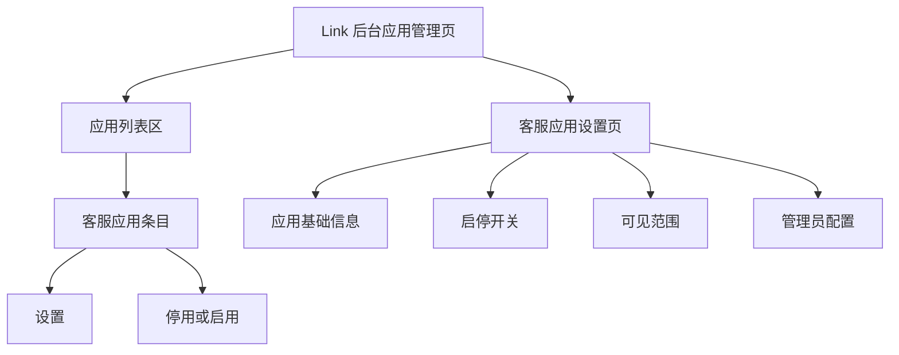
```mermaid
graph TD
A[Link 后台应用管理页] --> B[应用列表区]
B --> C[客服应用条目]
C --> D[设置]
C --> E[停用或启用]
A --> F[客服应用设置页]
F --> G[应用基础信息]
F --> H[启停开关]
F --> I[可见范围]
F --> J[管理员配置]
```

### 2.1.2 客服应用启停与可见范围配置

#### 2.1.2.1 功能定义

**功能描述：** 用于管理客服应用在 Link 体系内的启用状态、成员可见范围及客服管理后台超级管理员范围。  
**用户场景：** 企业管理员需要控制哪些成员可以看到并使用客服应用，以及哪些成员可以进入客服管理后台执行配置。  
**功能入口与触发方式：** Link 后台管理端应用管理页点击客服应用“设置”或“停用/启用”。  

#### 2.1.2.2 交互流程

**流程说明：** 管理员进入客服应用设置页后，可选择修改启停状态、可见范围、管理员范围；保存后，系统在列表与各端入口同步生效。  

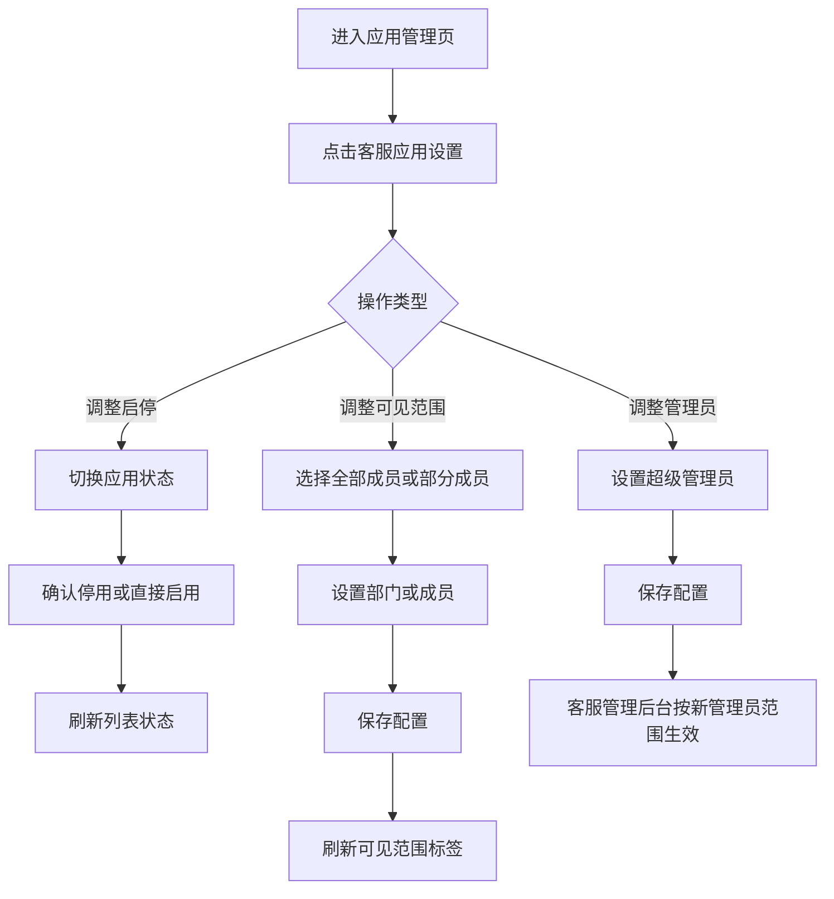
```mermaid
flowchart TD
A[进入应用管理页] --> B[点击客服应用设置]
B --> C{操作类型}
C -->|调整启停| D[切换应用状态]
D --> E[确认停用或直接启用]
E --> F[刷新列表状态]
C -->|调整可见范围| G[选择全部成员或部分成员]
G --> H[设置部门或成员]
H --> I[保存配置]
I --> J[刷新可见范围标签]
C -->|调整管理员| K[设置超级管理员]
K --> L[保存配置]
L --> M[客服管理后台按新管理员范围生效]
```

#### 2.1.2.3 前置条件

**登录状态：** 仅已登录管理员可执行。  
**角色与权限：** 仅具备 Link 后台应用管理权限的企业管理员可执行。  
**前置业务条件：** 客服应用已在应用管理列表中展示。  
**依赖配置或前序步骤：** 组织架构、成员数据、部门数据可正常读取。  

#### 2.1.2.4 输入规则

**应用状态：** 二值开关，取值为“已启用/已停用”。  
**可见范围：** 单选，取值为“全部成员/部分成员”。  
**部分成员：** 通过设置入口选择部门或成员；未选择任何部门或成员时，展示“暂无所选部门/人员”。  
**管理员：** 通过设置入口选择用户；选中的用户成为客服管理后台超级管理员。  
**停用确认：** 停用时弹出二次确认弹窗，启用时直接生效。  

#### 2.1.2.5 校验规则

**可见范围：** 当选择“部分成员”但未选择任何部门或成员时，不允许保存，提示“请选择部门或成员”（待确认）。  
**管理员：** 超级管理员人数上限未在原型中明确，建议支持多选，数量上限 50 人（待确认）。  
**权限校验：** 非应用管理员不可提交任何配置，提示“无操作权限”。  
**停用确认：** 点击“取消”后保持当前状态不变。  

#### 2.1.2.6 业务规则

**启用规则：** 客服应用启用后，处于可见范围内的成员可在客户端与移动端看到客服应用入口。  
**停用规则：** 客服应用停用后，所有成员不可继续进入客服应用；应用列表中范围标签展示为“已停用”。  
**范围规则：** 可见范围由“全部成员”切换为“部分成员”后，仅新范围内成员保留入口。  
**管理员规则：** 仅被配置为超级管理员的成员可进入客服管理后台执行系统级配置。  
**跨端联动规则：** 后台配置变更后，客户端与移动端在刷新后按新范围生效。  
**既有数据规则：** 停用或缩小范围时，不删除历史会话、标签、快捷回复等既有数据。  

#### 2.1.2.7 展示与交互状态规则

**列表状态展示：** 已启用时操作文案显示“停用”，已停用时显示“启用”。  
**范围标签展示：** 已启用时展示当前可见范围；已停用时展示灰态“已停用”。  
**详情页状态展示：** 设置页顶部展示应用名称、应用描述与启停开关状态。  
**保存反馈：** 配置成功后以页面局部刷新方式更新状态与标签。  
**入口联动展示：** 被移出可见范围的成员刷新后不再显示客服应用入口。  
**无权限展示：** 无权限用户不展示后台配置入口。  

#### 2.1.2.8 异常处理

**请求失败：** 提示“设置失败，请稍后重试”，用户可重新提交。  
**无权限：** 提示“无操作权限”，用户可返回应用列表。  
**重复提交：** 同一时刻仅受理一次保存请求，其余点击拦截并提示“处理中，请稍候”（待确认）。  
**超时或中断：** 提示“网络异常，请重新尝试”，页面保持原状态。  

#### 2.1.2.9 后置条件

**配置结果：** 客服应用启停状态、可见范围、管理员范围被保存。  
**页面结果：** 应用列表即时刷新显示结果。  
**联动结果：** 客户端、移动端、客服管理后台入口权限按新配置生效。  
**日志结果：** 记录管理员操作日志。  

#### 2.1.2.10 补充条件

**例外情况：** 超级管理员始终可见客服应用入口。  
**历史兼容策略：** 配置变更不影响既有历史会话数据的保存。  

## 2.2 客户端客服工作台

### 2.2.1 页面整体概览

**页面定位：** 客服成员在 Link 客户端内使用客服应用完成会话查看、接待处理、群聊协同和访客信息维护。  
**页面结构：** 页面由左侧应用入口区、会话列表区、聊天内容区、聊天工具区、右侧信息区组成。  
**信息布局：** 左侧展示客服应用入口与角标；中部左侧展示会话/群聊列表及筛选；中部右侧展示聊天内容与输入区；最右侧展示访客信息、会话信息或群设置。  

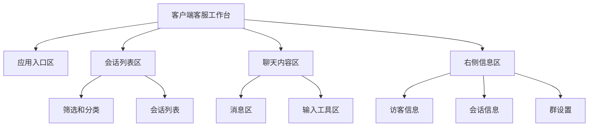
```mermaid
graph TD
A[客户端客服工作台] --> B[应用入口区]
A --> C[会话列表区]
C --> C1[筛选和分类]
C --> C2[会话列表]
A --> D[聊天内容区]
D --> D1[消息区]
D --> D2[输入工具区]
A --> E[右侧信息区]
E --> E1[访客信息]
E --> E2[会话信息]
E --> E3[群设置]
```

### 2.2.2 客服应用入口展示与未读提醒

#### 2.2.2.1 功能定义

**功能描述：** 用于在 Link 客户端展示客服应用入口，并对待处理量进行角标提醒。  
**用户场景：** 客服成员需要从 Link 客户端直接进入客服工作台，并快速感知是否存在待处理会话。  
**功能入口与触发方式：** Link 客户端左侧应用栏点击“客服”。  

#### 2.2.2.2 交互流程

**流程说明：** 客服成员登录 Link 客户端后，系统根据后台可见范围决定是否展示客服入口；有待处理会话时展示角标，点击后进入客服工作台。  

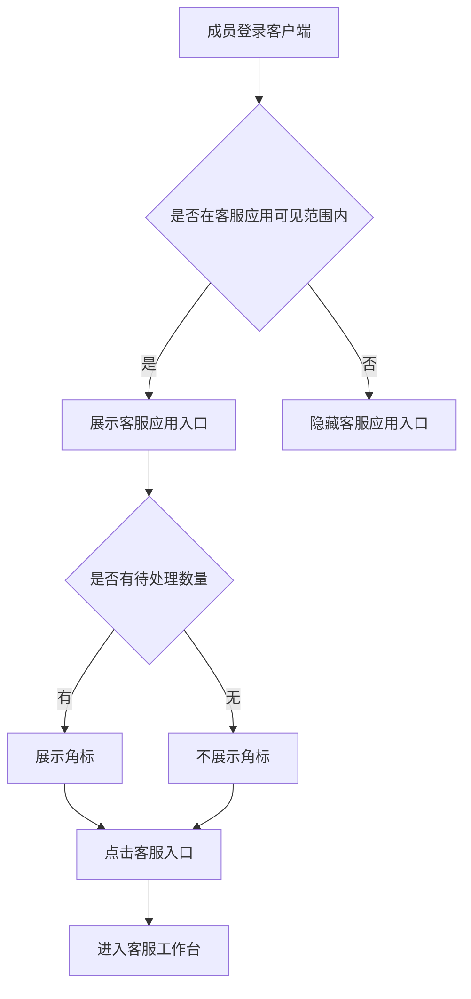
```mermaid
flowchart TD
A[成员登录客户端] --> B{是否在客服应用可见范围内}
B -->|是| C[展示客服应用入口]
B -->|否| D[隐藏客服应用入口]
C --> E{是否有待处理数量}
E -->|有| F[展示角标]
E -->|无| G[不展示角标]
F --> H[点击客服入口]
G --> H
H --> I[进入客服工作台]
```

#### 2.2.2.3 前置条件

**登录状态：** 仅已登录成员可执行。  
**角色与权限：** 仅在后台可见范围内的成员可见入口。  
**前置业务条件：** 客服应用处于启用状态。  
**依赖配置或前序步骤：** 后台已完成客服应用可见范围配置。  

#### 2.2.2.4 输入规则

**应用入口：** 固定应用入口，名称为“客服”。  
**角标数量：** 整数展示，超过 99 时显示“99+”。  
**进入方式：** 单击应用入口进入客服工作台。  

#### 2.2.2.5 校验规则

**权限校验：** 不在可见范围内的成员不可通过常规导航进入客服应用。  
**状态校验：** 客服应用停用时入口不允许进入。  
**角标校验：** 角标数量需与当前待处理量保持同步。  

#### 2.2.2.6 业务规则

**入口展示规则：** 客服入口与日历、待办同级，作为 Link 内嵌应用存在。  
**角标规则：** 角标聚合展示客服相关未处理数量。  
**停用联动规则：** 后台停用后，客户端刷新后不再展示客服入口。  
**权限变更规则：** 成员被移出可见范围后，刷新或重新登录后入口消失。  

#### 2.2.2.7 展示与交互状态规则

**选中态：** 当前进入客服应用时，导航高亮客服入口。  
**角标展示：** 有未处理量时展示红色角标，无数量时隐藏。  
**禁入反馈：** 已在客服应用中的成员若权限被移除，后续任一操作触发“无权限访问，请联系管理员”提示并退出至消息页

#### 2.2.2.8 异常处理

**无权限：** 提示“无权限访问，请联系管理员”，并返回默认消息页。  
**请求失败：** 提示“加载失败，请稍后重试”。  
**超时或中断：** 提示“网络异常，请重新尝试”。  

#### 2.2.2.9 后置条件

**页面结果：** 用户进入客服工作台或停留在原页面。  
**展示结果：** 导航高亮与角标状态完成刷新。  

### 2.2.3 会话/群聊列表筛选与分类浏览

#### 2.2.3.1 功能定义

**功能描述：** 用于在客户端客服工作台按会话类型、未读状态、对象类型等维度浏览会话列表。  
**用户场景：** 客服成员需要快速定位单聊、群聊、访客、客户或未读会话。  
**功能入口与触发方式：** 会话列表头部筛选按钮、下拉项、标签项。  

#### 2.2.3.2 交互流程

**流程说明：** 用户进入客服工作台后，系统默认展示消息列表；用户可通过快捷筛选或分类下拉切换结果集，列表随之刷新。  

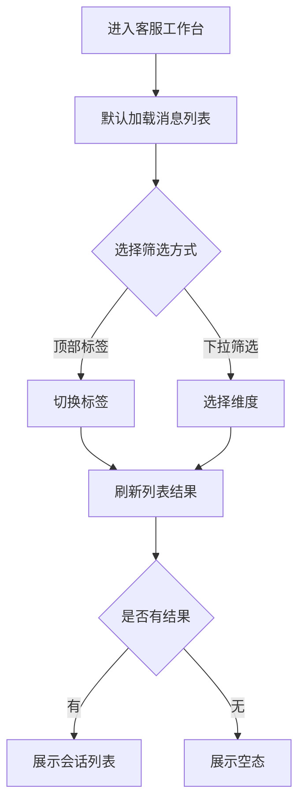
```mermaid
flowchart TD
A[进入客服工作台] --> B[默认加载消息列表]
B --> C{选择筛选方式}
C -->|顶部标签| D[切换标签]
C -->|下拉筛选| E[选择维度]
D --> F[刷新列表结果]
E --> F
F --> G{是否有结果}
G -->|有| H[展示会话列表]
G -->|无| I[展示空态]
```

#### 2.2.3.3 前置条件

**登录状态：** 仅已登录客服成员可执行。  
**角色与权限：** 具备客服应用访问权限。  
**前置业务条件：** 当前账号存在客服会话数据或具备接待权限。  
**依赖配置或前序步骤：** 会话列表数据源可正常返回。  

#### 2.2.3.4 输入规则

**筛选标签：** 可选值为“消息/未读/单聊/群聊/客服/客户/访客”。  
**分类下拉：** 与筛选标签口径保持一致。  
**搜索词：** 客户端原型未明确搜索框，当前页面以筛选为主，不新增搜索项。  
**列表项：** 每项至少展示名称、最后消息、时间、未读数、会话类型。  

#### 2.2.3.5 校验规则

**单选校验：** 同一时刻仅允许一个主筛选条件处于激活状态。  
**列表同步校验：** 切换筛选后，必须清空旧结果并刷新为新结果。  
**未读校验：** 未读筛选下仅展示存在未读消息的会话。  

#### 2.2.3.6 业务规则

**消息规则：** 默认展示全部客服相关消息列表。  
**未读规则：** 展示存在未读内容的会话。  
**单聊规则：** 展示一对一会话。  
**群聊规则：** 展示多人群聊会话。  
**客服规则：** 展示以客服成员为主要对象的会话集合。  
**客户规则：** 展示客户对象会话集合。  
**访客规则：** 展示访客对象会话集合。  
**排序规则：** 默认按最新消息时间倒序排列。  

#### 2.2.3.7 展示与交互状态规则

**激活态：** 当前筛选项高亮显示。  
**空态：** 无结果时展示空列表，不保留旧数据。  
**未读态：** 有未读时展示数字角标。  
**切换反馈：** 切换筛选后列表局部刷新，不整页跳转。  

#### 2.2.3.8 异常处理

**加载失败：** 提示“列表加载失败，请稍后重试”。  
**无数据：** 展示空态说明。  
**超时或中断：** 提示“网络异常，请重新尝试”。  

#### 2.2.3.9 后置条件

**结果状态：** 当前筛选条件被记录并作用于列表展示。  
**页面状态：** 用户可继续打开列表项进入详情。  

### 2.2.4 会话详情查看与状态处理

#### 2.2.4.1 功能定义

**功能描述：** 用于在客户端查看会话内容、会话标题及系统提示，并按状态执行会话处理动作。  
**用户场景：** 客服成员需要查看历史沟通内容、对已关闭会话执行删除，对会话执行接待或继续回复。  
**功能入口与触发方式：** 点击会话列表项进入聊天区域或详情抽屉。  

#### 2.2.4.2 交互流程

**流程说明：** 用户点击列表项后进入会话详情，系统展示聊天内容、系统提示和底部动作；不同会话状态对应不同可执行动作。  

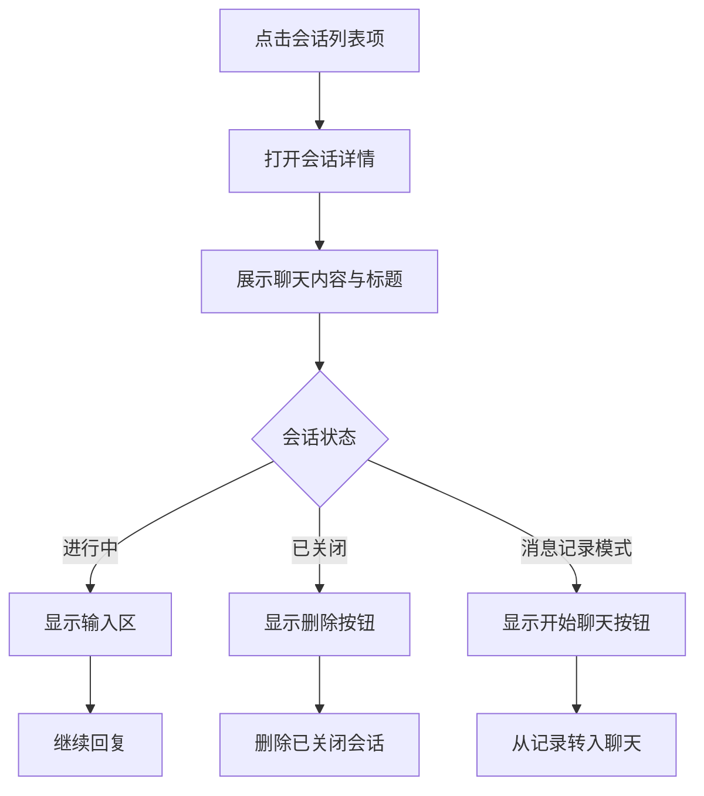
```mermaid
flowchart TD
A[点击会话列表项] --> B[打开会话详情]
B --> C[展示聊天内容与标题]
C --> D{会话状态}
D -->|进行中| E[显示输入区]
D -->|已关闭| F[显示删除按钮]
D -->|消息记录模式| G[显示开始聊天按钮]
E --> H[继续回复]
F --> I[删除已关闭会话]
G --> J[从记录转入聊天]
```

#### 2.2.4.3 前置条件

**登录状态：** 仅已登录客服成员可执行。  
**角色与权限：** 具备对应会话的查看权限。  
**前置业务条件：** 会话存在且未被删除。  
**依赖配置或前序步骤：** 会话详情数据可正常读取。  

#### 2.2.4.4 输入规则

**会话标题：** 支持编辑；为空时回退展示“新的会话”或默认标题。  
**底部动作：** 取值为“删除会话/开始聊天/发送消息”，按当前模式与状态展示。  
**导航按钮：** 支持上一条、下一条详情切换。  

#### 2.2.4.5 校验规则

**标题校验：** 标题为空时提交后回退为原标题或默认标题。  
**删除校验：** 仅已关闭会话允许删除。  
**聊天校验：** 记录模式点击开始聊天前需校验当前用户是否有接待权限。  

#### 2.2.4.6 业务规则

**标题规则：** 会话标题可被手动编辑；编辑结果立即回写当前列表。  
**删除规则：** 已关闭会话支持删除；删除后从列表中移除。  
**系统提示规则：** 存在“客户已超过 30 分钟未回复，会话自动关闭”等系统提示。  
**导航规则：** 详情抽屉支持在当前结果集内上下切换。  

#### 2.2.4.7 展示与交互状态规则

**详情标题展示：** 会话模式显示会话标题，消息记录模式显示“消息详情”或记录标题。  
**编辑态：** 标题编辑时显示输入框，失焦或回车保存。  
**关闭态：** 已关闭会话显示删除按钮，不显示发送操作。  
**进行中状态：** 会话进行中展示输入区与消息内容。  

#### 2.2.4.8 异常处理

**删除失败：** 提示“删除失败，请稍后重试”。  
**详情加载失败：** 提示“会话加载失败，请稍后重试”。  
**无权限：** 提示“无查看权限”，并关闭详情。  

#### 2.2.4.9 后置条件

**数据结果：** 会话标题、会话删除状态按操作结果更新。  
**页面结果：** 列表、详情抽屉与可执行动作同步刷新。  

### 2.2.5 右侧会话信息/访客信息查看与维护

#### 2.2.5.1 功能定义

**功能描述：** 用于在客户端查看并维护当前会话的会话信息、访客信息、访客标签与会话标签。  
**用户场景：** 客服成员在接待过程中需要快速补充备注、查看访客资料、维护标签和识别当前服务客服。  
**功能入口与触发方式：** 会话页右侧信息面板切换“访客信息/会话信息”。  

#### 2.2.5.2 交互流程

**流程说明：** 用户打开右侧信息面板后，可在访客信息与会话信息之间切换，查看基础资料、标签、统计信息并进行编辑。  

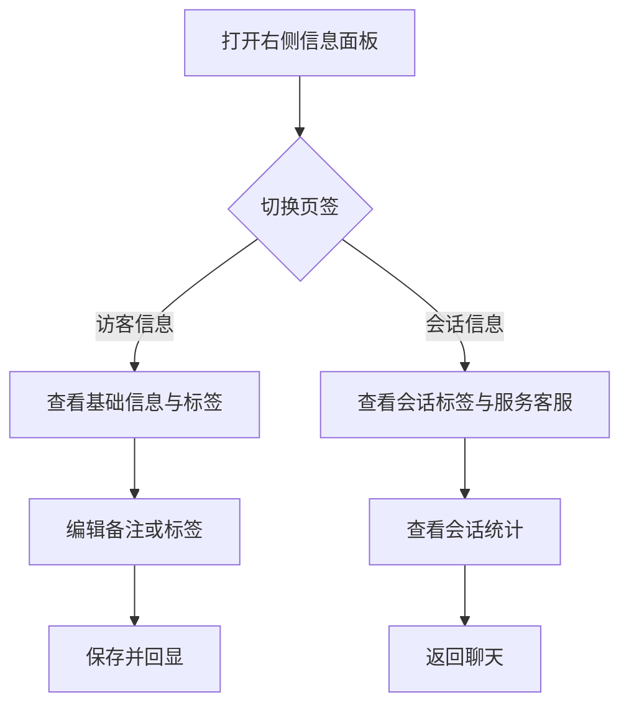
```mermaid
flowchart TD
A[打开右侧信息面板] --> B{切换页签}
B -->|访客信息| C[查看基础信息与标签]
B -->|会话信息| D[查看会话标签与服务客服]
C --> E[编辑备注或标签]
D --> F[查看会话统计]
E --> G[保存并回显]
F --> H[返回聊天]
```

#### 2.2.5.3 前置条件

**登录状态：** 仅已登录客服成员可执行。  
**角色与权限：** 具备当前会话查看权限。  
**前置业务条件：** 当前已选中会话。  
**依赖配置或前序步骤：** 标签数据与访客数据可正常读取。  

#### 2.2.5.4 输入规则

**页签：** 单选，取值为“访客信息/会话信息”。  
**备注名：** 文本输入，支持编辑，长度上限 50 个字符。  
**访客标签：** 多选，支持从已有标签中选择，也支持搜索/创建标签。  
**会话标签：** 多选，支持从已有标签中选择，也支持搜索/创建标签。  

#### 2.2.5.5 校验规则

**备注名：** 为空时允许保存为空值或“-”。  
**标签名称：** 新建标签时名称不可为空，不可与同类现有标签完全重复。  
**权限校验：** 无编辑权限时仅允许查看，不允许修改。  

#### 2.2.5.6 业务规则

**访客信息规则：** 展示备注名、姓名、电话、邮箱、起点页面、会话总数、访问轨迹、设备信息等。  
**会话信息规则：** 展示会话标签、服务客服、会话负责人等信息。  
**标签创建规则：** 在无匹配标签时支持即时创建并加入当前对象。  
**标签归属规则：** 访客标签归属访客对象，会话标签归属当前会话对象。  

#### 2.2.5.7 展示与交互状态规则

**折叠展示：** 基础信息、标签、附加信息等按区块折叠展示。  
**编辑态：** 鼠标悬停显示编辑按钮；编辑后原位回显。  
**标签展示：** 已选标签以标签样式展示，新增按钮置于列表末尾。  
**回写反馈：** 保存成功后局部刷新，不关闭当前会话。  

#### 2.2.5.8 异常处理

**保存失败：** 提示“保存失败，请稍后重试”。  
**标签加载失败：** 提示“标签加载失败，请稍后重试”。  
**无权限：** 提示“无编辑权限”，保留只读展示。  

#### 2.2.5.9 后置条件

**数据结果：** 访客资料、访客标签、会话标签按保存结果更新。  
**页面结果：** 当前右侧面板与列表信息同步刷新。  

### 2.2.6 群聊设置与群成员管理

#### 2.2.6.1 功能定义

**功能描述：** 用于在客户端群聊场景中查看群成员、修改群名、添加或移除成员、解散群聊以及设置群成员私聊限制。  
**用户场景：** 客服成员在群聊服务中需要管理群结构与查看成员组成。  
**功能入口与触发方式：** 群聊会话中打开右侧群设置页。  

#### 2.2.6.2 交互流程

**流程说明：** 用户进入群聊后打开群设置，可查看成员列表并执行群名维护、成员增删、群聊解散等动作。  

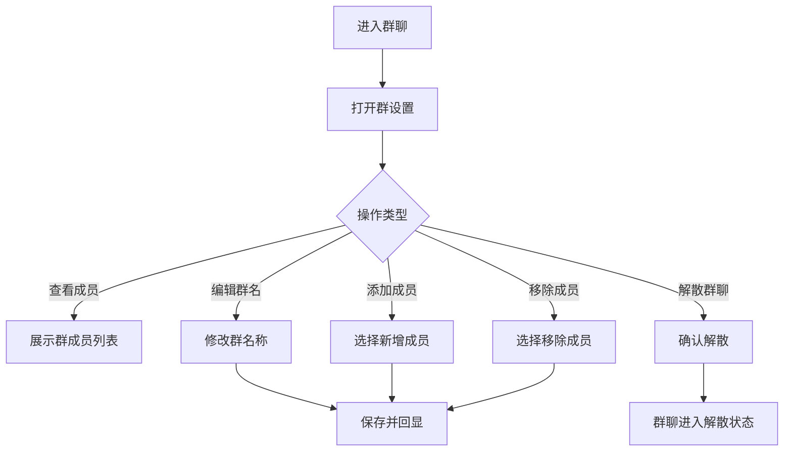
```mermaid
flowchart TD
A[进入群聊] --> B[打开群设置]
B --> C{操作类型}
C -->|查看成员| D[展示群成员列表]
C -->|编辑群名| E[修改群名称]
C -->|添加成员| F[选择新增成员]
C -->|移除成员| G[选择移除成员]
C -->|解散群聊| H[确认解散]
E --> I[保存并回显]
F --> I
G --> I
H --> J[群聊进入解散状态]
```

#### 2.2.6.3 前置条件

**登录状态：** 仅已登录客服成员可执行。  
**角色与权限：** 具备当前群聊查看权限；群名称编辑、成员增删、解散群聊权限归属为群主  
**前置业务条件：** 当前会话为群聊。  
**依赖配置或前序步骤：** 群成员数据可正常读取。  

#### 2.2.6.4 输入规则

**群名称：** 文本输入，长度上限 30 个字符。  
**群成员：** 展示成员头像、名称、角色标识。  
**新增成员：** 支持选择客服、访客、客户成员。  
**移除成员：** 支持勾选成员后移除。  
**禁止群成员私聊：** 开关配置，取值为“开启/关闭”。  

#### 2.2.6.5 校验规则

**群名称：** 不能为空；超长时不允许保存。  
**移除成员：** 不允许移除客服群聊的群主。  
**解散群聊：** 需二次确认后执行。  
**权限校验：** 无管理权限的成员仅可查看成员列表，不可执行修改。  

#### 2.2.6.6 业务规则

**成员展示规则：** 群设置中展示全部群成员，并对群主或负责人添加角色标识。  
**新增成员规则：** 新增成员成功后，立即加入群成员列表。  
**移除成员规则：** 移除成员成功后，从群成员列表中删除。  
**私聊限制规则：** 开启后，群成员间私聊能力受限。  
**解散规则：** 群聊解散后，不再允许继续沟通。  

#### 2.2.6.7 展示与交互状态规则

**成员展示：** 以网格形式展示成员头像与简称。  
**编辑态：** 鼠标悬停显示群名编辑入口。  
**危险操作展示：** 解散群聊按钮使用红色危险态。  
**只读态：** 无管理权限时隐藏或禁用增删改入口。  

#### 2.2.6.8 异常处理

**新增失败：** 提示“添加成员失败，请稍后重试”。  
**移除失败：** 提示“移除成员失败，请稍后重试”。  
**解散失败：** 提示“解散失败，请稍后重试”。  
**无权限：** 提示“无操作权限”。  

#### 2.2.6.9 后置条件

**数据结果：** 群名称、群成员、群聊状态按操作结果更新。  
**页面结果：** 群设置页、聊天头部、成员统计同步刷新。  

### 2.2.7 快捷回复面板调用与发送

#### 2.2.7.1 功能定义

**功能描述：** 用于在客户端聊天输入区打开快捷回复面板，并从公共回复或个人回复中选择内容插入当前会话。  
**用户场景：** 客服成员希望快速复用标准回复，提升接待效率。  
**功能入口与触发方式：** 聊天输入区工具栏点击快捷回复按钮。  

#### 2.2.7.2 交互流程

**流程说明：** 用户点击快捷回复按钮后，面板展开；选择分类与回复内容后，系统将内容插入输入区或直接发送。  

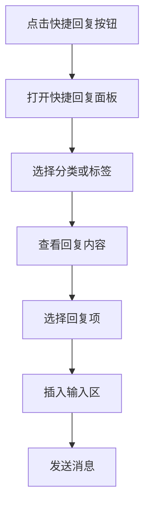
```mermaid
flowchart TD
A[点击快捷回复按钮] --> B[打开快捷回复面板]
B --> C[选择分类或标签]
C --> D[查看回复内容]
D --> E[选择回复项]
E --> F[插入输入区]
F --> G[发送消息]
```

#### 2.2.7.3 前置条件

**登录状态：** 仅已登录客服成员可执行。  
**角色与权限：** 具备当前会话发送权限。  
**前置业务条件：** 当前会话处于可发送状态。  
**依赖配置或前序步骤：** 已存在公共回复或个人回复数据。  

#### 2.2.7.4 输入规则

**回复分类：** 取值为“公共回复/个人回复/标签分类”。  
**回复内容：** 支持文本；是否支持图片附件取决于快捷回复配置。  
**搜索词：** 客户端原型未明确独立搜索框，按分类浏览为主。  

#### 2.2.7.5 校验规则

**发送校验：** 当前会话已结束时不可发送快捷回复。  
**内容校验：** 空内容不可插入。  
**权限校验：** 无发送权限时不可触发插入。  

#### 2.2.7.6 业务规则

**分类规则：** 公共回复对全体有权限成员可见，个人回复仅对本人可见。  
**插入规则：** 选择回复项后，将内容插入当前输入区。  
**面板跳转规则：** 面板顶部设置按钮可跳转快捷回复管理后台。  

#### 2.2.7.7 展示与交互状态规则

**展开态：** 面板浮层展示在输入区上方。  
**空态：** 未选择分类时展示“请选择分类或标签查看快捷回复”。  
**关闭态：** 点击关闭按钮后收起面板。  

#### 2.2.7.8 异常处理

**加载失败：** 提示“快捷回复加载失败，请稍后重试”。  
**发送失败：** 提示“发送失败，请稍后重试”。  

#### 2.2.7.9 后置条件

**页面结果：** 快捷回复内容成功插入输入区或发送成功。  
**数据结果：** 会话消息内容追加一条新消息。  

## 2.3 客户端客服管理后台 - 成员与规则配置

### 2.3.1 页面整体概览

**页面定位：** 客服管理员在客户端内进入客服管理后台，对成员、角色和成员规则进行统一管理。  
**页面结构：** 页面由左侧功能导航、成员列表区、角色列表区、成员设置区、详情抽屉与操作弹窗组成。  
**信息布局：** 左侧导航切换成员、角色、成员设置；成员页展示客服列表与账号详情；角色页展示角色与权限范围；成员设置页展示超时和离开规则。  

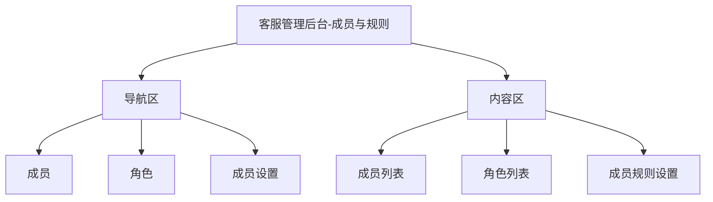
```mermaid
graph TD
A[客服管理后台-成员与规则] --> B[导航区]
B --> B1[成员]
B --> B2[角色]
B --> B3[成员设置]
A --> C[内容区]
C --> C1[成员列表]
C --> C2[角色列表]
C --> C3[成员规则设置]
```

### 2.3.2 客服成员管理

#### 2.3.2.1 功能定义

**功能描述：** 用于管理客服成员的新增、移除、账号详情、服务能力与在线状态相关配置。  
**用户场景：** 客服管理员需要维护组织内的客服接待人员，控制其会话限制与接待资格。  
**功能入口与触发方式：** 客服管理后台“成员”页。  

#### 2.3.2.2 交互流程

**流程说明：** 管理员进入成员页后，可查看成员列表、添加客服、打开账号详情、移除客服，并对会话限制与离开状态进行设置。  

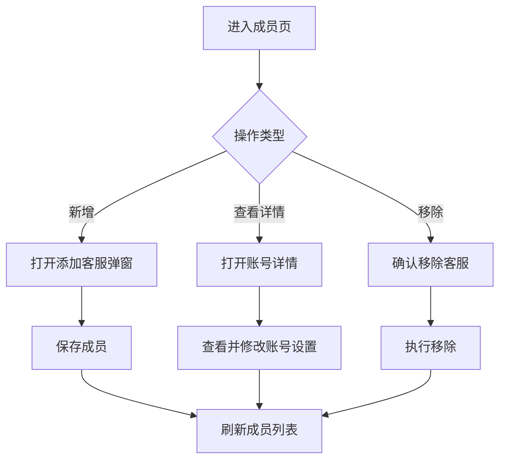
```mermaid
flowchart TD
A[进入成员页] --> B{操作类型}
B -->|新增| C[打开添加客服弹窗]
B -->|查看详情| D[打开账号详情]
B -->|移除| E[确认移除客服]
C --> F[保存成员]
D --> G[查看并修改账号设置]
E --> H[执行移除]
F --> I[刷新成员列表]
G --> I
H --> I
```

#### 2.3.2.3 前置条件

**登录状态：** 仅已登录客服管理员可执行。  
**角色与权限：** 仅客服管理后台管理员可执行。  
**前置业务条件：** 当前用户已进入客服管理后台。  
**依赖配置或前序步骤：** 企业成员数据可正常读取。  

#### 2.3.2.4 输入规则

**成员姓名：** 文本输入，1-32 个字符。  
**所属部门：** 多选，最多可选择 10 个。  
**工号：** 文本输入，自动代入 link 通讯录中的内容。  
**会话限制：** 数值输入，表示单个客服可承接的会话上限。  
**角色：** 下拉单选，至少包含“客服”。  
**状态：** 取值包含“在线/离开/离线”。  

#### 2.3.2.5 校验规则

**成员姓名：** 必填，长度 1-32 个字符，且不得重复。  
**所属部门：** 必填，超出 10 个时不允许继续选择。  
**会话限制：** 需为正整数，最小值 1，最大值 99999。  
**移除校验：** 若客服存在服务中会话，移除前提示“该客服有正在服务中的会话，移除后将中断客户服务”。  

#### 2.3.2.6 业务规则

**新增规则：** 新增客服后加入成员列表，可被分配接待角色及管理权限。  
**移除规则：** 移除后，该成员失去客服接待权限。  
**离开规则：** 标记离开后，该客服不再接受新的客户分配。  
**头像规则：** 账号详情中配置的头像将向访客展示。  

#### 2.3.2.7 展示与交互状态规则

**空态：** 无成员时展示“暂无客服成员”。  
**列表展示：** 展示姓名、角色、工号、状态、会话限制、添加时间等字段。  
**详情抽屉：** 账号详情以右侧抽屉形式展示。  
**状态样式：** 在线与离线状态以不同状态点区分。  

#### 2.3.2.8 异常处理

**保存失败：** 提示“保存失败，请稍后重试”。  
**移除失败：** 提示“移除失败，请稍后重试”。  
**无权限：** 提示“无操作权限”。  

#### 2.3.2.9 后置条件

**数据结果：** 客服成员新增、修改、移除结果被保存。  
**页面结果：** 成员列表、账号详情与相关状态同步刷新。  

### 2.3.3 角色查看与权限范围查看

#### 2.3.3.1 功能定义

**功能描述：** 用于查看角色名称、关联成员数与角色覆盖的会话、访客等权限范围。  
**用户场景：** 客服管理员需要明确不同角色可操作的模块与权限边界。  
**功能入口与触发方式：** 客服管理后台“角色”页。  

#### 2.3.3.2 交互流程

**流程说明：** 管理员进入角色页后查看角色列表，点击角色进入详情查看权限覆盖范围。  

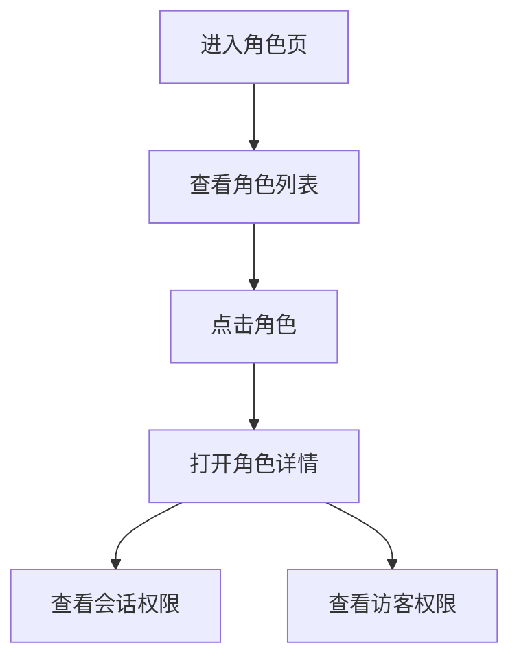
```mermaid
flowchart TD
A[进入角色页] --> B[查看角色列表]
B --> C[点击角色]
C --> D[打开角色详情]
D --> E[查看会话权限]
D --> F[查看访客权限]
```

#### 2.3.3.3 前置条件

**登录状态：** 仅已登录客服管理员可执行。  
**角色与权限：** 仅具备角色查看权限的管理员可执行。  
**前置业务条件：** 角色数据已存在。  
**依赖配置或前序步骤：** 角色与成员关联数据可读取。  

#### 2.3.3.4 输入规则

**角色名称：** 列表字段，至少包含“客服”。  
**关联成员数：** 数值展示。  
**权限分类：** 包含“会话”“访客”等分类。  

#### 2.3.3.5 校验规则

**详情校验：** 点击角色后必须能打开对应权限详情。  
**权限展示校验：** 角色详情需按业务分类清晰展示，不得混合呈现。  

#### 2.3.3.6 业务规则

**角色规则：** 角色与成员形成绑定关系。  
**详情规则：** 角色详情展示该角色在会话与访客模块的权限覆盖范围。  
**只读规则：** 当前原型以查看为主，未覆盖角色新增或删除。  

#### 2.3.3.7 展示与交互状态规则

**列表展示：** 展示角色名称与关联成员数。  
**详情展示：** 角色详情抽屉按模块分区展示。  
**空态：** 无角色数据时展示空态。  

#### 2.3.3.8 异常处理

**加载失败：** 提示“角色信息加载失败，请稍后重试”。  
**无权限：** 提示“无查看权限”。  

#### 2.3.3.9 后置条件

**页面结果：** 管理员完成角色信息查看。  

### 2.3.4 成员规则设置

#### 2.3.4.1 功能定义

**功能描述：** 用于配置客服不活跃、会话超时与离开状态相关的全局规则。  
**用户场景：** 客服管理员需要统一定义接待超时与排队回流规则。  
**功能入口与触发方式：** 客服管理后台“成员设置”页。  

#### 2.3.4.2 交互流程

**流程说明：** 管理员进入成员设置页后配置不活跃时长、超时规则和离开状态说明，保存后作用于后续接待流程。  

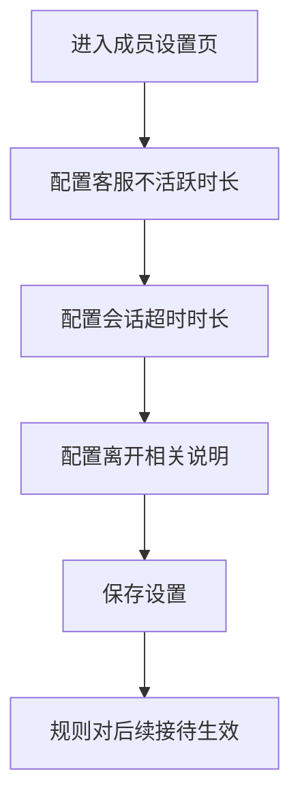
```mermaid
flowchart TD
A[进入成员设置页] --> B[配置客服不活跃时长]
B --> C[配置会话超时时长]
C --> D[配置离开相关说明]
D --> E[保存设置]
E --> F[规则对后续接待生效]
```

#### 2.3.4.3 前置条件

**登录状态：** 仅已登录客服管理员可执行。  
**角色与权限：** 仅客服管理后台管理员可执行。  
**前置业务条件：** 成员设置页配置项已加载。  
**依赖配置或前序步骤：** 会话流程规则可被系统读取。  

#### 2.3.4.4 输入规则

**客服不活跃时长：** 数值输入，单位为秒或分钟（待确认）。  
**会话超时时长：** 数值输入，表示客服超过指定时长未回复访客消息时触发排队。  
**离开状态：** 状态说明项，支持标记离开。  

#### 2.3.4.5 校验规则

**时长字段：** 必填，必须为大于 0 的整数。  
**保存校验：** 存在非法数值时不允许保存。  

#### 2.3.4.6 业务规则

**不活跃规则：** 客服超过设定时间未操作时，进入不活跃状态（待确认）。  
**会话超时规则：** 客服超过设定时间未回复访客消息时，会话自动进入排队中。  
**离开规则：** 标记离开后，不再接受新的客户分配。  

#### 2.3.4.7 展示与交互状态规则

**字段展示：** 采用规则说明加输入框的形式展示。  
**保存反馈：** 保存成功后提示“保存成功”。  

#### 2.3.4.8 异常处理

**保存失败：** 提示“保存失败，请稍后重试”。  
**无权限：** 提示“无操作权限”。  

#### 2.3.4.9 后置条件

**规则结果：** 成员规则配置被保存并作用于后续会话流程。  

## 2.4 客户端客服管理后台 - 安装与访客端配置

### 2.4.1 页面整体概览

**页面定位：** 客服管理员和实施人员在客服管理后台中完成网站小部件安装、聊天页面分发和访客端展示自定义配置。  
**页面结构：** 页面由安装导航区、网站代码页、聊天页面页、自定义配置页、预览区组成。  
**信息布局：** 左侧导航切换安装能力；网站代码页提供嵌入代码与 SDK 示例；聊天页面页提供直链和 HTML 下载；自定义页左侧配置、右侧预览访客端效果。  

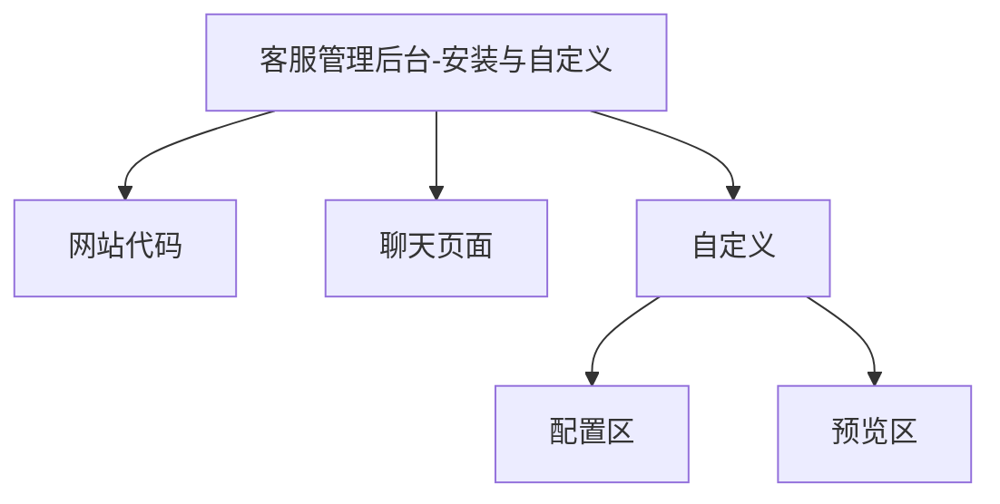
```mermaid
graph TD
A[客服管理后台-安装与自定义] --> B[网站代码]
A --> C[聊天页面]
A --> D[自定义]
D --> E[配置区]
D --> F[预览区]
```

### 2.4.2 网站代码安装说明与代码示例

#### 2.4.2.1 功能定义

**功能描述：** 用于提供网站小部件的基础安装脚本与常见自定义接入示例。  
**用户场景：** 实施人员需要将客服聊天组件嵌入企业官网或业务网页。  
**功能入口与触发方式：** 客服管理后台“安装-网站代码”。  

#### 2.4.2.2 交互流程

**流程说明：** 用户进入网站代码页后，复制基础安装脚本或参考自定义代码片段，将其接入外部网页。  

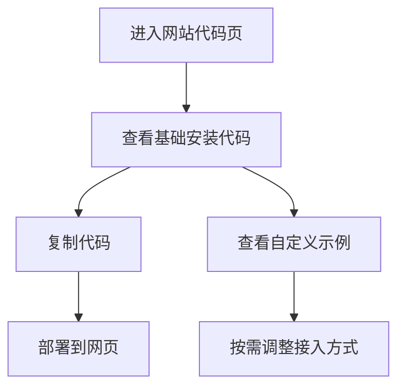
```mermaid
flowchart TD
A[进入网站代码页] --> B[查看基础安装代码]
B --> C[复制代码]
C --> D[部署到网页]
B --> E[查看自定义示例]
E --> F[按需调整接入方式]
```

#### 2.4.2.3 前置条件

**登录状态：** 仅已登录客服管理员或实施人员可执行。  
**角色与权限：** 具备安装配置查看权限。  
**前置业务条件：** 客服应用已启用。  
**依赖配置或前序步骤：** 已生成可用 AppID。  

#### 2.4.2.4 输入规则

**基础安装代码：** 固定脚本块，需粘贴到网页 `</body>` 前。  
**语言参数：** 支持 `zh-cn/zh-tw/en`。  
**隐藏默认角标：** 通过脚本配置图标模式。  
**客户信息接入字段：** 包含用户唯一标识、用户签名、随机字符串、姓名、昵称、邮箱、电话。  

#### 2.4.2.5 校验规则

**代码复制：** 点击复制后需提示“复制成功”。  
**客户信息字段：** 用户签名需按签名规则生成，格式错误时登录接入无效（待确认）。  
**语言参数：** 非支持值不允许生效。  

#### 2.4.2.6 业务规则

**基础安装规则：** 完成基础安装后即可使用默认聊天功能。  
**自定义触发规则：** 可隐藏默认角标，改为由自定义按钮触发打开聊天窗口。  
**未读监听规则：** 支持监听未读消息数变化。  
**语言切换规则：** 支持动态设置国际化语言。  
**客户信息规则：** 支持静态设置或加载后动态登录设置客户信息。  
**准备状态规则：** 支持监听 SDK ready、检查 ready 状态、读取错误信息。  

#### 2.4.2.7 展示与交互状态规则

**代码块展示：** 以只读代码块方式展示，支持复制按钮。  
**预览入口：** 页面提供预览按钮查看网站小部件效果。  
**说明文案展示：** 每段示例代码前展示使用说明。  

#### 2.4.2.8 异常处理

**复制失败：** 提示“复制失败，请手动复制”（待确认）。  
**参数错误：** 提示“参数配置无效，请检查配置”（待确认）。  

#### 2.4.2.9 后置条件

**产出结果：** 用户获得可直接接入的网站代码或示例脚本。  

### 2.4.3 聊天页面链接与 HTML 部署说明

#### 2.4.3.1 功能定义

**功能描述：** 用于提供可直接分享的聊天页面链接和 HTML 部署包说明。  
**用户场景：** 企业希望通过邮件、App、社交媒体或自有服务器快速分发访客聊天入口。  
**功能入口与触发方式：** 客服管理后台“安装-聊天页面”。  

#### 2.4.3.2 交互流程

**流程说明：** 用户进入聊天页面页后，可复制直链，或下载 HTML 部署包上传到自有服务器后使用自有域名分发。  

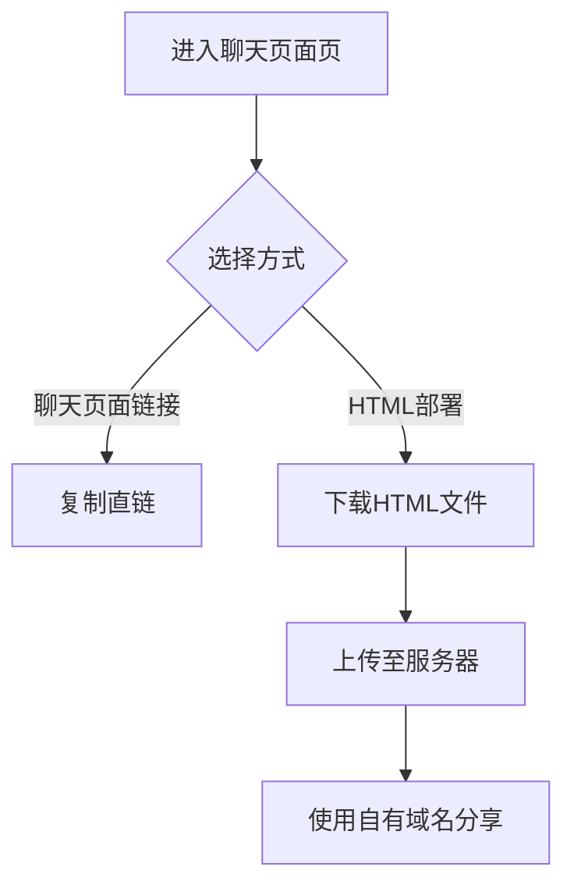
```mermaid
flowchart TD
A[进入聊天页面页] --> B{选择方式}
B -->|聊天页面链接| C[复制直链]
B -->|HTML部署| D[下载HTML文件]
D --> E[上传至服务器]
E --> F[使用自有域名分享]
```

#### 2.4.3.3 前置条件

**登录状态：** 仅已登录客服管理员或实施人员可执行。  
**角色与权限：** 具备安装配置查看权限。  
**前置业务条件：** 已生成聊天页面地址。  
**依赖配置或前序步骤：** 开发设置中已生成签名相关配置。  

#### 2.4.3.4 输入规则

**聊天页面链接：** 固定 URL，可直接复制。  
**语言参数：** 通过 `?lang=` 追加，支持 `zh-cn/zh-tw/en`。  
**客户信息参数：** 包含用户唯一标识、用户签名、随机字符串、姓名、备注名、邮箱、电话。  
**HTML 部署：** 通过下载文件并上传至服务器使用。  

#### 2.4.3.5 校验规则

**语言参数：** 仅支持预定义值。  
**签名参数：** 需按规则生成，否则客户信息透传无效。  
**复制校验：** 点击复制后需给出反馈。  

#### 2.4.3.6 业务规则

**直链规则：** 直链可直接发送给客户，无需网站部署。  
**HTML 规则：** 部署包用于自有服务器托管场景。  
**签名规则：** 用户签名由唯一标识、AppSecret、随机串组合生成。  
**安全规则：** AppSecret 为敏感信息，仅可在开发设置中生成与重置。  

#### 2.4.3.7 展示与交互状态规则

**链接展示：** 直链以单行地址展示，并提供复制按钮。  
**步骤展示：** HTML 部署以三步说明卡片展示。  
**说明展示：** 参数说明采用表格方式展示。  

#### 2.4.3.8 异常处理

**复制失败：** 提示“复制失败，请手动复制”（待确认）。  
**下载失败：** 提示“下载失败，请稍后重试”（待确认）。  

#### 2.4.3.9 后置条件

**产出结果：** 用户获得可分发的聊天页面链接或 HTML 部署方式。  

### 2.4.4 自定义配置中心

#### 2.4.4.1 功能定义

**功能描述：** 用于统一配置访客端的品牌、会话前表单、消息内容、会话功能、状态反馈与样式展示。  
**用户场景：** 客服管理员希望通过后台配置直接改变访客端首页、消息页、表单页、最小化页的展示和行为。  
**功能入口与触发方式：** 客服管理后台“安装-自定义”。  

#### 2.4.4.2 交互流程

**流程说明：** 管理员在左侧配置面板修改不同配置项，右侧预览区实时映射到访客端页面效果。  

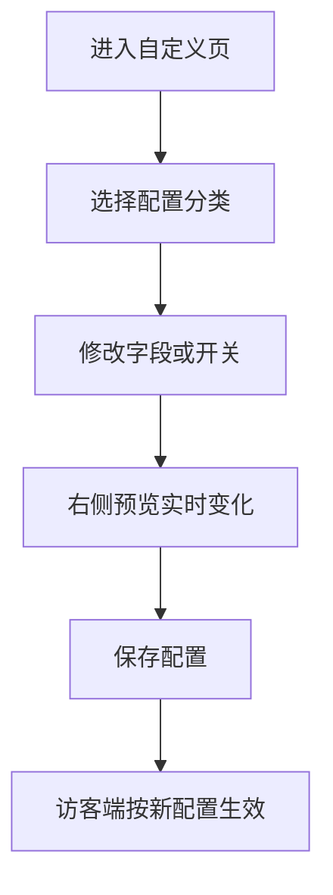
```mermaid
flowchart TD
A[进入自定义页] --> B[选择配置分类]
B --> C[修改字段或开关]
C --> D[右侧预览实时变化]
D --> E[保存配置]
E --> F[访客端按新配置生效]
```

#### 2.4.4.3 前置条件

**登录状态：** 仅已登录客服管理员可执行。  
**角色与权限：** 仅客服管理后台管理员可执行。  
**前置业务条件：** 访客端渠道已开通。  
**依赖配置或前序步骤：** 访客端预览模型可正常加载。  

#### 2.4.4.4 输入规则

**品牌信息：** 包含品牌名称、品牌图标、品牌说明。  
**组件位置：** 设置聊天小部件在网页上的位置。  
**快捷入口：** 配置访客端可见的快捷入口名称、跳转方式与内容。  
**欢迎语：** 文本输入，多行。  
**结束语：** 文本输入，多行。  
**会话离线自动回复：** 文本输入，多行。  
**单聊离线自动回复：** 文本输入，多行。  
**访客评价：** 开关配置。  
**会话前表单：** 配置标题、姓名、电话、邮箱等字段是否展示、是否必填。  
**发起会话：** 开关配置。  
**最大会话数：** 正整数输入。  
**删除会话：** 开关配置。  
**主动结束会话：** 开关配置。  
**会话标题：** 取值为“AI 生成会话标题/客服信息”。  
**排队提醒：** 开关配置。  
**访客不活跃时长：** 数值输入。  
**消息已读状态：** 开关配置。  
**客服在线状态：** 开关配置。  
**Powered by Link：** 开关配置，控制是否隐藏底部标识。  

#### 2.4.4.5 校验规则

**文本字段：** 欢迎语、结束语、离线回复不可为空；建议上限 500 个字符（待确认）。  
**最大会话数：** 启用限制时必填，必须为大于 0 的整数。  
**表单字段：** 开启表单后至少保留 1 个字段。  
**快捷入口：** 名称与目标值不可为空；URL 类型需以 `http://` 或 `https://` 开头。  
**互斥校验：** 启用最大会话数限制时，建议关闭“删除会话”或关闭“删除会话时主动结束会话”以避免额度误占。  

#### 2.4.4.6 业务规则

**映射规则：** 该页面配置是访客端展示与逻辑的唯一配置源。  
**预览规则：** 预览支持首页、消息、表单、最小化四种模式。  
**会话前表单规则：** 表单收集的数据自动同步到访客信息。  
**发起会话规则：** 关闭后，访客端隐藏“新的会话”入口。  
**最大会话数规则：** 开启后限制访客同时存在的未结束会话数量。  
**删除会话规则：** 开启后，访客会话列表显示删除按钮。  
**标题规则：** 访客端会话标题展示方式取决于后台配置。  
**状态规则：** 排队提醒、消息已读状态、客服在线状态按开关展示。  
**品牌规则：** Powered by Link 可被隐藏。  

#### 2.4.4.7 展示与交互状态规则

**配置展示：** 左侧按分类卡片展示，开关与输入混排。  
**预览展示：** 右侧实时展示对应模式下的访客端效果。  
**联动展示：** 修改欢迎语、结束语、离线回复等内容时，预览区即时回显。  
**禁用态：** 相关开关关闭后，其下级配置区收起或不可编辑。  

#### 2.4.4.8 异常处理

**保存失败：** 提示“保存失败，请稍后重试”。  
**预览加载失败：** 提示“预览加载失败，请稍后重试”（待确认）。  
**配置冲突：** 提示具体冲突项并阻止保存。  

#### 2.4.4.9 后置条件

**配置结果：** 自定义配置被保存并作用于访客端。  
**页面结果：** 预览区与实际访客端口径保持一致。  

#### 2.4.4.10 补充条件

**规则边界：** 访客端相关逻辑及样式显示需参考本页配置。  

## 2.5 客户端客服管理后台 - 运营与数据配置

### 2.5.1 页面整体概览

**页面定位：** 客服管理员在客服管理后台中进行会话查询、访客管理、客户管理、标签管理、快捷回复管理与开发配置。  
**页面结构：** 页面由运营导航区、数据列表区、筛选区、详情抽屉、标签弹窗、开发配置区组成。  
**信息布局：** 不同导航页承载不同对象列表；会话、访客、客户支持列表查询；标签与快捷回复支持新增维护；开发设置展示 AppID、AppSecret 与 Webhooks 规则。  

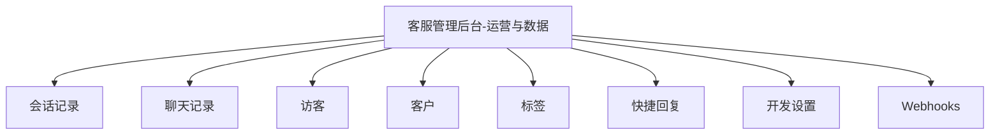
```mermaid
graph TD
A[客服管理后台-运营与数据] --> B[会话记录]
A --> C[聊天记录]
A --> D[访客]
A --> E[客户]
A --> F[标签]
A --> G[快捷回复]
A --> H[开发设置]
A --> I[Webhooks]
```

### 2.5.2 会话记录与聊天记录查询

#### 2.5.2.1 功能定义

**功能描述：** 用于按筛选条件查看会话记录与聊天记录，并进入详情查看内容。  
**用户场景：** 客服管理员需要复盘历史会话、查看群聊情况、筛选负责人和访客评价。  
**功能入口与触发方式：** 客服管理后台“会话记录”“聊天记录”。  

#### 2.5.2.2 交互流程

**流程说明：** 管理员进入记录页后设置筛选条件，系统返回匹配结果；点击某条记录后打开详情。  

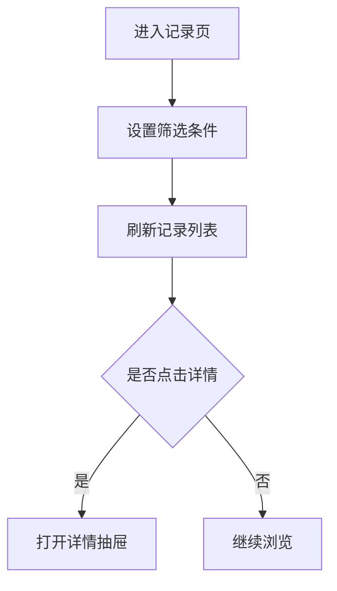
```mermaid
flowchart TD
A[进入记录页] --> B[设置筛选条件]
B --> C[刷新记录列表]
C --> D{是否点击详情}
D -->|是| E[打开详情抽屉]
D -->|否| F[继续浏览]
```

#### 2.5.2.3 前置条件

**登录状态：** 仅已登录客服管理员可执行。  
**角色与权限：** 具备记录查看权限。  
**前置业务条件：** 存在历史记录数据。  
**依赖配置或前序步骤：** 记录数据源可正常读取。  

#### 2.5.2.4 输入规则

**会话记录筛选项：** 支持会话标题、访客备注名、访客评价、会话负责人、接待时间等。  
**聊天记录筛选项：** 支持访客姓名、访客备注名、客服姓名、消息类型。  
**消息类型：** 至少包含“群聊”。  
**排序字段：** 支持消息数量、接待时间等排序。  

#### 2.5.2.5 校验规则

**时间范围：** 开始时间不得晚于结束时间。  
**筛选联动：** 修改任一筛选项后，列表需按新条件刷新。  
**详情校验：** 点击标题后必须打开对应详情。  

#### 2.5.2.6 业务规则

**会话记录规则：** 展示总会话数、访客数量、消息数量、负责人、服务客服、标签、评价等。  
**聊天记录规则：** 支持区分单聊与群聊。  
**详情规则：** 记录详情以抽屉形式展示聊天内容。  
**群聊统计规则：** 聊天记录页面展示群聊数统计。  

#### 2.5.2.7 展示与交互状态规则

**表格展示：** 采用表格承载字段，并支持表头排序。  
**空态：** 无记录时展示“暂无历史会话”。  
**详情展示：** 详情抽屉展示消息内容与系统提示。  

#### 2.5.2.8 异常处理

**加载失败：** 提示“记录加载失败，请稍后重试”。  
**无权限：** 提示“无查看权限”。  

#### 2.5.2.9 后置条件

**页面结果：** 管理员获得目标记录与详情内容。  

### 2.5.3 在线/全部访客管理

#### 2.5.3.1 功能定义

**功能描述：** 用于查看在线访客和全部访客，支持查看详情、创建会话和维护访客标签。  
**用户场景：** 客服管理员希望主动联系访客、识别高价值访客并维护标签。  
**功能入口与触发方式：** 客服管理后台“在线访客”“全部访客”。  

#### 2.5.3.2 交互流程

**流程说明：** 管理员进入访客页后浏览列表，点击查看详情或创建会话，也可在详情中维护标签。  

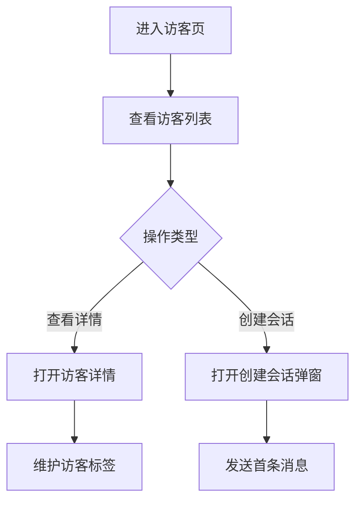
```mermaid
flowchart TD
A[进入访客页] --> B[查看访客列表]
B --> C{操作类型}
C -->|查看详情| D[打开访客详情]
C -->|创建会话| E[打开创建会话弹窗]
D --> F[维护访客标签]
E --> G[发送首条消息]
```

#### 2.5.3.3 前置条件

**登录状态：** 仅已登录客服管理员可执行。  
**角色与权限：** 具备访客查看权限。  
**前置业务条件：** 访客数据已存在。  
**依赖配置或前序步骤：** 访客标签数据可读取。  

#### 2.5.3.4 输入规则

**搜索项：** 支持访客名称或备注名搜索（待确认）。  
**操作项：** 包含“查看详情”“创建会话”。  
**会话内容：** 创建会话时输入首条消息内容，为多行文本。  

#### 2.5.3.5 校验规则

**首条消息：** 创建会话时不可为空。  
**标签名称：** 新建标签不可为空，不可重复。  
**详情校验：** 访客详情需能展示基础信息、标签、附加信息、访问轨迹、设备信息。  

#### 2.5.3.6 业务规则

**在线访客规则：** 展示当前在线的访客对象。  
**全部访客规则：** 展示全部历史访客对象。  
**详情规则：** 访客详情可展示备注名、姓名、电话、邮箱、会话总数、入口页面、IP 等。  
**创建会话规则：** 管理员可主动创建新会话。  

#### 2.5.3.7 展示与交互状态规则

**空态：** 无访客时展示对应空态。  
**详情展示：** 访客详情以抽屉展示，可折叠各信息区块。  
**标签展示：** 已选标签以标签形式展示，并支持加号新增。  

#### 2.5.3.8 异常处理

**创建失败：** 提示“创建会话失败，请稍后重试”。  
**加载失败：** 提示“访客加载失败，请稍后重试”。  

#### 2.5.3.9 后置条件

**数据结果：** 访客详情、访客标签或新会话结果更新。  

### 2.5.4 在线/全部客户管理

#### 2.5.4.1 功能定义

**功能描述：** 用于查看在线客户和全部客户，支持查看详情、创建会话。  
**用户场景：** 客服管理员希望区分客户与访客并维护已识别客户对象。  
**功能入口与触发方式：** 客服管理后台“在线客户”“全部客户”。  

#### 2.5.4.2 交互流程

**流程说明：** 管理员进入客户页后浏览列表，点击查看详情或创建会话。  

```mermaid
flowchart TD
A[进入客户页] --> B[查看客户列表]
B --> C{操作类型}
C -->|查看详情| D[打开客户详情]
C -->|创建会话| E[打开创建会话弹窗]
```

#### 2.5.4.3 前置条件

**登录状态：** 仅已登录客服管理员可执行。  
**角色与权限：** 具备客户查看权限。  
**前置业务条件：** 客户数据已存在。  
**依赖配置或前序步骤：** 客户身份识别逻辑已生效（待确认）。  

#### 2.5.4.4 输入规则

**搜索项：** 支持按客户姓名、客服标识、标签等筛选（待确认）。  
**操作项：** 包含“查看详情”“创建会话”。  

#### 2.5.4.5 校验规则

**详情校验：** 客户详情需可展示会话 ID、发起时间、接待时间、接入客服、会话次数、客户 ID、客户备注。  
**创建会话：** 首条消息不可为空。  

#### 2.5.4.6 业务规则

**在线客户规则：** 展示当前在线客户。  
**全部客户规则：** 展示全部客户。  
**详情规则：** 客户详情与访客详情相似，但对象字段以客户身份展示。  

#### 2.5.4.7 展示与交互状态规则

**表格展示：** 支持客服标识、标签等字段展示。  
**详情展示：** 客户详情页或抽屉展示详细信息。  

#### 2.5.4.8 异常处理

**加载失败：** 提示“客户加载失败，请稍后重试”。  
**无权限：** 提示“无查看权限”。  

#### 2.5.4.9 后置条件

**页面结果：** 获得客户对象详情或新建会话结果。  

### 2.5.5 访客标签与会话标签管理

#### 2.5.5.1 功能定义

**功能描述：** 用于统一维护访客标签与会话标签，并为会话/访客信息页提供可复用标签库。  
**用户场景：** 客服管理员需要建立标准标签体系，提高筛选和识别效率。  
**功能入口与触发方式：** 客服管理后台“访客标签”“会话标签”。  

#### 2.5.5.2 交互流程

**流程说明：** 管理员进入标签页后搜索、创建、编辑或删除标签，保存后供前台业务页面使用。  

```mermaid
flowchart TD
A[进入标签页] --> B[搜索标签]
B --> C{操作类型}
C -->|新增| D[打开新增标签弹窗]
C -->|编辑| E[打开编辑标签弹窗]
C -->|删除| F[确认删除]
D --> G[保存标签]
E --> G
F --> H[移除标签]
```

#### 2.5.5.3 前置条件

**登录状态：** 仅已登录客服管理员可执行。  
**角色与权限：** 具备标签管理权限。  
**前置业务条件：** 当前处于对应标签管理页。  
**依赖配置或前序步骤：** 标签库可正常读写。  

#### 2.5.5.4 输入规则

**标签名称：** 文本输入，必填。  
**排序：** 数值输入，必填。  
**搜索词：** 文本输入，支持模糊搜索。  

#### 2.5.5.5 校验规则

**标签名称：** 不可为空，不可与同类型标签重复。  
**排序：** 必须为整数；展示顺序按排序值从大到小。  
**删除校验：** 删除前需二次确认。  

#### 2.5.5.6 业务规则

**展示顺序规则：** 标签在选择面板中按排序值由大到小展示。  
**搜索规则：** 支持按名称模糊搜索。  
**复用规则：** 标签库被会话详情、访客详情、移动端标签面板等复用。  

#### 2.5.5.7 展示与交互状态规则

**列表展示：** 表格展示标签名称、排序、操作项。  
**空态：** 无标签时展示空态。  
**创建联动展示：** 在业务侧搜索无匹配标签时，可直接创建标签。  

#### 2.5.5.8 异常处理

**保存失败：** 提示“保存失败，请稍后重试”。  
**删除失败：** 提示“删除失败，请稍后重试”。  

#### 2.5.5.9 后置条件

**数据结果：** 标签库更新，并同步影响业务侧标签选择结果。  

### 2.5.6 公共回复与个人回复管理

#### 2.5.6.1 功能定义

**功能描述：** 用于维护公共回复与个人回复内容，并供客户端与移动端快捷回复面板调用。  
**用户场景：** 客服成员与管理员需要沉淀高频回复模板。  
**功能入口与触发方式：** 客服管理后台“公共回复”“个人回复”。  

#### 2.5.6.2 交互流程

**流程说明：** 用户进入快捷回复页后新增、编辑、删除或搜索快捷回复内容。  

```mermaid
flowchart TD
A[进入快捷回复页] --> B[查看回复列表]
B --> C{操作类型}
C -->|新增| D[填写标签与内容]
C -->|编辑| E[修改回复内容]
C -->|删除| F[删除回复]
D --> G[保存并入库]
E --> G
```

#### 2.5.6.3 前置条件

**登录状态：** 仅已登录用户可执行。  
**角色与权限：** 公共回复由管理员维护，个人回复由当前用户维护（待确认）。  
**前置业务条件：** 当前进入对应回复页。  
**依赖配置或前序步骤：** 快捷回复数据存储可正常读写。  

#### 2.5.6.4 输入规则

**标签：** 文本输入，必填。  
**回复内容：** 多行文本输入，必填。  
**图片附件：** 支持上传图片附件（待确认）。  
**搜索词：** 支持搜索快捷回复内容。  

#### 2.5.6.5 校验规则

**标签：** 不可为空。  
**回复内容：** 不可为空。  
**图片格式：** 若支持图片，格式与大小限制为 JPG/PNG，单张不超过 10MB（待确认）。  

#### 2.5.6.6 业务规则

**公共回复规则：** 面向有权限成员共享。  
**个人回复规则：** 仅当前成员可见和使用。  
**调用规则：** 客户端与移动端聊天输入区可调用本页维护的数据。  

#### 2.5.6.7 展示与交互状态规则

**列表展示：** 展示标签、回复内容、创建人、创建时间。  
**空态：** 无数据时展示空态。  
**预览态：** 内容过长时支持截断展示并查看详情（待确认）。  

#### 2.5.6.8 异常处理

**保存失败：** 提示“保存失败，请稍后重试”。  
**删除失败：** 提示“删除失败，请稍后重试”。  

#### 2.5.6.9 后置条件

**数据结果：** 快捷回复库更新，并供多端调用。  

### 2.5.7 开发设置与 Webhooks 管理

#### 2.5.7.1 功能定义

**功能描述：** 用于查看 AppID、管理 AppSecret、查看签名规则并配置 Webhooks 事件。  
**用户场景：** 实施人员需要将客服模块与企业内部系统、安全校验与事件通知流程对接。  
**功能入口与触发方式：** 客服管理后台“开发设置”“Webhooks”。  

#### 2.5.7.2 交互流程

**流程说明：** 用户进入开发设置后查看 AppID，按需重置 AppSecret，并在 Webhooks 页面配置事件订阅。  

```mermaid
flowchart TD
A[进入开发设置] --> B[查看AppID]
B --> C{是否重置AppSecret}
C -->|是| D[确认重置]
D --> E[生成新密钥]
C -->|否| F[查看签名规则]
F --> G[进入Webhooks页]
G --> H[配置事件与地址]
```

#### 2.5.7.3 前置条件

**登录状态：** 仅已登录客服管理员或实施人员可执行。  
**角色与权限：** 具备开发配置权限。  
**前置业务条件：** 客服应用已开通开发设置能力。  
**依赖配置或前序步骤：** 安全配置模块可正常读写。  

#### 2.5.7.4 输入规则

**AppID：** 只读展示。  
**AppSecret：** 仅首次展示，丢失后需重置。  
**签名规则：** 使用请求头签名方式。  
**Webhook 地址：** URL 输入，需以 `http://` 或 `https://` 开头（待确认）。  
**事件类型：** 至少包含访客消息未回复事件 `UNREPLIED`。  

#### 2.5.7.5 校验规则

**重置确认：** 重置 AppSecret 前必须二次确认。  
**Webhook 地址：** 地址不能为空，格式需合法。  
**事件选择：** 至少选择 1 个事件后才能保存（待确认）。  

#### 2.5.7.6 业务规则

**AppSecret 规则：** 出于安全原因，AppSecret 只展示一次；重置后旧密钥立即失效。  
**签名规则：** 回调使用签名校验，签名方式由原型说明定义。  
**事件规则：** 支持配置访客消息未回复等事件推送；示例中首触发与重复提醒节奏已给出。  

#### 2.5.7.7 展示与交互状态规则

**敏感信息展示：** AppSecret 以敏感信息形式展示，并附重置入口。  
**说明展示：** 页面展示签名生成与校验规则说明。  
**成功反馈：** 重置成功后弹窗展示新的 AppSecret，并提醒妥善保存。  

#### 2.5.7.8 异常处理

**重置失败：** 提示“重置失败，请稍后重试”。  
**保存失败：** 提示“保存失败，请稍后重试”。  

#### 2.5.7.9 后置条件

**数据结果：** 新的 AppSecret、Webhook 配置被保存。  
**安全结果：** 旧密钥失效，新密钥生效。  

## 2.6 移动端客服接待

### 2.6.1 页面整体概览

**页面定位：** 客服成员在 Link 移动端完成排队会话接入、聊天处理、会话信息查看、群设置和快捷回复调用。  
**页面结构：** 页面由排队列表页、聊天详情页、会话信息页、访客信息页、群设置页、底部选择面板组成。  
**信息布局：** 顶层以会话列表和排队入口承接接待，中层以聊天页承接回复，底层通过信息页和底部面板承接标签、群成员与转接操作。  

```mermaid
graph TD
A[移动端客服接待] --> B[排队列表页]
A --> C[聊天详情页]
A --> D[会话信息页]
A --> E[访客信息页]
A --> F[群设置页]
A --> G[底部标签与快捷回复面板]
```

### 2.6.2 客服应用入口与排队会话列表

#### 2.6.2.1 功能定义

**功能描述：** 用于在移动端查看排队中会话，并按访客/客服维度切换和接入会话。  
**用户场景：** 客服成员在移动场景下需要快速感知排队会话并接入处理。  
**功能入口与触发方式：** Link 移动端客服入口或排队页。  

#### 2.6.2.2 交互流程

**流程说明：** 用户进入排队页后查看排队中数量，切换访客或客服维度，点击会话后执行接入。  

```mermaid
flowchart TD
A[进入移动端客服页] --> B[查看排队中数量]
B --> C[切换访客或客服维度]
C --> D[选择待接入会话]
D --> E[点击接入]
E --> F[进入聊天详情]
```

#### 2.6.2.3 前置条件

**登录状态：** 仅已登录客服成员可执行。  
**角色与权限：** 具备移动端客服接待权限。  
**前置业务条件：** 存在排队中会话。  
**依赖配置或前序步骤：** 移动端客服入口已对当前成员开放。  

#### 2.6.2.4 输入规则

**切换页签：** 取值为“访客/客服”。  
**排队会话项：** 展示名称、摘要、未读数、时间。  
**接入按钮：** 固定动作按钮，执行会话接入。  

#### 2.6.2.5 校验规则

**接入校验：** 同一会话不可被重复接入（待确认）。  
**权限校验：** 无接待权限时不可点击接入。  

#### 2.6.2.6 业务规则

**排队规则：** 排队页聚合展示待接入会话数量。  
**切换规则：** 访客与客服维度切换仅影响当前列表结果。  
**接入规则：** 点击接入后，会话进入当前客服的聊天详情页。  

#### 2.6.2.7 展示与交互状态规则

**计数展示：** 页签与标题显示当前排队数量。  
**空态：** 无排队会话时展示“暂无排队中聊天”。  
**成功反馈：** 接入成功后提示“会话已接入”。  

#### 2.6.2.8 异常处理

**接入失败：** 提示“接入失败，请稍后重试”。  
**加载失败：** 提示“列表加载失败，请稍后重试”。  

#### 2.6.2.9 后置条件

**页面结果：** 用户进入聊天详情并开始接待。  

### 2.6.3 移动端会话详情与处理

#### 2.6.3.1 功能定义

**功能描述：** 用于在移动端查看聊天内容，并执行回复、转移会话、结束会话。  
**用户场景：** 客服成员在手机上处理正在进行中的咨询。  
**功能入口与触发方式：** 点击移动端会话列表项进入聊天详情。  

#### 2.6.3.2 交互流程

**流程说明：** 用户进入聊天详情后查看消息内容，按需发送消息、调用快捷回复、转移会话或结束会话。  

```mermaid
flowchart TD
A[进入聊天详情] --> B[查看消息内容]
B --> C{操作类型}
C -->|发送消息| D[输入并发送]
C -->|快捷回复| E[打开快捷回复面板]
C -->|转移会话| F[选择客服并转接]
C -->|结束会话| G[结束当前会话]
```

#### 2.6.3.3 前置条件

**登录状态：** 仅已登录客服成员可执行。  
**角色与权限：** 具备当前会话的接待权限。  
**前置业务条件：** 会话已接入当前客服或当前用户可处理。  
**依赖配置或前序步骤：** 会话消息数据可正常读取。  

#### 2.6.3.4 输入规则

**消息内容：** 文本输入，支持回车发送（待确认）。  
**转移对象：** 单选客服成员。  
**结束会话：** 危险操作，点击后执行结束。  

#### 2.6.3.5 校验规则

**消息内容：** 空消息不可发送。  
**转移对象：** 未选择客服成员时不可提交转接。  
**结束校验：** 已结束会话不可重复结束。  

#### 2.6.3.6 业务规则

**结束规则：** 结束后消息摘要显示“[会话已结束]”，消息区插入“会话已结束”提示。  
**自动关闭规则：** 存在“客户已超过 30 分钟未回复，会话自动关闭”系统提示。  
**转移规则：** 选择客服并确认后，当前会话转交目标客服。  

#### 2.6.3.7 展示与交互状态规则

**进行中态：** 展示输入区、工具栏与消息列表。  
**已结束态：** 隐藏输入能力，显示会话结束提示。  
**系统提示展示：** 自动关闭与结束提示以居中文本展示。  

#### 2.6.3.8 异常处理

**发送失败：** 提示“发送失败，请稍后重试”。  
**转移失败：** 提示“转移失败，请稍后重试”。  
**结束失败：** 提示“结束失败，请稍后重试”。  

#### 2.6.3.9 后置条件

**数据结果：** 会话状态、负责人或消息内容按操作结果更新。  

### 2.6.4 移动端会话信息/访客信息与标签操作

#### 2.6.4.1 功能定义

**功能描述：** 用于在移动端查看会话信息与访客信息，并维护会话标签和访客标签。  
**用户场景：** 客服成员在移动端接待时需要快速识别当前会话对象并补充标签。  
**功能入口与触发方式：** 聊天详情页切换“会话信息/访客信息”。  

#### 2.6.4.2 交互流程

**流程说明：** 用户进入信息页后切换页签，查看信息并打开底部面板选择标签。  

```mermaid
flowchart TD
A[进入信息页] --> B[切换会话信息或访客信息]
B --> C[查看基础字段]
C --> D[打开标签底部面板]
D --> E[选择或创建标签]
E --> F[保存并回显]
```

#### 2.6.4.3 前置条件

**登录状态：** 仅已登录客服成员可执行。  
**角色与权限：** 具备当前会话查看权限。  
**前置业务条件：** 当前已选中会话。  
**依赖配置或前序步骤：** 标签库可正常读取。  

#### 2.6.4.4 输入规则

**页签：** 取值为“会话信息/访客信息”。  
**会话标签：** 多选，支持搜索与创建标签。  
**访客标签：** 多选，支持搜索与创建标签。  
**会话字段：** 包含会话 ID、服务客服等。  
**访客字段：** 包含访客信息、会话总数等。  

#### 2.6.4.5 校验规则

**标签名称：** 新建时不可为空，不可重复。  
**字段展示：** 会话信息与访客信息必须按页签切换，不可混淆。  

#### 2.6.4.6 业务规则

**标签复用规则：** 移动端标签面板与管理后台标签库共用同一标签数据。  
**创建规则：** 搜索无匹配标签时可直接创建。  
**信息展示规则：** 会话信息展示服务客服与会话标签，访客信息展示访客基础资料与访客标签。  

#### 2.6.4.7 展示与交互状态规则

**底部面板展示：** 标签选择采用 bottom sheet。  
**标签展示：** 已选标签在信息页原位回显。  
**切换态：** 当前页签高亮。  

#### 2.6.4.8 异常处理

**加载失败：** 提示“信息加载失败，请稍后重试”。  
**保存失败：** 提示“保存失败，请稍后重试”。  

#### 2.6.4.9 后置条件

**数据结果：** 当前会话标签或访客标签更新。  

### 2.6.5 移动端群设置与群成员管理

#### 2.6.5.1 功能定义

**功能描述：** 用于在移动端群聊中查看群成员、修改群名称、添加客服、移除客服，并查看客户成员详情。  
**用户场景：** 客服成员在移动端处理多人服务群时需要维护群结构。  
**功能入口与触发方式：** 群聊中进入“群设置”。  

#### 2.6.5.2 交互流程

**流程说明：** 用户进入群设置后查看成员列表，可修改群名、添加客服、移除客服和查看客户详情。  

```mermaid
flowchart TD
A[进入群设置] --> B[查看群成员]
B --> C{操作类型}
C -->|修改群名| D[编辑群名]
C -->|添加客服| E[选择客服]
C -->|移除客服| F[选择并移除]
C -->|查看成员| G[打开成员详情]
```

#### 2.6.5.3 前置条件

**登录状态：** 仅已登录客服成员可执行。  
**角色与权限：** 具备群聊查看权限。  
**前置业务条件：** 当前会话为群聊。  
**依赖配置或前序步骤：** 群成员数据已加载。  

#### 2.6.5.4 输入规则

**群名称：** 文本输入。  
**群成员：** 展示客服、访客、客户成员。  
**添加客服：** 多选客服成员（待确认）。  
**移除客服：** 多选需移除的客服成员。  

#### 2.6.5.5 校验规则

**群名称：** 不可为空。  
**移除成员：** 至少保留 1 名服务客服成员（待确认）。  
**查看详情限制：** 移动端客服侧可查看客户详情页；是否支持查看客服详情页以原型为准（待确认）。  

#### 2.6.5.6 业务规则

**群成员规则：** 群成员列表展示客服、访客、客户混合成员。  
**新增客服规则：** 添加成功后立即加入群。  
**移除客服规则：** 移除成功后从群成员中删除。  
**客户详情规则：** 点击客户/访客成员可进入详情页。  

#### 2.6.5.7 展示与交互状态规则

**网格展示：** 群成员以宫格形式展示。  
**角色标识：** 群主或负责人显示角色标识。  
**操作入口：** 添加与移除以独立宫格入口展示。  

#### 2.6.5.8 异常处理

**保存失败：** 提示“操作失败，请稍后重试”。  
**无权限：** 提示“无操作权限”。  

#### 2.6.5.9 后置条件

**数据结果：** 群名称、群成员结构按操作结果更新。  

### 2.6.6 移动端快捷回复调用

#### 2.6.6.1 功能定义

**功能描述：** 用于在移动端聊天页搜索并调用快捷回复内容。  
**用户场景：** 客服成员在移动端希望快速使用标准话术。  
**功能入口与触发方式：** 聊天输入区点击快捷回复图标。  

#### 2.6.6.2 交互流程

**流程说明：** 用户点击快捷回复入口后打开底部面板，搜索或选择回复内容并插入当前聊天。  

```mermaid
flowchart TD
A[点击快捷回复图标] --> B[打开底部面板]
B --> C[搜索回复内容]
C --> D[选择回复项]
D --> E[插入输入区或发送]
```

#### 2.6.6.3 前置条件

**登录状态：** 仅已登录客服成员可执行。  
**角色与权限：** 具备当前会话发送权限。  
**前置业务条件：** 当前会话处于可发送状态。  
**依赖配置或前序步骤：** 快捷回复数据可读取。  

#### 2.6.6.4 输入规则

**搜索词：** 文本输入，支持搜索快捷回复。  
**回复项：** 文本内容为主，支持按标签分类展示。  

#### 2.6.6.5 校验规则

**空搜索：** 空搜索时展示默认推荐列表。  
**无结果：** 无匹配时展示空态。  

#### 2.6.6.6 业务规则

**数据来源规则：** 与管理后台快捷回复数据一致。  
**调用规则：** 选中后插入或发送至当前会话。  

#### 2.6.6.7 展示与交互状态规则

**面板展示：** 采用底部弹出层。  
**空态展示：** 展示“没有匹配到相关的快捷回复”。  

#### 2.6.6.8 异常处理

**加载失败：** 提示“快捷回复加载失败，请稍后重试”。  
**发送失败：** 提示“发送失败，请稍后重试”。  

#### 2.6.6.9 后置条件

**数据结果：** 快捷回复内容成功作用于当前会话。  

## 2.7 访客端聊天页

### 2.7.1 页面整体概览

**页面定位：** 访客或客户通过网站小部件、聊天直链或 HTML 部署页进入客服会话，并按后台自定义配置查看首页、消息页、表单页和最小化页。  
**页面结构：** 页面由首页视图、消息视图、表单视图、最小化视图、会话列表区、群成员入口组成。  
**信息布局：** 首页承载品牌和会话入口；消息页承载聊天内容与状态提示；表单页承载会话前表单；最小化页承载折叠图标；群聊场景承载成员查看入口。  

```mermaid
graph TD
A[访客端聊天页] --> B[首页]
A --> C[消息页]
A --> D[表单页]
A --> E[最小化页]
C --> F[会话列表]
C --> G[消息内容]
C --> H[群成员入口]
```

### 2.7.2 访客入口与会话列表展示

#### 2.7.2.1 功能定义

**功能描述：** 用于承接访客通过网站代码、聊天直链或 HTML 页面进入客服会话，并展示会话列表与发起会话入口。  
**用户场景：** 访客希望从企业官网或分享链接进入客服系统发起咨询。  
**功能入口与触发方式：** 网站小部件、聊天页面直链、HTML 部署页、自有域名页面。  

#### 2.7.2.2 交互流程

**流程说明：** 访客进入页面后，系统按配置展示首页与会话列表；允许发起新会话或进入已有会话。  

```mermaid
flowchart TD
A[访客进入聊天页] --> B[展示首页或会话列表]
B --> C{是否存在会话}
C -->|有| D[展示会话列表]
C -->|无| E[展示空首页]
D --> F[点击已有会话]
E --> G[点击新的会话]
F --> H[进入消息页]
G --> H
```

#### 2.7.2.3 前置条件

**登录状态：** 访客无需 Link 登录，可直接访问。  
**角色与权限：** 面向访客与客户开放。  
**前置业务条件：** 渠道已完成安装或链接可访问。  
**依赖配置或前序步骤：** 安装配置与自定义配置已生效。  

#### 2.7.2.4 输入规则

**会话入口：** “新的会话”按钮按后台配置显示或隐藏。  
**删除会话：** 按后台配置控制是否显示删除按钮。  
**语言：** 支持简体中文、繁体中文、英文。  

#### 2.7.2.5 校验规则

**入口校验：** 发起会话关闭时，不展示“新的会话”入口。  
**删除校验：** 删除会话关闭时，不展示删除按钮。  
**链接校验：** 无效链接需给出错误反馈（待确认）。  

#### 2.7.2.6 业务规则

**直链规则：** 聊天页面可直接分享给访客，无需网站部署。  
**列表规则：** 已有会话在会话列表中展示。  
**删除规则：** 访客是否可删除会话由后台配置决定。  

#### 2.7.2.7 展示与交互状态规则

**首页展示：** 展示品牌头部、示例会话、会话入口。  
**列表展示：** 会话项展示标题、时间与摘要。  
**最小化展示：** 最小化模式展示浮动图标。  

#### 2.7.2.8 异常处理

**加载失败：** 提示“加载失败，请稍后重试”。  
**访问异常：** 提示“页面暂不可用，请稍后重试”（待确认）。  

#### 2.7.2.9 后置条件

**页面结果：** 访客进入目标会话或停留在首页。  

### 2.7.3 会话前表单与发起会话

#### 2.7.3.1 功能定义

**功能描述：** 用于在访客开始会话前收集基础信息，并同步至访客信息。  
**用户场景：** 企业希望在客服接待前收集姓名、电话、邮箱等信息。  
**功能入口与触发方式：** 访客点击发起会话后进入表单页。  

#### 2.7.3.2 交互流程

**流程说明：** 访客进入表单页后填写后台配置的字段，提交成功后进入消息页。  

```mermaid
flowchart TD
A[点击发起会话] --> B[进入会话前表单]
B --> C[填写字段]
C --> D[点击提交]
D --> E{是否校验通过}
E -->|是| F[同步访客信息]
F --> G[进入消息页]
E -->|否| H[提示错误]
```

#### 2.7.3.3 前置条件

**登录状态：** 访客无需登录。  
**角色与权限：** 面向访客与客户开放。  
**前置业务条件：** 后台已开启会话前表单。  
**依赖配置或前序步骤：** 表单字段配置已生效。  

#### 2.7.3.4 输入规则

**表单标题：** 文本展示，可配置。  
**姓名：** 文本输入，可配置是否必填。  
**电话：** 文本输入，可配置是否必填。  
**邮箱：** 文本输入，可配置是否必填。  
**提交按钮：** 固定按钮。  

#### 2.7.3.5 校验规则

**姓名：** 设为必填时不可为空。  
**电话：** 设为必填时不可为空；格式建议校验手机号或电话号，最长 20 个字符（待确认）。  
**邮箱：** 设为必填时不可为空；格式需符合邮箱格式（待确认）。  
**提交校验：** 任一必填字段不通过时不可提交。  

#### 2.7.3.6 业务规则

**同步规则：** 会话前表单收集的数据自动同步至访客信息。  
**进入规则：** 提交成功后创建会话并进入消息页。  

#### 2.7.3.7 展示与交互状态规则

**字段展示：** 必填字段展示红色星号。  
**禁用态：** 必填未完成时提交按钮禁用或弱化（待确认）。  
**成功反馈：** 提交成功后直接进入消息页，不额外弹窗。  

#### 2.7.3.8 异常处理

**提交失败：** 提示“提交失败，请稍后重试”。  
**字段错误：** 就近提示字段错误信息。  

#### 2.7.3.9 后置条件

**数据结果：** 访客资料被创建或补充。  
**页面结果：** 访客进入消息页。  

### 2.7.4 聊天页自定义展示规则承接

#### 2.7.4.1 功能定义

**功能描述：** 用于承接客服管理后台“安装-自定义”中的访客端品牌、样式、入口与展示配置。  
**用户场景：** 企业希望访客端页面视觉与品牌、入口和样式保持一致。  
**功能入口与触发方式：** 访客端首页、消息页、表单页、最小化页加载时自动触发。  

#### 2.7.4.2 交互流程

**流程说明：** 访客端页面加载时读取后台配置，动态渲染品牌信息、页面样式和交互入口。  

```mermaid
flowchart TD
A[访客端页面加载] --> B[读取后台自定义配置]
B --> C[渲染品牌和样式]
C --> D[渲染入口和文案]
D --> E[展示对应页面]
```

#### 2.7.4.3 前置条件

**登录状态：** 访客无需登录。  
**角色与权限：** 面向访客与客户开放。  
**前置业务条件：** 后台自定义配置已保存。  
**依赖配置或前序步骤：** 对应渠道页面可读取配置。  

#### 2.7.4.4 输入规则

**品牌名称：** 文本展示。  
**品牌图标：** 图片或默认图标。  
**组件位置：** 位置配置项。  
**快捷入口：** 列表配置项。  
**Powered by Link：** 开关配置项。  

#### 2.7.4.5 校验规则

**品牌资源：** 图标资源为空时使用默认图标。  
**快捷入口：** 无有效入口时不展示快捷入口区。  

#### 2.7.4.6 业务规则

**来源规则：** 访客端相关逻辑及样式显示均需参考客服管理后台“安装-自定义”配置。  
**位置规则：** 小部件位置由后台配置控制。  
**品牌规则：** 页面头部品牌名称与图标由后台配置控制。  
**标识规则：** Powered by Link 是否显示由后台配置控制。  

#### 2.7.4.7 展示与交互状态规则

**首页展示：** 展示品牌信息和预设欢迎内容。  
**消息页展示：** 按配置展示头部名称、快捷入口和底部品牌标识。  
**最小化展示：** 展示最小化悬浮入口。  

#### 2.7.4.8 异常处理

**配置读取失败：** 退回默认样式并提示“配置加载失败，已使用默认设置”（待确认）。  

#### 2.7.4.9 后置条件

**页面结果：** 访客端按最新配置渲染。  

### 2.7.5 会话状态反馈与辅助信息展示

#### 2.7.5.1 功能定义

**功能描述：** 用于在访客会话过程中展示欢迎语、结束语、离线回复、排队提醒、访客评价、消息已读状态和客服在线状态。  
**用户场景：** 访客希望清晰感知当前接待状态与会话结果。  
**功能入口与触发方式：** 访客在消息页发生对应会话状态时自动触发。  

#### 2.7.5.2 交互流程

**流程说明：** 访客消息页根据后台配置和当前会话状态自动展示不同提示内容。  

```mermaid
flowchart TD
A[进入消息页] --> B{会话状态}
B -->|新会话| C[展示欢迎语]
B -->|离线| D[展示离线回复]
B -->|排队中| E[展示排队提醒]
B -->|已结束| F[展示结束语]
F --> G{是否开启评价}
G -->|是| H[展示访客评价]
B -->|单聊在线| I[展示客服在线状态]
B -->|已读开启| J[展示已读状态]
```

#### 2.7.5.3 前置条件

**登录状态：** 访客无需登录。  
**角色与权限：** 面向访客与客户开放。  
**前置业务条件：** 对应配置项已开启。  
**依赖配置或前序步骤：** 当前会话状态可被识别。  

#### 2.7.5.4 输入规则

**欢迎语：** 文本内容。  
**结束语：** 文本内容。  
**离线回复：** 文本内容。  
**排队提醒：** 文本内容，包含前方人数。  
**访客评价：** 满意/一般/不满意。  
**已读状态：** 开关型展示。  
**客服在线状态：** 单聊场景下展示。  

#### 2.7.5.5 校验规则

**评价触发：** 仅在主动或自动关闭会话后触发。  
**在线状态：** 仅在单聊并开启配置时展示。  
**排队提醒：** 仅排队状态下展示。  

#### 2.7.5.6 业务规则

**欢迎语规则：** 访客发起会话时自动发送。  
**结束语规则：** 会话被客服主动结束或自动结束时自动发送。  
**离线回复规则：** 全部客服不在线或单聊客服不在线时自动发送。  
**排队提醒规则：** 访客进入排队时显示当前排队信息。  
**评价规则：** 会话关闭后可邀请访客评价。  
**已读规则：** 开启后，访客可在会话中看到客服已读状态。  
**在线状态规则：** 开启后，访客可在单聊中看到客服在线状态。  

#### 2.7.5.7 展示与交互状态规则

**消息气泡展示：** 欢迎语、结束语、离线回复以系统消息气泡展示。  
**排队提醒展示：** 以悬浮提示或顶部提示展示。  
**评价展示：** 以评价卡片展示。  
**结束态展示：** 会话已结束时隐藏输入区并展示“会话已结束，请重新咨询”。  

#### 2.7.5.8 异常处理

**状态读取失败：** 按普通消息页展示，不触发对应状态组件（待确认）。  
**提交评价失败：** 提示“评价失败，请稍后重试”（待确认）。  

#### 2.7.5.9 后置条件

**页面结果：** 访客获得当前会话状态反馈，并可继续或结束交互。  

### 2.7.6 群聊成员查看

#### 2.7.6.1 功能定义

**功能描述：** 用于在访客或客户参与的群聊中查看当前群成员列表。  
**用户场景：** 访客希望明确当前群聊中有哪些参与成员。  
**功能入口与触发方式：** 访客/客户群聊页面点击群成员入口。  

#### 2.7.6.2 交互流程

**流程说明：** 访客进入群聊后点击群成员入口，系统展示成员列表，仅供浏览，不进入详情页。  

```mermaid
flowchart TD
A[进入访客群聊] --> B[点击群成员入口]
B --> C[展示群成员列表]
C --> D{点击成员}
D -->|任意成员| E[仅展示基础列表态]
```

#### 2.7.6.3 前置条件

**登录状态：** 访客无需登录。  
**角色与权限：** 仅限当前群聊成员查看。  
**前置业务条件：** 当前会话为群聊。  
**依赖配置或前序步骤：** 群成员数据可正常读取。  

#### 2.7.6.4 输入规则

**成员列表：** 展示成员头像、简称、名称、人数统计。  
**成员点击：** 仅支持点击查看基础列表态，不跳转详情。  

#### 2.7.6.5 校验规则

**详情限制校验：** 访客端点击任一群成员时，不得进入客服详情页，也不得进入访客详情页。  
**权限校验：** 非当前群聊成员不可查看成员列表（待确认）。  

#### 2.7.6.6 业务规则

**可查看范围规则：** 访客/客户消息群聊中支持查看群成员。  
**详情边界规则：** 不支持查看客服详情。  
**详情边界规则二：** 不支持查看访客详情页面。  
**样式来源规则：** 群成员区域的逻辑与样式需参考客服管理后台“安装-自定义”的整体访客端配置风格。  

#### 2.7.6.7 展示与交互状态规则

**成员展示：** 以成员列表或宫格方式展示成员头像和名称。  
**只读态：** 成员项仅用于查看，不展示编辑、添加、移除按钮。  
**人数展示：** 头部展示群成员总数。  

#### 2.7.6.8 异常处理

**加载失败：** 提示“成员加载失败，请稍后重试”。  
**无数据：** 提示“暂无群成员”（待确认）。  

#### 2.7.6.9 后置条件

**页面结果：** 访客完成群成员查看，停留在当前群聊上下文。  

## 3 功能规则补充说明

**消息能力边界：** 消息收发、消息摘要逻辑已存在，本期仅复用，不在本 PRD 内定义底层实现。  
**配置主来源：** 访客端展示与交互规则的配置主来源为客服管理后台“安装-自定义”。  
**多端一致性要求：** 后台应用启停、可见范围、会话标签、访客标签、快捷回复等配置需在客户端与移动端保持一致口径。  
**群聊边界要求：** 客服端允许查看群成员并按权限查看对象详情；访客端群聊仅允许查看群成员列表，不允许进入客服详情或访客详情页面。  
**不确定信息标注：** 原型未明确的阈值、角色边界、状态定义均已标注 `（待确认）`，评审后需统一补齐。  
