# 1 背景与目标

## 1.1 业务背景

**业务现状：** 当前项目已提供待办应用的桌面端、移动端、管理端入口，并与日历视图形成联动，但待办能力仍以原型形式呈现，规则口径、状态边界、筛选定义与多端一致性尚未形成可评审的正式需求说明。  
**核心痛点：** 用户缺少统一的待办处理入口与规则说明，难以快速完成创建、筛选、处理、复盘等连续动作；管理员缺少待办应用启停与成员范围的明确配置规则；桌面端、移动端与日历联动的状态同步口径尚未文档化，存在评审和落地偏差风险。  
**触发原因：** 需要将现有待办原型沉淀为正式需求文档，明确管理端配置、桌面端工作台、移动端待办页以及日历联动的业务范围、交互流程、状态规则与异常边界。  
**影响范围：** 企业管理员、组织成员（桌面端）、组织成员（移动端）；影响应用管理、待办工作台、待办详情、评论动态、日历待办展示等核心流程。

## 1.2 目标

**目标一：** 建立待办模块的统一需求基线，覆盖管理端、桌面端、移动端与日历联动。  
**衡量口径：** 正式 PRD 中完整覆盖已确认的信息架构范围，并可直接用于评审、设计与后续实现。  
**目标值或期望区间：** 全量覆盖本次确认范围内的 17 个功能节点。

**目标二：** 缩短用户创建、筛选、处理待办的操作路径，提升任务处理效率。  
**衡量口径：** 用户可在 3 步内完成常用动作，包括创建待办、完成待办、按条件定位待办。  
**目标值或期望区间：** 关键高频动作的主路径不超过 3 步。

**目标三：** 统一多端待办状态定义与展示反馈，减少状态理解偏差。  
**衡量口径：** 待办在未完成、已完成、已删除等关键状态下，桌面端、移动端和日历视图的展示结果一致。  
**目标值或期望区间：** 关键状态在多端展示一致率 100%。

## 1.3 验收指标

**指标名称：** 需求覆盖完整率  
**计算口径：** 已确认信息架构中的功能节点，全部在正式 PRD 中落入对应业务章节并输出完整规则。  
**统计周期：** 本期需求评审阶段。  
**验收阈值：** 100%。  
**数据来源：** 需求评审清单。

**指标名称：** 高优先级待办识别效率  
**计算口径：** 用户进入待办首页后，能否直接在默认页签或快捷标签中定位逾期/今日截止/紧急待办。  
**统计周期：** 上线后首个版本观察周期。  
**验收阈值：** 用户无需额外搜索即可识别高优先级待办（定性验收标准）。  
**数据来源：** 可用性走查记录、用户反馈。

**指标名称：** 多端状态同步准确性  
**计算口径：** 对同一条待办执行创建、完成、恢复、删除操作后，各关联视图的展示状态是否一致。  
**统计周期：** 联调与验收测试阶段。  
**验收阈值：** 关键操作场景通过率 100%。  
**数据来源：** 测试用例执行结果、联调记录。

# 2 待办模块

## 2.1 管理端应用管理页

### 2.1.1 页面整体概览

**页面定位：** 企业管理员在应用管理页查看待办应用，并对应用状态与成员可见范围进行配置。  
**页面结构：** 页面由应用列表区、应用基础信息区、成员范围展示区、操作区组成。  
**信息布局：** 每个应用卡片展示应用名称、归属分类、成员范围标签和操作入口；待办应用支持“设置”和“停用/启用”操作。  

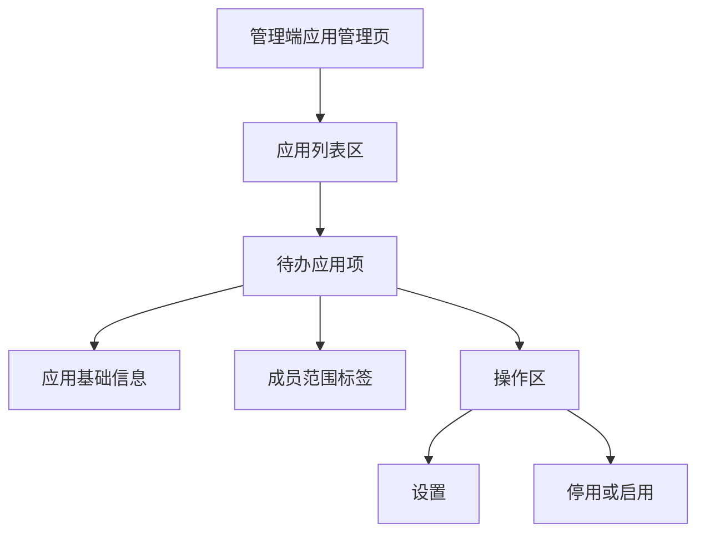
```mermaid
graph TD
A[管理端应用管理页] --> B[应用列表区]
B --> C[待办应用项]
C --> D[应用基础信息]
C --> E[成员范围标签]
C --> F[操作区]
F --> G[设置]
F --> H[停用或启用]
```

### 2.1.2 待办应用启停与可见范围配置

#### 2.1.2.1 功能定义

**功能描述：** 用于管理待办应用在企业内的启用状态及成员可见范围。  
**用户场景：** 企业管理员需要控制哪些成员可使用待办应用，或临时停用待办应用时使用。  
**功能入口与触发方式：** 管理端应用列表中的“待办”应用行，点击“设置”或“停用/启用”。

#### 2.1.2.2 交互流程

**流程说明：** 管理员进入应用管理页后，定位待办应用，选择设置成员范围或切换应用状态；系统保存后在列表内即时回显最新结果。  

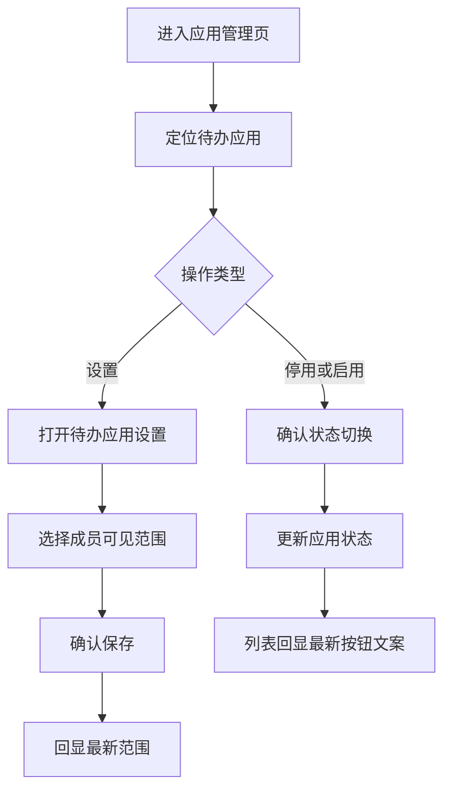
```mermaid
flowchart TD
A[进入应用管理页] --> B[定位待办应用]
B --> C{操作类型}
C -->|设置| D[打开待办应用设置]
D --> E[选择成员可见范围]
E --> F[确认保存]
F --> G[回显最新范围]
C -->|停用或启用| H[确认状态切换]
H --> I[更新应用状态]
I --> J[列表回显最新按钮文案]
```

#### 2.1.2.3 前置条件

**登录状态：** 仅已登录管理员可执行。  
**角色与权限：** 仅具备应用管理权限的企业管理员可执行。  
**前置业务条件：** 待办应用已在应用列表中配置展示。  
**依赖配置或前序步骤：** 企业组织架构与成员数据可正常读取。

#### 2.1.2.4 输入规则

**成员可见范围：** 单选，默认展示当前生效范围，初始展示“全部成员”；已确认可展示“全部成员”，其他可选值为“指定成员/指定部门。  
**应用状态：** 二值状态，取值为“已启用/已停用”。  
**确认操作：** 切换应用状态时需二次确认。

#### 2.1.2.5 校验规则

**成员范围：** 未选择成员范围时，禁用「确定」按钮  。
**状态切换：** 管理员确认前不执行状态变更；取消后保持原状态。  
**无权限校验：** 非管理员点击操作入口时，不允许提交操作并提示“无操作权限”。

#### 2.1.2.6 业务规则

**应用启用规则：** 应用启用后，处于可见范围内的成员可正常进入待办应用。
**应用停用规则：** 应用停用后，成员不可从工作台继续进入待办应用（历史待办数据仍然保留 ）；
**成员范围规则：** 成员范围变更后，仅在新范围内的成员继续可见待办应用。  
**权限差异规则：** 普通成员无权调整待办应用状态与范围。

#### 2.1.2.7 展示与交互状态规则

**范围展示：** 页面以标签形式展示当前生效成员范围。  
**状态按钮展示：** 已启用时展示“已停用”，已停用时展示“已启用”。  
**保存反馈：** 配置成功后提示保存成功，并刷新列表展示。  
**禁用态：** 无权限用户不展示入口。
**用户侧从不可见变为可见：**触发刷新后/重新登录后显示应用入口。
**用户侧从可见变为不可见：1、用户未在待办应用中：1）移动端：点击「待办」应用时，显示提示弹窗“无权限访问，请联系管理员”，用户点击「确认」按钮后退出待办应应用进入至「消息」页且待办应用入口隐藏。2）客户端：点击「待办」应用时，显示提示弹窗“无权限访问，请联系管理员”，用户点击「确认」按钮后退出待办应用，默认选中「消息」显示消息列表及右侧初始内容，同时待办应用入口隐藏。2、用户在待办应用中：1）移动端：任何操作都会显示提示弹窗“无权限访问，请联系管理员”，用户点击「确认」按钮后退出待办应应用进入至「消息」页且待办应用入口隐藏。2）客户端：任何操作都会显示提示弹窗“无权限访问，请联系管理员”，用户点击「确认」按钮后退出待办应用，默认选中「消息」显示消息列表及右侧初始内容；同时待办应用入口隐藏。

#### 2.1.2.8 异常处理

**请求失败：** 提示“设置失败，请稍后重试”，用户可再次提交。  
**无权限：** 提示“无操作权限”，用户仅可返回列表。  
**重复提交：** 连续点击保存时，仅受理一次有效请求，其余操作拦截并提示“处理中，请稍候”。  
**超时或中断：** 提示“网络异常，请重新尝试”，用户可重新发起操作。

#### 2.1.2.9 后置条件

**配置结果：** 系统保存最新应用状态与成员可见范围。  
**页面反馈：** 应用列表即时刷新对应标签和按钮文案。  
**影响范围：** 后续成员访问待办应用时按新配置生效。  
**操作记录：** 需要记录管理员操作日志。

#### 2.1.2.10 补充条件

**历史数据兼容策略：** 停用或范围缩小时，既有待办数据保留在个人历史中。  
**例外情况：** 超级管理员始终保留待办应用访问权限。

## 2.2 桌面端待办工作台

### 2.2.1 页面整体概览

**页面定位：** 组织成员在桌面端统一查看、筛选、处理和维护待办事项的主工作台。  
**页面结构：** 页面由左侧导航区、顶部工具区、快捷标签区、待办列表区、新建待办弹窗、待办详情抽屉组成。  
**信息布局：** 左侧导航承载分栏切换；顶部工具区承载搜索、排序、筛选；列表区展示待办卡片；详情抽屉承载待办编辑、动态与评论。  

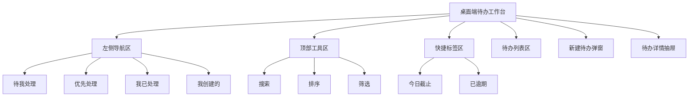
```mermaid
graph TD
A[桌面端待办工作台] --> B[左侧导航区]
B --> B1[待我处理]
B --> B2[优先处理]
B --> B3[我已处理]
B --> B4[我创建的]
A --> C[顶部工具区]
C --> C1[搜索]
C --> C2[排序]
C --> C3[筛选]
A --> D[快捷标签区]
D --> D1[今日截止]
D --> D2[已逾期]
A --> E[待办列表区]
A --> F[新建待办弹窗]
A --> G[待办详情抽屉]
```

### 2.2.2 待办列表浏览与分栏切换

#### 2.2.2.1 功能定义

**功能描述：** 用于按业务视角切换待办列表并查看不同处理范围内的任务。  
**用户场景：** 用户希望快速区分待处理、高优先级、已完成以及本人创建的待办。  
**功能入口与触发方式：** 桌面端待办工作台左侧导航项。

#### 2.2.2.2 交互流程

**流程说明：** 用户进入待办工作台后默认进入“优先处理”；点击其他分栏时，系统重新计算标题、角标与列表结果。  

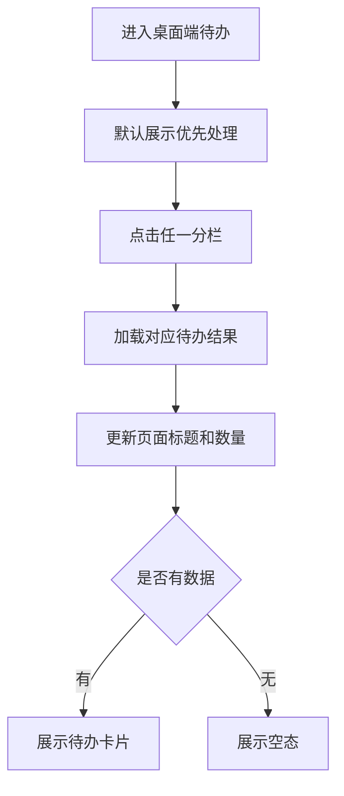
```mermaid
flowchart TD
A[进入桌面端待办] --> B[默认展示优先处理]
B --> C[点击任一分栏]
C --> D[加载对应待办结果]
D --> E[更新页面标题和数量]
E --> F{是否有数据}
F -->|有| G[展示待办卡片]
F -->|无| H[展示空态]
```

#### 2.2.2.3 前置条件

**登录状态：** 仅已登录用户可执行。  
**角色与权限：** 在待办应用可见范围内的成员可访问。  
**前置业务条件：** 待办应用处于启用状态。  
**依赖配置或前序步骤：** 用户已有待办数据时展示角标与列表，无数据时展示空态。

#### 2.2.2.4 输入规则

**分栏标签：** 单选切换，可选值为“待我处理 / 优先处理 / 我已处理 / 我创建的”。  
**默认分栏：** 默认进入“优先处理”。  
**数量角标：** “待我处理”和“优先处理”显示角标数量；其他分栏不显示角标

#### 2.2.2.5 校验规则

**分栏切换：** 同一时刻仅允许一个分栏处于激活状态。  
**结果加载：** 分栏切换后，旧分栏结果需被新分栏结果覆盖。  
**空态校验：** 分栏结果为空时必须展示空态，不可保留旧分栏数据。

#### 2.2.2.6 业务规则

**待我处理：** 展示当前用户未完成的待办；
**优先处理：** 展示当前用户未完成且今日截止、已逾期的待办 ；数据排序：默认按照创建时间倒序排列  
**我已处理：** 展示当前用户已完成的待办；数据排序：默认按照标记完成时间倒序排列
**我创建的：** 展示当前用户创建的待办，完成与未完成状态均可展示；数据排序：默认按照创建时间倒序排列  
**标题联动：** 分栏切换后，主标题同步切换为当前分栏名称。

#### 2.2.2.7 展示与交互状态规则

**激活态：** 当前分栏高亮显示。  
**列表展示：** 每张待办卡片展示复选框（选中代表已完成，取消选中待办取消完成）、标题、截止信息、创建时间、创建人、来源和操作按钮（未完成待办列表展示更多、完成待办按钮；已完成待办列表展示更多、已完成按钮；点击更多按钮显示删除按钮弹窗；已完成按钮/完成待办按钮点击可互相切换）。  
**优先级视觉：** 逾期待办突出显示风险色，即将截止待办突出显示提示色；  
**空态：** 无数据时展示“暂无待办内容”。

#### 2.2.2.8 异常处理

**无数据：** 展示空态，用户可切换其他分栏或创建待办。  
**请求失败：** 提示“加载失败，请刷新重试”，用户可点击刷新。  
**无权限：** 提示“当前无访问权限”。

#### 2.2.2.9 后置条件

**页面状态：** 当前分栏状态被更新。  
**数量结果：** 角标与全局待办提醒数按最新数据重算。  
**用户结果：** 用户可继续执行搜索、筛选、查看详情等后续操作。

#### 2.2.2.10 补充条件

**高优先级口径：** “优先处理”仅包含已逾期、今日截止待办；
**列表分页：**以10 条数据为 1 页，采用滚动加载方式分页展示。

### 2.2.3 待办搜索、排序与筛选

#### 2.2.3.1 功能定义

**功能描述：** 用于帮助用户快速定位目标待办，并按业务条件重新组织列表结果。  
**用户场景：** 用户需要按标题检索待办，或按截止时间、完成状态、优先级快速过滤结果。  
**功能入口与触发方式：** 顶部搜索框、排序入口、筛选弹窗、快捷标签“今日截止 / 已逾期”。

#### 2.2.3.2 交互流程

**流程说明：** 用户输入关键词后系统展示下拉结果；用户选择排序或筛选条件后，系统刷新当前列表；快捷标签与筛选弹窗中的截止时间条件联动。  

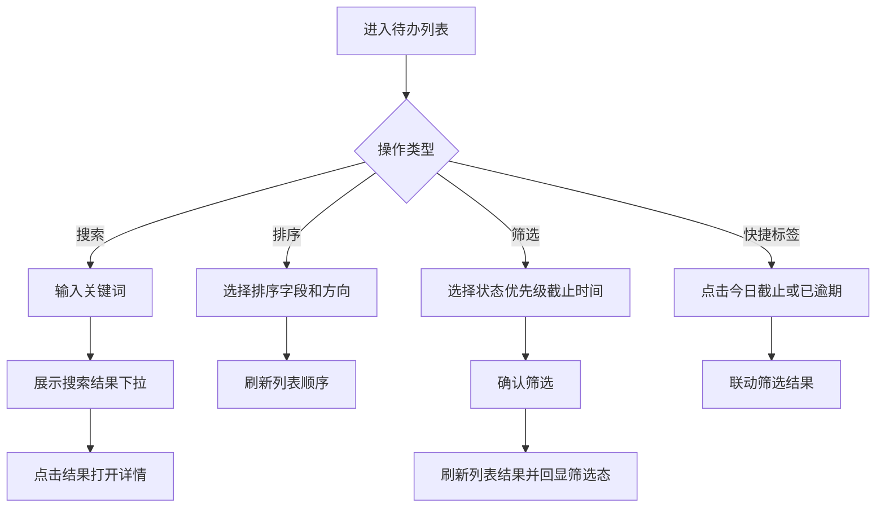
```mermaid
flowchart TD
A[进入待办列表] --> B{操作类型}
B -->|搜索| C[输入关键词]
C --> D[展示搜索结果下拉]
D --> E[点击结果打开详情]
B -->|排序| F[选择排序字段和方向]
F --> G[刷新列表顺序]
B -->|筛选| H[选择状态优先级截止时间]
H --> I[确认筛选]
I --> J[刷新列表结果并回显筛选态]
B -->|快捷标签| K[点击今日截止或已逾期]
K --> L[联动筛选结果]
```

#### 2.2.3.3 前置条件

**登录状态：** 仅已登录用户可执行。  
**角色与权限：** 用户可正常访问待办列表。  
**前置业务条件：** 当前分栏已加载待办数据。  
**依赖配置或前序步骤：** 搜索、排序、筛选基于当前分栏数据生效。

#### 2.2.3.4 输入规则

**搜索关键词：** 文本输入，选填，按待办标题进行模糊匹配。  
**搜索清空：** 支持一键清空关键词。  
**排序字段：** 单选，可选值为“截止时间 / 创建时间 / 更新时间 / 优先级”。  
**排序方向：** 单选；时间类字段支持“从早到晚 / 从晚到早”，优先级支持“从低到高 / 从高到低”。  
**完成状态：** 单选，候选值为“未完成 / 已完成”；不同分栏存在默认锁定规则。
**优先级：** 单选，候选值为：“较低 / 普通 / 较高 / 紧急”。  
**截止时间：**单选，候选值为：已逾期、今天、明天、未来 7 天（未来 7 个自然日） 
**快捷标签：** 单选切换，可选值为“今日截止 / 已逾期”（仅待我处理、优先处理中显示此快捷标签）。

#### 2.2.3.5 校验规则

**搜索校验：** 关键词为空时不展示搜索结果下拉。  
**排序校验：** 同一时刻仅允许一个排序字段和一个排序方向生效。  
**筛选校验：** “待我处理”和“优先处理”分栏默认锁定“未完成”；“我已处理”默认锁定“已完成”；用户不可取消该默认状态。  
**筛选结果校验：** 无匹配结果时必须展示空态。  
**条件联动校验：** 快捷标签与筛选弹窗中的截止时间条件需互相同步。

#### 2.2.3.6 业务规则

**搜索范围：** 仅按待办标题检索。  
**排序范围：** 在当前分栏结果内排序，不跨分栏合并。  
**筛选范围：** 在当前分栏结果内按完成状态、优先级、截止时间组合筛选。  
**默认排序：** 默认按“创建时间 从晚到早”。  
**快捷标签规则：** 激活“今日截止”时，仅展示今日到期待办；激活“已逾期”时，仅展示已逾期待办；再次点击可取消激活。  

#### 2.2.3.7 展示与交互状态规则

**搜索结果展示：** 以浮层列表展示匹配项，并展示标题与截止信息。  
**筛选激活态：** 存在有效筛选条件时，筛选入口高亮显示。  
**快捷标签激活态：** 当前标签选中后改变底色与字体颜色。  
**空态：** 搜索无结果时展示“无搜索结果”；筛选无结果时展示“暂无待办内容”。

#### 2.2.3.8 异常处理

**无搜索结果：** 提示“无搜索结果”，用户可修改或清空关键词。  
**请求失败：** 提示“操作失败，请重试”，用户可再次选择排序或筛选。  
**重复操作：** 同一筛选条件重复点击不应造成多次重复计算。  
**超时或中断：** 提示“网络异常，请稍后重试”。

#### 2.2.3.9 后置条件

**列表结果：** 当前列表仅保留符合条件的待办。  
**页面反馈：** 排序文案、筛选入口状态、快捷标签状态与结果保持一致。  
**后续动作：** 用户可直接在结果列表中查看详情或处理待办。

#### 2.2.3.10 补充条件

**优先级口径冲突：** 筛选条件与编辑条件中的优先级档位命名不一致，需统一后再评审。  
**截止时间口径：** “明天”“未来七天”的自然日边界包含今天。

### 2.2.4 新建待办

#### 2.2.4.1 功能定义

**功能描述：** 用于创建新的个人待办事项，并补充标题、描述、截止时间、优先级与附件。  
**用户场景：** 用户需要快速记录新的待处理事项并安排完成时限。  
**功能入口与触发方式：** 列表页右上角新增按钮。

#### 2.2.4.2 交互流程

**流程说明：** 用户打开新建弹窗，填写标题、描述、截止日期、截止时间、优先级、附件后点击确定；系统校验通过后创建待办并插入列表顶部。  

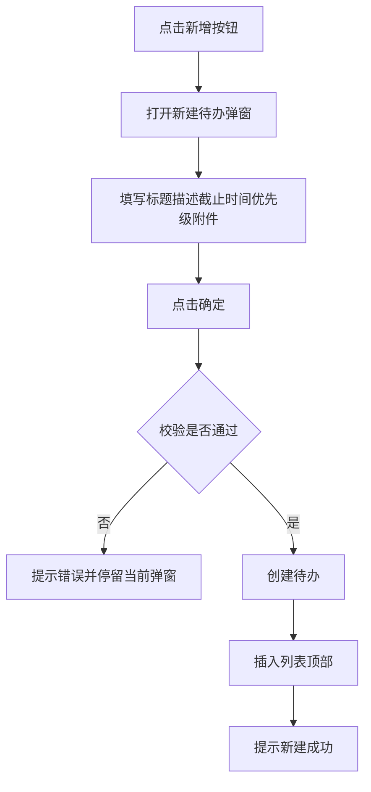
```mermaid
flowchart TD
A[点击新增按钮] --> B[打开新建待办弹窗]
B --> C[填写标题描述截止时间优先级附件]
C --> D[点击确定]
D --> E{校验是否通过}
E -->|否| F[提示错误并停留当前弹窗]
E -->|是| G[创建待办]
G --> H[插入列表顶部]
H --> I[提示新建成功]
```

#### 2.2.4.3 前置条件

**登录状态：** 仅已登录用户可执行。  
**角色与权限：** 在待办应用可见范围内的成员可执行。  
**前置业务条件：** 待办应用可正常访问。  

#### 2.2.4.4 输入规则

**待办标题：** 文本输入，必填，不能为空；最大长度为200，输入框高度随字数伸缩。  
**描述：** 多行文本输入，选填；最大长度为3000，输入框高度随字数伸缩。 。  
**截止日期：** 日期选择（仅可选择当天及以后的日期），必填，默认为当天年月日。  
**截止时间：** 时间选择，必填，00:00-23:59 任意时分进行选择，必填，默认为当天 18:00。  
**优先级：** 单选，默认值为“普通”，可选值为“较低 / 普通 / 较高 / 紧急”。  
**附件：** 选填，支持多附件上传；图片：支持jpg、jpeg、png；单个图片最大为 2M；视频：支持MP4；单个视频大小不超过 200MB；视频时长不超过5分钟，超过5分钟无法发送；文件：支持doc、docx、dot、dotx、docm、dotm、xls、xlsx、xlt、xltx、xlsm、xltm、csv、ett、ppt、pptx、pps、ppsx、pptm、ppsm、pot、potx、potm、dpt、dps 、pdf、ofd、zip、rar、txt、rtf、html、htm、mht、mhtml、xml、uof、uot、mp3、wav、amr、rp 格式；单个文件大小不超过500M

#### 2.2.4.5 校验规则

**标题校验：** 标题为空时提示“请填写待办事项标题”。  
**截止时间校验：** 未完整选择截止日期和时间时提示“请选择完整的截止日期和时间”。  
**附件校验：** 上传重复附件时不重复加入列表。  
**格式校验：** 附件超出支持格式时：图片提示文案为“图片格式不支持”，文件提示文案为“文件格式不支持”，视频提示文案为“视频仅支持MP4 格式文件”；附件超出大小限制时：图片提示文案为“图片大小不能超过 2M”，文件提示文案为“文件大小不能超过 500MB”，视频提示文案为“视频大小不能超过 200MB”；视频时长超过 5 分钟限制时：提示文案为“视频时长不能超过 5 分钟”。

#### 2.2.4.6 业务规则

**创建归属：** 新建待办默认归属为“个人待办”。  
**创建人：** 创建人为当前用户。  
**插入位置：** 新建成功后，待办插入当前列表顶部。  
**默认状态：** 新建完成后状态为“未完成”。  
**优先级影响：** 紧急待办或临近截止待办会进入“优先处理”统计范围。  
**时间文案：** 系统根据截止时间生成“已经截止 / 即将截止 / 截止时间”展示文案。

#### 2.2.4.7 展示与交互状态规则

**弹窗展示：** 新建待办以弹窗形式打开，支持取消关闭。  
**成功反馈：** 创建成功后提示“新建待办成功”。  
**列表回显：** 卡片展示标题、截止信息、创建时间、创建人、来源、操作按钮。  
**重置规则：** 创建成功后，表单内容恢复默认值。

#### 2.2.4.8 异常处理

**提交失败：** 提示“新建失败，请稍后重试”，用户可重新提交。  
**网络异常：** 提示“网络异常，请稍后重试”。  
**重复提交：** 连续点击确定时，仅受理一次创建请求。  
**上传失败：** 提示“附件上传失败”，用户可重新上传。

#### 2.2.4.9 后置条件

**数据结果：** 系统新增一条待办记录。  
**状态结果：** 新待办状态为未完成。  
**页面反馈：** 列表、角标数量、优先处理数量按最新数据更新。  

#### 2.2.4.10 补充条件
 
**附件能力：** 附件默认支持预览（点击显示大弹窗进行预览）、下载与删除（点击直接删除）；具体看三方平台的支撑能力，若附件格式文件不支持预览则无预览按钮；

### 2.2.5 待办详情查看与编辑

#### 2.2.5.1 功能定义

**功能描述：** 用于查看待办完整内容，并在详情抽屉中编辑标题、描述、截止时间、优先级和附件。  
**用户场景：** 用户需要补充或修改待办内容，避免回到列表页重复创建。  
**功能入口与触发方式：** 点击任一待办卡片进入详情抽屉。

#### 2.2.5.2 交互流程

**流程说明：** 用户点击待办卡片后打开详情抽屉；系统展示当前待办内容；用户修改字段后系统实时回写详情页与列表卡片。  

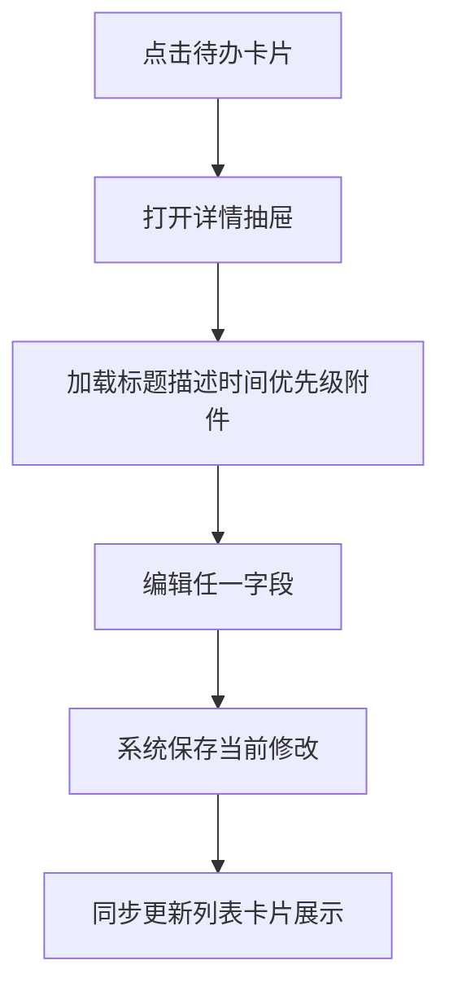
```mermaid
flowchart TD
A[点击待办卡片] --> B[打开详情抽屉]
B --> C[加载标题描述时间优先级附件]
C --> D[编辑任一字段]
D --> E[系统保存当前修改]
E --> F[同步更新列表卡片展示]
```

#### 2.2.5.3 前置条件

**登录状态：** 仅已登录用户可执行。  
**角色与权限：** 对当前待办具有查看与编辑权限的成员可执行。
**前置业务条件：** 目标待办已存在。  
**依赖配置或前序步骤：** 用户从待办列表或日历联动入口进入详情。

#### 2.2.5.4 输入规则

**待办标题：** 文本输入，必填，不能为空；最大长度为200，输入框高度随字数伸缩。  
**描述：** 多行文本输入，选填；最大长度为3000，输入框高度随字数伸缩。 。  
**截止日期：** 日期选择（仅可选择当天及以后的日期），必填，默认为当天年月日。  
**截止时间：** 时间选择，必填，00:00-23:59 任意时分进行选择，必填，默认为当天 18:00。  
**优先级：** 单选，默认值为“普通”，可选值为“较低 / 普通 / 较高 / 紧急”。  
**附件：** 选填，支持多附件上传；图片：支持jpg、jpeg、png；单个图片最大为 2M；视频：支持MP4；单个视频大小不超过 200MB；视频时长不超过5分钟，超过5分钟无法发送；文件：支持doc、docx、dot、dotx、docm、dotm、xls、xlsx、xlt、xltx、xlsm、xltm、csv、ett、ppt、pptx、pps、ppsx、pptm、ppsm、pot、potx、potm、dpt、dps 、pdf、ofd、zip、rar、txt、rtf、html、htm、mht、mhtml、xml、uof、uot、mp3、wav、amr、rp 格式；单个文件大小不超过500M

#### 2.2.5.5 校验规则

**标题校验：** 标题为空时提示“请填写待办事项标题”。  
**截止时间校验：** 未完整选择截止日期和时间时提示“请选择完整的截止日期和时间”。  
**附件校验：** 上传重复附件时不重复加入列表。  
**格式校验：** 附件超出支持格式时：图片提示文案为“图片格式不支持”，文件提示文案为“文件格式不支持”，视频提示文案为“视频仅支持MP4 格式文件”；附件超出大小限制时：图片提示文案为“图片大小不能超过 2M”，文件提示文案为“文件大小不能超过 500MB”，视频提示文案为“视频大小不能超过 200MB”；视频时长超过 5 分钟限制时：提示文案为“视频时长不能超过 5 分钟”

#### 2.2.5.6 业务规则

**实时同步规则：** 详情页字段变更后，同步更新列表卡片展示。  
**编辑范围：** 用户可修改标题、描述、截止时间、优先级与附件。  
**状态独立规则：** 完成状态变更通过单独功能执行，不通过普通编辑保存触发。  
**来源展示：** 待办来源保持原值，不因编辑变更。

#### 2.2.5.7 展示与交互状态规则

**详情结构：** 顶部展示状态操作与更多菜单，中部展示核心字段，底部展示待办动态与动态评论子模块。  
**回显规则：** 打开详情时，默认回显待办当前信息。  
**附件展示：**卡片样式展示，显示文件名称、文件格式、文件大小、文件操作按钮（预览、下载、删除）  
**关闭规则：** 点击关闭按钮后退出详情，不影响已保存的修改。

#### 2.2.5.8 异常处理

**待办不存在：** 提示“待办不存在或已删除”，用户可返回列表。  
**保存失败：** 提示“保存失败，请稍后重试”，用户可再次编辑。  
**无权限：** 提示“无编辑权限”，用户仅可查看详情。  
**网络中断：** 提示“网络异常，请稍后重试”。

#### 2.2.5.9 后置条件

**数据结果：** 待办主信息被更新。  
**页面反馈：** 详情页与列表卡片展示保持一致。  
**联动结果：** 关联日历展示按最新截止时间更新。  
**记录结果：** 编辑行为写入待办动态记录，例如“王三 更新内容 这是变更后的标题”。

#### 2.2.5.10 补充条件

**只读场景：** 已完成待办允许继续编辑标题、描述、时间与优先级。  

#### 2.2.5.11 待办动态与动态评论

**模块定位：** 待办动态与动态评论为待办详情查看与编辑中的协同子模块，承载待办处理过程记录与评论沟通。  
**动态内容：** 动态区展示日期时间与动态内容；动态内容包括“#创建人姓名# 创建待办”、“#创建人姓名# 已完成待办”、“#创建人姓名# 标记待办为未完成”、“#操作人姓名# 更新内容 #更新后的内容，如标题、时间等#，例王三 更新内容 这是变更后的标题”。  
**评论内容：** 评论区支持文字评论与附件评论，附件规则同 2.2.4 新建待办的上传附件规则；评论区展示评论用户头像、昵称、评论时间和评论内容，并支持删除评论。  
**交互规则：** 评论新增、删除仅影响评论区内容，不影响待办主信息保存；标题、描述、截止时间、优先级等主信息编辑成功后需同步生成动态记录。  
**权限规则：** 具有详情查看权限的成员可查看动态与评论；具备评论操作权限的成员可发送或删除评论。  
**展示规则：** 默认打开“动态”标签；动态与评论通过标签切换展示；动态列表按时间倒序展示，评论列表按最新结果刷新；已上传的附件型评论按附件卡片形式展示。  
**交互状态规则：** 评论输入存在有效内容时显示发送按钮；评论为空时展示“暂无评论”或同义空态；删除入口仅在具备权限时展示。  
**异常处理：** 评论发送或删除失败时提示“请稍后重试”；待办已删除时不可继续新增评论。

### 2.2.6 完成待办与恢复待办

#### 2.2.6.1 功能定义

**功能描述：** 用于在桌面端将待办从未完成切换为已完成，或从已完成恢复为未完成。  
**用户场景：** 用户完成任务后需要归档处理结果，或误操作后恢复待办继续处理。  
**功能入口与触发方式：** 列表卡片复选框、卡片按钮、详情抽屉顶部状态按钮。

#### 2.2.6.2 交互流程

**流程说明：** 用户点击完成待办按钮后，系统更新状态并调整列表位置；若再次点击已完成按钮，系统恢复为未完成。  

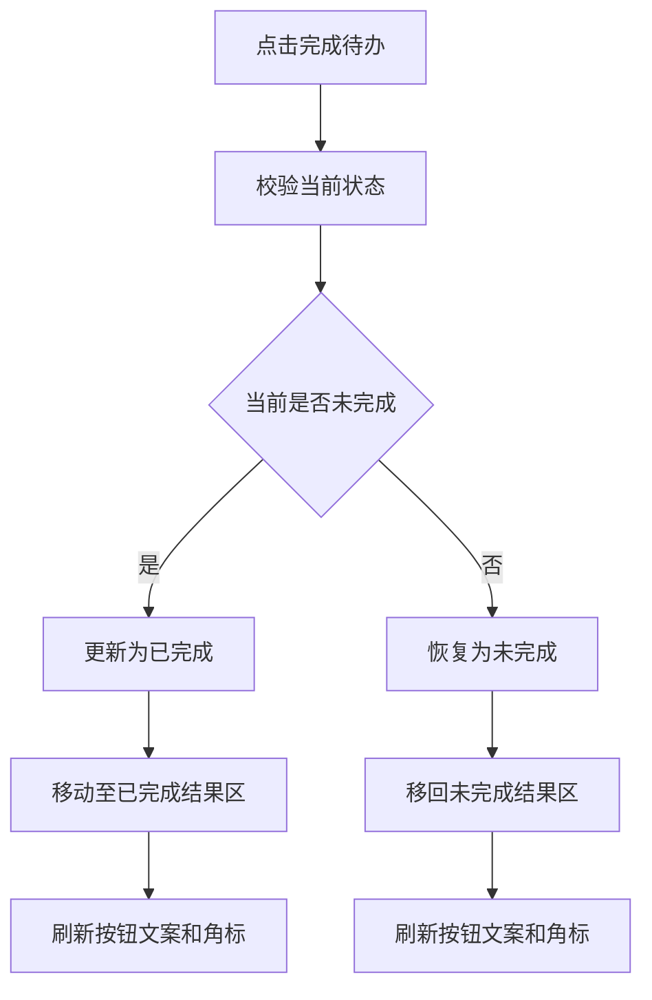
```mermaid
flowchart TD
A[点击完成待办] --> B[校验当前状态]
B --> C{当前是否未完成}
C -->|是| D[更新为已完成]
D --> E[移动至已完成结果区]
E --> F[刷新按钮文案和角标]
C -->|否| G[恢复为未完成]
G --> H[移回未完成结果区]
H --> I[刷新按钮文案和角标]
```

#### 2.2.6.3 前置条件

**登录状态：** 仅已登录用户可执行。  
**角色与权限：** 对当前待办具有处理权限的成员可执行。  
**前置业务条件：** 目标待办存在。  
**依赖配置或前序步骤：** 用户已进入列表页或详情页。

#### 2.2.6.4 输入规则

**状态操作：** 单次点击触发一次状态切换。  
**目标状态：** 可选结果为“已完成 / 未完成”。  
**操作入口：** 列表与详情入口触发结果一致。

#### 2.2.6.5 校验规则

**重复点击校验：** 状态变更处理中不可重复提交。  
**权限校验：** 无处理权限时不允许切换状态。  
**数据存在校验：** 待办已删除时不允许切换状态，并提示待办不存在。

#### 2.2.6.6 业务规则

**完成规则：** 待办完成后进入已完成结果集，并在“我已处理”中展示。  
**恢复规则：** 已完成待办恢复后重新进入未完成结果集。  
**优先处理重算：** 状态变化后，待我处理数量、优先处理数量和全局提醒数需重新计算。  
**展示文案规则：** 完成后按钮文案变为“已完成”，恢复后变为“完成待办”。  
**详情联动规则：** 若详情抽屉已打开，顶部状态按钮与当前状态同步。

#### 2.2.6.7 展示与交互状态规则

**完成态展示：** 卡片使用完成样式，标题可展示删除线或弱化色。  
**恢复态展示：** 卡片恢复未完成样式。  
**反馈提示：** 完成后提示“待办已完成”，恢复后提示“已恢复待办”。  
**位置变化：** 状态变化后列表内的位置和所属结果集同步更新。

#### 2.2.6.8 异常处理

**请求失败：** 提示“操作失败，请稍后重试”，用户可再次点击。  
**网络异常：** 提示“网络异常，请稍后重试”。  
**无权限：** 提示“无处理权限”，用户可仅查看详情。  
**重复提交：** 忽略短时间内的连续重复点击。

#### 2.2.6.9 后置条件

**状态结果：** 待办状态更新为已完成或未完成。  
**列表结果：** 卡片移动至对应结果集。  
**数量结果：** 角标与提醒数被重新计算。  
**联动结果：** 日历视图中的待办状态同步更新。

#### 2.2.6.10 补充条件

**完成定义：** 已完成记录完成人和完成时间。  
**恢复权限：** 已完成待办仅允许原处理人恢复为未完成待办。

### 2.2.7 删除待办

#### 2.2.7.1 功能定义

**功能描述：** 用于删除不再需要保留的待办事项。  
**用户场景：** 用户误创建待办，或待办已失效需要彻底移除时使用。  
**功能入口与触发方式：** 列表卡片更多菜单、详情抽屉更多菜单点击“删除”。

#### 2.2.7.2 交互流程

**流程说明：** 用户点击删除后，系统展示二次确认弹窗；用户确认后删除待办并关闭相关详情或浮层。  

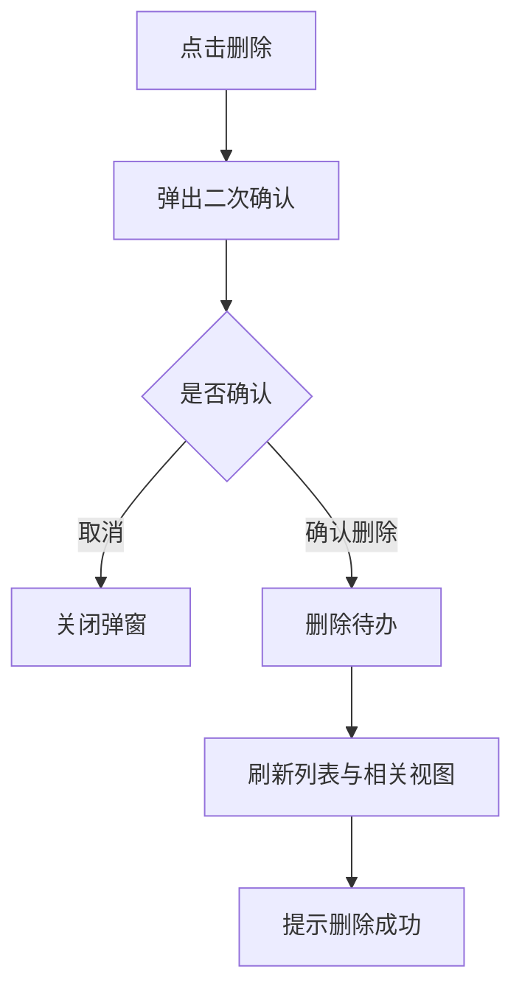
```mermaid
flowchart TD
A[点击删除] --> B[弹出二次确认]
B --> C{是否确认}
C -->|取消| D[关闭弹窗]
C -->|确认删除| E[删除待办]
E --> F[刷新列表与相关视图]
F --> G[提示删除成功]
```

#### 2.2.7.3 前置条件

**登录状态：** 仅已登录用户可执行。  
**角色与权限：** 对当前待办具有删除权限的成员可执行； 
**前置业务条件：** 目标待办存在。  
**依赖配置或前序步骤：** 用户已打开卡片更多菜单或详情更多菜单。

#### 2.2.7.4 输入规则

**删除确认：** 二次确认弹窗必经。  
**确认文案：** 提示“删除的待办不可恢复”。  
**操作结果：** 用户可选“取消 / 删除”。

#### 2.2.7.5 校验规则

**确认校验：** 未确认前不执行删除。  
**权限校验：** 无删除权限时，不展示删除入口或禁止删除。  
**存在校验：** 待办已被删除时不可再次删除。

#### 2.2.7.6 业务规则

**删除规则：** 确认删除后，目标待办从当前结果集移除。  
**不可恢复规则：** 删除后不提供恢复入口。  
**联动规则：** 删除后需同步移除日历中的对应待办展示。  
**详情处理：** 若删除操作发生在详情页，删除成功后关闭详情抽屉。

#### 2.2.7.7 展示与交互状态规则

**确认弹窗：** 居中展示删除确认信息。  
**成功反馈：** 删除成功后提示“删除成功”。  
**刷新方式：** 列表和相关浮层即时刷新。  
**空态反馈：** 删除后若当前结果集为空，展示空态。

#### 2.2.7.8 异常处理

**删除失败：** 提示“删除失败，请稍后重试”。  
**无权限：** 提示“无删除权限”。  
**网络异常：** 提示“网络异常，请稍后重试”。  
**重复提交：** 连续点击删除时仅受理一次。

#### 2.2.7.9 后置条件

**数据结果：** 目标待办被删除。  
**页面结果：** 当前列表、详情页、日历浮层同步移除目标待办。  
**数量结果：** 角标与提醒数被重新计算。  
**日志结果：** 删除行为保留在审计记录。

#### 2.2.7.10 补充条件
  
**附件处理：** 待办删除后附件同步删除

## 2.3 桌面端日历联动

### 2.3.1 页面整体概览

**页面定位：** 日历视图用于按日期查看待办安排，并作为待办详情的辅助浏览入口。  
**页面结构：** 页面由月视图、周视图、日视图、列表视图及待办浮层/详情联动区组成。  
**信息布局：** 待办以日期标记、时间槽卡片或列表项形式展示，支持从日历直接查看待办详情与执行状态操作。  

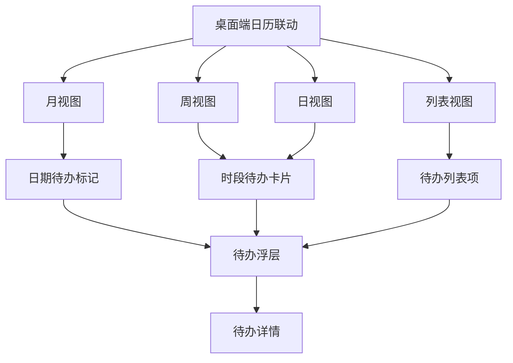
```mermaid
graph TD
A[桌面端日历联动] --> B[月视图]
A --> C[周视图]
A --> D[日视图]
A --> E[列表视图]
B --> F[日期待办标记]
C --> G[时段待办卡片]
D --> G
E --> H[待办列表项]
F --> I[待办浮层]
G --> I
H --> I
I --> J[待办详情]
```

### 2.3.2 日历视图中的待办展示与快捷查看

#### 2.3.2.1 功能定义

**功能描述：** 用于在日历中展示待办事项，并支持快捷查看待办详情。  
**用户场景：** 用户在查看日程时，希望同时掌握某一天或某时间段内的待办安排。  
**功能入口与触发方式：** 桌面端日历月视图、周视图、日视图、列表视图中的待办标记或待办列表项。

#### 2.3.2.2 交互流程

**流程说明：** 用户进入日历后查看指定日期或时段的待办；点击待办项后，系统展示待办浮层卡片弹窗（显示标题、来源、截止日期字段及查看详情按钮、删除待办按钮、完成待办/已完成按钮、卡片弹窗隐藏按钮）；点击卡片中的查看详情打开待办详情弹窗。  

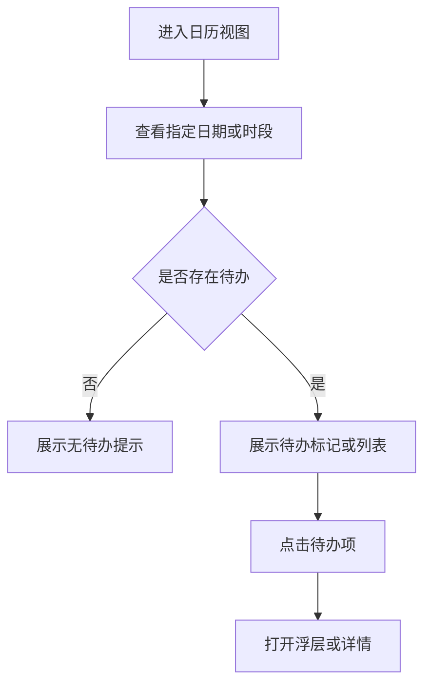
```mermaid
flowchart TD
A[进入日历视图] --> B[查看指定日期或时段]
B --> C{是否存在待办}
C -->|否| D[展示无待办提示]
C -->|是| E[展示待办标记或列表]
E --> F[点击待办项]
F --> G[打开浮层或详情]
```

#### 2.3.2.3 前置条件

**登录状态：** 仅已登录用户可执行。  
**角色与权限：** 用户可访问日历与待办应用。  
**前置业务条件：** 当前日期范围内存在待办数据时才展示待办项。  
**依赖配置或前序步骤：** 待办与日历已建立关联展示关系。

#### 2.3.2.4 输入规则

**视图类型：** 可选值为“月视图 / 周视图 / 日视图 / 列表视图”。  
**日期选择：** 用户可切换查看不同日期。  
**待办项点击：** 单次点击打开目标待办浮层卡片弹窗。

#### 2.3.2.5 校验规则

**数据匹配校验：** 仅展示与当前日期或时段匹配的待办。  
**状态展示校验：** 已完成待办与未完成待办需有可区分的展示样式。  
**空态校验：** 当月或当前视图无待办时必须展示空态提示。

#### 2.3.2.6 业务规则

**日期归属规则：** 待办按截止日期归入对应日期展示。  
**时间归属规则：** 在周视图和日视图中，待办按截止时间落入对应时间槽。  
**详情联动规则：** 从日历点击待办后，打开的是同一条待办的统一详情。  
**状态联动规则：** 已完成待办在日历中保留展示，但样式弱化。

#### 2.3.2.7 展示与交互状态规则

**月视图展示：** 日期格内展示阳历日期、农历信息和待办项；单条待办展示圆点、完成状态图标和待办标题，标题超长时单行省略。  
**月视图交互：** 单日待办超过 5 条时，日期格内显示前 4 条，并展示“还有X项...”入口；点击单条待办打开待办浮层卡片，点击“还有X项...”打开该日剩余待办列表浮层。  
**周/日视图展示：** 待办按截止时间落入对应小时槽位；同一时段待办不超过 2 条时全部直出，超过 2 条时直出 1 条并展示“还有X项...”入口。  
**周/日视图状态：** 今日对应日期或列高亮展示；若当前查看日期或本周包含今天，则展示当前时间红线并自动滚动到当前时间附近。  
**列表视图展示：** 按日期分组展示待办；左侧展示日期、周几和农历，右侧展示待办列表项；单条待办展示时间、完成状态图标和待办标题。  
**待办浮层展示：** 浮层卡片展示待办标题、来源“来自待办”、截止时间、时区信息“GMT+8”，并提供“查看详情”“完成待办/标记为未完成”“删除”“关闭”操作。  
**完成态展示：** 已完成待办保留展示，圆点和勾选图标弱化，标题显示浅灰色并加中划线。  
**空态：** 月、日、周视图在无待办时不展示待办标记；

#### 2.3.2.8 异常处理

**无数据：** 展示空态，用户可切换日期继续查看。  
**加载失败：** 提示“加载失败，请重试”。  
**无权限：** 提示“无查看权限”，用户不可进入详情。  
**网络异常：** 提示“网络异常，请稍后重试”。

#### 2.3.2.9 后置条件

**查看结果：** 用户可在日历视图中完成待办浏览和详情查看。  
**页面结果：** 当前日历视图保留定位状态。  
**后续动作：** 用户可在详情中继续完成、恢复或删除待办。

#### 2.3.2.10 补充条件

**月视图展示上限：** 单日最多直接展示 5 条待办，超过部分通过“还有X项...”承接。  
**日/周视图展示上限：** 同一时段最多直接完整展示 2 条待办，超过部分通过“还有X项...”承接。  

### 2.3.3 待办与日历数据同步

#### 2.3.3.1 功能定义

**功能描述：** 用于确保待办列表和日历视图在创建、完成、恢复、删除后的展示结果保持一致。  
**用户场景：** 用户在任一入口处理待办后，希望另一个入口立即呈现同样的状态。  
**功能入口与触发方式：** 在待办列表、待办详情、日历视图中执行创建、完成、恢复、删除等动作时自动触发。

#### 2.3.3.2 交互流程

**流程说明：** 用户在待办相关入口完成操作后，系统刷新日历和待办视图中的对应数据，保持当前页面结果一致。  

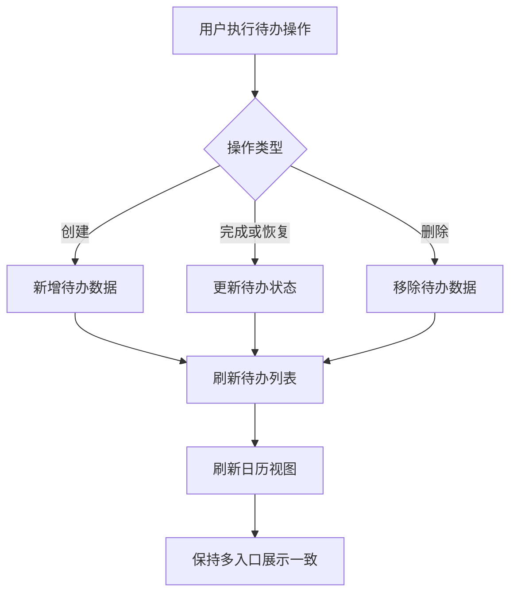
```mermaid
flowchart TD
A[用户执行待办操作] --> B{操作类型}
B -->|创建| C[新增待办数据]
B -->|完成或恢复| D[更新待办状态]
B -->|删除| E[移除待办数据]
C --> F[刷新待办列表]
D --> F
E --> F
F --> G[刷新日历视图]
G --> H[保持多入口展示一致]
```

#### 2.3.3.3 前置条件

**登录状态：** 仅已登录用户可执行。  
**角色与权限：** 对目标待办拥有相应操作权限的成员可触发同步。  
**前置业务条件：** 目标待办已与日历形成日期关联。  
**依赖配置或前序步骤：** 至少一个待办入口和一个日历入口处于可用状态。

#### 2.3.3.4 输入规则

**触发动作：** 包含创建、编辑截止时间、完成、恢复、删除。  
**同步范围：** 当前会话内的待办列表与日历各视图。  
**刷新策略：** 自动触发，无需用户手动确认。

#### 2.3.3.5 校验规则

**一致性校验：** 同一待办在多个入口的标题、时间、状态必须一致。  
**日期校验：** 截止时间变化后，需从原日期位置移除并更新到新日期位置。  
**删除校验：** 删除后不得在任一日历视图中继续出现。

#### 2.3.3.6 业务规则

**创建同步：** 新建待办后，日历中对应日期立即展示新待办。  
**状态同步：** 完成或恢复后，日历中的视觉状态与列表状态同步变化。  
**删除同步：** 删除待办后，日历与列表同时移除。  
**时间同步：** 修改截止时间后，日历中的归属日期和时间槽同步更新。

#### 2.3.3.7 展示与交互状态规则

**刷新反馈：** 同步完成后无需额外弹窗提示，以结果刷新为主。  
**当前视图保持：** 在用户当前所在视图内完成局部或整体刷新，不强制跳转视图。  
**详情联动：** 若详情抽屉已打开，展示内容保持最新状态。  
**浮层联动：** 若日历单条待办浮层或“还有X项...”浮层已打开，完成、恢复或删除后浮层内容即时重绘；无剩余待办时关闭对应浮层。

#### 2.3.3.8 异常处理

**同步失败：** 提示“同步失败，请刷新后重试”
**部分成功：** 若列表更新成功但日历未刷新，提示“数据已更新，日历展示稍后刷新”。  
**网络异常：** 提示“网络异常，请稍后重试”。  
**重复操作：** 重复触发同一操作时，不应生成重复待办项。

#### 2.3.3.9 后置条件

**数据结果：** 待办与日历的展示数据保持一致。  
**页面结果：** 用户在不同视图中看到同一条待办的统一状态。  
**统计结果：** 相关数量与提醒状态按最新结果更新。

#### 2.3.3.10 补充条件

**跨端同步时效：** 桌面端与移动端之间需要实时同步。

## 2.4 移动端待办页

### 2.4.1 页面整体概览

**页面定位：** 组织成员在移动端进行待办浏览、创建、编辑、处理和复盘的主入口。  
**页面结构：** 页面由顶部导航区、分栏标签区、排序筛选区、待办卡片区、新建待办面板、详情全屏页组成。  
**信息布局：** 顶部承载返回、分栏和工具；中部承载待办卡片列表；底部悬浮按钮承载新建；详情页承载编辑、动态与评论。  

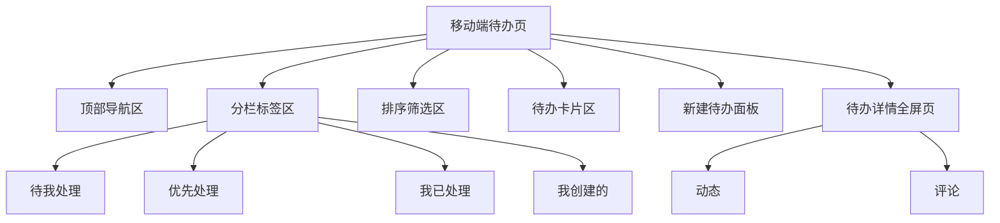
```mermaid
graph TD
A[移动端待办页] --> B[顶部导航区]
A --> C[分栏标签区]
C --> C1[待我处理]
C --> C2[优先处理]
C --> C3[我已处理]
C --> C4[我创建的]
A --> D[排序筛选区]
A --> E[待办卡片区]
A --> F[新建待办面板]
A --> G[待办详情全屏页]
G --> H[动态]
G --> I[评论]
```

### 2.4.2 移动端待办列表浏览与分栏切换

#### 2.4.2.1 功能定义

**功能描述：** 用于在移动端快速切换不同待办视角并查看对应结果。  
**用户场景：** 用户在手机端处理碎片化任务时，希望通过分栏快速进入最关注的待办范围。  
**功能入口与触发方式：** 移动端待办页顶部标签。

#### 2.4.2.2 交互流程

**流程说明：** 用户进入移动端待办页后默认停留在“优先处理”；左右切换或点击其他标签后，系统刷新列表和数量角标。  

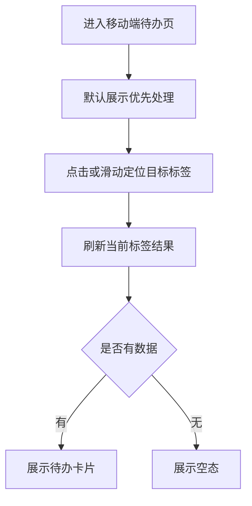
```mermaid
flowchart TD
A[进入移动端待办页] --> B[默认展示优先处理]
B --> C[点击或滑动定位目标标签]
C --> D[刷新当前标签结果]
D --> E{是否有数据}
E -->|有| F[展示待办卡片]
E -->|无| G[展示空态]
```

#### 2.4.2.3 前置条件

**登录状态：** 仅已登录用户可执行。  
**角色与权限：** 在待办应用可见范围内的成员可访问。  
**前置业务条件：** 移动端待办入口已开放。  
**依赖配置或前序步骤：** 当前用户已有或可创建待办。

#### 2.4.2.4 输入规则

**分栏标签：** 单选，可选值为“待我处理 / 优先处理 / 我已处理 / 我创建的”。  
**默认分栏：** 默认进入“优先处理”。  
**数量角标：** “待我处理”和“优先处理”显示数量角标。

#### 2.4.2.5 校验规则

**标签校验：** 同一时刻仅允许一个标签处于激活状态。  
**空态校验：** 当前标签无数据时必须展示空态。  
**滚动定位校验：** 标签切换后，当前激活项需保持可见。

#### 2.4.2.6 业务规则

**待我处理：** 展示未完成待办。  
**优先处理：** 展示未完成且符合高优先级规则的待办。  
**我已处理：** 展示已完成待办。  
**我创建的：** 展示当前用户创建的全部待办。  
**数量重算：** 状态或筛选变化后，标签角标同步刷新。

#### 2.4.2.7 展示与交互状态规则

**激活态：** 当前标签高亮并显示底部指示线。  
**卡片展示：** 卡片展示标题、截止信息、创建人、来源。  
**完成态：** 已完成卡片展示弱化样式。  
**空态：** 无数据时展示“暂无待办内容”。

#### 2.4.2.8 异常处理

**无数据：** 展示空态，用户可切换标签或新建待办。  
**加载失败：** 提示“加载失败，请稍后重试”。  
**无权限：** 提示“当前无访问权限”。

#### 2.4.2.9 后置条件

**页面结果：** 当前标签状态更新。  
**数量结果：** 标签角标按最新数据刷新。  
**后续动作：** 用户可继续排序、筛选、查看详情或新建待办。

#### 2.4.2.10 补充条件

**标签排序：** 标签顺序为固定。  
**高优先级口径：** 与桌面端保持一致。

### 2.4.3 移动端排序与筛选

#### 2.4.3.1 功能定义

**功能描述：** 用于在移动端按照排序与筛选条件快速定位目标待办。  
**用户场景：** 用户需要在小屏场景下快速查看逾期待办、今日待办或某一优先级待办。  
**功能入口与触发方式：** 移动端待办页顶部“排序”入口和“筛选”入口。

#### 2.4.3.2 交互流程

**流程说明：** 用户打开排序或筛选面板后选择条件并确认，系统按当前标签状态刷新结果；标签默认锁定的完成状态不可取消。  

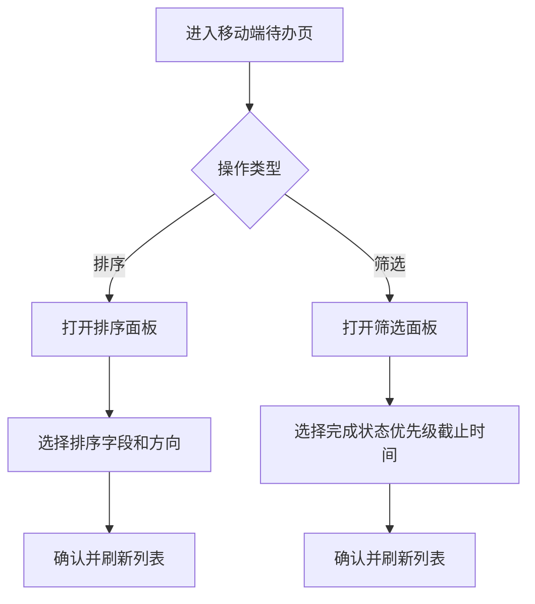
```mermaid
flowchart TD
A[进入移动端待办页] --> B{操作类型}
B -->|排序| C[打开排序面板]
C --> D[选择排序字段和方向]
D --> E[确认并刷新列表]
B -->|筛选| F[打开筛选面板]
F --> G[选择完成状态优先级截止时间]
G --> H[确认并刷新列表]
```

#### 2.4.3.3 前置条件

**登录状态：** 仅已登录用户可执行。  
**角色与权限：** 用户可正常访问移动端待办页。  
**前置业务条件：** 当前标签已有待办结果或允许为空。  
**依赖配置或前序步骤：** 排序和筛选基于当前标签结果生效。

#### 2.4.3.4 输入规则

**排序字段：** 单选，可选值为“截止时间 / 创建时间 / 更新时间 / 优先级”。  
**排序方向：** 时间类支持“从早到晚 / 从晚到早”，优先级支持“从低到高 / 从高到低”。  
**完成状态：** 候选值为“未完成 / 已完成”；待我处理、优先处理、我已处理存在默认锁定。  
**优先级：** 筛选候选值为“紧急 / 较紧急 / 普通 / 较低”；
**截止时间：** 候选值为“已逾期 / 今天 / 明天 / 未来七天”。

#### 2.4.3.5 校验规则

**状态锁定校验：** 在“待我处理 / 优先处理”下，完成状态默认锁定为未完成；在“我已处理”下默认锁定为已完成。  
**结果校验：** 无匹配结果时展示空态。  
**条件校验：** 同一分组内仅保留一个生效条件。  
**口径校验：** 优先级档位命名需在正式上线前统一。

#### 2.4.3.6 业务规则

**默认排序：** 默认按“创建时间 从晚到早”。  
**筛选范围：** 筛选仅作用于当前标签结果集。  
**高优先级规则：** “优先处理”默认只展示高优先级未完成待办。  
**截止时间规则：** “已逾期”“今天”已体现明确结果；“明天”“未来七天”的边界口径为包含今天。

#### 2.4.3.7 展示与交互状态规则

**面板形式：** 排序和筛选均以底部抽屉形式打开。  
**激活态：** 存在有效筛选条件时，筛选入口高亮。  
**列表刷新：** 用户确认后立即刷新当前卡片列表。  
**空态：** 无结果时展示移动端空态。

#### 2.4.3.8 异常处理

**请求失败：** 提示“操作失败，请稍后重试”。  
**网络异常：** 提示“网络异常，请稍后重试”。  
**重复点击：** 忽略连续重复确认操作。

#### 2.4.3.9 后置条件

**结果数据：** 当前标签下仅保留符合条件的待办。  
**页面状态：** 排序文案、筛选按钮状态与结果一致。  
**数量结果：** 标签角标按最新结果重新计算。

### 2.4.4 移动端新建待办

#### 2.4.4.1 功能定义

**功能描述：** 用于在移动端快速创建新的待办事项。  
**用户场景：** 用户在外出或碎片化场景中快速记录任务并设置截止时间。  
**功能入口与触发方式：** 列表页右下角新增按钮。

#### 2.4.4.2 交互流程

**流程说明：** 用户点击新增按钮后打开底部全屏面板，填写标题、描述、日期、时间、优先级和附件后确认创建。  

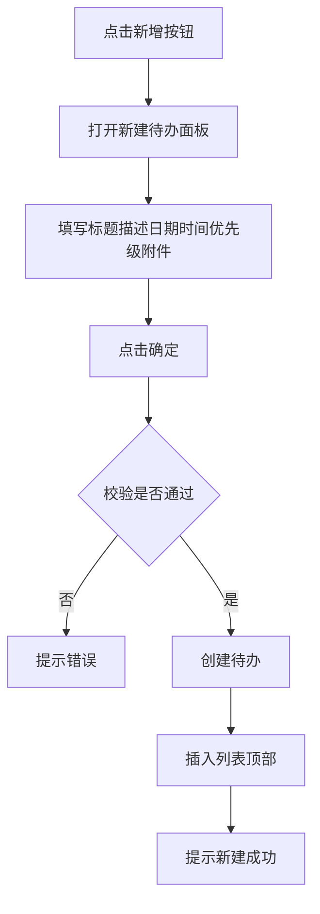
```mermaid
flowchart TD
A[点击新增按钮] --> B[打开新建待办面板]
B --> C[填写标题描述日期时间优先级附件]
C --> D[点击确定]
D --> E{校验是否通过}
E -->|否| F[提示错误]
E -->|是| G[创建待办]
G --> H[插入列表顶部]
H --> I[提示新建成功]
```

#### 2.4.4.3 前置条件

**登录状态：** 仅已登录用户可执行。  
**角色与权限：** 在待办应用可见范围内的成员可执行。  
**前置业务条件：** 移动端待办入口可正常打开。  
**依赖配置或前序步骤：** 用户拥有创建个人待办权限（待确认）。

#### 2.4.4.4 输入规则

**待办标题：** 文本输入，必填，不能为空；最大长度为200，输入框高度随字数伸缩。  
**描述：** 多行文本输入，选填；最大长度为3000，输入框高度随字数伸缩。 。  
**截止日期：** 日期选择（仅可选择当天及以后的日期），必填，默认为当天年月日。  
**截止时间：** 时间选择，必填，00:00-23:59 任意时分进行选择，必填，默认为当天 18:00。  
**优先级：** 单选，默认值为“普通”，可选值为“较低 / 普通 / 较高 / 紧急”。  
**附件：** 选填，支持多附件上传；图片：支持jpg、jpeg、png；单个图片最大为 2M；视频：支持MP4；单个视频大小不超过 200MB；视频时长不超过5分钟，超过5分钟无法发送；文件：支持doc、docx、dot、dotx、docm、dotm、xls、xlsx、xlt、xltx、xlsm、xltm、csv、ett、ppt、pptx、pps、ppsx、pptm、ppsm、pot、potx、potm、dpt、dps 、pdf、ofd、zip、rar、txt、rtf、html、htm、mht、mhtml、xml、uof、uot、mp3、wav、amr、rp 格式；单个文件大小不超过500M

#### 2.4.4.5 校验规则

**标题校验：** 标题为空时提示“请填写待办事项标题”。  
**截止时间校验：** 未完整选择截止日期和时间时提示“请选择完整的截止日期和时间”。  
**附件校验：** 上传重复附件时不重复加入列表。  
**格式校验：** 附件超出支持格式时：图片提示文案为“图片格式不支持”，文件提示文案为“文件格式不支持”，视频提示文案为“视频仅支持MP4 格式文件”；附件超出大小限制时：图片提示文案为“图片大小不能超过 2M”，文件提示文案为“文件大小不能超过 500MB”，视频提示文案为“视频大小不能超过 200MB”；视频时长超过 5 分钟限制时：提示文案为“视频时长不能超过 5 分钟”。

#### 2.4.4.6 业务规则

**创建归属：** 新建待办默认来源为“个人待办”。  
**创建人：** 创建人为当前用户。  
**默认标签归属：** 新建后至少进入“待我处理”和“我创建的”；是否立即进入“优先处理”取决于优先级和截止时间。  
**时间文案：** 系统根据截止时间生成“已经截止 / 即将截止 / 截止时间”展示文案。  
**插入位置：** 新建成功后插入移动端列表顶部。

#### 2.4.4.7 展示与交互状态规则

**面板展示：** 以底部全屏面板形式展示。  
**成功反馈：** 创建成功后提示“新建待办成功”。  
**表单默认值：** 标题和描述为空，截止时间默认 18:00，优先级默认普通。  
**关闭规则：** 用户可点击关闭按钮退出面板。

#### 2.4.4.8 异常处理

**提交失败：** 提示“新建失败，请稍后重试”。  
**网络异常：** 提示“网络异常，请稍后重试”。  
**重复提交：** 连续点击“确定”时仅受理一次。  
**附件失败：** 提示“附件上传失败，请重试”。

#### 2.4.4.9 后置条件

**数据结果：** 系统新增一条待办记录。  
**页面结果：** 当前标签列表与角标刷新。  
**联动结果：** 日历中对应日期新增待办展示。  
**状态结果：** 新待办默认未完成。

#### 2.4.4.10 补充条件

**创建完成后的定位：** 新建成功后始终停留当前标签。  

### 2.4.5 移动端待办详情查看与编辑

#### 2.4.5.1 功能定义

**功能描述：** 用于在移动端查看待办详情并编辑核心信息。  
**用户场景：** 用户在移动端需要快速修改待办标题、描述、截止时间、优先级等信息。  
**功能入口与触发方式：** 点击任一移动端待办卡片进入全屏详情页。

#### 2.4.5.2 交互流程

**流程说明：** 用户点击卡片后进入详情页；系统回显当前待办信息；用户修改后即时同步列表卡片和相关联视图。  

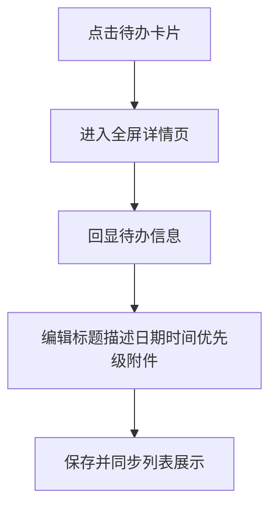
```mermaid
flowchart TD
A[点击待办卡片] --> B[进入全屏详情页]
B --> C[回显待办信息]
C --> D[编辑标题描述日期时间优先级附件]
D --> E[保存并同步列表展示]
```

#### 2.4.5.3 前置条件

**登录状态：** 仅已登录用户可执行。  
**角色与权限：** 对当前待办仅创建人支持查看和编辑。  
**前置业务条件：** 目标待办存在。  
**依赖配置或前序步骤：** 用户已从列表页或日历卡片进入详情。

#### 2.4.5.4 输入规则

**待办标题：** 文本输入，必填，不能为空；最大长度为200，输入框高度随字数伸缩。  
**描述：** 多行文本输入，选填；最大长度为3000，输入框高度随字数伸缩。 。  
**截止日期：** 日期选择（仅可选择当天及以后的日期），必填，默认为当天年月日。  
**截止时间：** 时间选择，必填，00:00-23:59 任意时分进行选择，必填，默认为当天 18:00。  
**优先级：** 单选，默认值为“普通”，可选值为“较低 / 普通 / 较高 / 紧急”。  
**附件：** 选填，支持多附件上传；图片：支持jpg、jpeg、png；单个图片最大为 2M；视频：支持MP4；单个视频大小不超过 200MB；视频时长不超过5分钟，超过5分钟无法发送；文件：支持doc、docx、dot、dotx、docm、dotm、xls、xlsx、xlt、xltx、xlsm、xltm、csv、ett、ppt、pptx、pps、ppsx、pptm、ppsm、pot、potx、potm、dpt、dps 、pdf、ofd、zip、rar、txt、rtf、html、htm、mht、mhtml、xml、uof、uot、mp3、wav、amr、rp 格式；单个文件大小不超过500M

#### 2.4.5.5 校验规则

**标题校验：** 标题为空时提示“请填写待办事项标题”。  
**截止时间校验：** 未完整选择截止日期和时间时提示“请选择完整的截止日期和时间”。  
**附件校验：** 上传重复附件时不重复加入列表。  
**格式校验：** 附件超出支持格式时：图片提示文案为“图片格式不支持”，文件提示文案为“文件格式不支持”，视频提示文案为“视频仅支持MP4 格式文件”；附件超出大小限制时：图片提示文案为“图片大小不能超过 2M”，文件提示文案为“文件大小不能超过 500MB”，视频提示文案为“视频大小不能超过 200MB”；视频时长超过 5 分钟限制时：提示文案为“视频时长不能超过 5 分钟”

#### 2.4.5.6 业务规则

**同步规则：** 详情页编辑后，移动端待办卡片和相关日历卡片同步更新。  
**日历入口规则：** 从移动端日历点击待办后，打开的是同一条待办的统一详情页。  
**状态独立：** 完成状态变更由独立的状态按钮执行。  
**来源稳定：** 来源字段保持原值，不因编辑而变化。  
**优先级影响：** 优先级和截止时间更新后，可能影响其是否出现在“优先处理”。  
**时间联动规则：** 截止日期或截止时间更新后，移动端日历中的归属日期和展示时间同步更新。

#### 2.4.5.7 展示与交互状态规则

**详情结构：** 顶部展示关闭与更多操作，中部展示状态按钮、标题、描述、日期时间、优先级、附件字段区，下部展示动态与评论标签区。  
**回显规则：** 进入详情页时回显最新待办数据。  
**附件区：** 展示附件入口，附件已上传列表展示卡片式列表（附件类型图标、附件名称、附件格式、附件大小、操作：预览、下载、删除）。  
**状态按钮展示：** 未完成时展示“完成待办”，已完成时展示“已完成”，按钮样式随状态同步切换。  
**关闭规则：** 关闭详情后返回上一级列表页；若从移动端日历进入详情，则关闭后返回原日历视图。

#### 2.4.5.8 异常处理

**保存失败：** 提示“保存失败，请稍后重试”。  
**待办不存在：** 提示“待办不存在或已删除”。  
**无权限：** 提示“无编辑权限”。  
**网络异常：** 提示“网络异常，请稍后重试”。

#### 2.4.5.9 后置条件

**数据结果：** 待办主信息更新。  
**页面结果：** 列表卡片、详情页展示与相关日历卡片保持一致。  
**日历结果：** 截止日期或时间变更后，移动端日历中的原日期位置同步移除并在新日期位置展示。  
**协同结果：** 动态记录写入编辑行为。

#### 2.4.5.10 补充条件

**已完成编辑权限：** 已完成待办允许继续编辑为
**附件删除：** 已上传附件支持在详情页内删除

### 2.4.6 移动端完成待办与恢复待办

#### 2.4.6.1 功能定义

**功能描述：** 用于在移动端切换待办完成状态。  
**用户场景：** 用户在手机端处理完待办后立即标记完成，或对误操作进行恢复。  
**功能入口与触发方式：** 详情页顶部状态按钮或联动操作入口。

#### 2.4.6.2 交互流程

**流程说明：** 用户在详情页点击状态按钮后，系统切换状态并同步列表卡片样式与当前标签结果。  

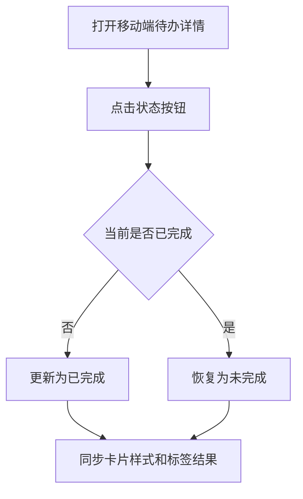
```mermaid
flowchart TD
A[打开移动端待办详情] --> B[点击状态按钮]
B --> C{当前是否已完成}
C -->|否| D[更新为已完成]
C -->|是| E[恢复为未完成]
D --> F[同步卡片样式和标签结果]
E --> F
```

#### 2.4.6.3 前置条件

**登录状态：** 仅已登录用户可执行。  
**角色与权限：** 对当前待办具备处理权限的成员可执行。  
**前置业务条件：** 目标待办存在。  
**依赖配置或前序步骤：** 用户已进入待办详情页。

#### 2.4.6.4 输入规则

**状态操作：** 单次点击触发一次状态切换。  
**目标状态：** 可选值为“完成待办 / 已完成”。  
**入口一致性：** 同一待办在不同入口的状态结果一致。

#### 2.4.6.5 校验规则

**重复点击校验：** 同一状态切换过程中不可重复提交。  
**权限校验：** 无处理权限时不允许切换状态。  
**存在校验：** 待办已删除时不允许切换状态。

#### 2.4.6.6 业务规则

**完成规则：** 状态切换为已完成后，卡片进入已完成结果集。  
**恢复规则：** 恢复未完成后，卡片重新进入未完成结果集。  
**标签联动规则：** 标签角标和当前标签列表即时刷新。  
**日历联动规则：** 移动端日历卡片同步更新完成态或未完成态。

#### 2.4.6.7 展示与交互状态规则

**按钮展示：** 未完成时展示“完成待办”，已完成时展示“已完成”。  
**卡片样式：** 已完成卡片展示灰化或删除线等完成态样式。  
**日历卡片样式：** 移动端日历中的待办保留展示，未完成待办显示空心勾选图标；已完成待办显示实心勾选图标，标题和时间信息弱化。  
**结果刷新：** 当前列表和对应详情即时刷新。  
**反馈提示：** 标记待办完成反馈文案为“已完成待办”，标记待办未完成反馈文案为“已标记待办未未完成”。

#### 2.4.6.8 异常处理

**操作失败：** 提示“操作失败，请稍后重试”。  
**无权限：** 提示“无处理权限”。  
**网络异常：** 提示“网络异常，请稍后重试”。  
**重复提交：** 忽略连续重复点击。

#### 2.4.6.9 后置条件

**状态结果：** 待办状态切换成功。  
**页面结果：** 当前标签卡片与详情页状态保持一致。  
**联动结果：** 相关日历卡片状态同步更新。

#### 2.4.6.10 补充条件

**完成时间记录：** 记录完成时间与完成人。
**恢复权限：** 仅允许原操作人恢复未完成。

### 2.4.7 移动端删除待办

#### 2.4.7.1 功能定义

**功能描述：** 用于在移动端删除待办事项。  
**用户场景：** 用户在移动端发现待办已失效或误建时执行删除。  
**功能入口与触发方式：** 详情页更多菜单点击“删除”，并在确认弹窗中确认。

#### 2.4.7.2 交互流程

**流程说明：** 用户在详情页打开更多菜单，点击删除；系统弹出确认框，确认后删除待办并关闭详情页。  

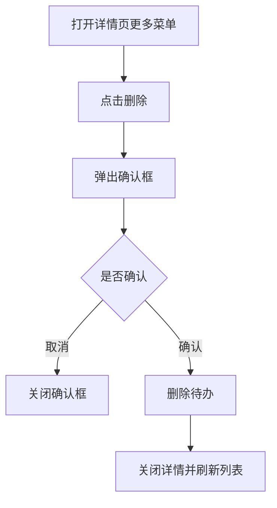
```mermaid
flowchart TD
A[打开详情页更多菜单] --> B[点击删除]
B --> C[弹出确认框]
C --> D{是否确认}
D -->|取消| E[关闭确认框]
D -->|确认| F[删除待办]
F --> G[关闭详情并刷新列表]
```

#### 2.4.7.3 前置条件

**登录状态：** 仅已登录用户可执行。  
**角色与权限：** 对当前待办具备删除权限的成员可执行。  
**前置业务条件：** 目标待办存在。  
**依赖配置或前序步骤：** 用户已进入详情页。

#### 2.4.7.4 输入规则

**删除确认：** 必须经过二次确认。  
**确认文案：** 提示“删除的待办不可恢复”。  
**操作结果：** 用户可选“取消 / 删除”。

#### 2.4.7.5 校验规则

**确认校验：** 未确认前不得删除。  
**权限校验：** 无删除权限时不允许执行删除。  
**存在校验：** 已删除待办不可重复删除。

#### 2.4.7.6 业务规则

**删除规则：** 删除成功后从移动端列表中移除。  
**详情规则：** 删除后关闭详情页并返回列表。  
**联动规则：** 删除后同步移除相关日历卡片。  
**不可恢复规则：** 删除后不提供恢复入口。

#### 2.4.7.7 展示与交互状态规则

**确认弹窗：** 以全局弹窗形式展示。  
**成功反馈：** 删除后列表即时刷新；单独提示成功文案为“删除成功”。  
**日历反馈：** 若删除的是当前日期对应待办，移动端日历当日列表即时移除该条待办；若当前日期移除后无待办，则切换为当日无待办展示。  
**空态：** 若删除后当前标签无数据，则展示空态。

#### 2.4.7.8 异常处理

**删除失败：** 提示“删除失败，请稍后重试”。  
**无权限：** 提示“无删除权限”。  
**网络异常：** 提示“网络异常，请稍后重试”。  
**重复提交：** 连续确认时仅受理一次。

#### 2.4.7.9 后置条件

**数据结果：** 待办被删除。  
**页面结果：** 详情页关闭，列表与日历结果同步刷新。  
**数量结果：** 标签角标被重新计算。

#### 2.4.7.10 补充条件
 
**附件处理：** 删除待办后附件也一并删除。

### 2.4.8 移动端动态与评论记录

#### 2.4.8.1 功能定义

**功能描述：** 用于在移动端详情页查看待办动态和评论。  
**用户场景：** 用户需要在手机端追踪待办变更历史并补充协同评论。  
**功能入口与触发方式：** 移动端详情页中的“动态 / 评论”标签及评论输入区。

#### 2.4.8.2 交互流程

**流程说明：** 用户在详情页切换动态与评论标签；在评论页输入内容后发送评论，也可删除已有评论。  

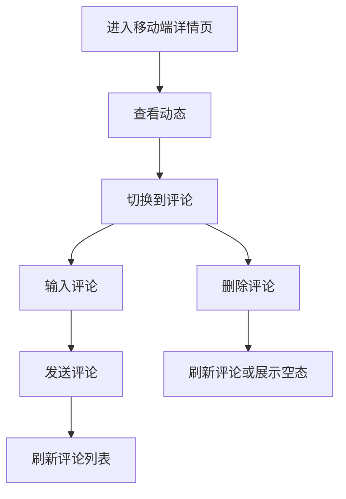
```mermaid
flowchart TD
A[进入移动端详情页] --> B[查看动态]
B --> C[切换到评论]
C --> D[输入评论]
D --> E[发送评论]
E --> F[刷新评论列表]
C --> G[删除评论]
G --> H[刷新评论或展示空态]
```

#### 2.4.8.3 前置条件

**登录状态：** 仅已登录用户可执行。  
**角色与权限：** 具有详情查看权限的成员可查看；评论删除权限为评论发布者。  
**前置业务条件：** 目标待办存在。  
**依赖配置或前序步骤：** 用户已进入移动端详情页。

#### 2.4.8.4 输入规则

**标签切换：** 单选，可选值为“动态 / 评论”。  
**评论内容：** 多行文本输入，发送前必须存在有效内容；最大长度为500字符。  
**评论删除：** 单条评论支持删除。  
**评论附件：** 支持新增附件，支持图片和文件（图片与文件的限制同新建待办附件上传的图片和文件限制），每次限制上传一个附件。

#### 2.4.8.5 校验规则

**发送校验：** 评论内容为空时不允许发送。  
**删除校验：** 删除前校验权限。  
**待办存在校验：** 待办已删除时不可继续评论。

#### 2.4.8.6 业务规则

**动态记录：** 至少记录创建、完成、恢复等关键动作。  
**评论规则：** 评论发送成功后加入评论列表。  
**空态规则：** 无评论时展示空态。  
**删除规则：** 删除评论后若列表为空，自动切换为空态展示。

#### 2.4.8.7 展示与交互状态规则

**默认标签：** 详情页默认展示“动态”标签，“评论”标签按切换后展示。  
**动态展示：** 展示操作者、动作内容和时间；当前标签激活时以下划线或高亮样式标识。  
**评论展示：** 展示评论人、评论时间和评论正文；附件型评论展示附件卡片。  
**发送按钮：** 输入有效内容后显示，发送完成后隐藏并清空输入框高度。  
**空态：** 无评论内容时展示“暂无评论内容”或同义空态。

#### 2.4.8.8 异常处理

**发送失败：** 提示“评论发送失败，请稍后重试”。
**删除失败：** 提示“删除失败，请稍后重试”。  
**无权限：** 提示“无评论操作权限”。  
**网络异常：** 提示“网络异常，请稍后重试”。

#### 2.4.8.9 后置条件

**数据结果：** 动态或评论列表按最新结果刷新。  
**页面结果：** 当前标签内容即时更新。  

#### 2.4.8.10 补充条件
`。  
**动态范围：** 编辑类操作全部入动态为“#操作人姓名# 更新内容 #更新后的内容，。
