# 1 背景与目标

## 1.1 业务背景

**业务背景：** 当前项目已提供日历应用的管理端入口、桌面端多视图日历以及移动端日历页，用户可以通过日历按日期查看待办事项，并从日历直接进入待办详情完成处理。  
**当前现状：** 桌面端日历已支持小日历、月视图、日视图、周视图、列表视图，以及“今天”“上下翻页”等基础能力；移动端已支持默认展开的月视图、折叠后的周视图、左右滑动切换和当日待办列表展示。  
**核心痛点：** 现有日历能力以原型形态存在，缺少统一的业务定义、视图切换规则、日期导航规则、联动规则和异常处理说明，评审与后续落地容易出现理解偏差。  
**触发原因：** 需要基于现有原型沉淀一份正式 PRD，明确日历模块的业务边界、页面结构、功能规则、状态规则与待办联动逻辑。  
**影响范围：** 企业管理员、桌面端组织成员、移动端组织成员；涉及应用管理、桌面端日历浏览、移动端日历浏览、待办详情联动、待办状态同步等核心流程。  
**范围边界：** 本期日历模块以“待办事项的日历化展示与处理联动”为核心，不包含独立会议创建、共享日历、外部日历订阅、跨组织共享等能力。

## 1.2 目标

**目标一：** 建立日历模块的统一需求基线，覆盖管理端配置、桌面端日历、移动端日历与待办联动。  
**衡量口径：** 正式 PRD 完整覆盖本次确认范围内的全部功能节点，并可直接用于评审和后续设计实现。  
**目标值或期望区间：** 全量覆盖本次确认范围内的 15 个功能节点。

**目标二：** 帮助用户按日期快速定位待办事项，提高任务时间管理效率。  
**衡量口径：** 用户可以通过月、日、周、列表等不同视图在 3 步内定位到目标日期的待办事项。  
**目标值或期望区间：** 关键定位路径不超过 3 步（待确认）。

**目标三：** 统一日历与待办模块之间的状态同步规则。  
**衡量口径：** 同一条待办在日历视图与待办模块中的标题、截止时间、完成状态、删除结果保持一致。  
**目标值或期望区间：** 关键同步场景一致率 100%（待确认）。

## 1.3 验收指标

**指标名称：** 需求覆盖完整率  
**计算口径：** 已确认信息架构中的功能节点全部在正式 PRD 中输出完整规则。  
**统计周期：** 本期需求评审阶段。  
**验收阈值：** 100%。  
**数据来源：** 需求评审清单。

**指标名称：** 日期定位效率  
**计算口径：** 用户从进入日历到定位到目标日期待办的平均操作步数。  
**统计周期：** 上线后首个版本观察周期（待确认）。  
**验收阈值：** 主路径不超过 3 步（定性验收标准）。  
**数据来源：** 可用性走查记录、用户反馈（待确认）。

**指标名称：** 日历待办同步准确性  
**计算口径：** 对同一条待办执行完成、恢复、删除、编辑截止时间等操作后，日历与待办模块展示是否一致。  
**统计周期：** 联调与验收测试阶段。  
**验收阈值：** 核心场景通过率 100%。  
**数据来源：** 联调记录、测试用例执行结果。

# 2 日历模块

## 2.1 管理端应用管理页

### 2.1.1 页面整体概览

**页面定位：** 企业管理员在应用管理页查看日历应用，并对日历应用的启用状态与成员可见范围进行配置。  
**页面结构：** 页面由应用列表区、应用基础信息区、成员范围标签区、操作区组成。  
**信息布局：** 每个应用项展示应用名称、归属分类、成员范围标签和操作入口；日历应用支持“设置”与“停用/启用”操作。

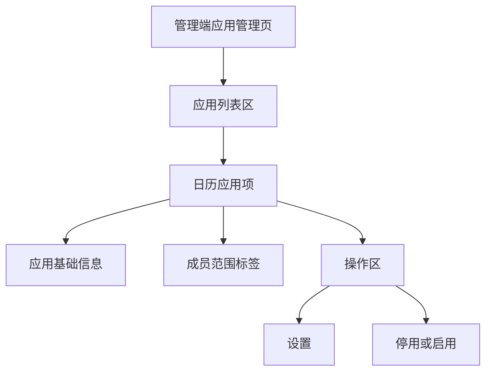
```mermaid
graph TD
A[管理端应用管理页] --> B[应用列表区]
B --> C[日历应用项]
C --> D[应用基础信息]
C --> E[成员范围标签]
C --> F[操作区]
F --> G[设置]
F --> H[停用或启用]
```

### 2.1.2 日历应用启停与可见范围配置

#### 2.1.2.1 功能定义

**功能描述：** 用于管理日历应用在企业内的启用状态及成员可见范围。  
**用户场景：** 企业管理员需要控制哪些成员可使用日历应用，或临时停用日历应用时使用。  
**功能入口与触发方式：** 管理端应用列表中的“日历”应用行，点击“设置”或“停用/启用”。

#### 2.1.2.2 交互流程

**流程说明：** 管理员进入应用管理页后，定位日历应用，选择设置成员范围或切换应用状态；系统保存后在列表内即时回显最新结果。

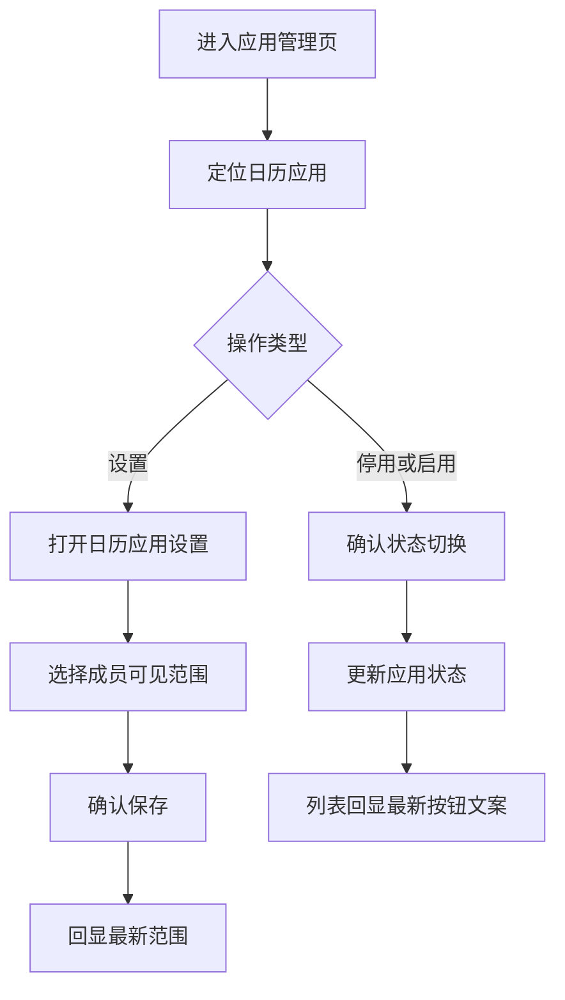
```mermaid
flowchart TD
A[进入应用管理页] --> B[定位日历应用]
B --> C{操作类型}
C -->|设置| D[打开日历应用设置]
D --> E[选择成员可见范围]
E --> F[确认保存]
F --> G[回显最新范围]
C -->|停用或启用| H[确认状态切换]
H --> I[更新应用状态]
I --> J[列表回显最新按钮文案]
```

#### 2.1.2.3 前置条件

**登录状态：** 仅已登录管理员可执行。  
**角色与权限：** 仅具备应用管理权限的企业管理员可执行。  
**前置业务条件：** 日历应用已在应用列表中配置展示。  
**依赖配置或前序步骤：** 企业成员与组织结构数据可正常读取。

#### 2.1.2.4 输入规则

**成员可见范围：** 单选，默认展示当前生效范围；已确认可展示“全部成员”，其他可选值为“指定成员/指定部门”。  
**应用状态：** 二值状态，取值为“启用/停用”。  
**确认操作：** 切换应用状态时需二次确认。

#### 2.1.2.5 校验规则

**成员范围：** 未选择成员范围时不可保存，提示“请选择可见范围”。  
**状态切换：** 管理员确认前不执行状态变更；取消后保持原状态。  
**无权限校验：** 非管理员点击操作入口时，不允许提交操作并提示“无操作权限”。

#### 2.1.2.6 业务规则

**应用启用规则：** 应用启用后，处于可见范围内的成员可进入日历应用。  
**应用停用规则：** 应用停用后，成员不可继续从工作台进入日历应用。  
**成员范围规则：** 成员范围变更后，仅在新范围内的成员继续可见日历应用。  
**权限差异规则：** 普通成员无权调整日历应用状态与可见范围。

#### 2.1.2.7 展示与交互状态规则

**范围展示：** 页面以标签形式展示当前成员范围。  
**状态按钮展示：** 已启用时展示“已停用”，已停用时展示“已启用”（待确认）。  
**保存反馈：** 配置成功后提示保存成功，并刷新列表展示。  
**禁用态：** 无权限用户不展示或不可点击操作入口（待确认）。

#### 2.1.2.8 异常处理

**请求失败：** 提示“设置失败，请稍后重试”，用户可再次提交。  
**无权限：** 提示“无操作权限”，用户仅可返回列表。  
**重复提交：** 连续点击保存时，仅受理一次有效请求，其余操作拦截并提示“处理中，请稍候”（待确认）。  
**超时或中断：** 提示“网络异常，请重新尝试”，用户可重新发起操作。

#### 2.1.2.9 后置条件

**配置结果：** 系统保存最新应用状态与成员可见范围。  
**页面反馈：** 应用列表即时刷新对应标签和按钮文案。  
**影响范围：** 后续成员访问日历应用时按新配置生效。  
**操作记录：** 记录管理员操作日志。

#### 2.1.2.10 补充条件

**例外情况：** 超级管理员始终保留日历应用访问权限

## 2.2 桌面端日历应用

### 2.2.1 页面整体概览

**页面定位：** 组织成员在桌面端以多视图方式查看按日期组织的待办事项，并通过日历入口完成任务查看和快捷处理。  
**页面结构：** 页面由左侧小日历区、顶部工具栏、主日历内容区、待办浮层组成。  
**信息布局：** 左侧小日历承载月份总览和日期定位；顶部工具栏承载“今天”、翻页、标题、视图切换；主内容区承载月视图、日视图、周视图、列表视图；待办浮层承载查看详情和快捷处理。

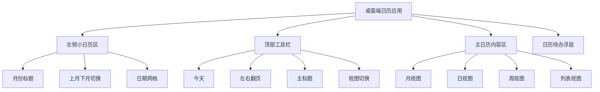
```mermaid
graph TD
A[桌面端日历应用] --> B[左侧小日历区]
B --> B1[月份标题]
B --> B2[上月下月切换]
B --> B3[日期网格]
A --> C[顶部工具栏]
C --> C1[今天]
C --> C2[左右翻页]
C --> C3[主标题]
C --> C4[视图切换]
A --> D[主日历内容区]
D --> D1[月视图]
D --> D2[日视图]
D --> D3[周视图]
D --> D4[列表视图]
A --> E[日历待办浮层]
```

### 2.2.2 小日历月份切换与日期定位

#### 2.2.2.1 功能定义

**功能描述：** 用于在桌面端通过左侧小日历切换月份并快速定位到目标日期。  
**用户场景：** 用户需要快速查看其他月份的日期布局，或直接定位到某一天查看待办。  
**功能入口与触发方式：** 小日历顶部左右切换按钮、日期格。

#### 2.2.2.2 交互流程

**流程说明：** 用户在小日历中切换月份或点击某一天后，系统更新当前选中日期，并联动主日历高亮状态和内容展示。

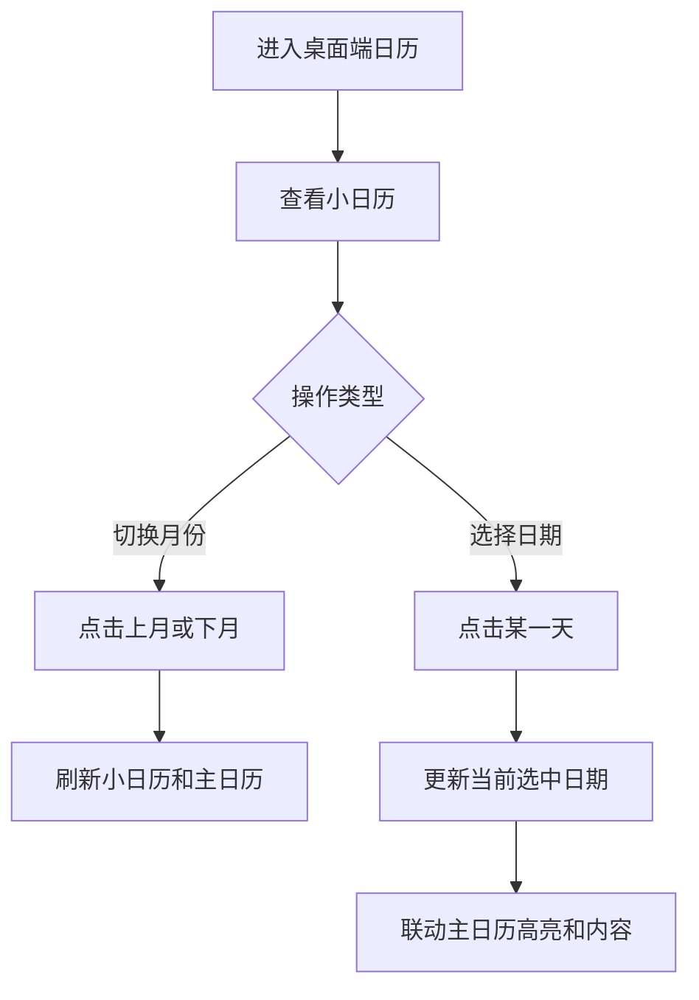
```mermaid
flowchart TD
A[进入桌面端日历] --> B[查看小日历]
B --> C{操作类型}
C -->|切换月份| D[点击上月或下月]
D --> E[刷新小日历和主日历]
C -->|选择日期| F[点击某一天]
F --> G[更新当前选中日期]
G --> H[联动主日历高亮和内容]
```

#### 2.2.2.3 前置条件

**登录状态：** 仅已登录用户可执行。  
**角色与权限：** 在日历应用可见范围内的成员可访问。  
**前置业务条件：** 日历应用处于启用状态。  
**依赖配置或前序步骤：** 当前日期范围在系统可支持的浏览边界内。

#### 2.2.2.4 输入规则

**月份切换：** 点击左右箭头切换月份。  
**日期选择：** 单选，点击某一天后设置为当前选中日期。  
**日期范围：** 以当前自然年为基准，支持向前 10 年和向后 10 年浏览；按 2026 年示例，可浏览 2016 年 1 月 1 日至 2036 年 12 月 31 日。  
**高亮状态：** 当前选中日期在小日历中需高亮；当前周在小日历中需附加周高亮效果。

#### 2.2.2.5 校验规则

**边界校验：** 超出可浏览日期范围时不允许切换，并保持当前月份和当前选中日期不变。  
**单选校验：** 同一时刻仅允许一个日期处于选中状态。  
**联动校验：** 选中日期变更后，主日历必须同步更新高亮状态。  
**月份变更校验：** 跨月选择日期时必须同步刷新月份标题。

#### 2.2.2.6 业务规则

**月份切换规则：** 切换月份后，小日历与主日历月份保持一致。  
**日期定位规则：** 选中日期后，当前日期成为主日历的定位基准。  
**周高亮规则：** 小日历中选中日期所在整周需展示弱高亮边框或背景。  
**今日标识规则：** 当前真实日期需展示“今天”特殊样式。

#### 2.2.2.7 展示与交互状态规则

**月份标题：** 展示为“YYYY年M月”。  
**今日样式：** 今日日期以特殊样式区分。  
**选中样式：** 当前选中日期高亮显示。  
**静默刷新：** 日期选择后优先通过联动刷新，不弹出额外提示。  
**边界态：** 到达最小或最大可浏览月份时，对应方向不再继续切换。

#### 2.2.2.8 异常处理

**超出边界：** 不执行月份切换，保持当前状态。  
**无数据：** 即使当天无待办，也允许正常选中日期。  
**加载失败：** 提示“加载失败，请稍后重试”（待确认）。  
**网络异常：** 提示“网络异常，请稍后重试”。

#### 2.2.2.9 后置条件

**日期结果：** 当前选中日期更新成功。  
**页面结果：** 小日历高亮、主日历高亮、主标题和当前视图内容同步更新。  
**后续动作：** 用户可继续切换视图或查看某日待办。

#### 2.2.2.10 补充条件

**节假日展示：** 存在农历文案，法定节假日暂不做标识展示。  
**跨年浏览范围：** 支持以当前自然年为基准前后 10 年的跨年浏览；按 2026 年示例，支持浏览 2016 年至 2036 年。
**时间标准：**优先取服务器时间，但会结合设备时间进行本地展示

### 2.2.3 主日历视图切换

#### 2.2.3.1 功能定义

**功能描述：** 用于在桌面端切换日历的展示方式，以满足不同粒度的查看需求。  
**用户场景：** 用户希望按天查看时段安排、按周查看整体分布、按月查看总览，或按列表查看有待办的日期分组。  
**功能入口与触发方式：** 顶部视图标签“日 / 周 / 月 / 列表”。

#### 2.2.3.2 交互流程

**流程说明：** 用户点击目标视图标签后，系统切换当前视图模式，并根据当前选中日期刷新对应内容。

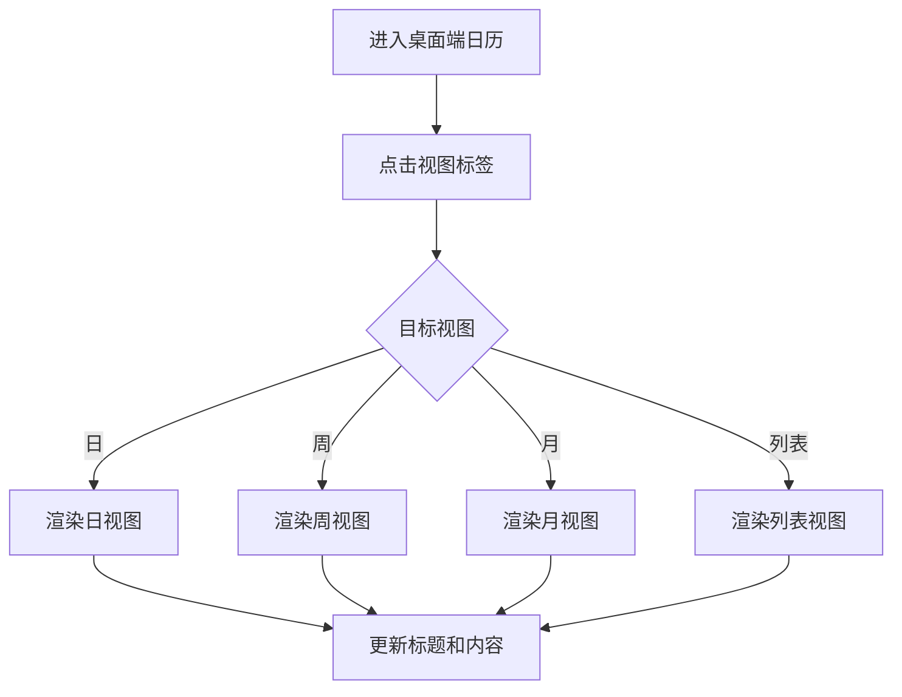
```mermaid
flowchart TD
A[进入桌面端日历] --> B[点击视图标签]
B --> C{目标视图}
C -->|日| D[渲染日视图]
C -->|周| E[渲染周视图]
C -->|月| F[渲染月视图]
C -->|列表| G[渲染列表视图]
D --> H[更新标题和内容]
E --> H
F --> H
G --> H
```

#### 2.2.3.3 前置条件

**登录状态：** 仅已登录用户可执行。  
**角色与权限：** 用户可访问桌面端日历应用。  
**前置业务条件：** 当前已存在可用的选中日期。  
**依赖配置或前序步骤：** 日历页面已完成初始化。

#### 2.2.3.4 输入规则

**视图类型：** 单选，可选值为“日 / 周 / 月 / 列表”。  
**默认视图：** 默认进入“月”视图。  
**定位基准：** 视图切换后以当前选中日期作为内容渲染基准。  
**标题文案：** 不同视图下的标题展示方式不同。

#### 2.2.3.5 校验规则

**单选校验：** 同一时刻仅允许一个视图标签处于激活状态。  
**内容切换校验：** 切换视图后，旧视图内容需隐藏，不可与新视图同时呈现。  
**日期继承校验：** 视图切换后必须继承当前选中日期，不可重置到默认日期。  
**标题校验：** 视图切换后主标题需同步更新。

#### 2.2.3.6 业务规则

**月视图：** 展示整月日期网格及每日待办摘要。  
**日视图：** 展示当前日期的 24 小时时间槽和待办分布。  
**周视图：** 展示当前周的 7 天列和 24 小时时间槽。  
**列表视图：** 展示当前月份内存在待办的日期分组列表。  
**视图记忆规则：** 当前激活视图作为后续左右翻页的粒度依据。

#### 2.2.3.7 展示与交互状态规则

**激活态：** 当前视图标签高亮。  
**切换反馈：** 切换后以内容刷新为主，不额外提示。  
**主标题：** 日视图显示到日，周/月/列表视图以月份为主。  
**空态：** 列表视图无数据时展示空态；其他视图无待办时仅保留时间或日期结构。

#### 2.2.3.8 异常处理

**切换失败：** 提示“视图切换失败，请重试”。  
**加载失败：** 提示“加载失败，请稍后重试”。  
**网络异常：** 提示“网络异常，请稍后重试”。

#### 2.2.3.9 后置条件

**视图结果：** 当前视图模式切换成功。  
**页面结果：** 主内容区按新视图刷新。  
**后续动作：** 用户可继续翻页、返回今天、查看待办浮层。

#### 2.2.3.10 补充条件

**视图偏好记忆：** 退出后不保留上次视图偏好，默认进入月视图。
**时间标准：** 退出后不保留上次视图偏好，默认进入月视图。

### 2.2.4 日期导航与返回今天

#### 2.2.4.1 功能定义

**功能描述：** 用于按照当前视图粒度前进或后退日期范围，并支持快速回到今天。  
**用户场景：** 用户需要查看前一天、后一周、上一个月等时间范围，或快速回到今天继续浏览。  
**功能入口与触发方式：** 顶部“今天”按钮、左右翻页按钮。

#### 2.2.4.2 交互流程

**流程说明：** 用户点击左右翻页按钮后，系统根据当前视图类型推进或回退日期；点击“今天”后快速回到今天并刷新当前视图。

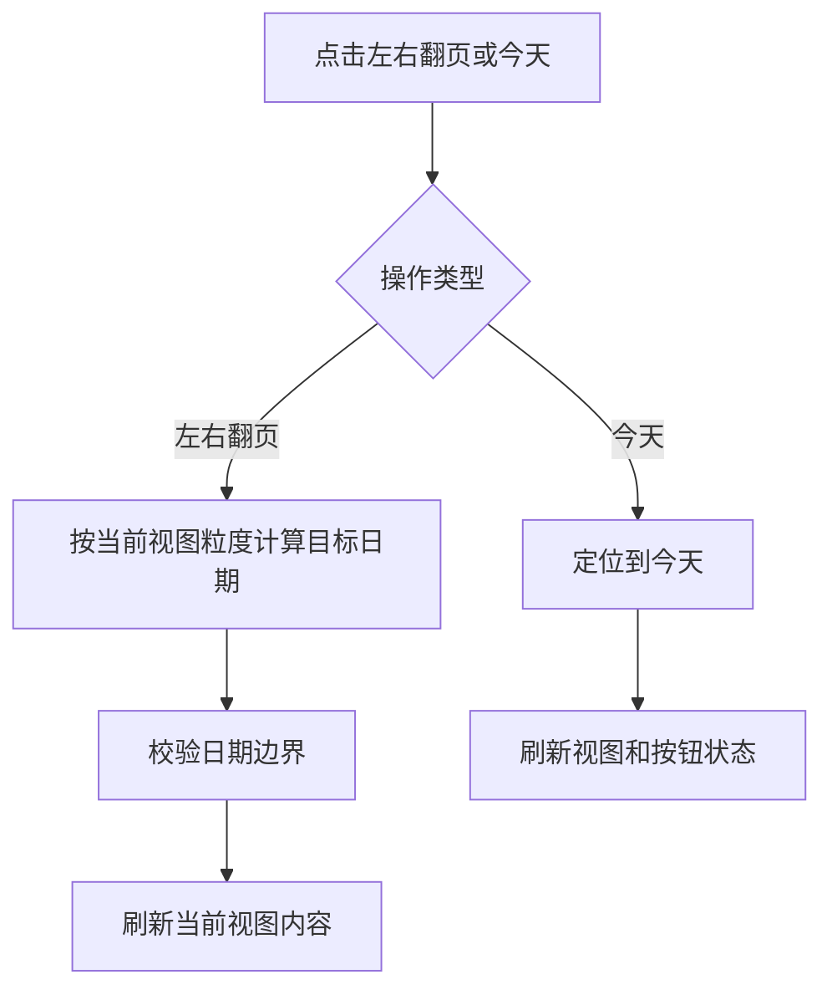
```mermaid
flowchart TD
A[点击左右翻页或今天] --> B{操作类型}
B -->|左右翻页| C[按当前视图粒度计算目标日期]
C --> D[校验日期边界]
D --> E[刷新当前视图内容]
B -->|今天| F[定位到今天]
F --> G[刷新视图和按钮状态]
```

#### 2.2.4.3 前置条件

**登录状态：** 仅已登录用户可执行。  
**角色与权限：** 用户可访问桌面端日历。  
**前置业务条件：** 页面已进入某一视图。  
**依赖配置或前序步骤：** 当前选中日期已存在。

#### 2.2.4.4 输入规则

**左右翻页：** 点击左箭头表示回退，点击右箭头表示前进。  
**翻页粒度：** 日视图按天翻页，周视图按周翻页，月视图按月翻页，列表视图按天翻页。  
**今天按钮：** 单击定位到今天。  
**日期范围：** 以当前自然年为基准，支持向前 10 年和向后 10 年浏览；按 2026 年示例，可浏览 2016 年 1 月 1 日至 2036 年 12 月 31 日。  

#### 2.2.4.5 校验规则

**边界校验：** 超出日期边界时不执行翻页，并保持当前标题、高亮日期和当前视图内容不变。  
**今天按钮校验：** 当前已处于今天时，“今天”按钮置灰不可点。  
**标题校验：** 翻页或返回今天后，标题必须同步更新。  
**视图保持校验：** 导航后保持当前视图模式不变。

#### 2.2.4.6 业务规则

**日视图导航：** 每次前进或回退 1 天。  
**周视图导航：** 每次前进或回退 7 天。  
**月视图导航：** 每次前进或回退 1 个月，并默认定位到该月 1 日。  
**列表视图导航：** 每次前进或回退 1 天，标题按当前所在月份展示。  
**返回今天规则：** 回到今天后，若发生跨月，需要同步刷新小日历和主日历月份。

#### 2.2.4.7 展示与交互状态规则

**今天按钮状态：** 位于今天时置灰禁用，不在今天时可点击。  
**标题展示：** 月/周/列表视图按月份展示；日视图展示到具体日期。  
**导航反馈：** 以视图内容刷新为主，不额外提示。  
**高亮联动：** 导航后当前选中日期高亮同步更新。  
**边界反馈：** 到达可浏览边界时，对应方向不可继续导航。

#### 2.2.4.8 异常处理

**超出边界：** 不执行导航并保持当前页面状态。  
**加载失败：** 提示“加载失败，请稍后重试”。  
**网络异常：** 提示“网络异常，请稍后重试”。  
**状态异常：** 当前选中日期缺失时回退到今天。

#### 2.2.4.9 后置条件

**日期结果：** 当前选中日期更新为目标日期或今天。  
**页面结果：** 小日历、主日历和标题同步刷新。  
**按钮结果：** “今天”按钮状态按最新日期更新。

#### 2.2.4.10 补充条件

**跳转日期输入：** 当前未提供自定义日期输入框。  
**跨年导航：** 在当前自然年前后 10 年的允许边界内支持跨年翻页；按 2026 年示例，可跨年浏览 2016 年至 2036 年。

### 2.2.5 月视图日期格与待办聚合展示

#### 2.2.5.1 功能定义

**功能描述：** 用于在月视图中以日期格方式展示每一天，并在格内聚合展示待办摘要。  
**用户场景：** 用户希望快速总览整月中哪些日期存在待办，以及每天的待办数量和完成状态。  
**功能入口与触发方式：** 切换到月视图，查看日期格内待办摘要；点击日期格内待办条目或“还有N项”入口。

#### 2.2.5.2 交互流程

**流程说明：** 系统渲染月视图网格后，将当天待办按顺序展示在日期格内；若数量超出展示上限，则通过“还有N项”入口查看剩余待办。

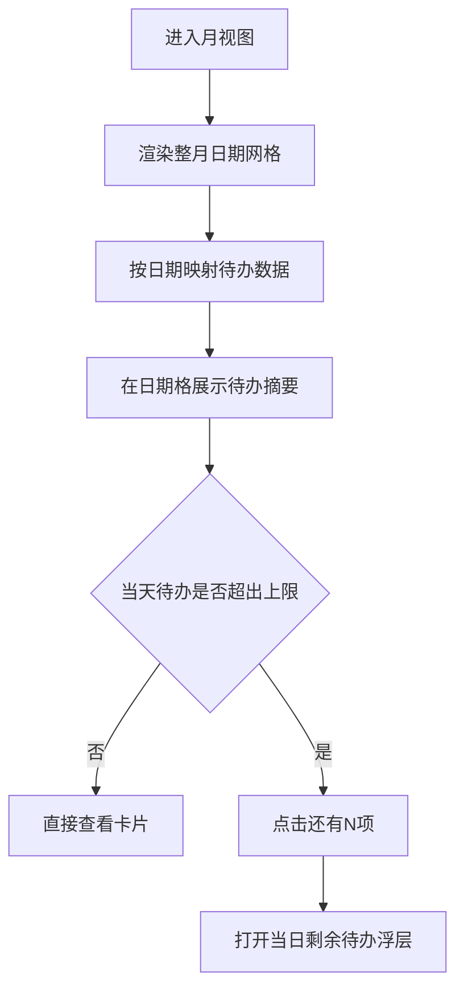
```mermaid
flowchart TD
A[进入月视图] --> B[渲染整月日期网格]
B --> C[按日期映射待办数据]
C --> D[在日期格展示待办摘要]
D --> E{当天待办是否超出上限}
E -->|否| F[直接查看卡片]
E -->|是| G[点击还有N项]
G --> H[打开当日剩余待办浮层]
```

#### 2.2.5.3 前置条件

**登录状态：** 仅已登录用户可执行。  
**角色与权限：** 用户可访问桌面端日历。  
**前置业务条件：** 当前视图为月视图。  
**依赖配置或前序步骤：** 待办数据已完成日期映射。

#### 2.2.5.4 输入规则

**日期格：** 每格展示公历日期与农历文案。  
**待办摘要：** 每个日期格最多直接展示 5 条待办。  
**剩余待办入口：** 当某日待办数大于 5 条时，日期格内显示前 4 条，展示“还有N项...”入口。  
**待办展示字段：** 至少展示完成状态图标、标题摘要。

#### 2.2.5.5 校验规则

**数量校验：** 当天待办数大于 5 条时，必须展示“还有N项...”入口。  
**日期映射校验：** 仅展示归属于当前日期的待办。  
**完成态校验：** 已完成待办需有独立视觉样式。  
**点击校验：** 点击待办摘要应打开待办浮层，不切换日期格。

#### 2.2.5.6 业务规则

**展示顺序：** 当天待办按既有顺序展示。  
**完成态规则：** 已完成待办在月视图中保留展示，但使用弱化样式。  
**剩余待办规则：** 点击“还有N项...”后仅展示超出首屏上限的剩余待办。  
**日期高亮规则：** 当前选中日期在月视图中高亮展示。

#### 2.2.5.7 展示与交互状态规则

**日期展示：** 展示公历日期和农历。  
**摘要样式：** 待办摘要支持悬停高亮。  
**浮层展示：** 点击“还有N项...”后以浮层方式展示当日剩余待办。  
**无待办状态：** 无待办日期仅展示日期信息，不展示占位文案。

#### 2.2.5.8 异常处理

**无数据：** 当天无待办时仅展示空日期格。  
**加载失败：** 提示“加载失败，请稍后重试”。  
**浮层失败：** 浮层打开失败时提示“打开失败，请重试”。  
**网络异常：** 提示“网络异常，请稍后重试”。

#### 2.2.5.9 后置条件

**页面结果：** 用户可在月视图中查看整月待办分布。  
**交互结果：** 用户可进入当日剩余待办浮层或单条待办浮层。  
**联动结果：** 日期高亮与小日历高亮保持一致。

#### 2.2.5.10 补充条件

**展示上限：** 当前确认月视图直出上限为 5 条。  
**更多入口文案：** 文案为“还有x项...”。

### 2.2.6 日视图时段待办展示

#### 2.2.6.1 功能定义

**功能描述：** 用于在日视图中按 24 小时时间轴展示当前日期的待办事项。  
**用户场景：** 用户希望精确查看某一天内各时间点的待办分布。  
**功能入口与触发方式：** 切换到“日”视图。

#### 2.2.6.2 交互流程

**流程说明：** 系统根据当前选中日期渲染 24 小时时间轴，并将该日待办按截止小时插入对应时间槽；若当天为今天，则绘制当前时间线。

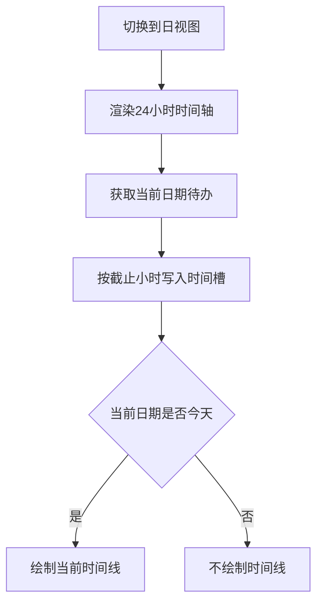
```mermaid
flowchart TD
A[切换到日视图] --> B[渲染24小时时间轴]
B --> C[获取当前日期待办]
C --> D[按截止小时写入时间槽]
D --> E{当前日期是否今天}
E -->|是| F[绘制当前时间线]
E -->|否| G[不绘制时间线]
```

#### 2.2.6.3 前置条件

**登录状态：** 仅已登录用户可执行。  
**角色与权限：** 用户可访问桌面端日历。  
**前置业务条件：** 当前视图为日视图。  
**依赖配置或前序步骤：** 当前选中日期已存在。

#### 2.2.6.4 输入规则

**时间轴：** 展示 00:00 至 23:00 共 24 个小时槽。  
**日期信息：** 头部展示日期数字、月份、星期和农历。  
**待办映射字段：** 依据待办截止时间中的小时部分映射到时间槽。  
**更多入口：** 同一小时内待办超过3项时，显示前2条，展示“还有N项...”入口。

#### 2.2.6.5 校验规则

**时间映射校验：** 仅将当前日期的待办渲染到对应小时槽。  
**当天校验：** 仅当当前日期为今天时绘制当前时间线。  
**更多入口校验：** 同一小时内待办超出直出上限时，必须展示更多入口。

#### 2.2.6.6 业务规则

**直出上限：** 单小时内待办数不超过 2 条时全部展示；超过时优先直出 1 条并展示“还有N项...”入口。  
**完成态规则：** 已完成待办以弱化样式展示。  
**时间线规则：** 当前时间线按小时和分钟动态定位。  
**滚动规则：** 当天视图打开后，自动滚动到当前时间附近。

#### 2.2.6.7 展示与交互状态规则

**时间槽展示：** 待办以卡片摘要形式嵌入小时槽。  
**当前时间线：** 以明显线条样式显示在当前时间位置。  
**点击交互：** 点击待办摘要打开待办浮层；点击“还有N项...”打开小时待办浮层。  
**无待办状态：** 无待办时仅保留时间轴结构。

#### 2.2.6.8 异常处理

**无数据：** 不展示待办摘要，仅展示时间轴。  
**渲染失败：** 提示“加载失败，请稍后重试”。  
**小时浮层失败：** 提示“打开失败，请重试”。  
**网络异常：** 提示“网络异常，请稍后重试”。

#### 2.2.6.9 后置条件

**页面结果：** 用户可在日视图查看当日各时间段的待办分布。  
**交互结果：** 用户可进入待办浮层或更多浮层。  
**联动结果：** 标题、日期高亮、小日历同步保持一致。

#### 2.2.6.10 补充条件

**分钟粒度：** 当前展示按小时槽位，不支持 15 分钟粒度拆分。  

### 2.2.7 周视图时段待办展示

#### 2.2.7.1 功能定义

**功能描述：** 用于在周视图中按一周七列、24 小时时间轴展示待办事项。  
**用户场景：** 用户希望查看某一周内不同日期的待办分布与时间冲突情况。  
**功能入口与触发方式：** 切换到“周”视图。

#### 2.2.7.2 交互流程

**流程说明：** 系统根据当前选中日期定位所在周，并渲染七列表头及 24 小时槽位；待办按日期和小时写入对应列与时间槽；若当前周包含今天，则绘制当天列的当前时间线。

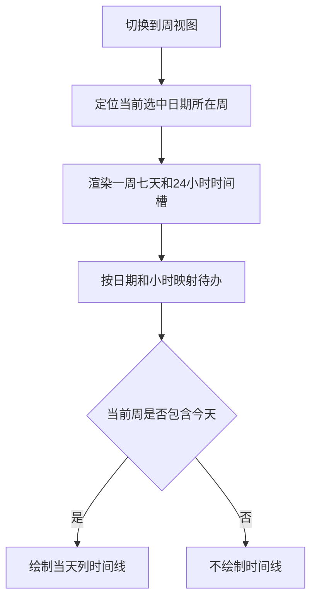
```mermaid
flowchart TD
A[切换到周视图] --> B[定位当前选中日期所在周]
B --> C[渲染一周七天和24小时时间槽]
C --> D[按日期和小时映射待办]
D --> E{当前周是否包含今天}
E -->|是| F[绘制当天列时间线]
E -->|否| G[不绘制时间线]
```

#### 2.2.7.3 前置条件

**登录状态：** 仅已登录用户可执行。  
**角色与权限：** 用户可访问桌面端日历。  
**前置业务条件：** 当前视图为周视图。  
**依赖配置或前序步骤：** 当前选中日期已存在。

#### 2.2.7.4 输入规则

**周范围：** 以当前选中日期所在自然周为展示范围。  
**表头字段：** 展示日期数字、星期和农历。  
**时间轴：** 展示 24 小时时间槽。  
**待办映射字段：** 依据截止日期和截止小时映射到对应列与时间槽。

#### 2.2.7.5 校验规则

**周计算校验：** 周视图必须以当前选中日期所在周为准。  
**列映射校验：** 待办必须展示在正确的日期列中。  
**当天列校验：** 若当前周包含今天，则今天所在列高亮。  
**时间线校验：** 当前时间线仅在包含今天的周中展示。

#### 2.2.7.6 业务规则

**展示规则：** 每日待办按小时映射展示。  
**直出规则：** 单小时内待办数不超过 2 条时全部展示；超过时优先直出 1 条并展示“还有N项...”入口。
**高亮规则：** 今天所在列使用高亮背景；当前选中日期所在列表头突出显示。  
**完成态规则：** 已完成待办继续展示，但样式弱化。

#### 2.2.7.7 展示与交互状态规则

**表头展示：** 每列展示日期、星期和农历。  
**列高亮：** 今天列高亮；当前选中日期列表头强化展示。  
**点击交互：** 点击待办摘要打开待办浮层；点击“还有N项...”打开小时剩余待办浮层。  
**无待办状态：** 无待办时保留完整周时间轴结构。

#### 2.2.7.8 异常处理

**无数据：** 不展示待办摘要，仅展示周轴结构。  
**渲染失败：** 提示“加载失败，请稍后重试”。  
**浮层失败：** 提示“打开失败，请重试”。  
**网络异常：** 提示“网络异常，请稍后重试”。

#### 2.2.7.9 后置条件

**页面结果：** 用户可在周视图查看一周待办分布。  
**交互结果：** 用户可通过浮层查看和处理某条待办。  
**联动结果：** 小日历、主标题和主内容区同步更新。

#### 2.2.7.10 补充条件

**一周起始日：** 当前按周日作为每周起始日。  
**跨月周展示：** 支持一周内跨月日期混合展示。

### 2.2.8 列表视图按日期分组展示

#### 2.2.8.1 功能定义

**功能描述：** 用于在桌面端按日期分组展示当前月份内存在待办的日期及其待办清单。  
**用户场景：** 用户希望用更接近清单的方式查看某月内全部待办安排。  
**功能入口与触发方式：** 切换到“列表”视图。

#### 2.2.8.2 交互流程

**流程说明：** 系统遍历当前月份的全部日期，对有待办的日期进行分组展示；每个分组显示日期头和当天待办列表，无待办月份则展示空态。

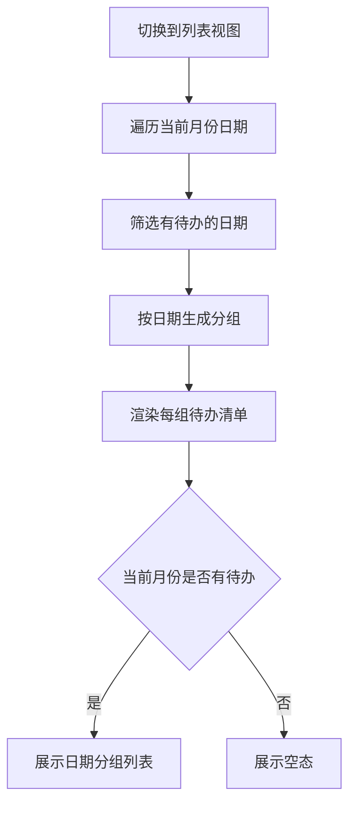
```mermaid
flowchart TD
A[切换到列表视图] --> B[遍历当前月份日期]
B --> C[筛选有待办的日期]
C --> D[按日期生成分组]
D --> E[渲染每组待办清单]
E --> F{当前月份是否有待办}
F -->|是| G[展示日期分组列表]
F -->|否| H[展示空态]
```

#### 2.2.8.3 前置条件

**登录状态：** 仅已登录用户可执行。  
**角色与权限：** 用户可访问桌面端日历。  
**前置业务条件：** 当前视图为列表视图。  
**依赖配置或前序步骤：** 当前月份和待办数据已确定。

#### 2.2.8.4 输入规则

**日期分组：** 仅展示当前月份内存在待办的日期。  
**分组头信息：** 展示日期数字、月份、星期、农历。  
**待办清单字段：** 展示截止时间、完成状态、标题。  
**空态文案：** 当前月无待办时展示“该月暂无安排待办事项”。

#### 2.2.8.5 校验规则

**分组校验：** 无待办日期不得生成空分组。  
**月份校验：** 仅统计当前月份范围内的待办。  
**完成态校验：** 已完成待办需在列表中弱化展示。  
**时间展示校验：** 有截止时间时展示“HH:mm 截止”。

#### 2.2.8.6 业务规则

**分组规则：** 按日期升序或页面既有顺序展示分组。  
**清单规则：** 同一日期下展示全部待办。  
**完成操作规则：** 列表视图中支持直接完成/恢复待办。  
**详情规则：** 点击待办行可打开待办浮层。

#### 2.2.8.7 展示与交互状态规则

**分组头展示：** 以明显的日期头区分不同日期。  
**待办行展示：** 展示色条、时间、完成状态图标和标题。  
**空态：** 无数据时展示空态图标和文案。  
**悬停态：** 待办行悬停高亮。

#### 2.2.8.8 异常处理

**无数据：** 展示空态。  
**加载失败：** 提示“加载失败，请稍后重试”。  
**操作失败：** 提示“操作失败，请稍后重试”。  
**网络异常：** 提示“网络异常，请稍后重试”。

#### 2.2.8.9 后置条件

**页面结果：** 用户可在列表视图中查看当前月份的全部待办日期分组。  
**交互结果：** 用户可直接从列表视图进入待办浮层或执行完成操作。  
**联动结果：** 完成操作后视图结果即时刷新。

#### 2.2.8.10 补充条件

**排序口径：** 同一天内多条待办的排序规则为按照日期顺序进行展示，数据过多时滑动更新展示数据。  
**分页策略：** 当前原型未体现分页，默认整月一次性展示。

### 2.2.9 日历待办浮层查看与快捷操作

#### 2.2.9.1 功能定义

**功能描述：** 用于在日历中快速查看某条待办的核心信息，并支持快捷操作。  
**用户场景：** 用户不希望离开日历主视图，即可完成查看详情、完成待办、恢复待办、删除待办等操作。  
**功能入口与触发方式：** 点击月视图、日视图、周视图、列表视图中的待办摘要。

#### 2.2.9.2 交互流程

**流程说明：** 用户点击待办摘要后，系统打开待办浮层，展示标题、截止时间与操作按钮；用户可在浮层中查看详情、完成/恢复待办或发起删除。

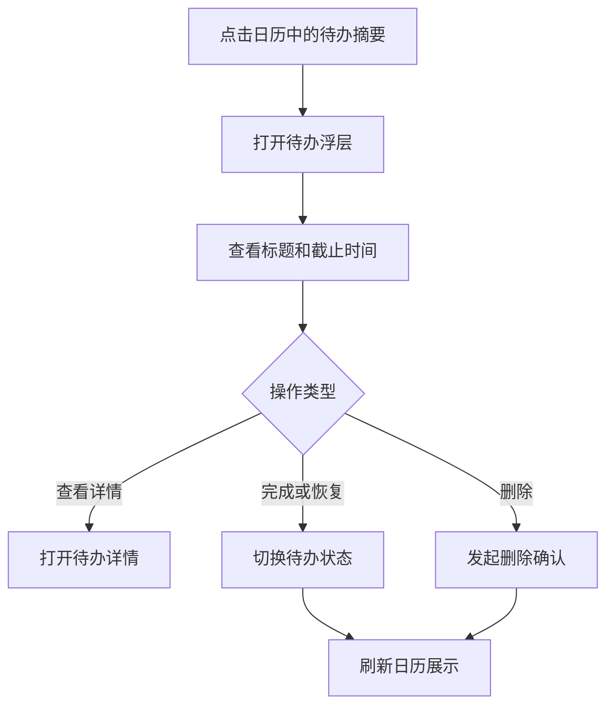
```mermaid
flowchart TD
A[点击日历中的待办摘要] --> B[打开待办浮层]
B --> C[查看标题和截止时间]
C --> D{操作类型}
D -->|查看详情| E[打开待办详情]
D -->|完成或恢复| F[切换待办状态]
D -->|删除| G[发起删除确认]
F --> H[刷新日历展示]
G --> H
```

#### 2.2.9.3 前置条件

**登录状态：** 仅已登录用户可执行。  
**角色与权限：** 用户对目标待办具备查看权限；处理和删除权限规则与待办模块一致。  
**前置业务条件：** 目标待办存在。  
**依赖配置或前序步骤：** 用户已点击某条待办摘要。

#### 2.2.9.4 输入规则

**浮层展示字段：** 至少展示待办标题、来源、截止时间。  
**操作按钮：** 包含“查看详情”和“完成待办/标记为未完成”；同时提供删除入口。  
**标题展示：** 已完成待办标题支持删除线样式。  
**时区展示：** 截止时间附带“GMT+8”展示文案。

#### 2.2.9.5 校验规则

**存在校验：** 目标待办不存在时不打开浮层。  
**状态校验：** 根据当前待办状态动态切换按钮文案。  
**权限校验：** 无删除或处理权限时，不可执行对应操作。  
**关闭校验：** 点击浮层外区域时自动关闭浮层。

#### 2.2.9.6 业务规则

**详情联动规则：** 点击“查看详情”后打开待办详情页。  
**状态切换规则：** 点击“完成待办”后切换到已完成；已完成时按钮文案变为“标记为未完成”。  
**删除规则：** 删除操作走待办模块的删除确认流程。  
**刷新规则：** 浮层内执行状态或删除后，当前视图与相关剩余待办浮层需同步刷新。

#### 2.2.9.7 展示与交互状态规则

**浮层样式：** 浮层悬浮于当前视图之上展示。  
**完成态样式：** 已完成待办按钮和标题展示不同样式。  
**关闭方式：** 支持点击关闭图标或点击外部空白区域关闭。  
**反馈方式：** 以状态刷新和待办提示为主。

#### 2.2.9.8 异常处理

**待办不存在：** 不展示浮层或提示“待办不存在”（待确认）。  
**操作失败：** 提示“操作失败，请稍后重试”。  
**无权限：** 提示“无操作权限”。  
**网络异常：** 提示“网络异常，请稍后重试”。

#### 2.2.9.9 后置条件

**数据结果：** 待办状态、删除结果或详情跳转完成。  
**页面结果：** 当前视图、更多浮层与日历摘要同步刷新。  
**联动结果：** 待办模块中的详情和列表状态保持一致。

#### 2.2.9.10 补充条件

**浮层定位：** 浮层需根据屏幕边界自动调整位置。  
**快捷编辑：** 当前浮层不支持直接编辑标题、时间等字段。

### 2.2.10 日历与待办数据同步

#### 2.2.10.1 功能定义

**功能描述：** 用于确保日历视图与待办模块在创建、完成、恢复、删除、编辑截止时间后的展示结果保持一致。  
**用户场景：** 用户在待办模块中处理待办后，希望日历立即看到相同结果；在日历中处理待办后，也希望待办模块同步变化。  
**功能入口与触发方式：** 在日历浮层、待办详情、待办列表中执行状态或数据变更操作时自动触发。

#### 2.2.10.2 交互流程

**流程说明：** 任一入口对待办执行变更后，系统重新计算待办在日历中的归属日期、完成状态和展示位置，并刷新相关视图。

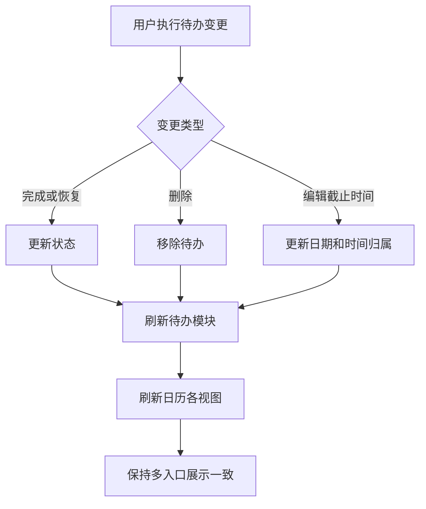
```mermaid
flowchart TD
A[用户执行待办变更] --> B{变更类型}
B -->|完成或恢复| C[更新状态]
B -->|删除| D[移除待办]
B -->|编辑截止时间| E[更新日期和时间归属]
C --> F[刷新待办模块]
D --> F
E --> F
F --> G[刷新日历各视图]
G --> H[保持多入口展示一致]
```

#### 2.2.10.3 前置条件

**登录状态：** 仅已登录用户可执行。  
**角色与权限：** 对目标待办具备相应操作权限的成员可触发同步。  
**前置业务条件：** 目标待办已存在并可映射到日历日期。  
**依赖配置或前序步骤：** 日历和待办模块已处于可用状态。

#### 2.2.10.4 输入规则

**触发动作：** 包含完成、恢复、删除、编辑截止时间、查看详情回写。  
**同步范围：** 桌面端月视图、日视图、周视图、列表视图以及待办模块。  
**刷新方式：** 自动触发，无需用户手动刷新。

#### 2.2.10.5 校验规则

**一致性校验：** 同一条待办在日历和待办模块中的标题、时间、状态必须一致。  
**日期归属校验：** 截止时间变化后，待办需从原日期移除并归入新日期。  
**删除校验：** 删除后不得继续出现在任一日历视图中。  
**状态校验：** 完成态与未完成态的样式和操作文案必须同步。

#### 2.2.10.6 业务规则

**创建同步：** 新建待办后，若截止日期落入当前可见范围，日历中立即展示。  
**状态同步：** 完成或恢复后，日历摘要和浮层按钮同步更新。  
**删除同步：** 删除待办后，月视图、日视图、周视图、列表视图中的对应项同步移除。  
**时间同步：** 修改截止时间后，待办应迁移到新的日期格或时间槽。  
**更多浮层同步：** 若“还有N项...”浮层已打开，数据变化后需同步刷新或自动关闭。

#### 2.2.10.7 展示与交互状态规则

**局部刷新：** 优先刷新当前视图和当前浮层，不强制用户跳转。  
**无感同步：** 同步成功后以展示变化为主，不额外弹窗。  
**空态切换：** 删除或迁移后，如当前视图无待办，则展示对应空态或空结构。

#### 2.2.10.8 异常处理

**同步失败：** 提示“同步失败，请刷新后重试”。  
**部分成功：** 若待办模块更新成功但日历未刷新，提示“数据已更新，日历展示稍后刷新”。  
**网络异常：** 提示“网络异常，请稍后重试”。  
**重复操作：** 连续触发同一操作时，不应生成重复日历项。

#### 2.2.10.9 后置条件

**数据结果：** 日历视图与待办模块保持一致。  
**页面结果：** 当前视图和相关浮层刷新为最新结果。  
**用户结果：** 用户在任一入口看到同一条待办的统一状态。

#### 2.2.10.10 补充条件

**跨端同步时效：** 与移动端日历之间要求实时同步。
**离线策略：** 弱网或离线场景的补偿刷新策略为本地先记、联网后自动补传，冲突时按时间戳或用户选择合并。

## 2.3 移动端日历页

### 2.3.1 页面整体概览

**页面定位：** 组织成员在移动端通过默认展开的月视图和当日清单查看按日期组织的待办事项，并可在折叠后以周视图继续浏览，再通过详情联动完成处理。  
**页面结构：** 页面由顶部标题区、周标题区、可伸缩日历区、当日信息卡片区、当日待办列表区、返回今天浮动按钮组成。  
**信息布局：** 上半区默认展示整月网格，折叠后仅保留当前选中日期所在周；下半区承载选中日期的待办列表；详情页复用待办模块详情能力。

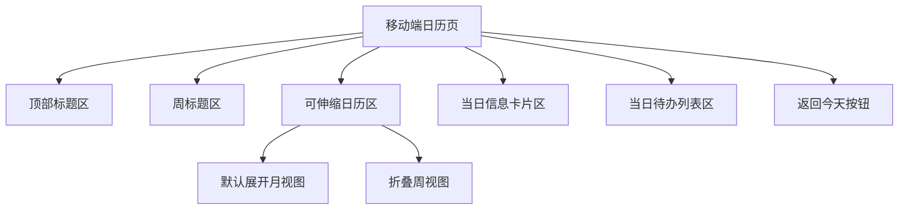
```mermaid
graph TD
A[移动端日历页] --> B[顶部标题区]
A --> C[周标题区]
A --> D[可伸缩日历区]
D --> D1[默认展开月视图]
D --> D2[折叠周视图]
A --> E[当日信息卡片区]
A --> F[当日待办列表区]
A --> G[返回今天按钮]
```

### 2.3.2 移动端月历浏览与日期选择

#### 2.3.2.1 功能定义

**功能描述：** 用于在移动端查看当前月份的日期网格，并选择某一天查看其待办清单。  
**用户场景：** 用户希望在手机端快速切换到目标日期，查看该日待办。  
**功能入口与触发方式：** 进入移动端日历页后，在月历网格中点击日期。

#### 2.3.2.2 交互流程

**流程说明：** 用户进入日历页后，系统默认以展开态渲染当前月份网格；点击某一天后，更新当前选中状态和下方当日待办列表。

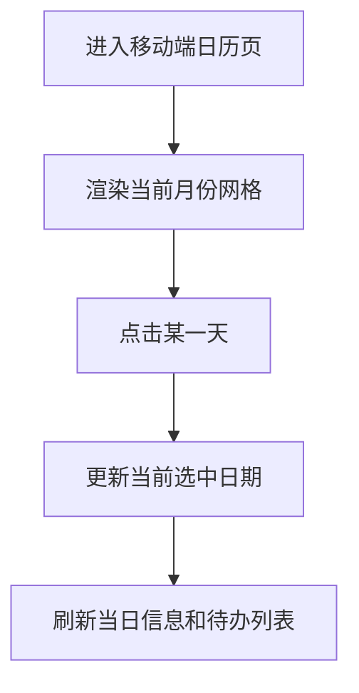
```mermaid
flowchart TD
A[进入移动端日历页] --> B[渲染当前月份网格]
B --> C[点击某一天]
C --> D[更新当前选中日期]
D --> E[刷新当日信息和待办列表]
```

#### 2.3.2.3 前置条件

**登录状态：** 仅已登录用户可执行。  
**角色与权限：** 在日历应用可见范围内的成员可访问。  
**前置业务条件：** 日历入口已开放。  
**依赖配置或前序步骤：** 移动端日历页面已完成初始化。

#### 2.3.2.4 输入规则

**月份标题：** 展示为“YYYY年M月”。  
**初始视图：** 默认以展开状态进入月视图。  
**日期选择：** 单选，点击某一天后成为当前日期。  
**日期网格：** 每格展示日期、农历和待办标记点。  
**当天标识：** 今天显示特殊样式。  
**日期范围：** 以当前自然年为基准，支持向前 10 年和向后 10 年浏览；按 2026 年示例，可浏览 2016 年 1 月 1 日至 2036 年 12 月 31 日。

#### 2.3.2.5 校验规则

**单选校验：** 同一时刻仅允许一个日期处于激活状态。  
**列表联动校验：** 日期切换后，下方待办列表必须同步更新。  
**月份校验：** 当前月份与头部标题保持一致。  
**边界校验：** 超出可浏览日期范围时不允许继续切换月份或周范围。  
**无待办校验：** 选中无待办日期时，下方列表按既定空态规则处理。

#### 2.3.2.6 业务规则

**日期定位规则：** 当前选中日期作为下方待办列表的展示基准。  
**标记点规则：** 存在待办的日期展示标记点。  
**今天规则：** 若选中日期为今天，则顶部当日信息卡片使用“今”样式。  
**补位规则：** 月历支持展示上月和下月补位日期。  
**浏览范围规则：** 月历浏览范围受当前自然年前后 10 年限制，超出边界时保持当前月份不变。

#### 2.3.2.7 展示与交互状态规则

**激活态：** 选中日期高亮显示。  
**今天样式：** 今天日期使用特殊底色和字体色。  
**浮动按钮：** 不在今天时展示“今”按钮，位于今天时隐藏。  
**列表更新：** 日期切换后当日信息卡和列表同步刷新。  
**无待办展示：** 选中无待办日期时，保留当日信息卡，列表区按空态规则隐藏待办卡片容器或展示标准空态。  
**边界态：** 到达最小或最大可浏览月份时，不再继续切换。

#### 2.3.2.8 异常处理

**无数据：** 无待办日期仍允许正常选中。  
**超出边界：** 不执行切换，保持当前月份和当前选中日期不变。  
**加载失败：** 提示“加载失败，请稍后重试”。  
**网络异常：** 提示“网络异常，请稍后重试”。

#### 2.3.2.9 后置条件

**日期结果：** 当前选中日期更新成功。  
**页面结果：** 月历高亮、当日信息和待办列表同步更新。  
**后续动作：** 用户可继续滑动切换、收起展开日历或打开待办详情。

#### 2.3.2.10 补充条件

**法定节日：** 当前未体现节日标识。  
**跨年浏览：** 支持以当前自然年为基准前后 10 年的跨年浏览；按 2026 年示例，支持浏览 2016 年至 2036 年。

### 2.3.3 移动端日历收起/展开与滑动切换

#### 2.3.3.1 功能定义

**功能描述：** 用于在移动端以默认展开的月视图进入日历，并通过拖拽和滑动手势切换月视图与周视图，再左右滑动浏览月份或周。  
**用户场景：** 用户在移动端希望节省屏幕空间，同时保持快速切换日期的效率。  
**功能入口与触发方式：** 拖拽手柄、上下滑动、左右滑动。

#### 2.3.3.2 交互流程

**流程说明：** 用户进入页面时默认看到展开的月视图；上滑时将月历收起为周视图，下滑时展开回月视图；收起态下左右滑动按周切换，展开态下左右滑动按月切换。

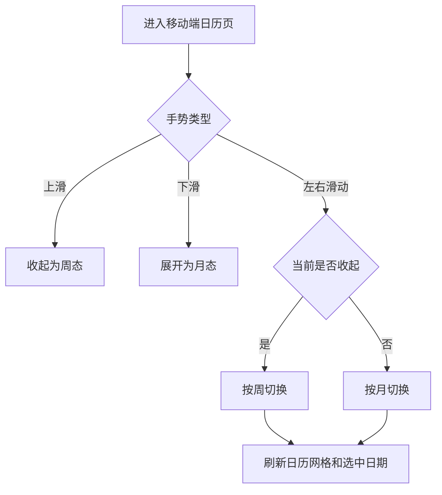
```mermaid
flowchart TD
A[进入移动端日历页] --> B{手势类型}
B -->|上滑| C[收起为周态]
B -->|下滑| D[展开为月态]
B -->|左右滑动| E{当前是否收起}
E -->|是| F[按周切换]
E -->|否| G[按月切换]
F --> H[刷新日历网格和选中日期]
G --> H
```

#### 2.3.3.3 前置条件

**登录状态：** 仅已登录用户可执行。  
**角色与权限：** 用户可访问移动端日历。  
**前置业务条件：** 日历页面已渲染完成。  
**依赖配置或前序步骤：** 触控手势监听已完成初始化。

#### 2.3.3.4 输入规则

**默认状态：** 首次进入页面时默认展示展开态月视图。  
**手柄点击：** 点击手柄可切换收起或展开状态。  
**上滑触发：** 展开态下上滑触发收起。  
**下滑触发：** 收起态下且列表已滚动到顶部时，下滑触发展开。  
**左右滑动：** 收起态按周切换，展开态按月切换。  
**浏览范围：** 以当前自然年为基准，支持向前 10 年和向后 10 年浏览；按 2026 年示例，可浏览 2016 年 1 月 1 日至 2036 年 12 月 31 日。

#### 2.3.3.5 校验规则

**状态校验：** 重复触发当前状态不执行切换。  
**滑动方向校验：** 单次手势需先判断横向或纵向，不可混用。  
**周态校验：** 收起时仅保留当前选中日期所在周。  
**滚动校验：** 下滑展开需在内容滚动到顶部附近时生效。  
**边界校验：** 左右滑动后若超出可浏览日期范围，则不执行切换。

#### 2.3.3.6 业务规则

**收起规则：** 收起后仅展示当前选中日期所在周。  
**展开规则：** 展开后恢复完整月历网格。  
**左右切换规则：** 展开态左右滑动按月切换，并默认定位新月份 1 日；收起态左右滑动按周切换，并保留周态。  
**滚动联动规则：** 展开态下当下方列表向上滚动达到阈值时，日历区自动收起为周视图。  
**视觉反馈规则：** 切换过程中提供位移、透明度和高度过渡动画反馈。

#### 2.3.3.7 展示与交互状态规则

**收起态：** 月历区高度缩短，仅保留单周。  
**展开态：** 月历区默认展示整月网格。  
**阴影反馈：** 收起后顶部容器增加阴影强化分层。  
**手柄展示：** 日历区底部固定展示拖拽手柄，作为收起与展开的显性入口。  
**切换反馈：** 以动画方式过渡。  
**边界态：** 到达最小或最大可浏览周或月份时，左右滑动不再继续切换。

#### 2.3.3.8 异常处理

**手势冲突：** 当手势方向不明确时不执行切换。  
**切换失败：** 保持当前状态不变。  
**渲染失败：** 提示“加载失败，请重试”（待确认）。  
**网络异常：** 本功能以本地界面切换为主，不依赖网络。

#### 2.3.3.9 后置条件

**页面结果：** 日历区在默认展开月视图和折叠周视图之间切换。  
**日期结果：** 左右滑动后选中日期和头部标题同步更新。  
**列表结果：** 下方当日待办列表按最新选中日期刷新。

#### 2.3.3.10 补充条件

**平板适配：** 当前规则按手机端优先设计。  
**横屏适配：** 强制竖屏锁定，无论系统是否开启旋转。

### 2.3.4 移动端当日待办列表展示

#### 2.3.4.1 功能定义

**功能描述：** 用于在移动端展示当前选中日期的待办卡片列表。  
**用户场景：** 用户在选择某一天后，希望直接查看该日待办并通过详情进一步处理。  
**功能入口与触发方式：** 进入移动端日历页或切换日期后查看下方列表。

#### 2.3.4.2 交互流程

**流程说明：** 系统根据当前选中日期刷新当日信息卡和待办列表；用户点击某条卡片可进入待办详情。

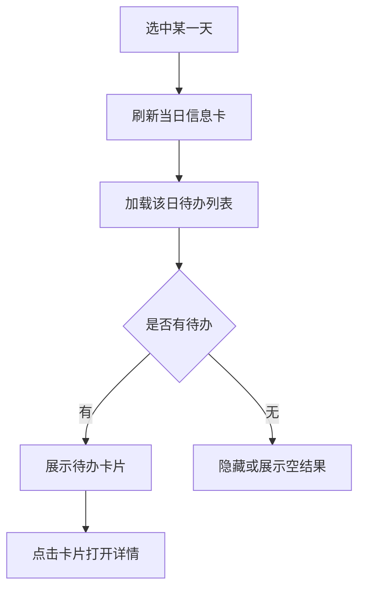
```mermaid
flowchart TD
A[选中某一天] --> B[刷新当日信息卡]
B --> C[加载该日待办列表]
C --> D{是否有待办}
D -->|有| E[展示待办卡片]
D -->|无| F[隐藏或展示空结果]
E --> G[点击卡片打开详情]
```

#### 2.3.4.3 前置条件

**登录状态：** 仅已登录用户可执行。  
**角色与权限：** 用户可访问移动端日历。  
**前置业务条件：** 当前已存在选中日期。  
**依赖配置或前序步骤：** 日历网格已渲染完成。

#### 2.3.4.4 输入规则

**当日信息卡：** 展示“今/日期数字”、公历日期、星期、农历。  
**待办卡片字段：** 展示截止时间、标题、完成状态。  
**卡片点击：** 单击打开待办详情。  
**列表范围：** 仅展示当前选中日期对应的待办。

#### 2.3.4.5 校验规则

**日期校验：** 待办列表必须与当前选中日期一致。  
**完成态校验：** 已完成卡片需展示弱化样式和完成图标。  
**无数据校验：** 无待办时需保留当日信息卡，并按既定规则隐藏待办卡片容器。  
**点击校验：** 点击卡片进入待办详情，不在列表页直接完成待办。

#### 2.3.4.6 业务规则

**来源规则：** 当前列表展示的是按日期映射的待办事项。  
**时间规则：** 卡片优先展示“HH:mm 截止”。  
**完成态规则：** 已完成卡片保留展示，但样式弱化。  
**当日规则：** 选中今天时，信息卡以“今”进行突出展示。

#### 2.3.4.7 展示与交互状态规则

**信息卡展示：** 顶部固定展示选中日期信息。  
**卡片展示：** 使用清单卡片样式展示待办。  
**无待办状态：** 当前原型中无待办时保留当日信息卡并隐藏待办卡片容器。  
**滚动展示：** 列表区支持纵向滚动。

#### 2.3.4.8 异常处理

**无数据：** 保留当日信息卡并隐藏待办卡片容器。  
**加载失败：** 提示“加载失败，请稍后重试”。  
**网络异常：** 提示“网络异常，请稍后重试”。

#### 2.3.4.9 后置条件

**页面结果：** 当日信息卡和列表展示刷新完成。  
**交互结果：** 用户可从卡片继续进入待办详情。  
**联动结果：** 详情页状态变化后可回写列表卡片样式。

#### 2.3.4.10 补充条件

**空态展示方式：** 当前原型为保留当日信息卡并隐藏待办卡片容器。  
**排序规则：** 同一天内多条待办根据截止日期顺序排列，截止日期相同则根据创建日期倒序进行排列。

### 2.3.5 移动端返回今天

#### 2.3.5.1 功能定义

**功能描述：** 用于在移动端快速恢复到今天的日期位置。  
**用户场景：** 用户浏览其他日期后，希望一键回到今天继续查看。  
**功能入口与触发方式：** 点击悬浮“今”按钮。

#### 2.3.5.2 交互流程

**流程说明：** 用户点击“今”按钮后，系统将当前选中日期重置为今天，并刷新月历高亮、头部信息卡和当日待办列表。

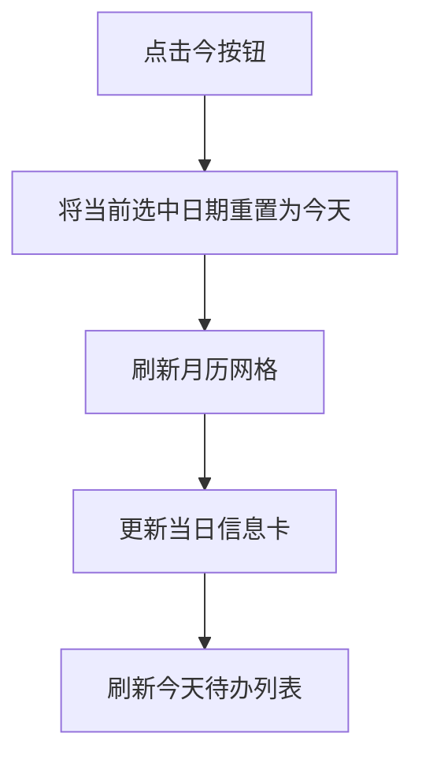
```mermaid
flowchart TD
A[点击今按钮] --> B[将当前选中日期重置为今天]
B --> C[刷新月历网格]
C --> D[更新当日信息卡]
D --> E[刷新今天待办列表]
```

#### 2.3.5.3 前置条件

**登录状态：** 仅已登录用户可执行。  
**角色与权限：** 用户可访问移动端日历。  
**前置业务条件：** 当前选中日期不是今天时，按钮显示。  
**依赖配置或前序步骤：** 日历页已打开。

#### 2.3.5.4 输入规则

**按钮文案：** 固定为“今”。  
**显示条件：** 当前选中日期不为今天时展示，为今天时隐藏。  
**点击动作：** 单击后将当前选中日期定位为今天。  
**视图规则：** 收起态和展开态均可使用。

#### 2.3.5.5 校验规则

**显示校验：** 位于今天时不展示或不可点击。  
**日期校验：** 点击后必须重置到今天。  
**列表校验：** 返回今天后必须同步刷新当日待办列表。  
**状态校验：** 若当前为收起态，需保留收起态并定位到今天所在周。

#### 2.3.5.6 业务规则

**回到今天规则：** 重置当前选中日期为今天。  
**视图保持规则：** 若当前为收起态，返回今天后仍保持收起态；若为展开态，保持展开态。  
**高亮规则：** 今天对应日期格自动高亮。  
**信息卡规则：** 信息卡恢复为今天样式。

#### 2.3.5.7 展示与交互状态规则

**按钮展示：** 悬浮于页面底部区域。  
**点击反馈：** 以列表和日历高亮刷新为主。  
**隐藏规则：** 当前已在今天时自动隐藏。  
**动画反馈：** 返回今天后支持平滑刷新或轻量过渡（待确认）。

#### 2.3.5.8 异常处理

**刷新失败：** 提示“加载失败，请重试”（待确认）。  
**无数据：** 回到今天但无待办时，正常展示今天信息卡和空列表。  
**网络异常：** 提示“网络异常，请稍后重试”。

#### 2.3.5.9 后置条件

**日期结果：** 当前选中日期更新为今天。  
**页面结果：** 月历高亮、头部信息卡、列表结果同步更新。  
**按钮结果：** “今”按钮隐藏。

#### 2.3.5.10 补充条件

**今日定义：** 以客户端所在时区当天为准，当前页面展示为 GMT+8 语境。  
**跨时区处理：** 多时区适配策略为统一转UTC时间戳入库，按用户当前设备时区渲染。

### 2.3.6 移动端日历卡片与待办详情联动

#### 2.3.6.1 功能定义

**功能描述：** 用于从移动端日历卡片直接进入待办详情，并在详情中处理待办后回写日历卡片状态。  
**用户场景：** 用户在日历里看到待办后，希望直接查看详情并完成处理，不必切换到其他模块重新查找。  
**功能入口与触发方式：** 点击移动端日历页中的待办卡片。

#### 2.3.6.2 交互流程

**流程说明：** 用户点击日历卡片后进入待办详情页；在详情中可查看、编辑、完成、恢复或删除待办；处理结果同步回写到日历卡片。

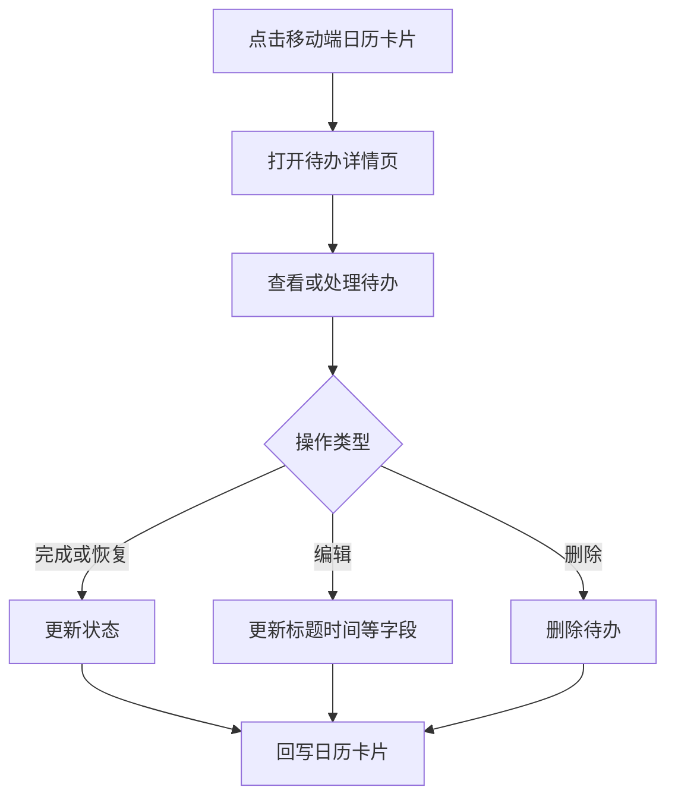
```mermaid
flowchart TD
A[点击移动端日历卡片] --> B[打开待办详情页]
B --> C[查看或处理待办]
C --> D{操作类型}
D -->|完成或恢复| E[更新状态]
D -->|编辑| F[更新标题时间等字段]
D -->|删除| G[删除待办]
E --> H[回写日历卡片]
F --> H
G --> H
```

#### 2.3.6.3 前置条件

**登录状态：** 仅已登录用户可执行。  
**角色与权限：** 对目标待办具备查看权限的成员可进入详情；处理和删除权限规则与待办模块一致。  
**前置业务条件：** 目标待办存在。  
**依赖配置或前序步骤：** 用户已在日历列表中点击卡片。

#### 2.3.6.4 输入规则

**卡片点击：** 单击进入待办详情页。  
**联动字段：** 至少联动标题、完成状态、截止时间。  
**回写范围：** 同步更新日历卡片样式与内容。  
**完成态：** 已完成卡片展示完成图标和弱化样式。

#### 2.3.6.5 校验规则

**存在校验：** 待办已删除时不可进入详情。  
**状态校验：** 详情页状态变化后，必须同步更新日历卡片。  
**编辑校验：** 修改标题或截止时间后，日历卡片需回显最新内容。  
**删除校验：** 删除待办后，日历卡片应立即移除。

#### 2.3.6.6 业务规则

**详情复用规则：** 复用待办模块的详情能力。  
**状态回写规则：** 完成或恢复后，卡片样式和图标同步更新。  
**标题回写规则：** 编辑标题后，日历卡片标题同步更新。  
**删除回写规则：** 删除后从当前日期列表中移除。  
**日历映射规则：** 修改截止日期后，应移动到新的日期结果集中。

#### 2.3.6.7 展示与交互状态规则

**进入方式：** 卡片点击后全屏进入详情页。  
**回写方式：** 详情页处理结果返回后，日历页无感刷新。  
**完成态展示：** 已完成卡片使用完成样式。  
**空态切换：** 当前日期最后一条待办被删除后，列表区切换为空结果。

#### 2.3.6.8 异常处理

**待办不存在：** 提示“待办不存在或已删除”。  
**回写失败：** 提示“同步失败，请刷新重试”。  
**无权限：** 提示“无操作权限”。  
**网络异常：** 提示“网络异常，请稍后重试”。

#### 2.3.6.9 后置条件

**数据结果：** 详情页处理结果写回移动端日历卡片。  
**页面结果：** 当前日期列表保持最新状态。  
**联动结果：** 与待办模块详情保持一致。

#### 2.3.6.10 补充条件

**返回定位：** 关闭详情后默认返回进入前的日历页位置。  
**跨页刷新时机：** 详情关闭前实时回写。
