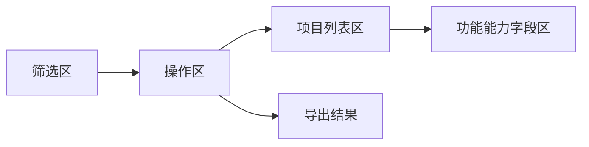
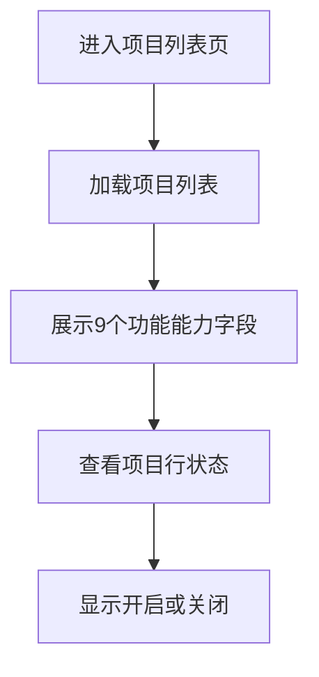
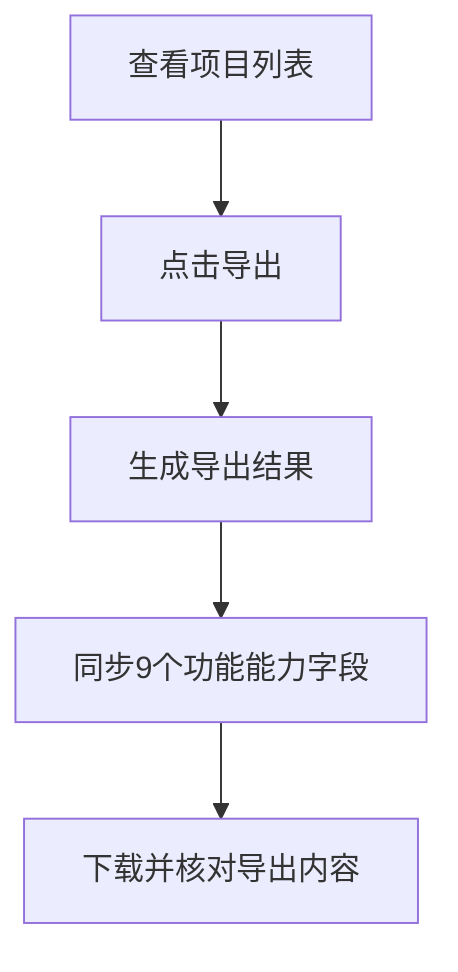

# 1 背景与目标

## 1.1 业务背景
**现状痛点：** `admin` 项目列表页已存在项目基础信息、统计信息、功能能力信息和导出入口，但本次确认范围内的 9 个功能能力字段尚未形成统一、明确的评审口径，且导出结果是否同步这 9 个字段缺少统一约束，容易导致页面查看口径与导出结果不一致。

**触发原因：** 管理员需要在项目列表中快速查看项目功能能力开通情况，并在导出项目数据时同步带出相同字段，便于运营盘点、售后排查与项目能力核对。

**影响范围：** 影响对象为进入 `admin` 后台项目管理的管理员。影响页面为项目列表页。影响流程为项目列表查看、项目能力状态识别、项目数据导出。

## 1.2 目标

### 1.2.1 项目列表补齐 9 个功能能力字段
**目标描述：** 在项目列表中新增并展示 9 个功能能力字段，统一反映项目功能开通状态。

**衡量口径：** 管理员进入项目列表页后，可看到 `Autopilot`、`会话前表单`、`全员离线表单`、`自动推荐回复`、`聊天翻译`、`边写边译`、`文本润色`、`会话评价`、`联系我们` 9 个字段，并在每个项目行中查看对应状态。

**目标值：** 9 个字段全部展示，状态展示正确率达到 100%。

### 1.2.2 保持列表与导出口径一致
**目标描述：** 导出结果同步包含上述 9 个功能能力字段，确保管理员在页面查看与导出分析时使用同一字段口径。

**衡量口径：** 管理员在项目列表页触发导出后，导出结果包含与列表相同的 9 个字段，且字段值与页面展示一致。

**目标值：** 9 个字段全部纳入导出，字段一致性达到 100%。

## 1.3 验收指标

### 1.3.1 列表字段展示完整性
**指标名称：** 列表字段展示完整性

**计算口径：** 验证项目列表表头是否完整包含 9 个目标字段，且每一行均显示对应状态值。

**统计周期：** 需求验收阶段。

**验收阈值：** 9 个字段全部展示，且项目行状态显示完整。

**数据来源：** 项目列表页验收走查。

### 1.3.2 字段状态映射准确性
**指标名称：** 字段状态映射准确性

**计算口径：** 抽样核对项目功能配置与列表字段展示结果，验证各字段是否按开启/关闭正确展示。

**统计周期：** 需求验收阶段。

**验收阈值：** 抽样项目的字段状态映射准确率达到 100%。

**数据来源：** 项目列表页验收走查与项目配置对照结果（待确认）。

### 1.3.3 导出字段同步准确性
**指标名称：** 导出字段同步准确性

**计算口径：** 触发项目列表导出后，验证导出结果是否包含 9 个目标字段，且字段顺序、字段值与页面展示保持一致。

**统计周期：** 需求验收阶段。

**验收阈值：** 9 个字段全部纳入导出，且字段值一致性达到 100%。

**数据来源：** 项目列表导出文件验收走查。

# 2 项目列表页

## 2.1 页面整体概览
**页面说明：** 项目列表页用于集中查看项目基础信息、统计数据、功能能力状态，并提供搜索、重置、导出等操作入口。

**页面结构：** 页面由筛选区、操作区、项目列表区组成。筛选区用于设置查询条件，操作区包含搜索、重置、导出入口，项目列表区用于横向展示项目字段信息。本次需求聚焦项目列表中的 9 个功能能力字段展示及导出同步。

## 2.2 功能能力字段新增与展示

### 2.2.1 功能定义
**功能描述：** 在项目列表页新增并展示 9 个功能能力字段，用于反映每个项目的功能开通状态。

**用户场景：** 管理员查看项目列表时，需要快速识别某个项目是否已开通 `Autopilot`、`会话前表单`、`全员离线表单`、`自动推荐回复`、`聊天翻译`、`边写边译`、`文本润色`、`会话评价`、`联系我们` 等能力。

**功能入口与触发方式：** 管理员进入项目管理中的项目列表页，在项目列表表头和项目行中直接查看目标字段。

**功能类型：** 修改、列表

**规则依据：** 当前项目列表页已存在功能能力类字段展示方式，本次需求将目标范围统一确认为 9 个字段，并按相同模式展示开启/关闭状态。

### 2.2.2 交互流程
1. 管理员进入项目列表页。
2. 系统根据当前查询结果加载项目列表。
3. 系统在项目列表中展示 9 个目标功能能力字段。
4. 管理员横向查看某个项目在 9 个字段下的状态。
5. 系统按每个项目的实际能力配置返回“开启”或“关闭”。

### 2.2.3 前置条件
**登录状态：** 用户已登录 `admin` 后台。

**角色与权限：** 用户具备项目列表查看权限（待确认）。

**前置业务条件：** 项目列表页可正常加载项目数据。

**数据前提：** 每个项目存在对应的功能能力状态数据；若某项能力未开通，则按关闭状态展示。

### 2.2.4 输入规则
**字段范围：** 本次新增字段固定为 `Autopilot`、`会话前表单`、`全员离线表单`、`自动推荐回复`、`聊天翻译`、`边写边译`、`文本润色`、`会话评价`、`联系我们`。

**字段顺序：** 字段顺序按 `Autopilot -> 会话前表单 -> 全员离线表单 -> 自动推荐回复 -> 聊天翻译 -> 边写边译 -> 文本润色 -> 会话评价 -> 联系我们` 展示。

**字段值来源：** 每个字段值来源于项目当前对应能力的开通状态。

**字段展示值：** 每个字段仅展示两种结果，已开通显示“开启”，未开通显示“关闭”。

**页面输入方式：** 该 9 个字段在项目列表页仅用于展示，不提供页内直接编辑入口。

### 2.2.5 校验规则
**字段完整性校验：** 项目列表表头必须完整展示 9 个目标字段，不允许缺失或重复。

**状态映射校验：** 每个字段必须映射到对应项目的真实能力状态，不允许跨字段错位展示。

**文案校验：** 状态文案统一为“开启”“关闭”，不使用其他表达。

**加载失败提示：** 若项目列表加载失败，沿用页面现有失败提示能力，具体提示文案为`（待确认）`。

### 2.2.6 业务规则
**字段展示规则：** 9 个字段与其他项目字段一并在列表中横向展示，属于项目功能能力信息的一部分。

**状态定义规则：** 项目已开通对应能力时显示“开启”；未开通对应能力时显示“关闭”。

**独立判断规则：** 9 个字段分别独立判断，不因其他字段状态变化而联动修改展示结果。

**列表查询规则：** 搜索、筛选、分页后，9 个字段仍需随当前结果列表一并展示。

**排序规则：** 本次范围未确认新增这 9 个字段的单独排序能力，默认沿用当前列表字段能力边界。

**范围边界：** 本次需求仅包含字段新增与状态展示，不包含新增筛选项、字段编辑入口、详情联动或批量变更能力。

### 2.2.7 展示与交互状态规则
**表头展示：** 9 个字段在项目列表表头中按确认顺序展示，字段名称与截图口径保持一致。

**单元格展示：** 每个项目在 9 个字段下显示对应状态值。

**横向滚动：** 当列表字段较多时，管理员通过列表横向滚动查看完整字段区域。

**加载态：** 页面加载中时，字段区域与列表区域保持统一加载状态。

**空态：** 当当前查询结果无项目数据时，列表不展示项目行，空态文案沿用页面现有规则。

### 2.2.8 异常处理
**无数据：** 当前查询无结果时，显示列表空态，管理员可调整筛选条件后重新查询。

**加载失败：** 项目列表加载失败时，提示文案沿用页面现有失败提示能力，管理员可刷新页面或重新查询。

**无权限：** 用户无项目列表查看权限时，不展示列表数据，提示文案为`（待确认）`。

**字段数据缺失：** 单个项目缺少某项能力状态时，默认按“关闭”展示（待确认）。

**状态异常：** 若字段状态无法识别，提示处理方式为`（待确认）`。

### 2.2.9 后置条件
**页面结果：** 项目列表成功展示 9 个目标字段及每个项目的状态值。

**数据结果：** 管理员可基于列表直接识别项目能力开通情况。

**业务影响：** 本次变更仅补充列表字段展示，不改变项目本身的能力配置状态。

### 2.2.10 补充条件
**历史数据兼容：** 存量项目按已有能力状态回填对应字段展示。

**显示一致性：** 9 个字段的名称、顺序、状态文案需与项目导出结果保持一致。

## 2.3 导出字段同步（架构外新增（待确认））

### 2.3.1 功能定义
**功能描述：** 项目列表执行导出时，导出结果同步包含与页面一致的 9 个功能能力字段。

**用户场景：** 管理员在项目列表中查看项目能力状态后，需要导出项目数据给运营、销售或售后团队做线下核对，要求导出文件中保留相同字段。

**功能入口与触发方式：** 管理员在项目列表页点击“导出”按钮后，系统生成并输出包含 9 个功能能力字段的导出结果。

**功能类型：** 修改、导出

**规则依据：** 当前项目列表页存在导出入口；本次需求明确要求导出字段同步 9 个功能能力字段，保证页面查看与导出分析口径一致。

### 2.3.2 交互流程
1. 管理员进入项目列表页并查看当前查询结果。
2. 管理员点击“导出”按钮。
3. 系统按当前导出范围生成导出结果。
4. 系统在导出结果中同步带出 9 个目标字段。
5. 管理员打开导出结果核对字段名称、顺序与状态值。

### 2.3.3 前置条件
**登录状态：** 用户已登录 `admin` 后台。

**角色与权限：** 用户具备项目列表导出权限（待确认）。

**前置业务条件：** 项目列表页存在导出入口且可正常执行导出。

**导出前提：** 9 个目标字段已纳入项目列表页展示范围。

### 2.3.4 输入规则
**导出字段范围：** 导出结果需包含 `Autopilot`、`会话前表单`、`全员离线表单`、`自动推荐回复`、`聊天翻译`、`边写边译`、`文本润色`、`会话评价`、`联系我们` 9 个字段。

**导出字段顺序：** 9 个字段在导出结果中的顺序与列表展示顺序保持一致。

**导出字段值：** 导出结果中的字段值与列表展示口径一致，统一输出“开启”“关闭”。

**导出范围：** 导出是否以当前查询结果为准，需在联调前最终确认。

**导出格式：** 导出文件格式沿用页面现有导出能力，具体文件格式为`（待确认）`。

### 2.3.5 校验规则
**字段完整性校验：** 导出结果必须完整包含 9 个目标字段，不允许缺失。

**字段顺序校验：** 导出结果中的 9 个字段顺序必须与页面展示顺序一致。

**字段值一致性校验：** 导出结果中的字段值必须与页面对应项目展示值一致。

**重复导出校验：** 管理员重复点击导出时的防重复规则沿用页面现有导出能力，具体行为为`（待确认）`。

**导出失败提示：** 导出失败时的提示文案为`（待确认）`。

### 2.3.6 业务规则
**同步规则：** 列表中展示的 9 个目标字段必须同步进入导出结果。

**口径一致规则：** 导出字段名称、字段顺序、字段值语义与页面列表保持一致。

**状态映射规则：** 导出结果中已开通的字段输出“开启”，未开通的字段输出“关闭”。

**范围边界：** 本次仅要求 9 个字段进入导出结果，不扩展新的导出入口或新增独立导出模板。

**查询联动规则：** 导出是否严格跟随当前搜索、筛选、分页结果范围为`（待确认）`。

### 2.3.7 展示与交互状态规则
**按钮入口：** 导出入口保留在项目列表页当前操作区。

**导出反馈：** 管理员点击导出后，页面反馈方式沿用现有导出能力，具体反馈文案为`（待确认）`。

**结果可读性：** 导出结果中的 9 个字段应使用业务字段名称，不使用内部识别名称。

**状态可读性：** 导出结果中的状态值需保持直观可读，统一输出中文状态文案。

### 2.3.8 异常处理
**无数据：** 当前无可导出项目时，提示文案与是否允许导出空结果为`（待确认）`。

**导出失败：** 导出失败时提示“导出失败，请稍后重试”（待确认），管理员可重新发起导出。

**无权限：** 用户无导出权限时，不允许导出，提示文案为`（待确认）`。

**导出超时：** 导出超时后的处理方式为`（待确认）`。

**字段缺失：** 若导出链路未带出 9 个字段中的任一字段，则视为导出结果不合格，管理员可重新发起导出并反馈异常。

### 2.3.9 后置条件
**导出结果：** 管理员获得包含 9 个目标字段的导出结果。

**数据结果：** 导出文件中的字段内容与页面展示保持一致。

**业务影响：** 运营、销售、售后等使用导出文件的角色可基于统一口径进行线下分析与核对。

### 2.3.10 补充条件
**字段扩展边界：** 本次导出同步范围仅限已确认的 9 个字段，不自动扩展其他功能能力字段。

**后续扩展：** 若后续项目列表继续新增能力字段，是否默认同步到导出结果需另行确认。
