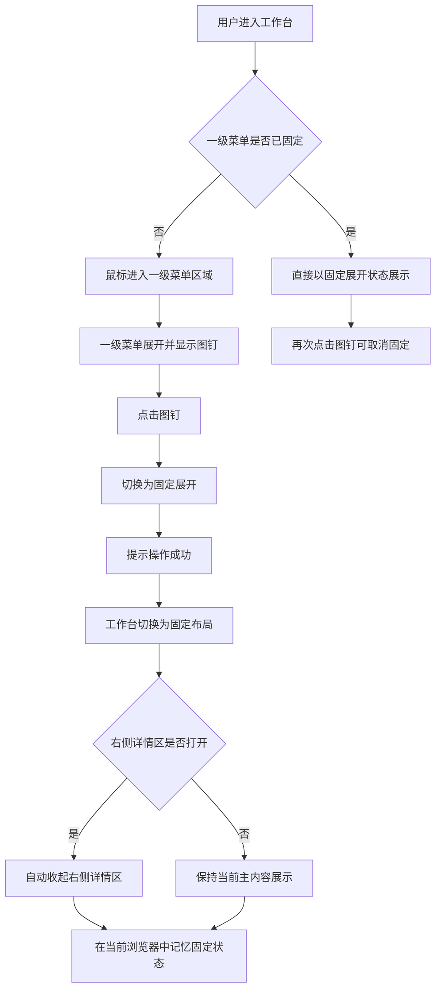

1 背景与目标

## 1.1 业务背景

**业务背景：** 当前工作台左侧一级菜单支持鼠标悬浮展开与收起，用户可通过一级菜单在消息、客户、设置等主模块之间切换。

**现状痛点：** 在未固定状态下，一级菜单依赖鼠标悬浮保持展开，用户连续切换主模块时需要反复悬浮一级菜单区域，操作连续性较弱。此前固定入口曾分散在个人资料区域，固定能力入口不够集中。

**触发原因：** 本次需求用于提升工作台主导航的持续可见性与操作效率，并统一一级菜单固定能力入口。

**影响范围：** 影响对象为已进入工作台的客服、管理员等登录角色；影响范围为左侧一级菜单区域、工作台整体布局联动、个人资料卡片入口呈现。

## 1.2 目标

**目标1：** 让用户可直接在左侧一级菜单区域完成固定与取消固定操作。

**衡量口径：** 用户进入一级菜单区域后，可看到图钉入口，并通过单击完成状态切换。

**目标值或期望区间：** 100% 支持。

**目标2：** 让一级菜单在固定后保持展开，并在当前浏览器内记忆状态。

**衡量口径：** 用户固定一级菜单后，当前页面保持展开布局；刷新或再次进入时延续上一次固定状态。

**目标值或期望区间：** 100% 支持。

**目标3：** 统一固定能力入口，避免用户在多个位置寻找同一操作。

**衡量口径：** 一级菜单固定能力仅保留在左侧一级菜单区域；个人资料卡片不再提供固定菜单入口。

**目标值或期望区间：** 100% 支持。

## 1.3 验收指标

**指标名称：** 固定入口可达性。

**计算口径：** 用户鼠标进入一级菜单区域后，可看到图钉按钮，并可通过点击切换固定状态。

**统计周期：** 单次验收。

**验收阈值：** 图钉入口可见且可操作，状态切换后有明确反馈。

**数据来源：** 工作台左侧一级菜单交互验收。

**指标名称：** 固定状态记忆有效性。

**计算口径：** 用户在当前浏览器中完成固定或取消固定后，刷新页面或再次进入时，一级菜单保持上一次已保存状态。

**统计周期：** 单次验收。

**验收阈值：** 状态记忆生效。

**数据来源：** 工作台左侧一级菜单交互验收。

**指标名称：** 布局联动准确性。

**计算口径：** 用户固定一级菜单时，工作台切换为固定展开布局；若右侧详情区处于打开状态，则自动收起。

**统计周期：** 单次验收。

**验收阈值：** 固定布局生效，详情区自动收起。

**数据来源：** 工作台整体布局联动验收。

**指标名称：** 入口收口一致性。

**计算口径：** 用户打开个人资料卡片后，不再看到固定菜单入口。

**统计周期：** 单次验收。

**验收阈值：** 个人资料卡片中不展示固定菜单入口。

**数据来源：** 个人资料卡片内容验收。

## 2 一级菜单固定

### 2.1 功能定义

**功能描述：** 一级菜单固定用于让用户将左侧一级菜单从“悬浮展开”切换为“固定展开”，在工作台中持续展示一级菜单，减少重复悬浮操作。

**用户场景：** 客服或管理员在工作台中频繁切换主模块时，希望左侧一级菜单持续展开；用户也可在不需要时取消固定，恢复为悬浮展开模式。

**功能入口与触发方式：** 用户鼠标悬浮左侧一级菜单区域后，在一级菜单展开头部看到图钉按钮；点击图钉按钮可固定或取消固定一级菜单。

**目标用户/角色：** 已登录并进入工作台的客服、管理员。

**功能类型：** 修改、状态变更。

**输出结果：** 一级菜单在未固定态与固定态之间切换，工作台布局按新状态调整，并在当前浏览器中记忆固定结果。

**规则依据：** 当前工作台已支持一级菜单悬浮展开、图钉切换固定状态、固定后布局联动与当前浏览器状态记忆。

### 2.2 交互流程

**主流程：**

1. 用户进入带左侧一级菜单的工作台页面。
2. 当一级菜单处于未固定状态时，用户将鼠标移入一级菜单区域，一级菜单展开。
3. 一级菜单展开后，头部显示图钉按钮。
4. 用户点击图钉按钮，系统将一级菜单切换为固定状态。
5. 系统展示“操作成功”反馈，并将工作台切换为一级菜单固定展开布局。
6. 若右侧详情区当前处于打开状态，系统在固定一级菜单时自动收起右侧详情区。
7. 用户刷新页面或再次进入当前浏览器中的工作台页面时，一级菜单保持固定展开状态。

**分支流程：**

1. 当一级菜单已固定时，用户再次点击图钉按钮，系统取消固定，一级菜单恢复为悬浮展开模式。
2. 当一级菜单未固定且用户鼠标移出一级菜单区域时，一级菜单自动收起。
3. 当一级菜单已固定时，用户鼠标移出一级菜单区域，一级菜单继续保持展开。

**异常流程：**

1. 当前浏览器没有已保存的固定状态时，系统按未固定状态进入工作台。
2. 当前浏览器无法保存固定状态时，操作后的持久化结果为`（待确认）`。

### 2.3 前置条件

**登录状态：** 用户需已登录系统并进入工作台页面。

**角色与权限：** 当前已确认可进入工作台的登录角色可使用该功能；更细粒度的角色权限差异为`（待确认）`。

**前置业务条件：** 当前页面需存在左侧一级菜单区域。

**依赖配置或前序步骤：** 固定状态记忆依赖当前浏览器具备本地保存能力；跨浏览器、跨设备或跨账号同步能力为`（待确认）`。

### 2.4 输入规则

**一级菜单固定状态：** 状态输入，支持“未固定 / 已固定”两种状态；当前浏览器无历史记录时默认值为未固定。

**图钉按钮：** 按钮输入，单击后切换一级菜单固定状态；按钮位于一级菜单展开头部。

**一级菜单区域悬浮：** 悬浮输入，未固定状态下鼠标移入一级菜单区域后展开一级菜单；鼠标移出后收起一级菜单。

**图钉按钮显示状态：** 默认隐藏；当用户悬浮一级菜单区域并进入展开态时显示；获得焦点时可继续显示。

**个人资料卡片入口：** 当前不提供一级菜单固定相关按钮或开关。

### 2.5 校验规则

**图钉按钮：** 仅在一级菜单进入展开态后可见并可操作。

**固定状态切换：** 用户每次点击图钉按钮后，系统需将一级菜单状态在“未固定 / 已固定”之间切换，不需要二次确认。

**状态反馈：** 每次固定或取消固定完成后，页面反馈文案为“操作成功”。

**历史状态读取：** 当前浏览器无历史固定记录时，页面按未固定状态展示，不报错。

**状态持久化失败提示：** 当前浏览器无法保存固定状态时，是否需要显式提示用户为`（待确认）`。

### 2.6 业务规则

**展开规则：** 一级菜单未固定时，随鼠标进入一级菜单区域而展开，随鼠标移出而收起。

**固定规则：** 一级菜单固定后持续保持展开，不再依赖鼠标悬浮维持展开状态。

**取消固定规则：** 用户取消固定后，一级菜单恢复为悬浮展开模式；鼠标移出一级菜单区域后收起。

**状态记忆规则：** 一级菜单固定结果在当前浏览器内保存；用户刷新页面或再次进入时沿用最近一次已保存状态。

**布局联动规则：** 一级菜单固定后，工作台整体切换为一级菜单固定展开布局。

**详情区联动规则：** 固定一级菜单时，若右侧详情区已打开，则系统自动收起右侧详情区。

**详情区恢复规则：** 取消固定一级菜单后，系统不自动重新打开此前已被收起的右侧详情区。

**入口统一规则：** 一级菜单固定能力统一收口到左侧一级菜单头部图钉按钮；个人资料卡片不再承载该能力入口。

**同步范围规则：** 当前仅确认在当前浏览器内记忆固定状态；跨浏览器、跨设备同步规则为`（待确认）`。

### 2.7 展示与交互状态规则

**未固定默认态：** 一级菜单在未悬浮时保持收起，仅展示收起态导航。

**未固定悬浮态：** 用户鼠标进入一级菜单区域后，一级菜单展开，并展示图钉按钮与一级菜单文字内容。

**已固定态：** 一级菜单持续保持展开，图钉按钮展示为已激活状态。

**图钉按钮显示规则：** 图钉按钮仅在一级菜单进入展开态时显示；未展开时不显示。

**成功反馈规则：** 用户完成固定或取消固定操作后，页面展示“操作成功”提示。

**布局展示规则：** 一级菜单固定后，工作台主内容区按固定展开布局重新排布。

**右侧详情区展示规则：** 固定一级菜单时，若右侧详情区原本打开，则自动隐藏。

**个人资料卡片展示规则：** 个人资料卡片仅保留账号、密码、通知、语言、退出等入口，不展示一级菜单固定入口。

### 2.8 异常处理

**历史状态缺失：** 当当前浏览器不存在历史固定记录时，页面按未固定状态进入；用户可执行动作为悬浮一级菜单并点击图钉进行固定。

**本地状态读取失败：** 当页面无法读取当前浏览器中的历史固定状态时，页面按未固定状态进入；用户可执行动作为重新点击图钉设置固定状态。

**本地状态写入失败：** 当页面无法保存固定状态时，是否提示用户、是否仅在本次会话内生效为`（待确认）`；用户可执行动作为刷新后重新尝试。

**无权限：** 当前角色若无权进入工作台，则无法使用一级菜单固定功能；进入工作台后的更细粒度禁用策略为`（待确认）`。

**重复操作：** 用户连续多次点击图钉按钮时，系统按最后一次点击结果生效，不需要额外确认。

### 2.9 后置条件

**状态结果：** 一级菜单更新为最新固定状态或取消固定状态。

**布局结果：** 工作台按当前一级菜单状态展示对应布局。

**详情区结果：** 当用户执行固定一级菜单时，右侧详情区被自动收起；取消固定时不自动恢复。

**保存结果：** 当前浏览器保存最近一次一级菜单固定状态。

**入口结果：** 个人资料卡片不再展示一级菜单固定入口。

**通知与日志：** 是否记录一级菜单固定相关操作日志、是否进入行为统计为`（待确认）`。

### 2.10 补充条件

**范围边界：** 本期仅覆盖一级菜单固定与取消固定、图钉入口展示、固定状态记忆、固定后的布局联动、个人资料卡片入口移除。

**非本期范围：** 二级导航固定、右侧详情区默认策略调整、跨设备同步固定状态不在本期已确认范围内，相关规则为`（待确认）`。

**兼容策略：** 历史用户若此前已在当前浏览器中保存一级菜单固定状态，进入工作台时沿用该状态。

**入口统一要求：** 与一级菜单固定相关的入口仅保留在左侧一级菜单区域，不再在其他个人操作面板重复提供。
