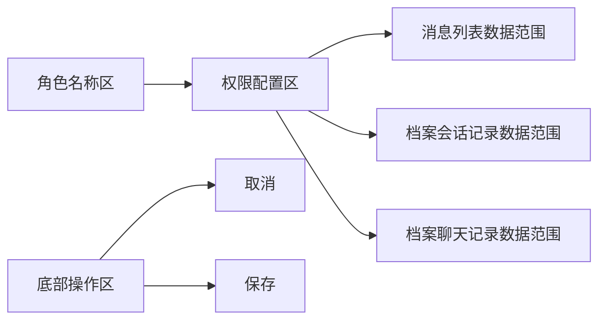
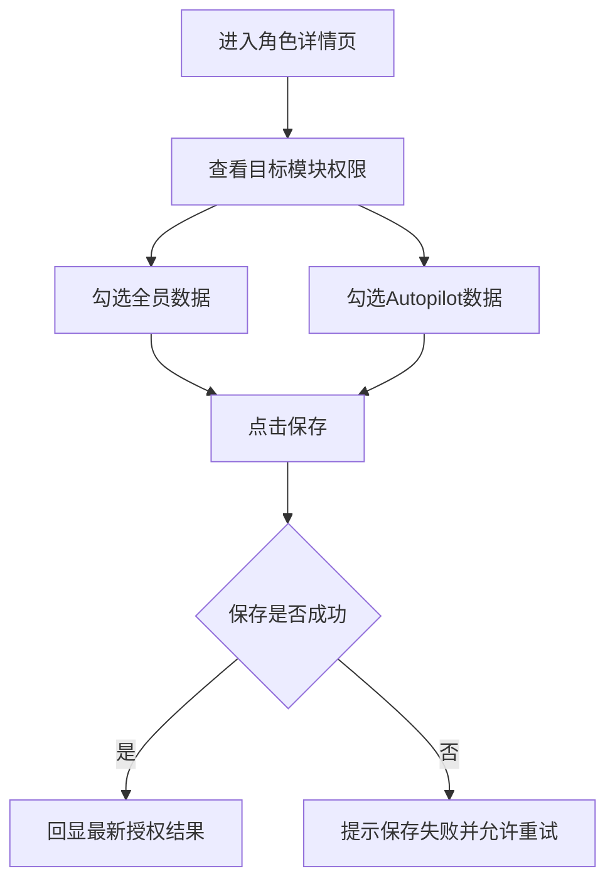
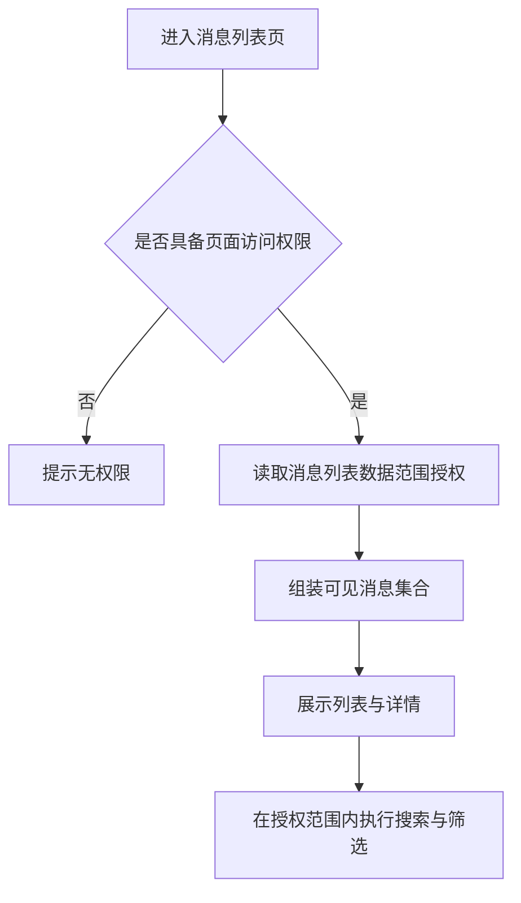
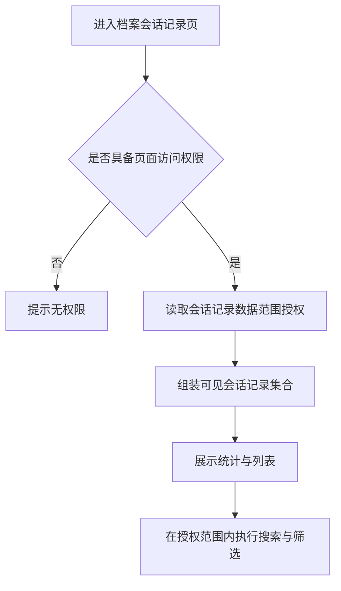

# 1 背景与目标

## 1.1 业务背景
**现状痛点：** 当前消息列表、档案会话记录、档案聊天记录均已存在按数据范围控制可见结果的能力，角色详情页也已支持为部分模块配置数据范围。但现有数据范围仍以个人数据、全员数据为主，Autopilot 接待或处理产生的数据尚未形成独立授权维度，导致角色无法只查看 Autopilot 数据，也无法将全员数据与 Autopilot 数据进行并行授权。

**触发原因：** 随着 Autopilot 接待与处理场景增加，团队需要在角色管理中独立控制 Autopilot 数据的查看范围，满足运营、主管、质检等角色对人工数据与 Autopilot 数据分开查看或组合查看的管理需求。

**影响范围：** 影响对象为具备角色管理权限的管理员，以及进入消息列表、档案会话记录、档案聊天记录的后台使用角色。影响页面为角色详情页、消息列表页、档案会话记录页、档案聊天记录页。影响核心流程为角色授权、消息查看、档案查看。

## 1.2 目标

### 1.2.1 建立 Autopilot 数据独立授权能力
**目标描述：** 在角色详情页中，为消息列表、档案会话记录、档案聊天记录分别新增 Autopilot 数据授权项，使后台角色可独立获得 Autopilot 数据查看权限。

**衡量口径：** 管理员进入角色详情页后，可在对应模块下看到 Autopilot 数据授权项，并可完成勾选、保存、回显。

**目标值：** 角色详情页的三个目标模块均支持 Autopilot 数据独立授权，验收通过率达到 100%。

### 1.2.2 支持全员数据与 Autopilot 数据同时授权
**目标描述：** 在同一模块下，全员数据与 Autopilot 数据不再互斥，支持同时选择，满足混合查看场景。

**衡量口径：** 管理员在同一模块下可同时勾选全员数据与 Autopilot 数据，保存后再次进入可正确回显。

**目标值：** 三个目标模块均支持两项同时勾选并保存成功，验收通过率达到 100%。

### 1.2.3 统一消息与档案的数据范围生效口径
**目标描述：** 角色授权保存后，消息列表、档案会话记录、档案聊天记录三处页面按统一口径识别并展示 Autopilot 数据。

**衡量口径：** 同一角色在三个目标页面中看到的数据范围与角色授权一致，且混合归属数据不重复展示。

**目标值：** 三个页面的数据范围一致性验收通过率达到 100%。

## 1.3 验收指标

### 1.3.1 角色授权配置可用性
**指标名称：** 角色授权配置可用性

**计算口径：** 对消息列表、档案会话记录、档案聊天记录三个权限配置点逐一验证：可展示 Autopilot 数据项、可与全员数据同时勾选、可成功保存、可正确回显。

**统计周期：** 需求验收阶段。

**验收阈值：** 三个配置点全部通过。

**数据来源：** 角色详情页验收走查。

### 1.3.2 消息列表范围准确性
**指标名称：** 消息列表范围准确性

**计算口径：** 分别验证仅个人数据、个人数据加全员数据、个人数据加 Autopilot 数据、个人数据加全员数据加 Autopilot 数据四种授权组合下的可见消息范围是否符合预期。

**统计周期：** 需求验收阶段。

**验收阈值：** 四种授权组合全部通过。

**数据来源：** 消息列表页验收走查。

### 1.3.3 档案范围一致性
**指标名称：** 档案范围一致性

**计算口径：** 使用同一角色进入档案会话记录与档案聊天记录页面，验证两页对 Autopilot 数据识别、生效范围、混合数据去重规则是否一致。

**统计周期：** 需求验收阶段。

**验收阈值：** 两个档案页面全部通过。

**数据来源：** 档案会话记录页与档案聊天记录页验收走查。

# 2 角色详情页

## 2.1 页面整体概览
**页面说明：** 角色详情页用于新增角色、编辑角色及查看角色权限。本次需求仅调整消息与档案相关权限区中的数据范围授权能力，不改变页面整体结构。

**页面结构：** 页面由角色名称区、权限配置区、底部操作区组成。权限配置区内包含消息列表、档案会话记录、档案聊天记录三类目标权限项，本次在各自的数据范围位置补充 Autopilot 数据授权。

## 2.2 消息与档案数据范围授权

### 2.2.1 功能定义
**功能描述：** 在角色详情页中，为消息列表、档案会话记录、档案聊天记录分别提供全员数据与 Autopilot 数据授权项，用于控制角色可查看的数据范围。

**用户场景：** 管理员需要为不同角色配置只看人工数据、只看 Autopilot 数据，或同时查看人工数据与 Autopilot 数据的权限范围。

**功能入口与触发方式：** 用户进入设置中的角色详情页，在消息列表、档案会话记录、档案聊天记录对应的权限区域勾选数据范围并保存。

**功能类型：** 修改

**规则依据：** 当前角色详情页已具备数据范围授权能力，消息与档案页面也已存在按数据范围展示结果的业务基础；本次需求在既有授权体系中新增 Autopilot 数据维度，并支持与全员数据并行授权。

### 2.2.2 交互流程
1. 管理员进入角色详情页。
2. 管理员定位到消息列表、档案会话记录、档案聊天记录的权限配置区域。
3. 管理员按模块分别勾选全员数据、Autopilot 数据中的一项或两项。
4. 管理员点击保存。
5. 系统完成权限保存，并在当前页面回显最新勾选状态。
6. 使用该角色的成员进入消息与档案页面后，系统按最新授权结果加载可见数据。

### 2.2.3 前置条件
**登录状态：** 用户已登录后台管理端。

**角色与权限：** 仅具备角色管理权限的用户可编辑该页面。

**前置业务条件：** 系统已存在角色详情页，且消息列表、档案会话记录、档案聊天记录权限项已可配置。

**前置数据条件：** 新增角色或已有角色均可配置本次新增的数据范围。

**默认范围：** 对应模块开通后，个人数据作为基础数据范围继续保留，不在本次需求中新增单独可视化勾选入口。

### 2.2.4 输入规则
**消息列表数据范围：** 复选项，可选值为全员数据、Autopilot 数据；两项支持同时勾选；仅在消息列表权限已开通时生效。

**档案会话记录数据范围：** 复选项，可选值为全员数据、Autopilot 数据；两项支持同时勾选；仅在档案会话记录权限已开通时生效。

**档案聊天记录数据范围：** 复选项，可选值为全员数据、Autopilot 数据；两项支持同时勾选；仅在档案聊天记录权限已开通时生效。

**个人数据：** 作为基础数据范围默认保留，不新增单独勾选项。

**Autopilot 数据：** 指由 Autopilot 接待、回复、分流、跟进或处理过程中产生的数据。

**全员数据：** 指团队内人工客服及成员处理产生的数据，不包含 Autopilot 数据（待确认）。

**数据范围组合：** 同一模块下，全员数据与 Autopilot 数据为独立复选项，不互斥。

### 2.2.5 校验规则
**模块权限依赖校验：** 未开通对应模块权限时，不可单独保存该模块的数据范围授权；提示“请先开启对应模块权限后再配置数据范围”。

**角色信息校验：** 角色详情页的基础信息仍需满足页面原有保存条件，例如角色名称必填。

**重复提交校验：** 管理员点击保存后，保存按钮进入处理中状态，结果返回前不可重复提交。

**失败提示文案：** 保存失败时，提示“保存失败，请稍后重试”，并保留当前勾选状态。

### 2.2.6 业务规则
**授权粒度：** 消息列表、档案会话记录、档案聊天记录三处数据范围独立配置、独立生效。

**基础范围规则：** 对应模块权限开通后，角色默认保留个人数据范围；本次新增授权项用于扩展额外可见范围。

**仅勾选 Autopilot 数据：** 对应模块可见范围为个人数据与 Autopilot 数据的并集。

**仅勾选全员数据：** 对应模块可见范围为个人数据与全员数据的并集。

**同时勾选全员数据与 Autopilot 数据：** 对应模块可见范围为个人数据、全员数据、Autopilot 数据的并集；同一条数据命中多个范围时仅展示一次。

**Autopilot 归属口径：** 只要该消息、会话记录或聊天记录存在 Autopilot 接待或处理行为，即归入 Autopilot 数据范围。

**历史角色兼容：** 已有角色默认延续原有授权结果，不因本次上线自动新增 Autopilot 数据权限。

**历史数据生效：** 角色获得 Autopilot 数据权限后，历史已存在的 Autopilot 数据按新规则即时纳入可见范围。

**权限边界：** 本次仅控制数据可见范围，不新增回复、领取、分配、导出等操作权限。

### 2.2.7 展示与交互状态规则
**展示位置：** Autopilot 数据与全员数据在对应模块的权限行内展示，便于与原有数据范围一并配置。

**状态回显：** 用户进入角色查看页或编辑页时，需按当前角色的真实授权结果回显勾选状态。

**组合展示：** 当全员数据与 Autopilot 数据同时授权时，两项均显示为选中状态。

**只读态：** 在角色详情只读场景下，勾选状态可见但不可修改。

**保存成功反馈：** 保存成功后，提示“保存成功”，并保留当前页面状态。

### 2.2.8 异常处理
**无权限：** 提示“当前账号暂无角色管理权限”，用户可返回角色列表页。

**保存失败：** 提示“保存失败，请稍后重试”，用户可再次点击保存。

**角色信息变更：** 提示“角色信息已更新，请刷新后重试”（待确认），用户可重新进入角色详情页。

**提交超时：** 提示“提交超时，请稍后重试”（待确认），用户可重新提交。

### 2.2.9 后置条件
**角色数据：** 角色的消息列表、档案会话记录、档案聊天记录数据范围授权被成功保存。

**页面生效：** 使用该角色的成员在重新进入或刷新相关页面后，按新授权范围查看数据。

**数据影响：** 本次变更仅影响可见范围，不修改原始消息、会话记录、聊天记录内容。

### 2.2.10 补充条件
**范围一致性：** 同一角色在三个目标页面中应使用同一套 Autopilot 数据识别口径。

**范围边界说明：** 全员数据是否永久排除 Autopilot 数据，需在开发联调前完成最终确认。

# 3 消息列表页

## 3.1 页面整体概览
**页面说明：** 消息列表页用于展示当前角色可处理或可查看的消息会话，页面包含标题区、范围提示区、搜索筛选区、消息列表区、消息详情区。

**页面结构：** 用户进入页面后，系统先按角色授权确定可见消息范围，再将搜索、筛选、统计、列表、详情等能力作用在该范围之内。

## 3.2 数据范围生效

### 3.2.1 功能定义
**功能描述：** 消息列表页根据角色授权结果，将 Autopilot 数据纳入独立的数据范围识别与展示逻辑中。

**用户场景：** 主管或运营角色进入消息列表时，需要只查看 Autopilot 接待会话，或在查看人工消息的同时查看 Autopilot 接待会话。

**功能入口与触发方式：** 用户进入消息列表页，系统自动读取当前角色的数据范围授权并加载列表。

**功能类型：** 查询、列表、修改

**规则依据：** 当前消息列表已按数据范围控制可见消息；本次新增 Autopilot 数据维度后，需要将其纳入同一生效链路。

### 3.2.2 交互流程
1. 用户进入消息列表页。
2. 系统校验当前角色是否具备消息列表访问权限。
3. 系统读取该角色的消息列表数据范围授权。
4. 系统按个人数据、全员数据、Autopilot 数据的并集口径组装可见消息集合。
5. 页面基于可见消息集合展示范围提示、搜索结果、筛选结果、消息列表与消息详情。
6. 用户切换筛选条件或搜索关键字时，仅在已授权的可见消息集合内执行。

### 3.2.3 前置条件
**登录状态：** 用户已登录后台管理端。

**角色与权限：** 用户具备消息列表访问权限。

**前置业务条件：** 当前角色已在角色详情页完成消息列表数据范围配置。

**数据范围来源：** 数据范围以角色详情页保存结果为准。

### 3.2.4 输入规则
**消息列表数据范围：** 非页面手动输入项，由角色授权自动带入；有效状态为个人数据、个人数据加全员数据、个人数据加 Autopilot 数据、个人数据加全员数据加 Autopilot 数据。

**搜索条件：** 沿用页面现有搜索能力，仅在当前角色可见消息范围内生效。

**筛选条件：** 沿用页面现有筛选能力，仅在当前角色可见消息范围内生效。

**Autopilot 数据：** 指由 Autopilot 接待或处理产生的消息会话数据。

### 3.2.5 校验规则
**访问权限校验：** 不具备消息列表访问权限时，不允许进入页面数据查看流程。

**数据范围校验：** 未额外开通全员数据或 Autopilot 数据时，页面仅展示个人数据。

**搜索范围校验：** 搜索结果不得超出当前角色已授权的消息范围。

**筛选范围校验：** 筛选结果、计数结果、列表结果均不得超出当前角色已授权的消息范围。

### 3.2.6 业务规则
**个人数据口径：** 指当前用户本人负责、本人参与或归属于本人的消息数据。

**全员数据口径：** 指团队内人工客服及成员处理产生的消息数据，不包含 Autopilot 数据（待确认）。

**Autopilot 数据口径：** 指由 Autopilot 接待、回复、跟进、分流或处理过的消息数据。

**混合归属规则：** 同一条消息会话若同时存在人工处理与 Autopilot 处理痕迹，则同时归属于全员数据与 Autopilot 数据；页面列表中仅展示一次。

**范围并集规则：** 页面可见消息集合按个人数据与已授权扩展范围的并集生成。

**统计联动规则：** 页面中的会话数量、筛选数量、搜索结果数量等均以可见消息集合为统计基础。

**详情联动规则：** 用户仅可打开当前可见消息集合中的详情内容。

**权限边界：** 本次仅影响数据可见范围，不改变回复、转接、关闭、标记等操作权限。

### 3.2.7 展示与交互状态规则
**范围提示：** 若页面顶部存在数据范围提示区，则需按当前角色的实际授权结果展示对应范围说明。

**列表展示：** 页面仅展示当前角色有权查看的消息会话。

**空态展示：** 当前授权范围内无消息时，展示空态提示，用户可调整筛选条件或返回其他模块。

**加载态展示：** 页面首次加载或切换条件时，列表区域展示加载态。

**局部刷新：** 搜索或筛选变化时，仅刷新当前可见消息列表与相关统计区域。

### 3.2.8 异常处理
**无权限：** 提示“当前账号暂无消息查看权限”，用户可返回上一级页面。

**加载失败：** 提示“消息加载失败，请稍后重试”，用户可点击重试或刷新页面。

**请求超时：** 提示“加载超时，请稍后重试”（待确认），用户可刷新页面。

**数据变化：** 当当前选中消息已不在授权范围内时，提示“当前消息已不可查看”（待确认），并返回列表态。

### 3.2.9 后置条件
**数据结果：** 页面完成当前角色可见消息集合的加载与展示。

**详情结果：** 消息详情区仅展示当前角色有权限查看的消息内容。

**统计结果：** 页面统计、筛选结果、搜索结果与当前授权范围保持一致。

### 3.2.10 补充条件
**历史数据兼容：** 历史已存在的 Autopilot 消息数据在角色获得授权后纳入当前页面可见范围。

**页面一致性：** 消息列表页对 Autopilot 数据的识别口径应与档案页面保持一致。

# 4 档案会话记录页

## 4.1 页面整体概览
**页面说明：** 档案会话记录页用于查看已沉淀的会话记录，页面包含标题区、范围提示区、统计区、筛选区、会话记录列表区及相关详情区。

**页面结构：** 用户进入页面后，系统先确定当前角色可查看的会话记录范围，再基于该范围生成统计、筛选和会话记录列表。

## 4.2 数据范围生效

### 4.2.1 功能定义
**功能描述：** 档案会话记录页根据角色授权结果，支持独立识别并展示 Autopilot 接待或处理产生的会话记录数据。

**用户场景：** 主管、质检、运营等角色进入档案会话记录页时，需要单独查看 Autopilot 会话记录，或将人工会话记录与 Autopilot 会话记录合并查看。

**功能入口与触发方式：** 用户进入档案会话记录页，系统自动读取当前角色的会话记录数据范围授权并加载数据。

**功能类型：** 查询、列表、修改

**规则依据：** 当前档案会话记录页已存在按数据范围控制可见结果的能力，本次新增 Autopilot 数据授权后，需要在该页统一生效。

### 4.2.2 交互流程
1. 用户进入档案会话记录页。
2. 系统校验当前角色是否具备会话记录访问权限。
3. 系统读取该角色的会话记录数据范围授权。
4. 系统按个人数据、全员数据、Autopilot 数据的并集口径组装可见会话记录集合。
5. 页面基于可见会话记录集合展示统计、筛选结果、列表及详情内容。
6. 用户执行搜索或筛选时，仅在当前授权范围内生效。

### 4.2.3 前置条件
**登录状态：** 用户已登录后台管理端。

**角色与权限：** 用户具备档案会话记录访问权限。

**前置业务条件：** 当前角色已在角色详情页完成档案会话记录数据范围配置。

**数据范围来源：** 数据范围以角色详情页保存结果为准。

### 4.2.4 输入规则
**会话记录数据范围：** 非页面手动输入项，由角色授权自动带入；有效状态为个人数据、个人数据加全员数据、个人数据加 Autopilot 数据、个人数据加全员数据加 Autopilot 数据。

**搜索条件：** 沿用页面现有搜索能力，仅在当前角色可见会话记录范围内生效。

**筛选条件：** 沿用页面现有筛选能力，仅在当前角色可见会话记录范围内生效。

**Autopilot 数据：** 指由 Autopilot 接待或处理产生的会话记录数据。

### 4.2.5 校验规则
**访问权限校验：** 不具备档案会话记录访问权限时，不允许进入页面数据查看流程。

**数据范围校验：** 未额外开通全员数据或 Autopilot 数据时，页面仅展示个人数据。

**搜索范围校验：** 搜索结果不得超出当前角色已授权的会话记录范围。

**筛选范围校验：** 统计结果、筛选结果、列表结果均不得超出当前角色已授权的会话记录范围。

### 4.2.6 业务规则
**个人数据口径：** 指当前用户本人负责、本人参与或归属于本人的会话记录数据。

**全员数据口径：** 指团队内人工客服及成员处理产生的会话记录数据，不包含 Autopilot 数据（待确认）。

**Autopilot 数据口径：** 指由 Autopilot 接待、回复、跟进、分流或处理过的会话记录数据。

**混合归属规则：** 同一条会话记录若同时存在人工处理与 Autopilot 处理痕迹，则同时归属于全员数据与 Autopilot 数据；页面列表中仅展示一次。

**范围并集规则：** 页面可见会话记录集合按个人数据与已授权扩展范围的并集生成。

**统计联动规则：** 页面中的总会话数、状态统计、筛选计数等均以可见会话记录集合为统计基础。

**详情联动规则：** 用户仅可查看当前可见会话记录集合中的详情内容。

**统一口径规则：** Autopilot 会话记录的可见性以本次新增的 Autopilot 数据授权为统一判断依据；是否仍受其他业务动作权限影响，需在联调前最终确认。

**权限边界：** 本次仅影响会话记录可见范围，不新增领取、分配、恢复、导出等操作权限。

### 4.2.7 展示与交互状态规则
**范围提示：** 若页面顶部存在数据范围提示区，则需按当前角色的实际授权结果展示对应范围说明。

**列表展示：** 页面仅展示当前角色有权查看的会话记录。

**统计展示：** 统计卡片仅基于当前角色可见的会话记录计算。

**空态展示：** 当前授权范围内无会话记录时，展示空态提示，用户可调整筛选条件。

**加载态展示：** 页面首次加载或切换条件时，列表区域与统计区域展示加载态。

### 4.2.8 异常处理
**无权限：** 提示“当前账号暂无会话记录查看权限”，用户可返回上一级页面。

**加载失败：** 提示“会话记录加载失败，请稍后重试”，用户可点击重试或刷新页面。

**请求超时：** 提示“加载超时，请稍后重试”（待确认），用户可刷新页面。

**数据变化：** 当前选中记录已不在授权范围内时，提示“当前会话记录已不可查看”（待确认），并返回列表态。

### 4.2.9 后置条件
**数据结果：** 页面完成当前角色可见会话记录集合的加载与展示。

**统计结果：** 页面统计、筛选结果、搜索结果与当前授权范围保持一致。

**详情结果：** 记录详情区仅展示当前角色有权限查看的内容。

### 4.2.10 补充条件
**历史数据兼容：** 历史已存在的 Autopilot 会话记录在角色获得授权后纳入当前页面可见范围。

**页面一致性：** 档案会话记录页对 Autopilot 数据的识别口径应与消息列表页、档案聊天记录页保持一致。

# 5 档案聊天记录页

## 5.1 页面整体概览
**页面说明：** 档案聊天记录页用于查看已沉淀的聊天记录，页面包含标题区、范围提示区、统计区、筛选区、聊天记录列表区及详情区。

**页面结构：** 用户进入页面后，系统先确定当前角色可查看的聊天记录范围，再基于该范围生成统计、筛选和聊天记录列表。

## 5.2 数据范围生效

### 5.2.1 功能定义
**功能描述：** 档案聊天记录页根据角色授权结果，支持独立识别并展示由 Autopilot 接待或处理产生的聊天记录数据。

**用户场景：** 主管、质检、运营等角色进入档案聊天记录页时，需要单独查看 Autopilot 聊天记录，或将人工聊天记录与 Autopilot 聊天记录合并查看。

**功能入口与触发方式：** 用户进入档案聊天记录页，系统自动读取当前角色的聊天记录数据范围授权并加载数据。

**功能类型：** 查询、列表、修改

**规则依据：** 当前档案聊天记录页已存在按数据范围控制可见结果的能力，本次新增 Autopilot 数据授权后，需要在该页统一生效。

### 5.2.2 交互流程
1. 用户进入档案聊天记录页。
2. 系统校验当前角色是否具备聊天记录访问权限。
3. 系统读取该角色的聊天记录数据范围授权。
4. 系统按个人数据、全员数据、Autopilot 数据的并集口径组装可见聊天记录集合。
5. 页面基于可见聊天记录集合展示统计、筛选结果、列表及详情内容。
6. 用户执行搜索或筛选时，仅在当前授权范围内生效。

### 5.2.3 前置条件
**登录状态：** 用户已登录后台管理端。

**角色与权限：** 用户具备档案聊天记录访问权限。

**前置业务条件：** 当前角色已在角色详情页完成档案聊天记录数据范围配置。

**数据范围来源：** 数据范围以角色详情页保存结果为准。

### 5.2.4 输入规则
**聊天记录数据范围：** 非页面手动输入项，由角色授权自动带入；有效状态为个人数据、个人数据加全员数据、个人数据加 Autopilot 数据、个人数据加全员数据加 Autopilot 数据。

**搜索条件：** 沿用页面现有搜索能力，仅在当前角色可见聊天记录范围内生效。

**筛选条件：** 沿用页面现有筛选能力，仅在当前角色可见聊天记录范围内生效。

**Autopilot 数据：** 指由 Autopilot 接待或处理产生的聊天记录数据。

### 5.2.5 校验规则
**访问权限校验：** 不具备档案聊天记录访问权限时，不允许进入页面数据查看流程。

**数据范围校验：** 未额外开通全员数据或 Autopilot 数据时，页面仅展示个人数据。

**搜索范围校验：** 搜索结果不得超出当前角色已授权的聊天记录范围。

**筛选范围校验：** 统计结果、筛选结果、列表结果均不得超出当前角色已授权的聊天记录范围。

### 5.2.6 业务规则
**个人数据口径：** 指当前用户本人负责、本人参与或归属于本人的聊天记录数据。

**全员数据口径：** 指团队内人工客服及成员处理产生的聊天记录数据，不包含 Autopilot 数据（待确认）。

**Autopilot 数据口径：** 指由 Autopilot 接待、回复、跟进、分流或处理过的聊天记录数据。

**混合归属规则：** 同一条聊天记录若同时存在人工处理与 Autopilot 处理痕迹，则同时归属于全员数据与 Autopilot 数据；页面列表中仅展示一次。

**范围并集规则：** 页面可见聊天记录集合按个人数据与已授权扩展范围的并集生成。

**统计联动规则：** 页面中的聊天数、单聊数、群聊数、状态统计等均以可见聊天记录集合为统计基础。

**详情联动规则：** 用户仅可查看当前可见聊天记录集合中的详情内容。

**权限边界：** 本次仅影响聊天记录可见范围，不新增编辑、导出、恢复等操作权限。

### 5.2.7 展示与交互状态规则
**范围提示：** 若页面顶部存在数据范围提示区，则需按当前角色的实际授权结果展示对应范围说明。

**列表展示：** 页面仅展示当前角色有权查看的聊天记录。

**统计展示：** 统计卡片仅基于当前角色可见的聊天记录计算。

**空态展示：** 当前授权范围内无聊天记录时，展示空态提示，用户可调整筛选条件。

**加载态展示：** 页面首次加载或切换条件时，列表区域与统计区域展示加载态。

### 5.2.8 异常处理
**无权限：** 提示“当前账号暂无聊天记录查看权限”，用户可返回上一级页面。

**加载失败：** 提示“聊天记录加载失败，请稍后重试”，用户可点击重试或刷新页面。

**请求超时：** 提示“加载超时，请稍后重试”（待确认），用户可刷新页面。

**数据变化：** 当前选中记录已不在授权范围内时，提示“当前聊天记录已不可查看”（待确认），并返回列表态。

### 5.2.9 后置条件
**数据结果：** 页面完成当前角色可见聊天记录集合的加载与展示。

**统计结果：** 页面统计、筛选结果、搜索结果与当前授权范围保持一致。

**详情结果：** 记录详情区仅展示当前角色有权限查看的内容。

### 5.2.10 补充条件
**历史数据兼容：** 历史已存在的 Autopilot 聊天记录在角色获得授权后纳入当前页面可见范围。

**页面一致性：** 档案聊天记录页对 Autopilot 数据的识别口径应与消息列表页、档案会话记录页保持一致。
