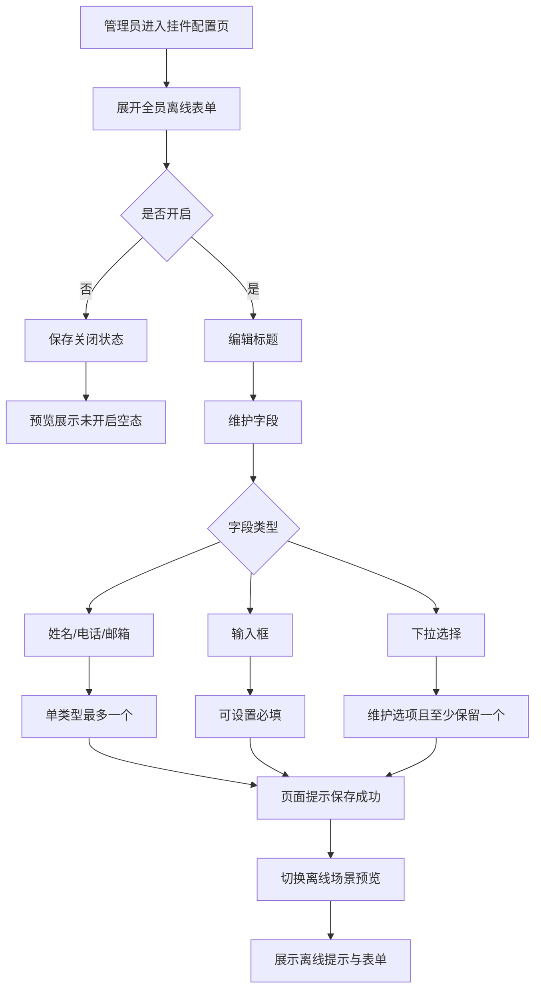

1 背景与目标

## 1.1 业务背景

**业务背景：** 当前聊天挂件自定义页已提供“全员离线表单”配置能力，用于在全部客服不在线时，引导访客填写联系方式与问题，避免访客因无人接待直接流失。

**现状痛点：** 现有能力已覆盖开启开关、表单标题、字段配置、必填设置、下拉选项维护与离线场景预览，但关于访客提交后的会话流转、通知机制、数据归属尚未形成完整业务口径，评审时容易出现配置侧与承接侧边界不清的问题。

**影响范围：** 影响对象为负责聊天挂件装修配置的运营/管理员角色，以及在客服全员离线场景下访问聊天挂件的访客。影响页面为设置-安装-网页-自定义中的挂件配置页与对应预览区域。

## 1.2 目标

**目标1：** 让运营/管理员可在单一配置区域内完成全员离线表单的开启、关闭、标题维护、字段维护与离线预览。

**衡量口径：** 在同一功能区内完成上述配置，无需跳转其他页面。

**目标值或期望区间：** 100% 支持。

**目标2：** 让访客在客服全员离线场景下看到清晰的离线提示与可填写表单，能够留下联系方式与问题。

**衡量口径：** 离线场景下展示离线提示、表单标题、字段列表与提交按钮；关闭功能时展示关闭空态。

**目标值或期望区间：** 100% 支持。

**目标3：** 控制表单配置质量，避免重复添加关键联系字段、避免下拉字段被配置成无可选项状态。

**衡量口径：** 单实例字段不可重复添加；下拉字段至少保留 1 个选项。

**目标值或期望区间：** 100% 生效。

## 1.3 验收指标

**指标名称：** 配置闭环完整性。

**计算口径：** 管理员进入全员离线表单配置区后，可依次完成功能开关、标题编辑、字段新增、字段删除、必填设置、下拉选项维护、预览查看，并在每次操作后收到成功反馈。

**统计周期：** 单次验收。

**验收阈值：** 全链路可完成，且每步均有明确页面反馈。

**数据来源：** 当前挂件自定义页现状与页面交互验收。

**指标名称：** 关键字段唯一性控制。

**计算口径：** 姓名、电话、邮箱三类字段在单份全员离线表单中最多各存在 1 次。

**统计周期：** 单次验收。

**验收阈值：** 任一关键字段均不可被重复添加。

**数据来源：** 当前挂件自定义页现状与页面交互验收。

**指标名称：** 下拉字段可用性。

**计算口径：** 任一离线表单下拉字段均至少保留 1 个选项。

**统计周期：** 单次验收。

**验收阈值：** 不允许删除至 0 个选项。

**数据来源：** 当前挂件自定义页现状与页面交互验收。

## 2 全员离线表单

### 2.1 功能定义

**功能描述：** 全员离线表单用于在全部客服离线时，向访客展示离线说明与信息收集表单，帮助访客留下联系方式和问题内容，便于后续跟进。

**用户场景：** 运营/管理员在挂件装修页配置离线表单内容；访客在客服全员离线时查看并填写表单。

**功能入口与触发方式：** 运营/管理员进入设置-安装-网页-自定义中的挂件配置页，展开“全员离线表单”功能区后进行配置；访客端在客服全员离线场景下自动触发表单展示。

**目标用户/角色：** 运营、管理员、访客。

**功能类型：** 修改。

**输出结果：** 生成一套可在客服全员离线场景下展示的表单配置，包含开关状态、标题、字段、必填规则、下拉选项与离线预览表现。

**规则依据：** 当前页面现状已支持全员离线表单的开关、标题维护、字段维护、下拉选项维护与离线预览。

### 2.2 交互流程

**主流程：**

1. 运营/管理员进入挂件配置页，展开“全员离线表单”功能区。
2. 运营/管理员通过开关决定是否启用全员离线表单。
3. 开启后，运营/管理员编辑表单标题，并对字段进行新增、删除、必填设置及下拉选项维护。
4. 每次配置动作完成后，页面立即给出“保存成功”反馈。
5. 运营/管理员切换到离线场景预览时，页面展示离线提示语、离线场景标识、表单标题、字段列表与提交按钮。
6. 若功能关闭，预览区展示“全员离线表单未开启”空态说明。

**分支流程：**

1. 当运营/管理员尝试重复添加“姓名/电话/邮箱”字段时，页面不新增该字段。
2. 当运营/管理员删除字段时，需先进行二次确认，确认后才删除。
3. 当运营/管理员删除下拉选项且当前仅剩 1 个选项时，删除动作不可执行。

**异常流程：**

1. 访客提交后的会话创建、消息通知、数据落库与后续跟进路径当前未明确，相关承接流程为`（待确认）`。

### 2.3 前置条件

**登录状态：** 需由已进入系统后台的运营/管理员执行配置；访客侧是否需要登录后才能提交离线表单为`（待确认）`。

**角色与权限：** 具备挂件装修配置权限的角色可操作该功能；更细粒度的角色差异为`（待确认）`。

**前置业务条件：** 需已进入设置-安装-网页-自定义中的挂件配置页，并可展开“全员离线表单”区域。

**依赖配置或前序步骤：** 离线预览依赖聊天挂件预览区正常展示；访客真实表单提交后的承接配置依赖项为`（待确认）`。

### 2.4 输入规则

**全员离线表单开关：** 开关输入，支持开启/关闭两种状态；默认值为开启。

**表单标题：** 文本输入，按当前语言分别维护；默认值为“当前客服均不在线，请留下您的联系方式和问题，我们会尽快联系您。”；字符上限、是否允许输入空字符串为`（待确认）`。

**表单字段：** 支持维护字段列表；默认包含姓名、电话、邮箱、问题 4 个字段。

**姓名字段：** 字段类型固定为姓名；默认存在；默认必填；在同一份表单中仅允许存在 1 个。

**电话字段：** 字段类型固定为电话；默认存在；默认必填；在同一份表单中仅允许存在 1 个。

**邮箱字段：** 字段类型固定为邮箱；默认存在；默认非必填；在同一份表单中仅允许存在 1 个。

**问题字段：** 字段类型为输入框；默认存在；默认必填；是否允许删除为当前支持，删除后的最少字段数限制为`（待确认）`。

**新增字段类型：** 支持从“姓名、电话、邮箱、输入框、下拉选择”中新增字段。

**字段标题：** 当前页面展示为固定字段名称；是否支持管理员直接改写字段名称为`（待确认）`。

**字段占位文本：** 文本输入，按当前语言分别维护；默认随字段类型带出预设文案；字符上限与禁用字符规则为`（待确认）`。

**字段必填状态：** 复选输入，支持“必填/非必填”两种状态；姓名、电话默认必填，邮箱默认非必填，输入框默认非必填，问题字段当前默认必填。

**下拉选择字段：** 新增时默认带 1 个选项；字段默认非必填。

**下拉选项：** 文本输入，按当前语言分别维护；默认以“选项一/选项二...”规则生成；字符上限、排序规则与是否支持拖拽排序为`（待确认）`。

### 2.5 校验规则

**全员离线表单开关：** 开关切换后立即生效并保存；若保存失败时的提示文案与回滚方式为`（待确认）`。

**姓名字段：** 不可重复添加；重复添加时，页面不新增该字段。

**电话字段：** 不可重复添加；重复添加时，页面不新增该字段。

**邮箱字段：** 不可重复添加；重复添加时，页面不新增该字段。

**字段删除：** 删除任一字段前均需二次确认；确认文案为“确定删除该字段吗？”；用户可执行动作为“取消”或“确定”。

**下拉选项删除：** 当下拉字段仅剩 1 个选项时，不允许继续删除；删除按钮置为不可执行状态。

**表单标题：** 是否允许为空、为空后的保存提示文案为`（待确认）`。

**字段占位文本：** 是否允许为空、为空后的保存提示文案为`（待确认）`。

**访客提交：** 访客提交时各字段的前台校验规则、错误提示文案及提交失败后的可执行动作均为`（待确认）`。

### 2.6 业务规则

**默认生成规则：** 全员离线表单默认开启，并默认生成“姓名、电话、邮箱、问题”4 个字段及一条默认表单标题。

**字段新增规则：** 运营/管理员选择字段类型后，系统立即在字段列表中新增对应字段，并同步保存。

**字段删除规则：** 运营/管理员确认删除后，系统从字段列表中移除对应字段，并同步保存。

**字段修改规则：** 运营/管理员修改表单标题、字段占位文本、必填状态、下拉选项内容后，系统同步保存。

**下拉选项新增规则：** 运营/管理员点击添加选项后，系统在当前下拉字段下新增 1 个默认命名选项，并同步保存。

**下拉选项删除规则：** 运营/管理员删除可删选项后，系统从当前下拉字段中移除对应选项，并同步保存。

**唯一性规则：** 姓名、电话、邮箱属于单实例字段，每类字段在同一份全员离线表单中最多存在 1 个。

**语言规则：** 表单标题、字段占位文本、下拉选项文本按当前语言分别维护；跨语言是否自动回填或兜底展示为`（待确认）`。

**预览联动规则：** 离线场景预览区按当前配置实时映射标题、字段、必填标识与下拉/输入框展示样式。

**访客承接规则：** 访客成功提交后是否创建新会话、是否进入消息列表、是否写入档案、是否触发客服跟进均为`（待确认）`。

### 2.7 展示与交互状态规则

**功能区展示规则：** 当开关关闭时，功能区仅展示功能标题、说明与开关，不展示表单标题和字段配置区。

**开启态展示规则：** 当开关开启且功能区展开时，展示表单标题输入区、字段列表、字段新增入口与下拉选项编辑区。

**离线预览展示规则：** 在离线场景预览下，页面先展示离线提示消息，再展示带“客服全员离线”标识的表单卡片。

**表单卡片展示规则：** 表单卡片展示表单标题、字段标签、必填星标、字段占位内容与提交按钮。

**空态展示规则：** 当全员离线表单关闭时，预览区展示“全员离线表单未开启”标题及“开启后，当全部客服离线时，访客可先留下联系方式与问题，我们会在客服上线后继续跟进。”说明。

**成功反馈规则：** 每次配置动作完成后，页面以提示文案“保存成功”反馈结果。

**删除确认展示规则：** 点击字段删除按钮后，在该字段位置展示确认浮层；点击取消后关闭浮层且不删除。

**禁用态展示规则：** 当下拉字段仅剩 1 个选项时，该选项的删除按钮展示为不可执行状态。

**隐藏态规则：** 离线预览标识仅在离线场景预览时显示，非离线场景不显示该标识。

### 2.8 异常处理

**无数据：** 当功能关闭时，预览区不展示表单内容，改为展示“全员离线表单未开启”空态；用户可执行动作为重新开启功能。

**删除误操作：** 当运营/管理员误点删除按钮时，页面先展示“确定删除该字段吗？”确认层；用户可执行动作为点击“取消”中止删除。

**最小选项约束：** 当下拉字段仅剩 1 个选项时，页面不允许继续删除；用户可执行动作为保留当前选项或先新增新选项后再调整。

**重复新增关键字段：** 当运营/管理员尝试再次新增姓名、电话、邮箱字段时，页面不执行新增；是否需要显式提示文案为`（待确认）`；用户可执行动作为改为新增其他字段类型或编辑现有字段。

**保存失败：** 配置保存失败时的提示文案、是否自动重试、是否回滚页面状态均为`（待确认）`；用户可执行动作为`（待确认）`。

**无权限：** 无权限角色是否可见该配置区、可见后的提示文案与跳转方式为`（待确认）`。

**重复提交：** 访客提交离线表单时是否需要防重复提交、重复提交提示文案与限制时长为`（待确认）`。

**超时或中断：** 访客或管理员操作中断后的数据恢复策略、重新进入页面后的草稿保留策略为`（待确认）`。

### 2.9 后置条件

**配置结果：** 全员离线表单的开启状态、标题、字段、必填规则与下拉选项被保存为当前挂件配置的一部分。

**页面结果：** 当前页面保留最新配置结果，预览区按最新配置重新展示。

**反馈结果：** 配置成功后页面提示“保存成功”。

**数据归属：** 配置数据归属当前挂件或当前网站安装项；更精确的数据归属粒度为`（待确认）`。

**访客提交结果：** 访客提交后的数据存储位置、是否写入访客档案、是否进入消息列表、是否关联会话与操作日志均为`（待确认）`。

**通知结果：** 是否向客服、管理员或其他角色发送通知及通知方式为`（待确认）`。

### 2.10 补充条件

**范围边界：** 本期已确认范围仅包含功能开关、表单标题、字段配置、字段增删改、必填设置、下拉选项维护、离线场景预览。

**架构外能力：** 访客提交后的会话流转、通知机制、数据去向不在本次已确认范围内，统一标记为`（待确认）`。

**兼容策略：** 历史已配置离线表单在本期规则下的兼容方式、迁移策略与默认补齐规则为`（待确认）`。

**数量限制：** 表单字段最大数量、下拉选项最大数量、各文本输入最大长度均为`（待确认）`。

**排序能力：** 当前字段区视觉上存在拖拽手柄，但是否支持正式排序能力及排序后的生效规则为`（待确认）`。
