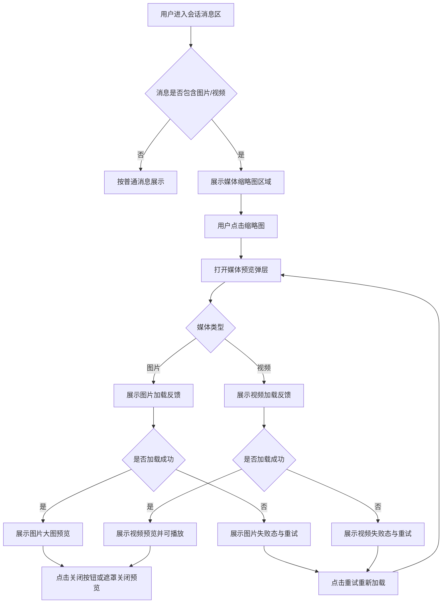

1 背景与目标

## 1.1 业务背景

**业务背景：** 当前工作台会话消息区已支持在消息正文中展示图片和视频媒体内容，用户可通过媒体缩略图进入预览弹层查看大图或播放视频。

**现状痛点：** 当前媒体预览能力虽已覆盖图片缩略图、视频缩略图、预览弹层、加载提示、失败重试与关闭操作，但图片与视频在缩略图表现、视频加载反馈、失败兜底和预览弹层观感上仍存在统一优化空间。

**触发原因：** 本次需求用于优化会话消息中图片、视频媒体的查看效果，提升客服在查看媒体类消息时的识别效率、等待感知和失败恢复体验。

**影响范围：** 影响对象为已登录工作台的客服、管理员；影响区域为工作台会话消息区中带图片或视频的消息内容及其对应预览弹层。

## 1.2 目标

**目标1：** 优化消息内图片、视频缩略图的展示效果，让用户更直观地区分媒体类型并快速进入预览。

**衡量口径：** 包含图片或视频的消息均能展示清晰的媒体缩略图区域，视频媒体有明确的视频识别标识与播放提示。

**目标值或期望区间：** 100% 支持。

**目标2：** 优化视频媒体在缩略图和预览弹层中的加载反馈，减少用户对“是否正在加载”的判断成本。

**衡量口径：** 视频缩略图加载中、视频预览加载中均有明确反馈，加载成功后能顺利进入可观看状态，加载失败后能进入失败态。

**目标值或期望区间：** 100% 支持。

**目标3：** 优化图片、视频预览失败后的恢复路径，确保用户可继续尝试查看媒体内容。

**衡量口径：** 预览失败后展示明确失败态与重试入口；用户可通过重试重新发起加载。

**目标值或期望区间：** 100% 支持。

**目标4：** 优化媒体预览弹层的查看与关闭体验，保证用户可以稳定进入和退出预览。

**衡量口径：** 用户可通过点击缩略图进入预览，并通过关闭按钮或点击遮罩关闭预览。

**目标值或期望区间：** 100% 支持。

## 1.3 验收指标

**指标名称：** 媒体缩略图展示完整性。

**计算口径：** 会话消息中包含图片或视频媒体时，页面展示对应媒体缩略图区域；单条媒体消息与多媒体消息均能正常展示。

**统计周期：** 单次验收。

**验收阈值：** 缩略图区域展示正常，可点击进入预览。

**数据来源：** 工作台会话消息区交互验收。

**指标名称：** 视频加载反馈有效性。

**计算口径：** 视频缩略图加载中与视频预览加载中均有明确加载反馈；加载成功后进入可播放状态；超时或失败后进入失败态。

**统计周期：** 单次验收。

**验收阈值：** 加载、成功、失败三类状态均可明确识别。

**数据来源：** 工作台会话消息区交互验收。

**指标名称：** 失败恢复可用性。

**计算口径：** 图片或视频预览失败后，页面展示失败文案与重试入口；用户点击重试后可重新发起预览加载。

**统计周期：** 单次验收。

**验收阈值：** 重试入口可见且可操作。

**数据来源：** 工作台会话消息区交互验收。

**指标名称：** 预览关闭有效性。

**计算口径：** 用户进入媒体预览后，可通过关闭按钮或点击遮罩关闭预览。

**统计周期：** 单次验收。

**验收阈值：** 两种关闭方式均可生效。

**数据来源：** 工作台会话消息区交互验收。

## 2 图片/视频预览效果优化

### 2.1 功能定义

**功能描述：** 图片/视频预览效果优化用于提升工作台会话消息内媒体内容的缩略图呈现、视频加载反馈、预览弹层查看效果和失败恢复体验。

**用户场景：** 客服或管理员在处理会话时查看包含图片、视频的消息，希望快速识别媒体类型、顺利进入预览、在加载较慢或失败时获得明确反馈，并能稳定关闭预览返回当前会话。

**功能入口与触发方式：** 用户在会话消息区点击图片或视频缩略图后，进入对应媒体预览弹层。

**目标用户/角色：** 已登录工作台的客服、管理员。

**功能类型：** 修改。

**输出结果：** 会话消息中的图片、视频媒体获得统一优化后的缩略图效果、加载状态反馈、失败重试入口与预览弹层查看体验。

**规则依据：** 当前工作台会话消息区已支持媒体缩略图、视频加载中提示、媒体预览弹层、失败重试与关闭操作。

### 2.2 交互流程

**主流程：**

1. 用户进入工作台会话消息区。
2. 系统在包含媒体的消息中展示图片或视频缩略图区域。
3. 用户点击任一图片或视频缩略图。
4. 系统打开媒体预览弹层，并根据媒体类型进入对应预览流程。
5. 若为图片，系统展示加载反馈，加载成功后展示大图预览。
6. 若为视频，系统展示视频加载反馈，加载成功后展示视频预览并进入可播放状态。
7. 用户查看完成后，可点击关闭按钮或点击遮罩关闭预览，返回当前会话消息区。

**分支流程：**

1. 当视频缩略图仍在加载时，缩略图区域展示视频加载中反馈。
2. 当视频缩略图加载完成后，缩略图区域展示视频标识和播放提示。
3. 当视频自动播放受浏览器限制时，系统仍展示视频预览，允许用户手动播放。
4. 当媒体缩略图封面缺失或加载失败时，缩略图区域展示占位样式。

**异常流程：**

1. 当图片预览加载失败时，预览弹层展示“图片预览失败”提示和重试入口。
2. 当视频预览加载失败时，预览弹层展示“加载失败”提示和重试入口。
3. 当视频加载超过预设超时时间仍未完成时，系统进入失败态。

### 2.3 前置条件

**登录状态：** 用户需已登录系统并进入工作台。

**角色与权限：** 当前已确认可进入工作台并查看会话消息的角色可使用该功能；更细粒度的角色差异为`（待确认）`。

**前置业务条件：** 当前会话消息中需存在图片或视频媒体内容。

**依赖配置或前序步骤：** 媒体预览依赖消息内存在可解析的图片或视频资源；其他类型附件的预览能力不在本次已确认范围内。

### 2.4 输入规则

**消息媒体内容：** 当前支持图片和视频两类媒体预览；是否支持更多媒体类型为`（待确认）`。

**图片缩略图：** 图片媒体在消息内以缩略图形式展示；用户点击后进入图片预览弹层。

**视频缩略图：** 视频媒体在消息内以视频缩略图形式展示；用户点击后进入视频预览弹层。

**视频识别标识：** 视频缩略图在非加载状态下展示视频类型标识和播放提示。

**视频加载反馈：** 视频缩略图加载中需展示加载反馈；视频预览弹层加载中也需展示加载反馈。

**媒体占位样式：** 当图片或视频缩略图无法正常展示时，缩略图区域展示对应媒体占位样式。

**预览弹层：** 预览弹层通过点击媒体缩略图打开，支持关闭按钮和遮罩关闭。

**图片预览内容：** 图片预览以等比方式在弹层中完整展示，优先保证主体可见。

**视频预览内容：** 视频预览在弹层中展示播放控件；是否支持倍速、画中画、全屏等更多播放器能力为`（待确认）`。

**失败重试入口：** 图片或视频预览失败后，弹层内展示重试按钮，用户点击后重新发起当前媒体加载。

### 2.5 校验规则

**媒体缩略图点击：** 仅消息中存在图片或视频媒体时，媒体缩略图才可点击进入预览。

**媒体类型匹配：** 用户点击哪一条媒体缩略图，系统就打开对应媒体的预览内容，不允许错位打开其他媒体。

**视频缩略图加载超时：** 视频缩略图加载超过 7 秒仍未完成时，进入失败态并展示占位样式。

**视频预览加载超时：** 视频预览加载超过 7 秒仍未完成时，进入失败态并展示重试入口。

**图片预览失败提示：** 图片预览失败时，失败文案为“图片预览失败”。

**视频预览失败提示：** 视频预览失败时，失败文案为“加载失败”。

**失败重试：** 用户点击重试后，系统重新进入加载态并重新发起当前媒体预览加载。

**关闭操作：** 用户点击关闭按钮或遮罩后，系统立即关闭预览弹层，不需要二次确认。

### 2.6 业务规则

**媒体识别规则：** 系统从消息正文中识别图片和视频媒体内容，并将其从正文展示中分离出来，统一展示在媒体缩略图区。

**媒体分类规则：** 图片与视频按不同媒体类型处理，分别进入图片缩略图与视频缩略图展示规则。

**单媒体展示规则：** 当消息内仅包含 1 条媒体时，媒体区域按单媒体样式展示。

**多媒体展示规则：** 当消息内包含多条媒体时，媒体区域按多媒体网格形式展示；是否支持多媒体连续切换浏览为`（待确认）`。

**视频缩略图状态规则：** 视频缩略图存在“加载中 / 已加载 / 加载失败”三类状态。

**预览弹层状态规则：** 媒体预览弹层存在“加载中 / 已加载 / 加载失败”三类状态。

**视频播放规则：** 视频预览默认自动进入播放流程；若浏览器阻止自动播放，系统仍展示视频内容，允许用户手动播放。

**失败恢复规则：** 媒体预览失败后，用户可通过重试按钮继续尝试加载同一媒体内容。

**关闭返回规则：** 用户关闭预览后，返回当前会话消息区，不改变会话内容、消息顺序或当前会话上下文。

### 2.7 展示与交互状态规则

**媒体区域展示规则：** 当消息同时存在正文与媒体时，正文与媒体区域同时展示；当消息仅有媒体时，媒体区域以独立样式展示。

**图片缩略图展示规则：** 图片缩略图优先展示图片本身，支持懒加载。

**视频缩略图展示规则：** 视频缩略图优先展示视频封面；封面缺失或未能正常展示时，以视频占位样式兜底。

**视频加载中展示规则：** 视频缩略图加载中展示加载反馈文案“加载视频预览中...”与加载动效。

**视频非加载态展示规则：** 视频缩略图在非加载状态下展示视频标识和播放提示。

**预览弹层展示规则：** 媒体预览以全局遮罩弹层方式展示，背景为深色遮罩，媒体内容居中展示。

**预览关闭按钮展示规则：** 预览弹层右上方展示关闭按钮，用户可随时关闭预览。

**图片加载中展示规则：** 图片预览加载中时，弹层展示加载中状态。

**视频加载中展示规则：** 视频预览加载中时，弹层展示带遮罩效果的加载中状态。

**失败态展示规则：** 媒体预览失败时，弹层展示失败文案与重试按钮；图片与视频失败态视觉风格可区分。

**媒体内容展示规则：** 图片和视频在弹层中按等比方式展示，不拉伸、不裁切主体。

### 2.8 异常处理

**无媒体内容：** 当消息中不包含图片或视频媒体时，不展示媒体缩略图区；用户继续按普通消息浏览。

**缩略图加载失败：** 当图片或视频缩略图无法正常展示时，缩略图区展示对应占位样式；用户仍可点击该媒体区域尝试进入预览。

**视频缩略图超时：** 当视频缩略图长时间未完成加载时，系统进入失败态并展示视频占位样式；用户可继续点击进入预览查看。

**图片预览失败：** 当图片预览加载失败时，弹层展示“图片预览失败”和重试按钮；用户可执行动作为点击“重试”或关闭弹层。

**视频预览失败：** 当视频预览加载失败时，弹层展示“加载失败”和重试按钮；用户可执行动作为点击“重试”或关闭弹层。

**自动播放受限：** 当视频因浏览器策略无法自动播放时，系统直接展示视频内容并保留播放控件；用户可执行动作为手动点击播放。

**中途关闭：** 当用户在媒体加载过程中关闭预览弹层时，系统立即终止当前预览展示并返回消息区；再次点击缩略图后可重新进入预览。

### 2.9 后置条件

**展示结果：** 用户成功查看图片大图或视频预览，或在失败后看到明确失败态与恢复入口。

**页面结果：** 关闭预览后，用户返回当前会话消息区，页面滚动位置与会话上下文保持不变。

**状态结果：** 当前媒体预览状态以最新一次加载结果为准；若重试成功，预览状态切换为已加载。

**数据结果：** 本功能仅影响媒体展示与预览体验，不修改消息内容本身。

**通知与日志：** 是否记录媒体预览打开、失败、重试等行为日志为`（待确认）`。

### 2.10 补充条件

**范围边界：** 本期已确认范围仅包含图片/视频缩略图展示优化、视频加载反馈优化、预览弹层加载/失败/重试/关闭体验优化。

**非本期范围：** 附件预览、媒体下载、图片缩放、旋转、键盘快捷键、左右切换连续浏览、视频倍速与画中画等能力不在本次已确认范围内，相关规则为`（待确认）`。

**兼容策略：** 历史会话中已存在的图片、视频消息进入工作台后，按本期优化后的预览规则展示。

**适用范围：** 本功能适用于当前工作台会话消息区中展示的图片、视频媒体内容。
