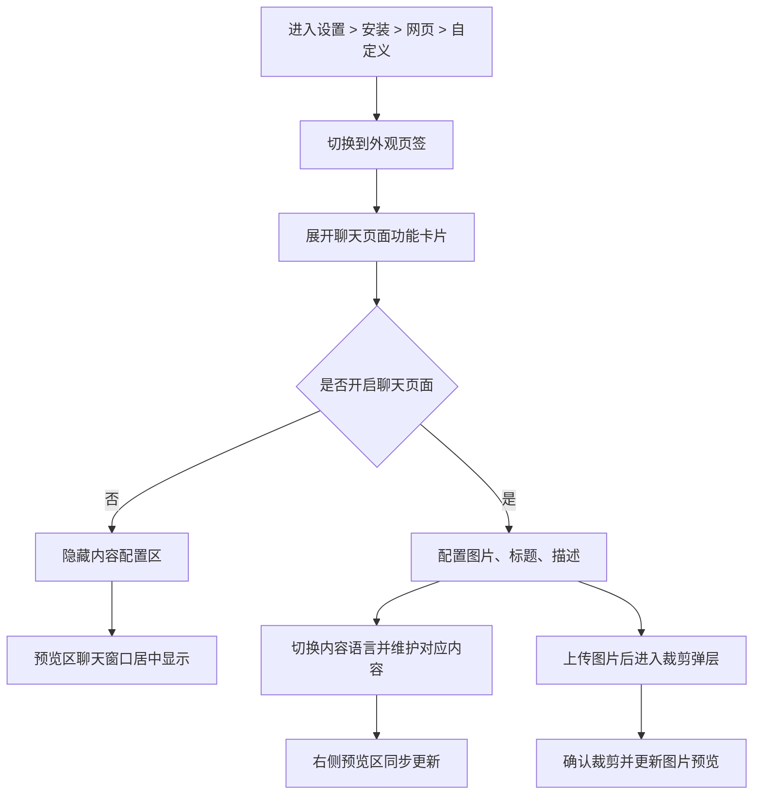

# 1 背景与目标

## 1.1 业务背景
**业务背景：** `web-agent` 已提供“设置 > 安装 > 网页 > 自定义”能力，用于统一维护网页聊天入口、聊天页面展示内容和访客侧聊天体验。

**当前现状：** 在“外观”页签下，系统已提供“聊天页面”功能卡片，用于控制聊天页面左侧品牌介绍区域的展示，并支持维护图片、标题和描述内容。

**核心痛点：** 若聊天页面缺少统一配置入口，品牌展示内容无法集中管理，访客进入聊天页面时也难以获得一致的品牌引导与场景说明。

**触发原因：** 当前产品原型已具备聊天页面开关、图片上传与裁剪、标题与描述维护、多语言切换以及右侧实时预览能力，需要将该功能整理为结构完整、边界清晰的正式需求文档。

**影响范围：** 影响具备网页组件自定义配置权限的后台用户，以及访问网页聊天页面的访客。

## 1.2 目标
**目标1：** 支持后台用户统一配置聊天页面左侧品牌介绍区域的展示内容。

**衡量口径：** 后台用户可通过单一功能入口完成聊天页面开关、图片、标题和描述配置。

**目标值或期望区间：** 聊天页面内容配置主流程可完整走通。

**目标2：** 支持后台用户按语言分别维护聊天页面内容。

**衡量口径：** 后台用户切换内容语言后，可分别维护当前语言下的聊天页面图片、标题和描述。

**目标值或期望区间：** 当前支持语言范围内均可独立配置对应内容。

**目标3：** 支持配置结果在预览区即时反馈，降低上线前反复校验成本。

**衡量口径：** 聊天页面配置项发生有效变更后，右侧预览区同步更新对应展示效果。

**目标值或期望区间：** 配置与预览表现保持一致。

## 1.3 验收指标
**指标名称：** 聊天页面配置可用性

**计算口径：** 后台用户可在“聊天页面”功能卡片内完成开关、图片、标题、描述维护，并获得保存反馈。

**统计周期：** 功能验收阶段

**验收阈值：** 配置主流程无阻断性异常。

**数据来源：** 后台页面操作验证

**指标名称：** 多语言配置可用性

**计算口径：** 后台用户切换不同内容语言后，可查看并编辑对应语言下的聊天页面配置内容。

**统计周期：** 功能验收阶段

**验收阈值：** 当前支持语言下均可独立维护内容。

**数据来源：** 多语言配置验证

**指标名称：** 预览一致性

**计算口径：** 配置图片、标题、描述或聊天页面开关后，右侧聊天页面预览同步展示对应结果。

**统计周期：** 功能验收阶段

**验收阈值：** 预览与配置内容一致。

**数据来源：** 预览区交互验证

# 2 聊天页面

## 2.1 功能定义
**功能描述：** 聊天页面用于配置访客侧聊天页面左侧品牌介绍区域的显示与内容，包括展示开关、图片、标题、描述及其多语言版本，并通过右侧预览区实时呈现最终效果。

**用户场景：** 后台运营人员或客服主管希望在访客进入聊天页面时，展示统一的品牌介绍内容，帮助访客快速理解当前聊天页面的服务入口和品牌身份。

**功能入口与触发方式：** 后台用户进入 `设置 > 安装 > 网页 > 自定义`，切换到“外观”页签，在“聊天页面”功能卡片中进行配置。

**目标用户：** 管理员、具备网页组件自定义配置权限的运营人员或客服主管（待确认）。

**功能价值：** 提升聊天页面品牌一致性与内容可控性，并降低多语言场景下的内容维护成本。

## 2.2 交互流程
**主流程：**

1. **步骤1：** 后台用户进入“设置 > 安装 > 网页 > 自定义”页面。
2. **步骤2：** 后台用户切换到“外观”页签。
3. **步骤3：** 后台用户展开“聊天页面”功能卡片。
4. **步骤4：** 后台用户根据需要开启或关闭聊天页面左侧品牌介绍区域。
5. **步骤5：** 当聊天页面开启时，后台用户可上传并裁剪图片，维护标题和描述内容。
6. **步骤6：** 后台用户切换不同内容语言，分别维护当前语言下的聊天页面内容。
7. **步骤7：** 系统在右侧预览区同步展示当前配置结果，并给出“保存成功”反馈。

**图片配置流程：**

1. **步骤1：** 后台用户点击聊天页面图片区域。
2. **步骤2：** 后台用户选择符合要求的图片文件。
3. **步骤3：** 系统打开图片裁剪弹层。
4. **步骤4：** 后台用户确认裁剪结果。
5. **步骤5：** 系统更新当前语言下的聊天页面图片，并同步刷新预览区。

**关闭聊天页面流程：**

1. **步骤1：** 后台用户关闭聊天页面开关。
2. **步骤2：** 系统隐藏图片、标题、描述配置区。
3. **步骤3：** 右侧预览区取消左侧品牌介绍区域，仅保留居中的聊天窗口区域。

## 2.3 前置条件
**登录状态：** 后台用户需已进入 `web-agent` 工作台。

**角色与权限：** 需具备访问“设置 > 安装 > 网页 > 自定义”页面的权限，具体角色边界为`（待确认）`。

**前置业务条件：** 当前需处于“外观”页签，且“聊天页面”功能卡片可见。

**依赖配置或前序步骤：** 聊天页面预览中的品牌名称与品牌 Logo 会复用品牌标识相关配置。

## 2.4 输入规则
**聊天页面开关：** 开关输入，默认开启；开启后显示聊天页面内容配置区，关闭后隐藏内容配置区。

**内容语言：** 下拉单选，当前支持简体中文、English、繁体中文、日语、韩语、德语、法语、俄语、葡萄牙语。

**聊天页面图片：** 文件上传输入，支持 `png`、`jpg`、`jpeg` 格式，单张图片大小不超过 2MB。

**图片裁剪：** 上传图片后进入裁剪弹层；后台用户可执行“取消”或“确认”。

**标题：** 文本输入，按当前语言分别维护；默认简体中文标题为“你好！”，其他语言存在对应默认文案。

**描述：** 多行文本输入，按当前语言分别维护；默认简体中文描述为“欢迎来到我们的聊天页面。需要帮助？我们会为你实时解答与跟进。”，其他语言存在对应默认文案。

**图片默认展示：** 当前语言下若未配置专属聊天页面图片，则预览区默认回退展示品牌 Logo。

**标题长度：** 当前上下文未体现标题长度限制，为`（待确认）`。

**描述长度：** 当前上下文未体现描述长度限制，为`（待确认）`。

## 2.5 校验规则
**图片格式校验：** 仅允许上传 `png`、`jpg`、`jpeg` 格式图片。

**图片大小校验：** 当上传图片大于 2MB 时，系统提示“图片大小不能超过2MB”，并保持当前图片不变。

**裁剪确认校验：** 仅当后台用户在裁剪弹层点击“确认”后，系统才更新聊天页面图片。

**裁剪取消校验：** 后台用户点击“取消”或点击裁剪弹层外部空白区域关闭时，本次图片变更不生效。

**保存反馈校验：** 当聊天页面开关切换、标题修改、描述修改或图片裁剪确认后，系统提示“保存成功”。

**内容必填校验：** 当前上下文未体现标题或描述为空时的拦截规则，为`（待确认）`。

## 2.6 业务规则
**展示开关规则：** 聊天页面开启时，访客侧聊天页面展示左侧品牌介绍区域；关闭时，聊天窗口区域居中显示。

**多语言配置规则：** 图片、标题和描述按当前内容语言分别维护，不同语言间互不覆盖。

**图片回退规则：** 若当前语言未上传聊天页面图片，系统在预览中回退展示品牌 Logo。

**预览联动规则：** 当后台用户展开“聊天页面”功能卡片时，右侧预览区自动切换到聊天页面预览场景。

**内容同步规则：** 后台用户修改聊天页面图片、标题、描述后，预览区同步展示最新内容。

**品牌联动规则：** 聊天页面右侧聊天窗口头部品牌名称与品牌 Logo 复用品牌标识配置。

**官方标识联动规则：** 当“隐藏官方标识”开启时，聊天页面预览底部不展示官方标识；关闭时展示底部品牌尾注。

**保存规则：** 当前界面表现为每次有效修改后即时反馈“保存成功”；是否持久化到后端或跨刷新保留为`（待确认）`。

## 2.7 展示与交互状态规则
**开启状态：** 聊天页面功能卡片展示图片、标题、描述配置项。

**关闭状态：** 聊天页面功能卡片仅保留标题、说明与开关，不展示图片、标题、描述配置项。

**图片展示状态：** 当已配置当前语言图片时，配置区和预览区展示该图片；未配置时展示品牌 Logo 回退图。

**预览布局状态：** 聊天页面开启时，预览区左侧展示品牌介绍区域，右侧展示聊天窗口区域；关闭时预览区仅展示居中的聊天窗口区域。

**标题展示状态：** 预览区按当前语言展示聊天页面标题。

**描述展示状态：** 预览区按当前语言展示聊天页面描述，并保留多行换行效果。

**裁剪弹层状态：** 选择图片后展示裁剪弹层，支持取消和确认操作。

**成功反馈状态：** 每次有效修改后，页面顶部提示“保存成功”。

## 2.8 异常处理
**无数据：** 当当前语言未配置聊天页面图片时，系统回退展示品牌 Logo，不展示图片空白态。

**请求失败：** 当前上下文未体现服务端保存失败提示或重试机制，为`（待确认）`。

**无权限：** 当前上下文未体现“聊天页面”功能对角色的单独权限差异，如后续需对部分角色隐藏或只读，规则为`（待确认）`。

**重复提交：** 当前页面无独立提交按钮，配置修改后按即时保存交互处理；是否需要增加重复操作防抖为`（待确认）`。

**中断处理：** 后台用户在图片裁剪过程中关闭弹层时，本次图片变更不生效，页面维持原有配置状态。

**超限处理：** 当图片大小超过 2MB 时，系统提示“图片大小不能超过2MB”，后台用户需重新选择符合要求的图片。

## 2.9 后置条件
**配置结果：** 当前语言下的聊天页面图片、标题和描述被更新为最新配置内容。

**预览结果：** 右侧聊天页面预览区展示最新配置效果。

**反馈结果：** 页面向后台用户展示“保存成功”反馈。

**展示结果：** 当聊天页面关闭时，预览区聊天窗口切换为居中布局；当聊天页面开启时，恢复左侧品牌介绍区域展示。

## 2.10 补充条件
**范围限制：** 本次“聊天页面”功能仅包含开关、图片、标题、描述、多语言配置及聊天页面预览，不包含欢迎语、快捷入口、会话表单、会话功能、排队提醒、主动会话提醒等其他配置。

**裁剪规则：** 当前可确认聊天页面图片上传后需进入裁剪流程，裁剪比例与输出尺寸为统一规则；更细的比例要求与运营规范为`（待确认）`。

**持久化策略：** 当前仅能确认页面存在即时保存反馈；配置内容在刷新页面后是否继续保留、是否与后端正式配置联动为`（待确认）`。

**扩展策略：** 是否需要为聊天页面增加更多品牌介绍字段、富文本描述能力或独立布局模板，当前未体现，为`（待确认）`。
