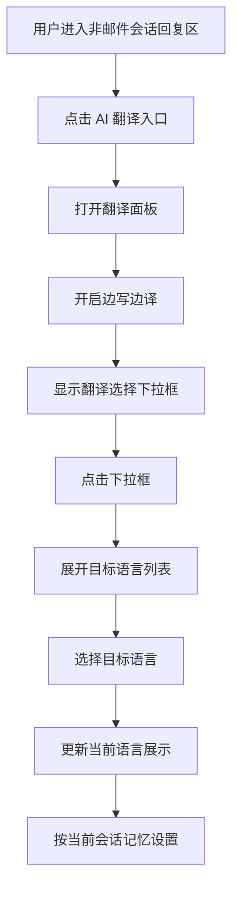

1 背景与目标

## 1.1 业务背景

**业务背景：** 当前工作台会话回复区已提供统一的 AI 翻译入口，用户可在同一面板中操作“边写边译”与“聊天翻译”。

**现状痛点：** 当前边写边译虽然具备开关与目标语言能力，但需要把“开启边译功能后显示翻译选择下拉框”的联动规则明确下来，避免用户开启后找不到目标语言入口，影响后续翻译与发送操作。

**触发原因：** 本次需求用于明确边写边译开启后的翻译选择下拉框展示规则，以及其与统一翻译面板、会话级设置记忆和适用场景边界的联动关系。

**影响范围：** 影响对象为已登录工作台、使用非邮件会话回复区的客服与管理员；影响范围为会话回复输入区、AI 翻译面板、边写边译目标语言选择区及当前浏览器内的会话级翻译设置。

## 1.2 目标

**目标1：** 让用户开启边写边译后，立即看到翻译选择下拉框，不需要额外寻找目标语言入口。

**衡量口径：** 用户开启边写边译后，翻译选择下拉框同步展示。

**目标值或期望区间：** 100% 支持。

**目标2：** 让用户可通过翻译选择下拉框快速切换边写边译目标语言。

**衡量口径：** 下拉框可展示当前目标语言，并支持切换到系统提供的其他语言。

**目标值或期望区间：** 100% 支持。

**目标3：** 让边写边译与聊天翻译在同一翻译面板下保持边界清晰，避免设置混淆。

**衡量口径：** 边写边译和聊天翻译共用同一入口，但分别展示各自开关与目标语言选择，不互相覆盖。

**目标值或期望区间：** 100% 支持。

**目标4：** 让边写边译开关与目标语言按会话记忆，减少重复设置。

**衡量口径：** 用户切换会话后再次进入原会话，边写边译开关状态与目标语言沿用最近一次设置。

**目标值或期望区间：** 100% 支持。

## 1.3 验收指标

**指标名称：** 开启后下拉框展示有效性。

**计算口径：** 用户在翻译面板中开启边写边译后，页面立即展示翻译选择下拉框。

**统计周期：** 单次验收。

**验收阈值：** 开启后可见，无需刷新页面或重复操作。

**数据来源：** 会话回复输入区交互验收。

**指标名称：** 目标语言切换有效性。

**计算口径：** 用户点击翻译选择下拉框后，可看到语言列表并切换目标语言，切换后当前选中项同步更新。

**统计周期：** 单次验收。

**验收阈值：** 语言列表可操作，切换结果可见。

**数据来源：** 会话回复输入区交互验收。

**指标名称：** 会话级记忆有效性。

**计算口径：** 用户在某会话中修改边写边译开关或目标语言后，离开并再次进入该会话时，沿用最近一次设置。

**统计周期：** 单次验收。

**验收阈值：** 开关状态与目标语言记忆生效。

**数据来源：** 当前浏览器内会话切换交互验收。

**指标名称：** 场景边界准确性。

**计算口径：** 备注模式与邮件回复场景中不展示边写边译翻译选择下拉框。

**统计周期：** 单次验收。

**验收阈值：** 不适用场景中不出现相关入口。

**数据来源：** 会话回复输入区交互验收。

## 2 边写边译翻译联动

### 2.1 功能定义

**功能描述：** 边写边译翻译联动用于在用户开启边写边译后，同步展示翻译选择下拉框，帮助用户立即设置目标语言并继续使用边写边译能力。

**用户场景：** 客服在跨语言会话中打开 AI 翻译面板，开启边写边译后，希望立即选择目标语言，而不是再去其他位置寻找语言入口。

**功能入口与触发方式：** 用户进入非邮件会话的回复输入区后，点击 AI 翻译入口，在翻译面板中开启“边写边译”；开启后显示翻译选择下拉框。

**目标用户/角色：** 已登录工作台的客服、管理员。

**功能类型：** 修改、状态变更。

**输出结果：** 开启边写边译后，系统展示翻译选择下拉框，用户可查看当前目标语言、打开语言列表并完成切换；对应设置按会话在当前浏览器内记忆。

**规则依据：** 当前工作台已存在统一 AI 翻译面板、边写边译开关、目标语言选择入口与会话级翻译设置记忆能力。

### 2.2 交互流程

**主流程：**

1. 用户进入非邮件会话的回复输入区。
2. 用户点击 AI 翻译入口，打开翻译面板。
3. 用户开启“边写边译”开关。
4. 系统立即展示边写边译的翻译选择下拉框。
5. 用户点击翻译选择下拉框。
6. 系统展开目标语言列表。
7. 用户选择目标语言。
8. 系统更新下拉框中的当前语言展示，并将该设置用于当前会话的边写边译能力。

**分支流程：**

1. 当边写边译处于关闭状态时，边写边译翻译选择下拉框不展示。
2. 当边写边译已开启时，用户再次点击开关关闭功能，翻译选择下拉框同步隐藏。
3. 用户切换到其他会话再返回当前会话时，系统恢复该会话最近一次边写边译开关与目标语言设置。
4. 用户关闭翻译面板后再次打开，如边写边译仍为开启状态，则翻译选择下拉框继续展示。

**异常流程：**

1. 当前浏览器无法读取会话级翻译设置时，系统按默认设置进入当前会话。
2. 当前浏览器无法保存会话级翻译设置时，设置持久化结果为`（待确认）`。
3. 目标语言切换失败时的提示文案与恢复动作为`（待确认）`。

### 2.3 前置条件

**登录状态：** 用户需已登录系统并进入工作台。

**角色与权限：** 当前已确认可进入工作台并使用回复输入区的角色可使用该功能；边写边译与聊天翻译的独立权限控制规则为`（待确认）`。

**前置业务条件：** 当前会话需为非邮件会话，且回复区处于“回复”模式而非“备注”模式。

**依赖配置或前序步骤：** 需已展示 AI 翻译入口；若当前版本或权限不提供翻译能力，则边写边译翻译选择下拉框不展示。

### 2.4 输入规则

**AI 翻译入口：** 按钮输入，位于回复输入区工具栏；用户点击后打开或关闭翻译面板。

**边写边译开关：** 开关输入，支持“开启 / 关闭”两种状态；默认值为关闭。

**翻译选择下拉框：** 仅在边写边译开关开启后展示；用户可通过下拉框查看当前目标语言并打开语言列表。

**目标语言：** 单选输入，当前支持英语、西班牙语、法语、德语、葡萄牙语、俄语、简体中文、繁体中文 8 种语言；默认值为英语。

**语言列表：** 点击翻译选择下拉框后展示；当前已选语言高亮显示。

**会话级设置：** 边写边译开关与目标语言按会话分别保存，并在当前浏览器内记忆。

**备注模式：** 当回复区切换到备注模式时，不展示边写边译翻译选择下拉框。

**邮件回复场景：** 当前邮件回复场景不展示边写边译翻译选择下拉框。

### 2.5 校验规则

**下拉框显示规则：** 仅在边写边译开关开启时展示翻译选择下拉框。

**下拉框隐藏规则：** 当边写边译关闭时，翻译选择下拉框立即隐藏。

**目标语言范围：** 用户仅可从系统提供的 8 种目标语言中进行选择。

**当前语言展示：** 下拉框默认展示当前已选目标语言；若无历史记录，则展示默认目标语言。

**设置记忆：** 当前浏览器无历史记录时，边写边译按默认关闭、默认目标语言进入当前会话。

**备注模式校验：** 备注模式下边写边译翻译选择下拉框不可进入。

**邮件场景校验：** 邮件回复场景下边写边译翻译选择下拉框不可进入。

### 2.6 业务规则

**开启联动规则：** 用户开启边写边译后，系统同步展示翻译选择下拉框，无需再次点击其他入口才能看到目标语言选择能力。

**关闭联动规则：** 用户关闭边写边译后，系统同步隐藏翻译选择下拉框。

**统一入口规则：** 边写边译与聊天翻译共用同一 AI 翻译入口，但分别维护各自的开关与目标语言。

**独立设置规则：** 边写边译的目标语言与聊天翻译的目标语言分别独立维护，不互相覆盖。

**会话记忆规则：** 每个会话分别记忆边写边译开关与目标语言，不同会话之间互不覆盖。

**当前浏览器范围规则：** 会话记忆仅在当前浏览器内生效；跨浏览器、跨设备同步规则为`（待确认）`。

**语言切换生效规则：** 用户在下拉框中切换目标语言后，系统立即更新边写边译当前语言展示，并将新语言作为当前会话的边写边译目标语言。

**发送联动规则：** 边写边译开启后的后续译文展示与发送链路继续沿用当前边写边译能力；最终发送内容与语言版本规则为`（待确认）`。

### 2.7 展示与交互状态规则

**默认态展示规则：** 边写边译关闭时，仅展示边写边译开关，不展示翻译选择下拉框。

**开启态展示规则：** 边写边译开启后，翻译选择下拉框紧随边写边译设置区域展示。

**下拉框展示规则：** 下拉框默认展示当前已选目标语言，并带有可展开标识。

**语言列表展示规则：** 用户点击下拉框后，展示目标语言列表，并高亮当前已选项。

**面板关闭规则：** 用户点击翻译面板外区域后，翻译面板关闭；若边写边译仍为开启状态，则再次打开面板时继续展示翻译选择下拉框。

**备注模式隐藏规则：** 备注模式下隐藏边写边译翻译选择下拉框。

**邮件场景隐藏规则：** 邮件回复场景下隐藏边写边译翻译选择下拉框。

**当前语言刷新规则：** 用户切换目标语言后，下拉框中的当前语言展示立即刷新。

### 2.8 异常处理

**无历史设置：** 当当前会话不存在历史边写边译设置时，系统按默认关闭、默认英语进入；用户可执行动作为手动开启边写边译并选择目标语言。

**设置读取失败：** 当当前浏览器无法读取会话级翻译设置时，系统按默认设置进入；用户可执行动作为重新开启边写边译并选择目标语言。

**设置保存失败：** 当当前浏览器无法保存会话级翻译设置时，是否提示用户、是否仅本次有效为`（待确认）`；用户可执行动作为继续当前会话使用或重新进入后再次设置。

**语言切换失败：** 当前未确认目标语言切换失败时的提示文案、是否自动回退到原语言以及重试方式，相关规则为`（待确认）`。

**无权限：** 当当前版本或权限不支持翻译能力时，边写边译翻译选择下拉框不展示；更细粒度的权限提示方式为`（待确认）`。

### 2.9 后置条件

**设置结果：** 当前会话的边写边译开关状态与目标语言被记录为最近一次设置。

**页面结果：** 用户完成边写边译开启与目标语言选择后，后续可在当前会话内继续使用边写边译能力。

**数据结果：** 本功能主要影响会话级翻译设置与页面展示，不直接修改历史消息内容。

**发送结果：** 用户后续通过边写边译触发的发送行为继续沿用当前会话设置；最终发给访客的消息语言版本与展示规则为`（待确认）`。

### 2.10 补充条件

**范围边界：** 本期已确认范围仅包含开启边写边译后显示翻译选择下拉框、目标语言选择、会话级记忆及与统一翻译面板的联动边界。

**非本期范围：** 聊天翻译详细规则、消息气泡内手动翻译、邮件回复翻译、翻译质量配置、翻译失败重试机制、跨设备同步和发送内容落库规则不在本次已确认范围内，相关规则为`（待确认）`。

**兼容策略：** 历史会话进入当前浏览器时，若已有会话级边写边译设置，则沿用该设置。

**入口协同要求：** 边写边译与聊天翻译共用同一翻译入口，但两者的开关、目标语言与后续行为边界需保持清晰，未明确部分统一标记为`（待确认）`。
