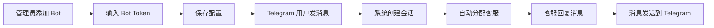

# PRD：Telegram 渠道接入

> **版本**：v1.0 · 2026-04-06
> **状态**：草稿

---

## 1. 概述

### 1.1 背景与动机

| 痛点 | 影响 |
|------|------|
| 海外客户习惯使用 Telegram 沟通，现有系统不支持该渠道 | 流失海外客户，无法覆盖 Telegram 用户群体 |
| 客服需要在多个平台切换处理消息 | 降低工作效率，增加响应时间 |

TWT 客服系统已支持网页、网页插件、Email 等渠道，但缺少 Telegram 支持。Telegram 在海外市场拥有大量用户，主流竞品（Zendesk、Intercom、Tidio）均已支持该渠道。通过接入 Telegram Bot，客服可在统一工作台处理所有渠道消息，提升海外客户服务体验。

### 1.2 目标

| Key Result | 量化标准 |
|-----------|---------|
| KR1：渠道覆盖 | 支持 Telegram Bot 接收和发送消息 |
| KR2：功能完整性 | 支持文本、图片、文件消息，支持消息撤回 |
| KR3：体验一致性 | 复用现有会话管理、分配、输入框功能 |

### 1.3 非目标（本期不做）

- 语音消息支持
- Telegram 群组消息
- Telegram 频道消息
- 视频通话功能

---

## 2. 用户故事

| ID | 角色 | 用户故事 | 验收标准 | 优先级 |
|----|------|---------|----------|--------|
| US-01 | 管理员 | 我希望在设置页面添加 Telegram Bot，让系统能接收 Telegram 消息 | 可输入 Bot Token、Bot 名称、欢迎消息并保存 | P0 |
| US-02 | 客服 | 我希望在消息队列中看到 Telegram 会话，并能识别渠道来源 | 会话列表显示 Telegram 图标，会话标题显示用户名 | P0 |
| US-03 | 客服 | 我希望在 Telegram 会话中发送文本、图片、文件 | 可使用输入框发送消息，支持表情、快捷回复、文件上传 | P0 |
| US-04 | 客服 | 我希望撤回发送错误的消息 | 可撤回自己发送的消息，Telegram 中消息被删除 | P1 |
| US-05 | 客服 | 我希望在访客信息面板查看 Telegram 用户信息 | 显示用户名、User ID、首次联系时间 | P1 |

---

## 3. 功能设计

### 3.1 信息架构

```
设置
└── 渠道
    ├── 网页
    ├── Email
    └── Telegram ← 新增
        ├── Bot 列表
        └── 添加 Bot 弹窗
```

### 3.2 核心流程



### 3.3 子功能详述

#### 3.3.1 Bot 配置管理

**功能描述**：管理员在设置页面添加、编辑、删除 Telegram Bot。

**用户场景**：管理员需要配置 Bot Token 以接收 Telegram 消息。

**前置条件**：
1. 用户已在 Telegram 通过 @BotFather 创建 Bot 并获得 Token
2. 用户具有管理员权限

**交互流程**：
1. 用户进入「设置 > Telegram」页面
2. 点击「添加 Bot」按钮
3. 填写 Bot Token（必填）、Bot 名称（选填）、欢迎消息（选填）
4. 点击「保存」
5. 系统验证 Token 格式并保存
6. Bot 列表显示新增的 Bot

**需求描述（功能规则）**：

1. **输入规则**：
   - Bot Token：必填，格式为 {bot_id}:{auth_token}（bot_id 为 8-10 位数字，auth_token 为 35 位字母数字组合），无长度限制
   - Bot 名称：选填，默认为「Telegram Bot」，最大长度 50 字符，输入时限制最多 50 字符禁止继续输入
   - 欢迎消息：选填，默认为「您好！有什么可以帮助您的吗？」，最大长度 500 字符，输入时限制最多 500 字符禁止继续输入

2. **校验规则**：
   - Bot Token 为空时提示「请输入 Bot Token」
   - Bot Token 格式错误时提示「Bot Token 格式不正确」
   - 同一 Bot Token 不允许重复添加，保存时校验重复则提示「该 Bot 已存在」
   - 编辑模式下 Bot Token 字段置灰不可修改

3. **业务规则**：
   - 最多支持 10 个 Bot
   - 达到上限时「添加 Bot」按钮置灰，hover 提示「最多支持 10 个 Bot」
   - Bot 列表为空时显示空状态，标题「还未添加任何 Bot」，描述「添加 Telegram Bot 开始接收消息」
   - Bot 列表显示：Bot 名称、Bot Username（从 Telegram API 自动获取，保存 Bot Token 时调用 getMe 接口获取）、状态（正常/异常）、创建人、创建时间、操作
   - Bot 状态说明：
     - 正常：Webhook 连接正常且 Token 有效
     - 异常：Webhook 连接失败或 Token 失效
     - 恢复：重新验证 Token 或修复 Webhook 后自动恢复为正常
   - 操作菜单：编辑、删除
   - 删除时弹窗确认，标题「删除 Bot」，描述「删除后将无法接收该 Bot 的消息」，按钮：取消、删除

4. **异常处理**：
   - Token 格式错误时提示「Bot Token 格式不正确」
   - 新增成功提示「新增成功」
   - 编辑成功提示「编辑成功」
   - 删除成功提示「删除成功」

**后置条件**：
1. Bot 配置保存到数据库
2. 系统开始接收该 Bot 的消息
3. 页面刷新显示最新 Bot 列表
4. 删除 Bot 后，该 Bot 的历史会话保留可查看，但无法继续发送消息，输入框显示「Bot 已删除，无法发送消息」

#### 3.3.2 Telegram 会话接收

**功能描述**：用户通过 Telegram 发送消息后，系统自动创建会话并分配给客服。

**用户场景**：Telegram 用户首次联系客服时，系统自动创建会话。

**前置条件**：
1. 管理员已配置 Telegram Bot
2. 用户在 Telegram 中向 Bot 发送消息

**交互流程**：
1. Telegram 用户发送消息
2. 系统接收消息并创建会话
3. 会话自动分配给在线客服
4. 客服在消息队列中看到新会话
5. 会话标题显示用户名（First Name + Last Name 或 Username）

**需求描述（功能规则）**：

1. **会话创建规则**：
   - 会话标题：优先使用「First Name + Last Name」，若无则使用「@Username」，若都无则显示「Telegram 用户」
   - 会话渠道标识：显示 Telegram 图标
   - 访客标识：默认标记为「访客」
   - 系统自动发送欢迎消息（使用 Bot 配置的欢迎消息）
   - 会话合并规则：同一 Telegram User ID 的消息合并到同一会话。若会话已结束，新消息自动重新开启会话并重新分配

2. **会话分配规则**：
   - 按客服在线状态和当前会话数量自动分配
   - 支持手动分配和领取

3. **消息展示规则**：
   - 文本消息：直接显示内容
   - 图片消息：显示缩略图，点击查看大图
   - 文件消息：显示文件名、大小、下载按钮

**后置条件**：
1. 会话出现在消息队列
2. 分配的客服收到通知
3. 会话记录保存到数据库

#### 3.3.3 消息发送

**功能描述**：客服在 Telegram 会话中发送文本、图片、文件消息。

**用户场景**：客服需要回复 Telegram 用户的咨询。

**前置条件**：
1. 客服已打开 Telegram 会话
2. 会话未结束

**交互流程**：
1. 客服在输入框输入文本或上传文件
2. 点击发送按钮
3. 消息发送到 Telegram
4. 消息气泡显示在聊天区域

**需求描述（功能规则）**：

1. **输入框功能**：
   - 支持文本输入，无长度限制
   - 支持表情选择
   - 支持快捷回复（替换输入框内容）
   - 支持文件上传：
     - 图片：最大 10MB，支持 jpg/png/gif，超出时提示「图片过大，最大支持 10MB」
     - 文档：最大 20MB，支持常见格式，超出时提示「文件过大，最大支持 20MB」
   - 支持 AI 功能（文本润色、Copilot 推荐回复、翻译）
   - 支持内部备注（Note）

2. **发送规则**：
   - 输入框为空时发送按钮置灰
   - 发送成功后清空输入框
   - 发送失败显示重试按钮，重试无次数限制，每次重试间隔 2 秒
   - 连续失败 3 次后提示「消息发送失败，请稍后重试」

3. **消息状态**：
   - 发送中：显示加载状态
   - 发送成功：正常显示
   - 发送失败：显示失败标识和重试按钮

**后置条件**：
1. 消息发送到 Telegram 用户
2. 消息记录保存到数据库
3. 会话更新时间刷新

#### 3.3.4 消息撤回

**功能描述**：客服可撤回自己发送的消息，Telegram 中消息被删除。

**用户场景**：客服发送错误消息后需要撤回。

**前置条件**：
1. 消息由当前客服发送
2. 消息未被撤回

**交互流程**：
1. 客服 hover 消息气泡
2. 点击「...」菜单
3. 选择「撤回」
4. 消息内容变为「消息已撤回」
5. Telegram 中消息被删除

**需求描述（功能规则）**：

1. **撤回权限**：
   - 只能撤回客服自己发送的消息
   - 不能撤回用户发送的消息
   - 撤回用户消息时提示「只能撤回自己发送的消息」

2. **撤回效果**：
   - 消息内容替换为「消息已撤回」
   - 消息气泡保留，不删除
   - Telegram 中消息被删除
   - 提示「消息已撤回（Telegram 中已删除）」

3. **用户撤回处理**：
   - 用户在 Telegram 中删除消息时，系统收到通知
   - 消息标记为「用户已删除」
   - 显示「用户撤回了一条消息」
   - 原始内容保留在数据库（审计需求）

**后置条件**：
1. 消息状态更新为已撤回
2. Telegram 中消息被删除
3. 操作记录保存到日志

#### 3.3.5 会话结束与重新开启

**功能描述**：客服可结束 Telegram 会话，结束后可重新开启。

**用户场景**：问题解决后客服结束会话，后续用户再次咨询时可重新开启。

**前置条件**：
1. 会话已存在

**交互流程**：
1. 客服点击「结束会话」按钮
2. 弹窗确认
3. 会话状态变为已结束
4. 输入框替换为「重新开启」按钮
5. 点击「重新开启」恢复会话

**需求描述（功能规则）**：

1. **结束会话**：
   - 弹窗标题「结束会话」
   - 弹窗描述「确认结束该会话吗？」
   - 按钮：取消、确认结束
   - 结束后输入框隐藏，显示「重新开启」按钮
   - 结束成功提示「会话已结束」

2. **重新开启**：
   - 点击「重新开启」按钮
   - 会话状态恢复为进行中
   - 输入框恢复可用
   - 提示「Telegram 会话已重新开启」

**后置条件**：
1. 会话状态更新
2. 会话从已结束队列移动到对应队列

#### 3.3.6 访客信息展示

**功能描述**：在访客信息面板显示 Telegram 用户信息。

**需求描述（功能规则）**：

1. **显示字段**：
   - 用户名：显示 First Name + Last Name 或 @Username
   - User ID：Telegram 用户唯一标识
   - 渠道：显示「Telegram」
   - 首次联系时间
   - 会话统计：「X 会话」
   - 操作系统：显示「Telegram」

2. **字段规则**：
   - 邮箱、电话、起点页面、设备 IP、浏览器字段为空时显示「–」

---

## 4. 数据模型

| 实体名 | 字段 | 类型 | 说明 |
|--------|------|------|------|
| TelegramBot | id | string | Bot ID |
| | name | string | Bot 名称 |
| | username | string | Bot Username |
| | token | string | Bot Token |
| | welcomeMessage | string | 欢迎消息 |
| | status | 'active' \| 'error' | Bot 状态 |
| | createdAt | string | 创建时间 |
| | createdBy | string | 创建人 |
| TelegramSession | id | string | 会话 ID |
| | channelType | 'telegram' | 渠道类型 |
| | telegramUserId | number | Telegram User ID |
| | telegramUsername | string | Telegram Username |
| | telegramFirstName | string | 用户名 |
| | telegramLastName | string | 用户姓 |
| | customerName | string | 会话标题 |
| | status | 'pending' \| 'processing' \| 'resolved' \| 'closed' | 会话状态（待回复/处理中/已解决/已关闭） |
| | closed | boolean | 是否已结束 |
| TelegramMessage | id | string | 消息 ID |
| | sessionId | string | 会话 ID |
| | role | 'agent' \| 'customer' \| 'system' | 消息角色 |
| | content | string | 消息内容 |
| | contentType | 'text' \| 'photo' \| 'document' | 内容类型 |
| | revoked | boolean | 是否已撤回 |
| | time | string | 发送时间 |

---

## 5. 权限与角色

| 功能 | 管理员 | 客服 | 无权限时的表现 |
|------|--------|------|--------------|
| 添加 Bot | ✓ | ✗ | 隐藏「添加 Bot」按钮 |
| 编辑 Bot | ✓ | ✗ | 隐藏编辑菜单项 |
| 删除 Bot | ✓ | ✗ | 隐藏删除菜单项 |
| 查看 Telegram 会话 | ✓ | ✓ | – |
| 发送消息 | ✓ | ✓ | – |
| 撤回消息 | ✓ | ✓ | – |

---

## 6. 约束与依赖

| 约束/依赖 | 说明 | 影响范围 |
|----------|------|---------|
| Bot Token 安全 | Token 需加密存储 | 后端实现 |
| Webhook 部署 | 需要公网 HTTPS 地址 | 后端部署 |
| Telegram API 限流 | 每秒最多 30 条消息 | 后端消息队列 |
| 最大 Bot 数量 | 最多 10 个 Bot | 前端校验 |

---

## 7. 异常处理

| 异常场景 | 处理方式 | 用户感知 |
|---------|---------|---------|
| Bot Token 无效 | 保存时校验失败 | 提示「Bot Token 格式不正确」 |
| 消息发送失败 | 显示重试按钮 | 消息气泡显示失败标识 |
| Webhook 连接失败 | Bot 状态标记为异常 | Bot 列表显示「异常」状态 |
| 撤回非自己的消息 | 拦截操作 | 提示「只能撤回自己发送的消息」 |

---

## 8. 跨模块联动

| 联动模块 | 联动方式 | 说明 |
|----------|----------|------|
| 会话列表 | 显示 Telegram 图标 | 渠道标识 |
| 访客列表 | 支持 Telegram 渠道筛选 | 筛选项增加 Telegram |
| 客户列表 | 支持 Telegram 渠道筛选 | 筛选项增加 Telegram |
| 筛选面板 | 渠道筛选增加 Telegram | 会话筛选面板的渠道选项需增加 `{ key: 'telegram', label: 'Telegram' }` |
| 角色权限 | 支持 Telegram 渠道权限控制 | 角色权限中增加「Telegram 渠道」权限组，包含：查看会话、发送消息、撤回消息、结束会话 |

---

## 9. 开放问题

| # | 问题 | 备选方案 | 当前倾向 | 状态 |
|---|------|---------|---------|------|
| 1 | 是否支持 Telegram 群组消息 | A) 支持 B) 不支持 | B | 已确认 |
| 2 | 离线消息如何处理 | A) 自动回复 B) 不处理 | A | 待确认 |
| 3 | 多 Bot 消息如何区分 | A) 会话标题显示 Bot 名称 B) 不区分 | A | 待确认 |
