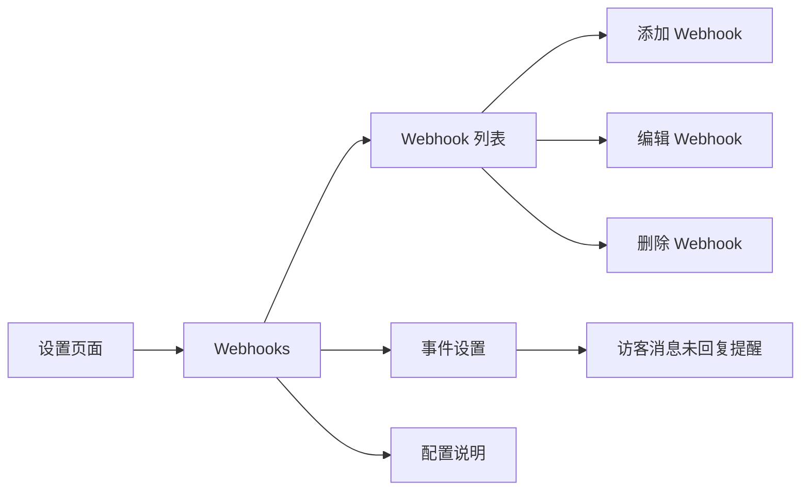
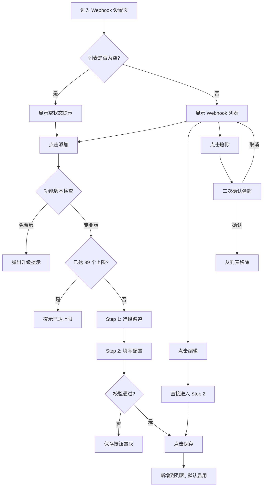

# PRD：Webhook 平台集成

> **版本**：v1.2 · 2026-03-25
> **状态**：草稿
> **模块编号**：Module 09

---

## 1. 概述

### 1.1 背景与动机

| 痛点 | 影响 |
|------|------|
| 客服消息到达后，运营人员无法在常用办公工具中即时收到通知 | 响应延迟，影响客户满意度 |
| 不同团队使用不同协作平台（飞书、钉钉、Slack、企业微信等），通知渠道分散 | 需要为每个平台单独开发推送逻辑，维护成本高 |
| 缺乏统一的 Webhook 推送能力，无法灵活对接第三方系统 | 限制了客服系统的集成扩展性 |

Webhook 平台集成功能允许用户将客服系统的事件通知（如访客消息未回复提醒）推送到指定的第三方平台或自定义接收地址。系统内部采用统一消息格式，通过平台适配器自动转换为各平台专用格式，并支持签名验证确保消息来源可信。

### 1.2 目标

| Key Result | 量化标准 |
|-----------|---------|
| KR1：平台覆盖 | 支持飞书、钉钉、Slack、企业微信、自定义 5 种渠道 |
| KR2：配置便捷性 | 用户可在 3 步内完成一个 Webhook 配置（选渠道 → 填写信息 → 保存） |
| KR4：安全保障 | 所有推送消息支持签名验证，防止伪造和篡改 |

---

## 2. 用户故事

| ID | 角色 | 用户故事 | 验收标准 | 优先级 |
|----|------|---------|----------|--------|
| US-01 | 管理员 | 我希望添加一个飞书 Webhook，以便团队在飞书群中收到客服消息未回复提醒 | 选择飞书渠道后填写 Webhook URL 并保存，列表中出现该配置且状态为启用 | P0 |
| US-02 | 管理员 | 我希望添加钉钉 Webhook 时强制填写加签密钥，以便消息安全可靠 | 钉钉渠道的加签密钥为必填项，未填写时保存按钮不可点击 | P0 |
| US-03 | 管理员 | 我希望随时启用或禁用某个 Webhook，以便灵活控制通知推送 | 列表中的状态开关可切换，禁用后该 Webhook 不再接收推送 | P0 |
| US-04 | 管理员 | 我希望设置访客消息未回复的提醒时间，以便按团队需求调整提醒节奏 | 可分别设置首次提醒时间和后续提醒间隔，保存后生效 | P0 |
| US-05 | 管理员 | 我希望删除不再使用的 Webhook 配置，以便保持列表整洁 | 删除前有二次确认，确认后从列表移除并停止推送 | P1 |
| US-06 | 开发者 | 我希望使用自定义 Webhook 对接内部系统，以便将客服事件接入自建工作流 | 选择自定义渠道后填写任意 HTTPS 地址，可选配置 HMAC 密钥 | P1 |

---

## 3. 功能设计

### 3.1 信息架构



Webhook 功能位于设置页面中，包含三个区域：Webhook 列表（配置管理）、事件设置（触发条件）、配置说明（开发文档）。

### 3.2 核心流程



### 3.3 子功能详述

#### 3.3.1 Webhook 列表管理

**功能描述**：以表格形式展示所有已配置的 Webhook，支持添加、编辑、删除和启用/禁用操作。

**用户场景**：管理员需要查看当前所有推送渠道的配置状态，并进行增删改操作。

**前置条件**：
1. 用户具有管理 Webhooks 权限

**交互流程**：
1. 页面加载后展示 Webhook 配置列表
2. 列表为空时显示空状态提示文案
3. 用户可通过「添加」按钮新增配置，通过行内按钮编辑或删除

**需求描述（功能规则）**：

1. **列表字段**：
   - 名称：Webhook 的配置名称
   - 渠道：所属平台名称（飞书/钉钉/Slack/企业微信/自定义）
   - 状态：启用/禁用开关
   - 创建时间：格式为 YYYY-MM-DD
   - 创建人：显示头像 + 昵称
   - 操作：编辑、删除

2. **数量限制**：最多 99 个 Webhook 配置，超出时提示「最多添加 99 个 Webhook」

3. **状态开关**：
   - 免费版用户开启时弹出升级提示
   - 专业版用户可自由切换启用/禁用

4. **空状态**：列表为空时显示title：「还未添加任何 Webhook」，描述：添加 Webhook 将平台事件实时推送至外部服务

#### 3.3.2 添加 Webhook（两步向导）

**功能描述**：通过两步向导弹窗完成 Webhook 配置的创建。

**用户场景**：管理员需要新增一个推送渠道，将事件通知发送到指定平台。

**前置条件**：
1. 当前 Webhook 数量未达 99 个上限
2. 用户具备专业版权限

**交互流程**：
1. 用户点击「添加」按钮
2. 系统检查功能版本和数量限制
3. 弹出 Step 1：选择推送渠道
4. 用户选择一个渠道后自动进入 Step 2：填写配置信息
5. 填写完毕后点击保存，新配置加入列表并默认启用

**需求描述（功能规则）**：

**Step 1：选择渠道**

支持的渠道及说明：

| 渠道 | 说明 |
|------|------|
| 飞书 | 推送消息到飞书群机器人，支持富文本 |
| 钉钉 | 推送消息到钉钉群机器人，支持 Markdown 格式 |
| Slack | 推送消息到 Slack 频道，支持 Block Kit 富文本 |
| 企业微信 | 推送消息到企业微信群机器人，支持 Markdown |
| 自定义 | 发送标准 JSON 格式到任意 Webhook 地址 |

每个渠道以卡片形式展示，包含图标、名称和简要说明。点击卡片即选择该渠道并进入下一步。

**Step 2：配置表单**

| 字段 | 规则 | 备注 |
|------|------|------|
| 配置名称 | 必填，最多 50 字符，自动去除空格 | 所有渠道通用 |
| Webhook URL | 必填 | 各渠道有专属 placeholder 提示示例地址 |
| 签名密钥 | 各渠道不同，详见下表 | 密钥类型和必填性因渠道而异 |

各渠道的签名密钥规则：

| 渠道 | 密钥字段名称 | 是否必填 | 密钥说明提示 |
|------|------------|---------|-------------|
| 飞书 | 签名密钥 | 选填 | 选填. 在飞书机器人安全设置中开启签名校验后填写 |
| 钉钉 | 加签密钥 | **必填** | 在钉钉机器人安全设置中开启加签，复制密钥（SEC开头） |
| Slack | 签名密钥 | 选填 | 选填. 用于验证请求来源 |
| 企业微信 | 签名密钥 | 选填 | 选填. 用于验证请求来源 |
| 自定义 | - | 无需填写 | - |

**表单字段规则**：

| 字段 | 必填性 | 长度限制 | 校验规则 | 视觉标记 |
|------|--------|---------|---------|---------|
| 配置名称 | 必填 | 最多 50 字符 | 自动去除空格 | 左侧显示红色星号 * |
| Webhook URL | 必填 | 最多 500 字符 | URL 格式校验、唯一性校验 | 左侧显示红色星号 * |
| 签名密钥（钉钉） | 必填 | 无限制 | - | 左侧显示红色星号 * |
| 签名密钥（其他渠道） | 选填 | 无限制 | - | 无星号标记 |
| 展示字段 | 必填 | - | 至少勾选一项 | - |

**字段提示（Tooltip）**：

关键字段的 label 右侧显示问号图标（?），鼠标 hover 时显示深色气泡提示：
- Webhook URL：显示对应渠道的 URL 获取说明
- 签名密钥：显示对应渠道的密钥获取说明（选填渠道的提示前缀"选填. "）
- 展示字段：显示"选择推送消息中需要展示的字段，至少勾选一项"

**实时表单验证**：

| 触发时机 | 校验字段 | 错误提示 | 提示位置 |
|---------|---------|---------|---------|
| 配置名称失焦 | 是否为空 | 请输入配置名称 | 输入框下方，红色文字 |
| Webhook URL 失焦 | 是否为空 | 请输入 Webhook URL | 输入框下方，红色文字 |
| Webhook URL 失焦 | URL 格式 | 无效URL | 输入框下方，红色文字 |
| 点击保存 | URL 唯一性 | 重复 Webhooks URL | Toast 提示，红色错误图标 |

**保存按钮状态**：

保存按钮在以下情况下置灰不可点击：
- 配置名称为空
- Webhook URL 为空
- 钉钉渠道的签名密钥为空
- 展示字段未勾选任何项

**展示字段配置**：

用户可自定义选择推送消息中需要展示的字段，提升消息的针对性和可读性。

可选字段列表（按展示顺序）：
1. 会话主题
2. 访客姓名
3. 消息创建时间
4. 消息内容
5. 项目名称
6. 访客备注名
7. 客户标识
8. 状态
9. 推送次数
10. 超时时间（秒）
11. 服务客服名称

字段选择规则：
- 字段以两列网格布局展示，每个字段前有复选框
- 至少勾选一项字段，否则保存按钮置灰
- 默认勾选：会话主题、访客姓名、消息内容、服务客服名称
- 保存后，推送消息时只包含勾选的字段

**后置条件**：
1. 新配置加入列表，状态默认为「启用」
2. 创建时间为当天日期，创建人为当前操作用户
3. 弹窗关闭，显示「保存成功」提示

#### 3.3.3 编辑 Webhook

**功能描述**：修改已有 Webhook 配置的名称、URL 和密钥信息。

**用户场景**：管理员需要更新某个 Webhook 的接收地址或密钥。

**前置条件**：
1. 列表中存在可编辑的 Webhook 配置

**交互流程**：
1. 用户点击行内「编辑」按钮
2. 弹出配置表单（直接进入 Step 2，跳过渠道选择）
3. 表单预填当前配置信息
4. 修改后点击保存

**需求描述（功能规则）**：

1. 编辑时不可更换渠道类型
2. 表单校验规则与添加时一致
3. 弹窗标题为「编辑 Webhook」

**后置条件**：
1. 配置信息更新
2. 弹窗关闭，显示「保存成功」提示

#### 3.3.4 删除 Webhook

**功能描述**：删除一个 Webhook 配置，停止向该地址推送事件。

**用户场景**：管理员需要移除不再使用的推送渠道。

**前置条件**：
1. 列表中存在可删除的 Webhook 配置

**交互流程**：
1. 用户点击行内「删除」按钮
2. 弹出二次确认弹窗，标题「删除 Webhook」，描述「删除后将不再向该渠道推送事件通知」
3. 用户点击「删除」确认，或点击「取消」放弃

**后置条件**：
1. 确认后配置从列表移除
2. 显示「删除成功」提示
3. 该地址不再接收任何事件推送

#### 3.3.5 访客消息未回复提醒设置

**功能描述**：配置访客消息未回复时的提醒触发规则，包括是否启用、首次提醒时间和后续提醒间隔。

**用户场景**：管理员希望在客服未及时回复访客消息时，通过 Webhook 向团队发送提醒通知。

**前置条件**：
1. 用户具备专业版权限

**交互流程**：
1. 用户在「支持事件」区域查看「访客消息未回复」事件
2. 通过开关启用或禁用该事件
3. 启用后显示时间配置项，可调整首次提醒时间和后续提醒间隔
4. 关闭后时间配置项自动隐藏

**需求描述（功能规则）**：

1. **事件开关**：
   - 默认状态：关闭
   - 开关状态实时保存，无需额外保存按钮
   - 免费版用户开启时弹出升级提示

2. **时间配置项显示规则**：
   - 开关启用时：显示时间配置项（首次提醒时间、后续提醒间隔）
   - 开关关闭时：隐藏时间配置项，仅显示事件名称和开关

3. **时间配置规则**：
   - 首次提醒时间：访客发送消息后多久首次提醒（默认值：0 小时 1 分钟 0 秒）
   - 后续提醒间隔：首次提醒后每隔多久再次提醒（默认值：0 小时 10 分钟 0 秒）
   - 最多提醒次数：4 次
   - 时间配置失焦自动保存

**后置条件**：
1. 设置保存后对所有启用的 Webhook 配置生效
2. 触发时系统向所有启用状态的 Webhook 地址并发推送提醒消息

---

## 4. 后端架构设计

### 4.1 平台适配器模式

系统采用适配器模式处理多平台差异。每个平台有独立的适配器，负责：

1. **消息格式转换**：将内部统一消息格式转换为各平台专用格式
2. **签名验证**：按各平台规范验证请求来源的合法性
3. **签名生成**：向用户配置的接收地址推送时附加签名

支持的适配器：

| 适配器 | 签名方式 | 格式特点 |
|--------|---------|---------|
| 飞书适配器 | HMAC-SHA256 + Base64 | 支持富文本消息 |
| 钉钉适配器 | HMAC-SHA256 + 时间戳加签 | 支持 Markdown |
| 企业微信适配器 | SHA1（token + timestamp + nonce） | 支持 Markdown |
| Slack 适配器 | HMAC-SHA256 | 支持 Block Kit |
| 自定义适配器 | HMAC-SHA256 | 标准 JSON |

### 4.2 消息格式规范

**自动换行格式**：

为提升消息可读性，所有推送到第三方平台的消息内容采用自动换行格式，每个字段独占一行。

格式规则：
- 每个 key-value 字段后自动换行
- 适用于所有渠道：飞书、钉钉、Slack、企业微信、自定义
- 后端负责处理数据格式，将字段按行组织

示例格式：
```
会话主题: New Conversation
访客姓名: Visitor15
消息内容: 您好，我想咨询一下产品价格
服务客服名称: 张三
```

### 4.3 URL 唯一性校验

系统在保存 Webhook 配置时进行 URL 唯一性校验：
- 同一个 Webhook URL 不允许重复添加
- 编辑模式下，排除当前编辑的条目进行校验
- 校验失败时提示：「该 Webhook 地址已存在，请勿重复添加」
- 防止重复推送导致接收方收到多条相同消息

---

## 5. 权限与角色

| 功能 | 超级管理员 | 普通客服 | 免费版用户 |
|------|-----------|---------|-----------|
| 查看 Webhook 列表 | 可用 | 可用 | 可用 |
| 添加 Webhook | 可用 | 可用 | 弹出升级提示 |
| 编辑 Webhook | 可用 | 可用 | 弹出升级提示 |
| 删除 Webhook | 可用 | 可用 | 弹出升级提示 |
| 启用/禁用 Webhook | 可用 | 可用 | 弹出升级提示 |
| 启用事件提醒 | 可用 | 可用 | 弹出升级提示 |

免费版用户可进入 Webhooks 页面查看内容，但所有写操作（添加/编辑/删除/启用）均会弹出升级提示弹窗。弹窗行为遵循全局服务版本规则：超级管理员显示「升级到专业版」按钮，普通用户显示「我知道了」按钮。

---

## 6. 异常处理

| 异常场景 | 处理方式 | 用户感知 |
|---------|---------|---------|
| Webhook 数量达到 99 个上限 | 阻止添加操作 | 提示「最多添加 99 个 Webhook」 |
| Webhook URL 重复 | 阻止保存操作 | 提示「该 Webhook 地址已存在，请勿重复添加」 |
| 展示字段未勾选 | 保存按钮置灰 | 无法点击保存按钮 |
| 免费版用户尝试操作 | 弹出升级提示弹窗 | 根据角色展示不同升级弹窗 |
