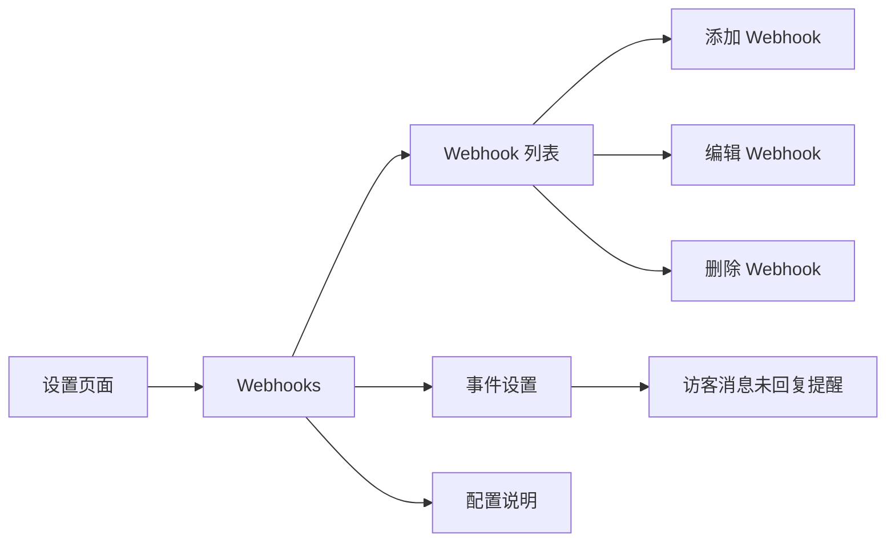
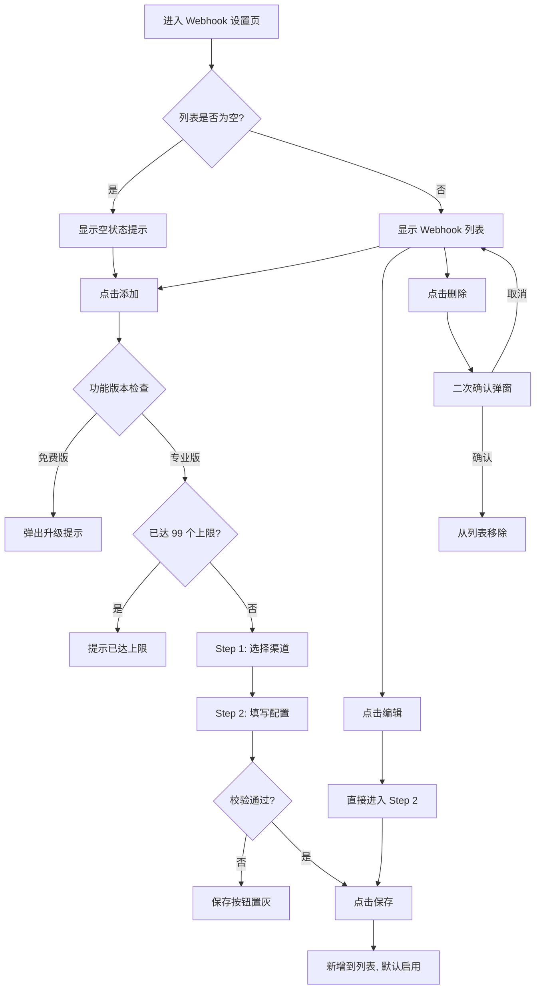

# PRD：Webhook 平台集成

> **版本**：v1.0 · 2026-03-22
> **状态**：草稿
> **模块编号**：Module 09

---

## 1. 概述

### 1.1 背景与动机

| 痛点 | 影响 |
|------|------|
| 客服消息到达后，运营人员无法在常用办公工具中即时收到通知 | 响应延迟，影响客户满意度 |
| 不同团队使用不同协作平台（飞书、钉钉、Slack、企业微信等），通知渠道分散 | 需要为每个平台单独开发推送逻辑，维护成本高 |
| 缺乏统一的 Webhook 推送能力，无法灵活对接第三方系统 | 限制了客服系统的集成扩展性 |

Webhook 平台集成功能允许用户将客服系统的事件通知（如访客消息未回复提醒）推送到指定的第三方平台或自定义接收地址。系统内部采用统一消息格式，通过平台适配器自动转换为各平台专用格式，并支持签名验证确保消息来源可信。

### 1.2 目标

| Key Result | 量化标准 |
|-----------|---------|
| KR1：平台覆盖 | 支持飞书、钉钉、Slack、企业微信、自定义 5 种渠道 |
| KR2：配置便捷性 | 用户可在 3 步内完成一个 Webhook 配置（选渠道 → 填写信息 → 保存） |
| KR3：推送可靠性 | 消息推送支持失败重试（指数退避，最多 3 次） |
| KR4：安全保障 | 所有推送消息支持签名验证，防止伪造和篡改 |

### 1.3 非目标（本期不做）

- 不支持 Webhook 推送日志查看和手动重试
- 不支持自定义消息模板（各平台使用固定格式）
- 不支持双向交互（仅单向推送，不接收平台回调）
- 不支持新会话创建以外的更多事件类型（本期仅支持「访客消息未回复提醒」）

---

## 2. 用户故事

| ID | 角色 | 用户故事 | 验收标准 | 优先级 |
|----|------|---------|----------|--------|
| US-01 | 管理员 | 我希望添加一个飞书 Webhook，以便团队在飞书群中收到客服消息未回复提醒 | 选择飞书渠道后填写 Webhook URL 并保存，列表中出现该配置且状态为启用 | P0 |
| US-02 | 管理员 | 我希望添加钉钉 Webhook 时强制填写加签密钥，以便消息安全可靠 | 钉钉渠道的加签密钥为必填项，未填写时保存按钮不可点击 | P0 |
| US-03 | 管理员 | 我希望随时启用或禁用某个 Webhook，以便灵活控制通知推送 | 列表中的状态开关可切换，禁用后该 Webhook 不再接收推送 | P0 |
| US-04 | 管理员 | 我希望设置访客消息未回复的提醒时间，以便按团队需求调整提醒节奏 | 可分别设置首次提醒时间和后续提醒间隔，保存后生效 | P0 |
| US-05 | 管理员 | 我希望删除不再使用的 Webhook 配置，以便保持列表整洁 | 删除前有二次确认，确认后从列表移除并停止推送 | P1 |
| US-06 | 管理员 | 我希望查看配置说明文档，以便在接收端正确解析 Webhook 消息 | 配置说明页展示签名验证方式、请求头/请求体格式、事件数据结构 | P1 |
| US-07 | 开发者 | 我希望使用自定义 Webhook 对接内部系统，以便将客服事件接入自建工作流 | 选择自定义渠道后填写任意 HTTPS 地址，可选配置 HMAC 密钥 | P1 |

---

## 3. 功能设计

### 3.1 信息架构

Webhook 功能位于设置页面中，包含三个区域：Webhook 列表（配置管理）、事件设置（触发条件）、配置说明（开发文档）。

### 3.2 核心流程

### 3.3 子功能详述

#### 3.3.1 Webhook 列表管理

**功能描述**：以表格形式展示所有已配置的 Webhook，支持添加、编辑、删除和启用/禁用操作。

**用户场景**：管理员需要查看当前所有推送渠道的配置状态，并进行增删改操作。

**前置条件**：
1. 用户已登录并进入设置页面的 Webhooks 区域

**交互流程**：
1. 页面加载后展示 Webhook 配置列表
2. 列表为空时显示空状态提示文案
3. 用户可通过「添加」按钮新增配置，通过行内按钮编辑或删除

**需求描述（功能规则）**：

1. **列表字段**：
   - 名称：Webhook 的配置名称
   - 渠道：所属平台名称（飞书/钉钉/Slack/企业微信/自定义）
   - 状态：启用/禁用开关
   - 创建时间：格式为 YYYY-MM-DD
   - 创建人：显示头像（取姓名首字）+ 姓名
   - 操作：编辑、删除

2. **数量限制**：最多 99 个 Webhook 配置，超出时提示「最多添加 99 个 Webhook」

3. **状态开关**：
   - 免费版用户开启时弹出升级提示
   - 专业版用户可自由切换启用/禁用

4. **空状态**：列表为空时显示「暂未添加任何 Webhook，点击「添加」开始配置」

#### 3.3.2 添加 Webhook（两步向导）

**功能描述**：通过两步向导弹窗完成 Webhook 配置的创建。

**用户场景**：管理员需要新增一个推送渠道，将事件通知发送到指定平台。

**前置条件**：
1. 当前 Webhook 数量未达 99 个上限
2. 用户具备专业版权限

**交互流程**：
1. 用户点击「添加」按钮
2. 系统检查功能版本和数量限制
3. 弹出 Step 1：选择推送渠道
4. 用户选择一个渠道后自动进入 Step 2：填写配置信息
5. 填写完毕后点击保存，新配置加入列表并默认启用

**需求描述（功能规则）**：

**Step 1：选择渠道**

支持的渠道及说明：

| 渠道 | 说明 |
|------|------|
| 飞书 | 推送消息到飞书群机器人，支持富文本 |
| 钉钉 | 推送消息到钉钉群机器人，支持 Markdown 格式 |
| Slack | 推送消息到 Slack 频道，支持 Block Kit 富文本 |
| 企业微信 | 推送消息到企业微信群机器人，支持 Markdown |
| 自定义 | 发送标准 JSON 格式到任意 Webhook 地址 |

每个渠道以卡片形式展示，包含图标、名称和简要说明。点击卡片即选择该渠道并进入下一步。

**Step 2：配置表单**

| 字段 | 规则 | 备注 |
|------|------|------|
| 配置名称 | 必填，最多 50 字符，自动去除空格 | 所有渠道通用 |
| Webhook URL | 必填 | 各渠道有专属 placeholder 提示示例地址 |
| 签名密钥 | 各渠道不同，详见下表 | 密钥类型和必填性因渠道而异 |

各渠道的签名密钥规则：

| 渠道 | 密钥字段名称 | 是否必填 | URL 描述提示 |
|------|------------|---------|-------------|
| 飞书 | 签名密钥 | 选填 | 在飞书群设置中添加自定义机器人，复制 Webhook 地址 |
| 钉钉 | 加签密钥 | **必填** | 在钉钉群设置中添加自定义机器人，复制 Webhook 地址 |
| Slack | 签名密钥 | 选填 | 在 Slack App 中启用 Incoming Webhooks，复制 Webhook URL |
| 企业微信 | 签名密钥 | 选填 | 在企业微信群中添加群机器人，复制 Webhook 地址 |
| 自定义 | HMAC 密钥 | 选填 | 输入您的自定义 Webhook 接收地址 |

**保存校验**：配置名称和 Webhook URL 均已填写时保存按钮可用；钉钉渠道额外要求加签密钥已填写。

**后置条件**：
1. 新配置加入列表，状态默认为「启用」
2. 创建时间为当天日期，创建人为当前操作用户
3. 弹窗关闭，显示「保存成功」提示

#### 3.3.3 编辑 Webhook

**功能描述**：修改已有 Webhook 配置的名称、URL 和密钥信息。

**用户场景**：管理员需要更新某个 Webhook 的接收地址或密钥。

**前置条件**：
1. 列表中存在可编辑的 Webhook 配置

**交互流程**：
1. 用户点击行内「编辑」按钮
2. 弹出配置表单（直接进入 Step 2，跳过渠道选择）
3. 表单预填当前配置信息
4. 修改后点击保存

**需求描述（功能规则）**：

1. 编辑时不可更换渠道类型
2. 表单校验规则与添加时一致
3. 弹窗标题为「编辑 Webhook」

**后置条件**：
1. 配置信息更新
2. 弹窗关闭，显示「保存成功」提示

#### 3.3.4 删除 Webhook

**功能描述**：删除一个 Webhook 配置，停止向该地址推送事件。

**用户场景**：管理员需要移除不再使用的推送渠道。

**前置条件**：
1. 列表中存在可删除的 Webhook 配置

**交互流程**：
1. 用户点击行内「删除」按钮
2. 弹出二次确认弹窗，标题「删除 Webhook」，描述「删除后将不再向该渠道推送事件通知」
3. 用户点击「删除」确认，或点击「取消」放弃

**后置条件**：
1. 确认后配置从列表移除
2. 显示「删除成功」提示
3. 该地址不再接收任何事件推送

#### 3.3.5 访客消息未回复提醒设置

**功能描述**：配置访客消息未回复时的提醒触发规则，包括是否启用、首次提醒时间和后续提醒间隔。

**用户场景**：管理员希望在客服未及时回复访客消息时，通过 Webhook 向团队发送提醒通知。

**前置条件**：
1. 用户具备专业版权限

**交互流程**：
1. 用户在事件设置区域查看「访客消息未回复提醒」事件
2. 通过开关启用或禁用该事件
3. 启用后可调整首次提醒时间和后续提醒间隔

**需求描述（功能规则）**：

1. **事件触发规则**：访客发出消息后，若客服未回复：
   - 首次提醒：默认 60 秒后触发
   - 后续提醒：默认每 600 秒（10 分钟）后再次触发
   - 最多提醒 4 次
   - 客服回复后停止提醒

2. **免费版限制**：事件开关默认关闭，开启时弹出升级提示

**后置条件**：
1. 设置保存后对所有启用的 Webhook 配置生效
2. 触发时系统向所有启用状态的 Webhook 地址并发推送提醒消息

#### 3.3.6 配置说明

**功能描述**：为开发者提供 Webhook 接入文档，说明签名验证方式、请求格式和事件数据结构。

**用户场景**：开发者需要在自己的系统中解析和验证收到的 Webhook 消息。

**需求描述（功能规则）**：

配置说明页包含以下内容：

1. **签名校验说明**：
   - 在开发设置中生成「AppSecret」
   - 通过 `x-chat-signature` 请求头发送签名
   - 签名算法：`HMAC-SHA256(secret, raw_body)`

2. **请求头格式**：
   - `content-type: application/json`
   - `x-chat-signature`: 签名值

3. **请求体结构**：

   | 字段 | 说明 | 示例 |
   |------|------|------|
   | created_at | Webhook 发送日期（时间戳） | 1765439941 |
   | event | 事件��称 | UNREPLIED |
   | webhook_id | 唯一的 Webhook ID | 58946f5f583edd... |
   | content | 包含特定事件数据的对象 | 详见事件数据 |

4. **访客消息未回复事件数据**：

   | 字段 | 说明 | 示例 |
   |------|------|------|
   | subject | 会话主题 | New Conversation |
   | visitor_name | 访客姓名 | Visitor15 |
   | created_at | 消息创建时间 | 1765439652 |
   | message_content | 消息内容 | 你好 |
   | property_name | 项目名称 | test |
   | visitor_nickname | 访客备注名 | VIP |
   | sbs | 客户标识 | 234442313 |
   | status | 状态（1: 待回复 2: 排队中 3: 待处理 4: 已回复） | 1 |
   | push_times | 推送次数 | 4 |
   | time_sec | 超时时间（秒） | 289 |
   | assigned_agent_nickname | 服务客服名称 | ctccccd |

---

## 4. 数据模型

### 4.1 Webhook 配置

| 字段 | 类型 | 说明 |
|------|------|------|
| id | 字符串 | 唯一标识 |
| channel | 枚举 | 渠道类型：feishu / dingtalk / slack / wecom / custom |
| name | 字符串 | 配置名称，最多 50 字符 |
| enabled | 布尔 | 是否启用 |
| createdAt | 日期 | 创建时间 |
| createdBy | 字符串 | 创建人 |
| webhookUrl | 字符串 | Webhook 接收地址 |
| secret | 字符串 | 签名密钥（可为空） |

### 4.2 未回复提醒设置

| 字段 | 类型 | 说明 |
|------|------|------|
| enabled | 布尔 | 是否启用 |
| firstSeconds | 整数 | 首次提醒延迟（秒），默认 60 |
| repeatSeconds | 整数 | 后续提醒间隔（秒），默认 600 |

### 4.3 推送消息（统一格式）

| 字段 | 类型 | 说明 |
|------|------|------|
| eventId | 字符串 | 事件唯一标识 |
| eventType | 枚举 | 事件类型 |
| platform | 枚举 | 来源平台 |
| timestamp | 时间戳 | 事件时间 |
| data | 对象 | 事件数据（含访客信息、消息内容等） |

---

## 5. 后端架构设计

### 5.1 平台适配器模式

系统采用适配器模式处理多平台差异。每个平台有独立的适配器，负责：

1. **消息格式转换**：将内部统一消息格式转换为各平台专用格式
2. **签名验证**：按各平台规范验证请求来源的合法性
3. **签名生成**：向用户配置的接收地址推送时附加签名

支持的适配器：

| 适配器 | 签名方式 | 格式特点 |
|--------|---------|---------|
| 飞书适配器 | HMAC-SHA256 + Base64 | 支持富文本消息 |
| 钉钉适配器 | HMAC-SHA256 + 时间戳加签 | 支持 Markdown |
| 企业微信适配器 | SHA1（token + timestamp + nonce） | 支持 Markdown |
| Slack 适配器 | HMAC-SHA256 | 支持 Block Kit |
| 自定义适配器 | HMAC-SHA256 | 标准 JSON |

### 5.2 推送机制

1. **并发推送**：事件触发时，向所有启用状态的 Webhook 地址并发推送
2. **超时控制**：单个推送请求超时时间为 5 秒
3. **失败重试**：采用指数退避策略，间隔 1 秒、2 秒、4 秒，最多重试 3 次
4. **推送日志**：记录每次推送的成功/失败结果

### 5.3 签名验证（防重放攻击）

1. 检查请求时间戳，拒绝超过 5 分钟的请求
2. 使用 nonce（随机数）记录已处理的请求，防止重复提交
3. 所有推送消息通过 `x-chat-signature` 头部附加签名

---

## 6. 权限与角色

| 功能 | 超级管理员 | 普通客服 | 免费版用户 |
|------|-----------|---------|-----------|
| 查看 Webhook 列表 | 可用 | 可用 | 可用 |
| 添加 Webhook | 可用 | 可用 | 弹出升级提示 |
| 编辑 Webhook | 可用 | 可用 | 弹出升级提示 |
| 删除 Webhook | 可用 | 可用 | 弹出升级提示 |
| 启用/禁用 Webhook | 可用 | 可用 | 弹出升级提示 |
| 启用事件提醒 | 可用 | 可用 | 弹出升级提示 |

免费版用户可进入 Webhooks 页面查看内容，但所有写操作（添加/编辑/删除/启用）均会弹出升级提示弹窗。弹窗行为遵循全局服务版本规则：超级管理员显示「升级到专业版」按钮，普通用户显示「我知道了」按钮。

---

## 7. 异常处理

| 异常场景 | 处理方式 | 用户感知 |
|---------|---------|---------|
| Webhook 数量达到 99 个上限 | 阻止添加操作 | 提示「最多添加 99 个 Webhook」 |
| 免费版用户尝试操作 | 弹出升级提示弹窗 | 根据角色展示不同升级弹窗 |
| 推送目标地址不可达 | 后端自动重试 3 次（指数退避） | 无直接感知，记入推送日志 |
| 签名验证失败 | 返回 401，记录日志 | 接收端收到 401 响应 |
| 请求超过 5 分钟（防重放） | 拒绝处理 | 接收端收到错误响应 |

---

## 8. 跨模块联动

| 联动模块 | 联动方式 | 说明 |
|----------|----------|------|
| 服务版本管理 | 功能开关 | Webhooks 为专业版功能，免费版受限 |
| 开发设置 | AppSecret 生成 | 配置说明中引用开发设置生成的 AppSecret 用于签名校验 |
| 在线会话 | 事件触发源 | 访客消息未回复事件由会话模块触发 |

---

## 9. 开放问题

| # | 问题 | 备选方案 | 当前倾向 | 状态 |
|---|------|---------|---------|------|
| 1 | 是否需要支持更多事件类型（如新会话创建、会话结束等） | A. 本期仅支持未回复提醒 B. 本期同时支持多种事件 | A. 后续迭代扩展 | 待确认 |
| 2 | 推送失败是否需要在前端展示日志和重试入口 | A. 仅后端记录 B. 前端增加推送日志页面 | A. 本期仅后端记录 | 待确认 |
| 3 | 是否需要支持 Webhook 测试推送功能（发送测试消息验证配置） | A. 不支持 B. 保存时自动发送测试消息 | B. 后续迭代 | 待确认 |
