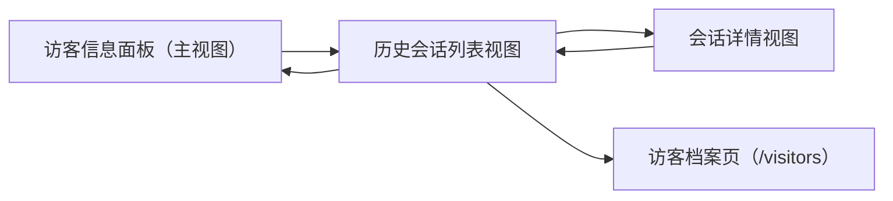
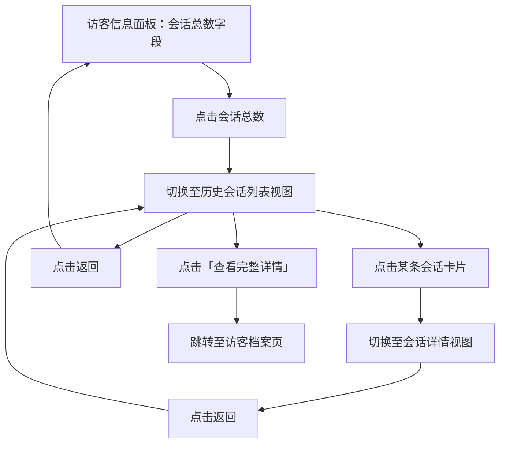

# PRD：历史会话

> **版本**：v1.1 · 2026-04-14
> **状态**：部分实现（当前为 mock 数据，尚未接入真实接口）

---

## 1. 概述

### 1.1 背景与动机

| 痛点 | 影响 |
|------|------|
| 客服在处理会话时无法快速了解该访客的历史沟通记录 | 重复询问访客背景，降低服务效率 |
| 访客详情面板仅展示静态信息，缺乏会话上下文 | 客服无法判断访客诉求的历史脉络 |

历史会话功能允许客服在当前会话处理过程中，直接查看该访客的所有历史会话列表及每条会话的完整消息记录，无需跳转到其他页面。

### 1.2 目标

| Key Result | 量化标准 |
|-----------|---------|
| KR1：历史会话可访问 | 客服可从访客信息面板进入历史会话列表 |
| KR2：历史会话可查阅 | 客服可查看每条历史会话的完整消息记录 |
| KR3：档案可跳转 | 历史会话列表提供跳转访客档案的入口 |

---

## 2. 用户故事

| ID | 角色 | 用户故事 | 验收标准 | 优先级 |
|----|------|---------|----------|--------|
| US-01 | 客服 | 我希望在处理会话时快速查看该访客的历史会话数量 | 访客信息面板中显示会话总数，数字可点击 | P0 |
| US-02 | 客服 | 我希望查看该访客的所有历史会话列表 | 点击会话总数后进入历史会话列表视图 | P0 |
| US-03 | 客服 | 我希望查看某条历史会话的完整消息记录 | 点击列表中的会话卡片后进入会话详情视图 | P0 |
| US-04 | 客服 | 我希望从历史会话列表快速跳转到访客档案 | 历史会话列表标题右侧提供「查看完整详情」入口 | P1 |

---

## 3. 功能设计

### 3.1 信息架构

### 3.2 核心流程

### 3.3 子功能详述

#### 3.3.1 会话总数入口

**功能描述**：访客信息面板中展示该访客的历史会话总数，数字可点击进入历史会话列表。

**需求描述**：
1. 会话总数以「N 个会话」格式展示，其中数字 N 为可点击链接
2. 点击数字后，面板切换至历史会话列表视图
3. 会话总数为 0 时，显示「0 个会话」文字但不可点击（非链接样式）

---

#### 3.3.2 历史会话列表视图

**功能描述**：展示该访客的所有历史会话，以卡片列表形式呈现。

**需求描述**：

1. **视图标题**：显示「历史会话」，标题右侧提供「查看完整详情」链接，点击在当前页跳转至会话记录档案，并定位到该访客的会话档案
2. **返回操作**：标题左侧提供返回按钮，点击返回访客信息主视图
3. **会话卡片**展示以下信息：
   - 会话标题
   - 会话负责人，显示头像和昵称，无负责人时不显示
   - 会话状态标签（待回复 / 已回复 / 排队中 / 待处理 / 已关闭）
   - 会话标签超出显示区域时，以 +1、+2形式折叠显示
4. 点击会话卡片进入该会话的详情视图
5. 页面切换时，自动关闭历史会话列表

---

#### 3.3.3 会话详情视图

**功能描述**：展示某条历史会话的完整消息记录及底部操作入口。

**需求描述**：

1. **视图标题**：显示该会话的标题，标题左侧提供返回按钮，点击返回历史会话列表视图
2. **消息记录**：
   - 按时间顺序展示所有消息
3. **底部操作区**
   - 根据会话状态、客服角色、是否在会话中动态展示操作按钮。与会话档案中一致。
4. **按钮行为**：
   - 「领取会话」：点击后当前客服直接接入该会话，Toast 提示「领取成功」，底部操作区变更为「进入会话」
   - 「分配会话」：点击后弹出分配弹窗（选择客服），确认后 Toast 提示「分配成功」，底部操作区变更为「进入会话」或「加入会话」
   - 「进入会话」：进入目标会话
   - 「加入会话」：进入目标会话
   - 「删除会话」：删除后toast提示「删除成功」，并自动返回到历史会话列页面，历史会话页面无数据时显示空状态
5. 页面切换时，自动关闭历史会话列表

---

## 4. 模块

**功能描述**：在以下功能模块的访客信息面板中，新增展示历史会话列表
- 会话模块（在线会话、在线聊天、Autopilot）
- 访客列表（在线访客、全部访客）
- 客户列表（在线客户、全部客户）
- 档案列表（会话记录）
