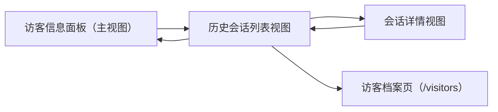
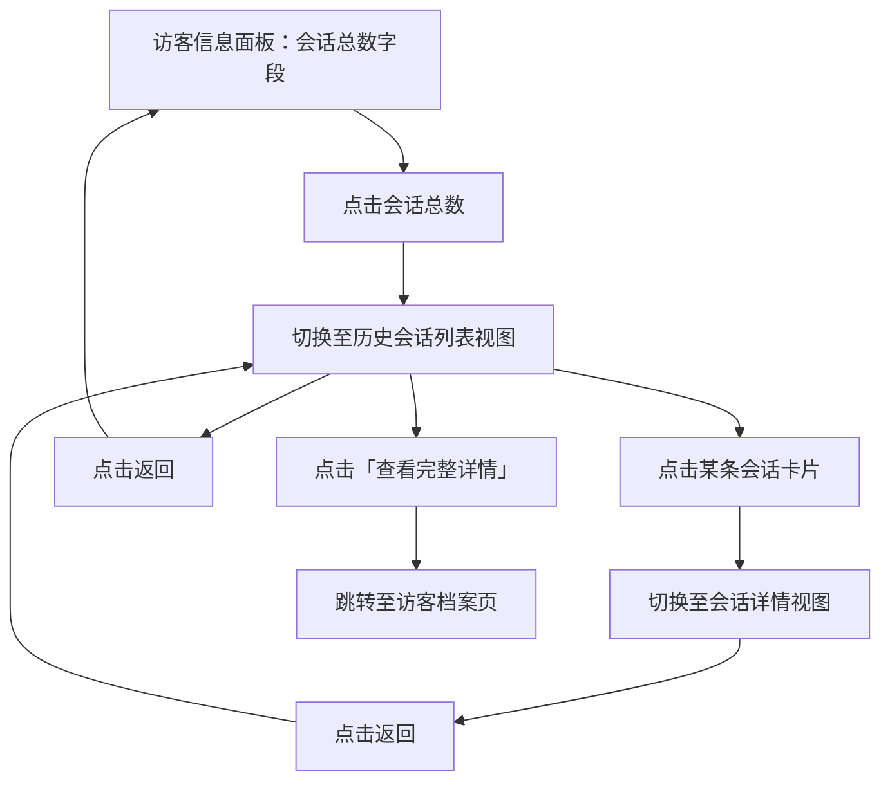

# PRD：历史会话

> **版本**：v1.1 · 2026-04-14
> **状态**：部分实现（当前为 mock 数据，尚未接入真实接口）

---

## 1. 概述

### 1.1 背景与动机

| 痛点 | 影响 |
|------|------|
| 客服在处理会话时无法快速了解该访客的历史沟通记录 | 重复询问访客背景，降低服务效率 |
| 访客详情面板仅展示静态信息，缺乏会话上下文 | 客服无法判断访客诉求的历史脉络 |

历史会话功能允许客服在当前会话处理过程中，直接查看该访客的所有历史会话列表及每条会话的完整消息记录，无需跳转到其他页面。

### 1.2 目标

| Key Result | 量化标准 |
|-----------|---------|
| KR1：历史会话可访问 | 客服可从访客信息面板进入历史会话列表 |
| KR2：历史会话可查阅 | 客服可查看每条历史会话的完整消息记录 |
| KR3：档案可跳转 | 历史会话列表提供跳转访客档案的入口 |

---

## 2. 用户故事

| ID | 角色 | 用户故事 | 验收标准 | 优先级 |
|----|------|---------|----------|--------|
| US-01 | 客服 | 我希望在处理会话时快速查看该访客的历史会话数量 | 访客信息面板中显示会话总数，数字可点击 | P0 |
| US-02 | 客服 | 我希望查看该访客的所有历史会话列表 | 点击会话总数后进入历史会话列表视图 | P0 |
| US-03 | 客服 | 我希望查看某条历史会话的完整消息记录 | 点击列表中的会话卡片后进入会话详情视图 | P0 |
| US-04 | 客服 | 我希望从历史会话列表快速跳转到访客档案 | 历史会话列表标题右侧提供「查看完整详情」入口 | P1 |

---

## 3. 功能设计

### 3.1 信息架构

### 3.2 核心流程

### 3.3 子功能详述

#### 3.3.1 会话总数入口

**功能描述**：访客信息面板中展示该访客的历史会话总数，数字可点击进入历史会话列表。

**需求描述**：
1. 会话总数以「N 个会话」格式展示，其中数字 N 为可点击链接
2. 点击数字后，面板切换至历史会话列表视图
3. 会话总数为 0 时，显示「0 个会话」文字但不可点击（非链接样式）

---

#### 3.3.2 历史会话列表视图

**功能描述**：展示该访客的所有历史会话，以卡片列表形式呈现。

**需求描述**：

1. **视图标题**：显示「历史会话」，标题右侧提供「查看完整详情」链接，点击在当前页跳转至访客档案页（`/visitors`），并定位到该访客的档案详情
2. **返回操作**：标题左侧提供返回按钮，点击返回访客信息主视图
3. **会话卡片**展示以下信息：
   - 会话标题
   - 会话状态标签（待回复 / 已回复 / 排队中 / 待处理 / 已关闭）
   - 负责客服姓名，无负责客服时显示「--」
   - 会话标签（最多展示 3 个，超出截断）
4. 点击会话卡片后，若消息记录加载中显示加载占位状态；加载失败显示 Toast「加载失败，请重试」
5. 点击会话卡片进入该会话的详情视图
6. 列表按会话最后消息时间倒序排列，全量加载（超过 50 条时分页，每页 20 条）

---

#### 3.3.3 会话详情视图

**功能描述**：展示某条历史会话的完整消息记录及底部操作入口。

**需求描述**：

1. **视图标题**：显示该会话的标题，标题左侧提供返回按钮，点击返回历史会话列表视图
2. **消息记录**：
   - 按时间顺序展示所有消息
   - 消息记录为空时，显示「暂无消息记录」
   - 消息分三种角色：访客消息、客服消息、系统消息
   - 系统消息（如「会话开始」「等待分配」）居中展示，不显示头像和发送者
   - 「会话已关闭」系统消息不展示
   - 客服消息和访客消息展示发送者姓名、发送时间、消息内容
   - 发送时间格式：同日消息显示「HH:mm」，跨日消息显示「MM-DD HH:mm」
3. **底部操作区**根据会话状态展示不同操作：
   - 排队中：「分配会话」+「领取会话」两个并排按钮
   - 待处理：「分配会话」+「进入会话」两个并排按钮
   - 其他状态（待回复、已回复、已关闭）：「进入会话」单个全宽按钮
4. **按钮行为**：
   - 「领取会话」：点击后当前客服直接接入该会话，Toast 提示「领取成功」，底部操作区变更为「进入会话」
   - 「分配会话」：点击后弹出分配弹窗（选择客服），确认后 Toast 提示「分配成功」，底部操作区变更为「进入会话」
   - 「进入会话」：工作台切换至目标会话，原会话状态不受影响；已关闭会话进入后为只读模式，不可发送消息

---

### 3.4 状态机

| 会话状态 | 含义 | 底部操作 |
|---------|------|---------|
| 待回复 | 访客已发消息，等待客服回复 | 进入会话 |
| 已回复 | 客服已回复，等待访客 | 进入会话 |
| 排队中 | 等待客服接入 | 分配会话 / 领取会话 |
| 待处理 | 已分配，等待处理 | 分配会话 / 进入会话 |
| 已关闭 | 会话已结束，只读 | 进入会话（只读） |

---

## 4. 数据模型

| 实体 | 字段 | 类型 | 说明 |
|------|------|------|------|
| 会话 | 标题 | 文本 | 会话主题 |
| 会话 | 状态 | 枚举 | 待回复 / 已回复 / 排队中 / 待处理 / 已关闭 |
| 会话 | 负责客服 | 文本 | 可为空，空时显示「--」 |
| 会话 | 标签 | 文本数组 | 最多展示 3 个 |
| 会话 | 最后消息时间 | 时间 | 用于列表倒序排列 |
| 消息 | 角色 | 枚举 | 访客 / 客服 / 系统 |
| 消息 | 发送者 | 文本 | 系统消息为空 |
| 消息 | 内容 | 文本 | 消息正文 |
| 消息 | 发送时间 | 时间 | 系统消息为空 |

---

## 5. 权限与角色

| 功能 | 客服 | 说明 |
|------|------|------|
| 查看历史会话列表 | 可见 | 仅限当前处理会话的访客 |
| 查看会话消息记录 | 可见 | — |
| 跳转访客档案 | 可见 | 跳转至 `/visitors` |
| 领取 / 分配会话 | 可操作 | 仅排队中 / 待处理状态可用 |

---

## 6. 跨模块联动

| 联动模块 | 联动方式 | 说明 |
|----------|----------|------|
| 访客档案（/visitors） | 页面跳转 | 历史会话列表提供「查看完整详情」入口，定位到该访客档案详情 |
| 会话列表 | 切换会话 | 会话详情底部「进入会话」按钮切换工作台至目标会话，原会话状态不变 |
