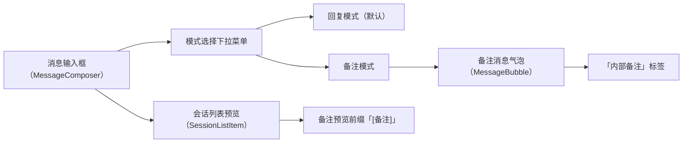
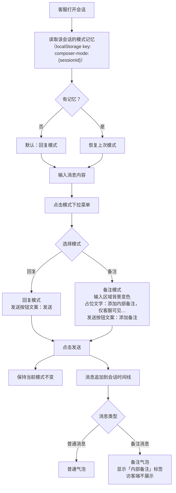

# PRD：在线会话 Note 内部备注

> **版本**：v1.0 · 2026-04-04
> **状态**：部分实现（UI 层已完成，数据层存在缺口，详见第 8 节）

---

## 1. 概述

### 1.1 背景与动机

| 痛点 | 影响 |
|------|------|
| 客服在处理会话时需要记录内部信息（如处理进展、特殊情况、交接说明），但系统没有内部备注渠道 | 客服依赖记忆或口头沟通，信息无法持久化，团队交接时容易出现信息断层、重复询问访客 |

在线会话消息输入框新增「备注」模式，客服可在不打断访客对话的情况下发送仅内部可见的备注消息，备注与普通消息共存于同一会话时间线，可被搜索功能索引。

### 1.2 目标

| Key Result | 量化标准 |
|-----------|---------|
| KR1：客服可在会话中发送内部备注 | 备注消息在客服端可见，访客端不展示 |
| KR2：备注消息在视觉上与普通消息可区分 | 备注气泡有独立标识，不与普通消息混淆 |
| KR3：模式选择持久化 | 切换会话后，各会话的模式选择独立保留 |

---

## 2. 用户故事

| ID | 角色 | 用户故事 | 验收标准 | 优先级 |
|----|------|---------|----------|--------|
| US-01 | 一线客服坐席 | 我希望在回复访客的同时，能记录一条仅同事可见的内部备注 | 切换到备注模式后发送的消息，访客端不展示，客服端显示「内部备注」标识 | P0 |
| US-02 | 一线客服坐席 | 我希望系统记住我在每个会话中选择的模式 | 切换到其他会话再切回，模式选择保持不变 | P1 |
| US-03 | 一线客服坐席 | 我希望能通过搜索找到历史备注内容 | 备注消息内容可被现有会话搜索功能索引 | P1 |

---

## 3. 功能设计

### 3.1 信息架构

### 3.2 核心流程

### 3.3 子功能详述

#### 3.3.1 模式选择下拉菜单

**功能描述**：输入框顶部提供「回复 / 备注」模式切换入口。

**用户场景**：客服需要在回复访客和记录内部备注之间切换。

**前置条件**：
1. 会话处于进行中状态（非已关闭）；已关闭会话的输入框整体不可用，模式选择按钮不展示，本地存储中的模式记忆保留

**交互流程**：
1. 客服点击输入框顶部的模式按钮（显示当前模式名称和图标）
2. 弹出下拉菜单，包含「回复」和「备注」两个选项，当前选中项高亮
3. 客服点击目标模式
4. 菜单关闭，输入框切换至对应模式
5. 点击菜单外区域，菜单关闭，模式不变

**需求描述（功能规则）**：
1. **默认状态**：新会话默认为回复模式
2. **模式持久化**：以 `sessionId` 为维度，将模式选择存储于浏览器本地存储（key 格式：`composer-mode:{sessionId}`）；回复模式不写入存储，备注模式写入值 `"note"`
3. **会话切换**：切换到其他会话时，读取目标会话的模式记忆并恢复；无记忆则默认回复模式
4. **发送后行为**：发送消息后保持当前模式不变，不自动切回回复模式
5. **输入内容保留**：切换模式时，输入框中已输入的内容不清空
6. **记忆清除**：会话永久删除时，清除对应的 `composer-mode:{sessionId}` 本地存储条目
7. **多标签页**：模式记忆为单标签页本地状态，多标签页间不同步
8. **键盘交互**：本期仅支持鼠标点击切换模式，不支持键盘导航

**后置条件**：
1. 模式选择写入本地存储
2. 输入框视觉状态更新（详见 3.3.2）
3. 发送成功：备注气泡即时追加到会话时间线末尾，无 Toast
4. 发送失败：气泡显示发送失败状态，与普通消息失败处理一致

---

#### 3.3.2 备注模式输入框

**功能描述**：备注模式下，输入框区域提供明显的视觉区分，提示客服当前处于内部备注状态。

**需求描述（功能规则）**：
1. **整体背景**：备注模式时，整个输入框区域（含工具栏）切换为备注专属背景色，与普通输入框背景可区分；切换即时生效
2. **占位文字**：`添加内部备注，仅客服可见…`
3. **发送按钮文案**：`添加备注`（回复模式为`发送`）
4. **发送按钮禁用条件**：输入内容去除首尾空格后为空时禁用，与回复模式一致
5. **内容长度**：备注内容长度限制与普通消息一致

---

#### 3.3.3 备注消息气泡

**功能描述**：备注消息在会话时间线中以独立样式展示，与普通消息可区分。

**需求描述（功能规则）**：
1. **气泡背景**：备注气泡使用备注专属背景色，与普通客服消息气泡可区分
2. **「内部备注」标签**：气泡内顶部显示「内部备注」文字标签
3. **位置**：备注消息由客服发送，在消息时间线中的位置与普通客服消息一致
4. **访客端不展示**：`isNote: true` 的消息不在访客端渲染（由数据层过滤保证）
5. **操作菜单**：备注气泡的 hover 操作菜单与普通消息一致（复制、翻译、撤回等）

---

#### 3.3.4 会话列表预览

**功能描述**：会话列表中，最后一条消息为备注时，预览文字加前缀标识。

**需求描述（功能规则）**：
1. 最后一条消息为备注且无搜索关键词时，预览文字格式为：`[备注] {内容前20字}`
2. 搜索关键词命中备注消息时，预览显示匹配内容并高亮关键词，不加「[备注]」前缀
3. 最后一条消息为普通消息时，保持现有预览逻辑不变

---

### 3.4 状态机

| 模式 | 含义 | 允许的操作 |
|------|------|-----------|
| 回复模式 | 发送的消息访客可见 | 切换至备注模式、输入内容、发送 |
| 备注模式 | 发送的消息仅客服可见 | 切换至回复模式、输入内容、添加备注 |

---

## 4. 数据模型

| 实体名 | 字段 | 类型 | 说明 |
|--------|------|------|------|
| MessageItem | id | string | 消息唯一标识 |
| MessageItem | role | `"agent" \| "customer" \| "system" \| "bot"` | 发送方角色 |
| MessageItem | content | string | 消息内容 |
| MessageItem | isNote | boolean | 是否为内部备注，默认 false |
| MessageItem | time | string | 发送时间 |

---

## 5. 权限与角色

| 功能 | 客服坐席 | 访客 | 无权限时的表现 |
|------|---------|------|--------------|
| 发送备注消息 | 允许 | 不适用 | — |
| 查看备注消息 | 允许（所有客服可见） | 禁止 | 访客端不渲染 `isNote: true` 的消息 |
| 切换输入模式 | 允许 | 不适用 | — |

---

## 6. 约束与依赖

| 约束/依赖 | 说明 | 影响范围 |
|----------|------|---------|
| 本地存储 | 模式记忆依赖浏览器 localStorage，清除浏览器数据后模式记忆丢失 | 模式持久化 |
| 访客端过滤 | 访客端不展示备注消息，当前为前端 mock 阶段，后端集成时需在接口层过滤；访客端搜索不返回备注消息 | 数据安全 |
| 搜索索引 | 备注消息能否被现有搜索功能索引，取决于搜索组件是否过滤 `isNote` 字段，需验证；搜索结果中备注消息显示「内部备注」标识 | 搜索功能 |

---

## 7. 异常处理

| 异常场景 | 处理方式 | 用户感知 |
|---------|---------|---------|
| 输入框为空时点击「添加备注」 | 按钮处于禁用状态，不响应点击 | 按钮不可点击 |
| 切换会话时本地存储读取失败 | 降级为默认回复模式 | 无感知，静默降级 |

---

## 8. 跨模块联动

| 联动模块 | 联动方式 | 说明 |
|----------|----------|------|
| MessageBubble | 新增 `isNote` prop | 备注气泡样式和「内部备注」标签 |
| SessionListItem | 新增 `isNotePreview` prop | 会话列表预览前缀 |
| MessageItem 类型 | 新增 `isNote?: boolean` 字段 | 默认 false，备注消息为 true |
| handleSend（App.vue） | 接收 `isNote` 参数并写入消息对象 | 备注消息携带 isNote 标记 |
| 档案页面 | 复用 MessageBubble 组件 | 备注消息在档案中同样显示「内部备注」标签；访客端档案不展示备注消息 |

---

## 9. 开放问题

| # | 问题 | 备选方案 | 当前倾向 | 状态 |
|---|------|---------|---------|------|
| 1 | 备注消息是否支持被所有客服查看，还是仅发送者可见？ | A) 所有客服可见 B) 仅发送者可见 | A) 所有客服可见 | 已确认：所有客服可见 |
| 2 | 搜索功能是否需要区分「仅搜索备注」和「仅搜索普通消息」？ | A) 统一搜索 B) 增加筛选项 | A) 统一搜索（最小版本） | 待确认 |
| 3 | 备注消息是否支持撤回？ | A) 支持，与普通消息一致 B) 不支持 | 待定 | 待确认 |
