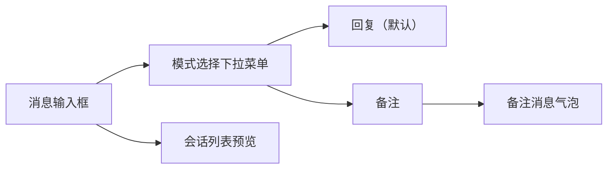
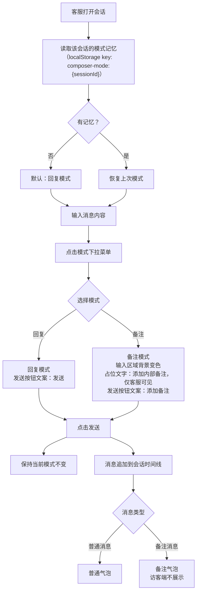

# PRD：在线会话 Note 内部备注

> **版本**：v1.0 · 2026-04-04
> **状态**：已实现

---

## 1. 概述

### 1.1 背景与动机

| 痛点 | 影响 |
|------|------|
| 客服在处理会话时需要记录内部信息（如处理进展、特殊情况、交接说明），但系统没有内部备注渠道 | 客服依赖记忆或口头沟通，信息无法持久化，团队交接时容易出现信息断层、重复询问访客 |

在线会话消息输入框新增「备注」模式，客服可在不打断访客对话的情况下发送仅内部可见的备注消息，备注与普通消息共存于同一会话时间线，可被搜索功能索引。

### 1.2 目标

| Key Result | 量化标准 |
|-----------|---------|
| KR1：客服可在会话中发送内部备注 | 备注消息在客服端可见，访客端不展示 |
| KR2：备注消息在视觉上与普通消息可区分 | 备注气泡有独立标识，不与普通消息混淆 |
| KR3：模式选择持久化 | 切换会话后，各会话的模式选择独立保留 |

---

## 2. 用户故事

| ID | 角色 | 用户故事 | 验收标准 | 优先级 |
|----|------|---------|----------|--------|
| US-01 | 一线客服坐席 | 我希望在回复访客的同时，能记录一条仅同事可见的内部备注 | 切换到备注模式后发送的消息，访客端不展示，客服端显示「内部备注」标识 | P0 |
| US-02 | 一线客服坐席 | 我希望系统记住我在每个会话中选择的模式 | 切换到其他会话再切回，模式选择保持不变 | P1 |
| US-03 | 一线客服坐席 | 我希望能通过搜索找到历史备注内容 | 备注消息内容可被现有会话搜索功能索引 | P1 |

---

## 3. 功能设计

### 3.1 信息架构

### 3.2 核心流程

### 3.3 子功能详述

#### 3.3.1 模式选择下拉菜单

**功能描述**：输入框顶部提供「回复 / 备注」模式切换入口。

**用户场景**：客服需要在回复访客和记录内部备注之间切换。

**前置条件**：
1. 会话处于进行中状态（非已关闭）；已关闭会话的输入框整体不可用，模式选择按钮不展示

**交互流程**：
1. 客服点击输入框顶部的模式按钮
2. 弹出下拉菜单，包含「回复」和「备注」两个选项
3. 客服点击目标模式
4. 菜单关闭，输入框切换至对应模式
5. 点击菜单外区域，菜单关闭，模式不变

**需求描述（功能规则）**：
1. **默认状态**：新会话默认为回复模式
2. **模式持久化**：以会话为维度，将模式选择存储于浏览器本地存储
3. **会话切换**：切换到其他会话时，读取目标会话的模式记忆并恢复；无记忆则默认回复模式
4. **发送后行为**：发送消息后保持当前模式不变，不自动切回回复模式
5. **输入内容保留**：切换模式时，输入框中已输入的内容不清空
6. **Email 渠道**：邮件会话同样支持模式切换；备注模式时隐藏 To/From 收发件人行，整体背景切换为备注专属背景色

**后置条件**：
1. 模式选择写入本地存储
2. 输入框视觉状态更新（详见 3.3.2）
3. 发送成功：备注气泡即时追加到会话时间线末尾
4. 发送失败：气泡显示发送失败状态，与普通消息失败处理一致

---

#### 3.3.2 备注模式输入框

**功能描述**：备注模式下，输入框区域提供明显的视觉区分，提示客服当前处于内部备注状态。

**需求描述（功能规则）**：
1. **整体背景**：备注模式时，整个输入框区域（含工具栏）切换为备注专属背景色，与普通输入框背景可区分；切换即时生效
2. **占位文字**：`添加内部备注，仅客服可见`
3. **发送按钮文案**：`添加备注`（回复模式为`发送`）
4. **内容长度**：备注内容长度限制与普通消息一致
4. **隐藏功能菜单**：切换至备注模式后，输入框上方的 Copilot 推荐回复、AI 翻译及远程协助功能将隐藏不展示；表情、快捷回复、附件、图片、文本润色功能可正常使用。

---

#### 3.3.3 备注消息气泡

**功能描述**：备注消息在会话时间线中以独立样式展示，与普通消息可区分。

**需求描述（功能规则）**：
1. **气泡背景**：备注气泡使用备注专属背景色，与普通客服消息气泡可区分
2. **位置**：备注消息由客服发送，在消息时间线中的位置与普通客服消息一致
3. **访客端不展示**：备注消息不在访客端渲染
4. **操作菜单**：备注气泡的 hover 操作菜单仅显示复制，其他消息操作（如：撤回、回复、翻译等）不可用
5. **AI 忽略**：备注回复会被AI忽略，不作为上下文传入AI
6. **风控忽略**：备注回复不传递给风控检测

---

#### 3.3.4 回复模式媒体消息卡片

**功能描述**：回复模式下发送图片、视频、文件等媒体内容时，消息以专属卡片样式展示，与回复模式下消息区分。

**需求描述（功能规则）**：
1. **背景色**：媒体消息气泡使用与备注消息气泡一致的背景色，与普通客服消息背景色不同

---

### 3.4 状态机

| 模式 | 含义 | 允许的操作 |
|------|------|-----------|
| 回复模式 | 发送的消息访客可见 | 切换至备注模式、输入内容、发送 |
| 备注模式 | 发送的消息仅客服可见 | 切换至回复模式、输入内容、添加备注 |

---

## 4. 权限与角色

| 功能 | 客服坐席 | 访客 | 无权限时的表现 |
|------|---------|------|--------------|
| 发送备注消息 | 允许 | 不适用 | — |
| 查看备注消息 | 允许（所有客服可见） | 禁止 | 访客端不渲染 |
| 切换输入模式 | 允许 | 不适用 | — |

---

## 5. 约束与依赖

| 约束/依赖 | 说明 | 影响范围 |
|----------|------|---------|
| 本地存储 | 模式记忆依赖浏览器 localStorage，清除浏览器数据后模式记忆丢失 | 模式持久化 |
| 访客端过滤 | 访客端不展示备注消息 | 数据安全 |
| 搜索索引 | 备注消息能否被现有搜索功能索引 | 搜索功能 |

---

## 6. 异常处理

| 异常场景 | 处理方式 | 用户感知 |
|---------|---------|---------|
| 输入框有内容时切换模式 | 内容保留 | 内容保留 |
| 切换会话时本地存储读取失败 | 降级为默认回复模式 | 无感知，静默降级 |

