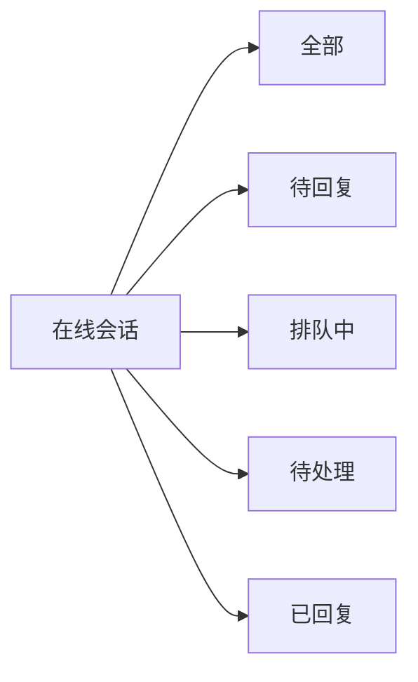
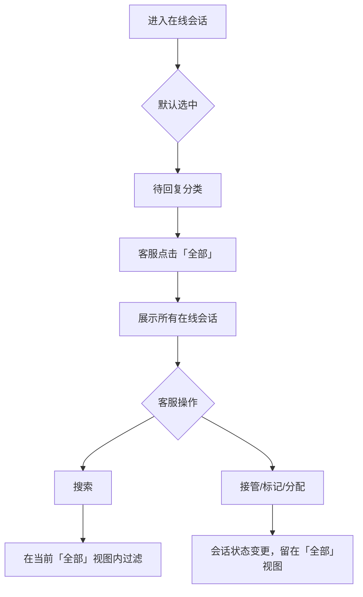

# PRD：在线会话「全部」分类

> **版本**：v1.0 · 2026-04-04
> **状态**：已交付

---

## 1. 概述

### 1.1 背景与动机

| 痛点 | 影响 |
|------|------|
| 客服需要在四个分类间逐一切换才能看到所有在线会话 | 无法快速掌握全局会话状态，影响响应效率 |

在线会话模块原有四个分类：待回复、排队中、待处理、已回复。客服反馈需要一个汇总视图，能一次性看到所有状态的会话，同时保留按状态分类查看的能力。

### 1.2 目标

| Key Result | 量化标准 |
|-----------|---------|
| KR1：减少客服切换分类次数 | 提供「全部」入口，无需逐一切换即可查看全局 |

---

## 2. 用户故事

| ID | 角色 | 用户故事 | 验收标准 | 优先级 |
|----|------|---------|----------|--------|
| US-01 | 客服 | 我希望能一眼看到所有在线会话，不需要逐个切换分类 | 点击「全部」分类，列表展示所有状态的在线会话 | P0 |
| US-02 | 客服 | 我希望在不确定会话所在分类时，能快速找到它 | 在「全部」分类下输入关键词可搜索到目标会话 | P0 |
| US-03 | 客服 | 我希望进入在线会话时默认看到最需要处理的内容 | 默认选中「待回复」分类，而非「全部」 | P0 |

---

## 3. 功能设计

### 3.1 信息架构

「全部」排在分类列表第一位，其余分类顺序不变。

### 3.2 核心流程

### 3.3 子功能详述

#### 3.3.1 「全部」分类入口

**功能描述**：在在线会话分类列表开头新增「全部」分类，展示所有状态的在线会话。

**用户场景**：客服需要查看全局会话状态，或查找不确定所在分类的会话。

**前置条件**：
1. 用户已进入「消息 - 在线会话」模块

**交互流程**：
1. 用户点击「全部」分类
2. 系统将会话列表切换为展示所有在线会话（待回复、排队中、待处理、已回复）
3. 搜索关键词、访客/客户筛选条件重置为默认值
4. 列表按原有排序规则展示

**需求描述（功能规则）**：
1. **展示范围**：「全部」分类展示待回复、排队中、待处理、已回复四种状态的会话，不包含其他渠道（如聊天室）的会话
2. **默认选中**：进入在线会话模块时，默认选中「待回复」分类，不是「全部」
3. **分类切换重置**：切换到任意分类（包括「全部」）时，搜索关键词、搜索字段范围、访客/客户筛选条件均重置为默认值
4. **访客/客户筛选**：「全部」分类下，访客/客户筛选功能正常可用
5. **搜索**：「全部」分类下，搜索功能正常可用，搜索范围为当前「全部」视图内的所有会话

**后置条件**：
1. 会话列表展示所有在线状态的会话
2. 搜索和筛选条件已重置

#### 3.3.2 操作后视图保持

**功能描述**：在「全部」分类下执行会话操作（接管、标记待处理、取消待处理、AI 分配、队列分配）后，视图保持在「全部」分类，不强制跳转到其他分类。

**用户场景**：客服在「全部」视图下批量处理会话，操作后不希望被打断跳转。

**前置条件**：
1. 当前选中「全部」分类

**交互流程**：
1. 客服在「全部」分类下对某个会话执行操作（如接管）
2. 系统完成操作，更新该会话的状态
3. 视图保持在「全部」分类，列表刷新反映状态变更

**需求描述（功能规则）**：
1. **接管会话**：操作完成后，若当前在「全部」分类，不跳转到「待回复」
2. **标记待处理**：操作完成后，若当前在「全部」分类，不跳转到「待处理」
3. **取消待处理**：操作完成后，若当前在「全部」分类，不跳转到「待回复」
4. **AI 分配**：分配完成后，若当前在「全部」分类且无其他同类会话需要处理，不跳转到「待回复」
5. **队列分配**：分配完成后，若当前在「全部」分类且无其他同类会话需要处理，不跳转到「待回复」
6. **非「全部」分类**：在其他分类下执行上述操作，跳转行为保持原有逻辑不变

**后置条件**：
1. 会话状态已更新
2. 当前分类保持为「全部」
3. 列表反映最新状态

---

## 4. 异常处理

| 异常场景 | 处理方式 | 用户感知 |
|---------|---------|---------|
| 「全部」分类下无会话 | 展示空状态提示 | 显示「你目前没有会话」 |
| 搜索无结果 | 展示空状态提示 | 显示「暂无符合条件的会话」 |

---

## 5. 跨模块联动

| 联动模块 | 联动方式 | 说明 |
|----------|----------|------|
| 访客/客户筛选 | 在「全部」分类下正常工作 | 筛选范围为「全部」视图内的会话 |
| 搜索功能 | 在「全部」分类下正常工作 | 搜索范围为「全部」视图内的会话 |
| 会话操作（接管/标记/分配） | 操作后保持「全部」视图 | 详见 3.3.2 |
