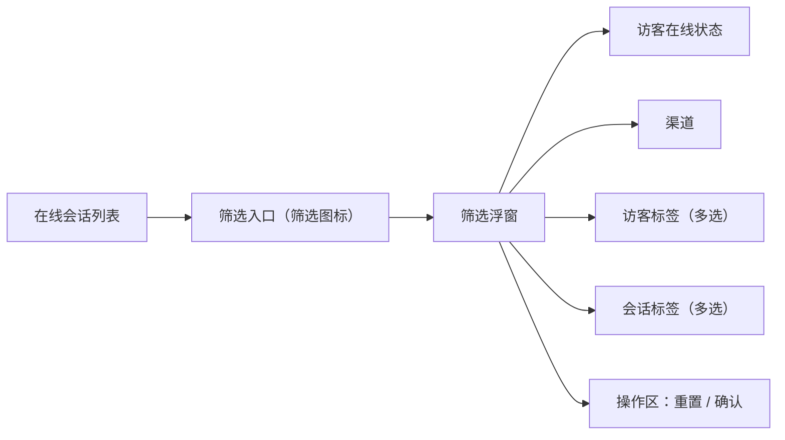
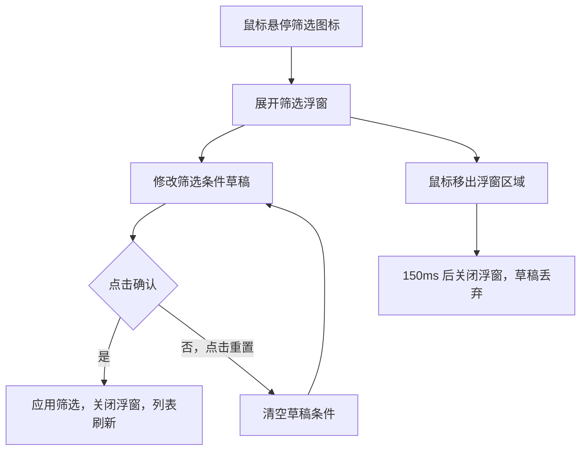

# PRD：在线会话筛选

> **版本**：v1.0 · 2026-04-05
> **状态**：草稿

---

## 1. 概述

### 1.1 背景与动机

| 痛点 | 影响 |
|------|------|
| 客服在待回复、排队中等队列中无法快速定位特定类型的会话 | 需要逐条翻阅，处理效率低 |
| 访客在线状态、渠道来源、标签等维度无法组合筛选 | 无法按优先级处理高价值或在线访客 |

客服工作台的在线会话列表支持多维度筛选，帮助客服快速缩小目标会话范围，提升处理效率。

### 1.2 目标

| Key Result | 量化标准 |
|-----------|---------|
| KR1：减少客服查找目标会话的操作步骤 | 通过筛选条件直接定位，无需手动翻阅 |

### 1.3 非目标（本期不做）

- 在线聊天、Autopilot 队列中的筛选功能
- 筛选条件的保存与复用

---

## 2. 用户故事

| ID | 角色 | 用户故事 | 验收标准 | 优先级 |
|----|------|---------|----------|--------|
| US-01 | 客服 | 我希望只查看当前在线的访客会话，以便优先响应 | 选择「在线」后，列表只显示访客在线的会话 | P0 |
| US-02 | 客服 | 我希望按渠道筛选会话，以便专注处理某类渠道 | 选择渠道后，列表只显示该渠道的会话 | P0 |
| US-03 | 客服 | 我希望按访客标签筛选，以便优先处理高价值访客 | 选择标签后，列表只显示带有该标签的会话 | P0 |
| US-04 | 客服 | 我希望按会话标签筛选，以便快速找到特定类型的会话 | 选择标签后，列表只显示带有该标签的会话 | P0 |

---

## 3. 功能设计

### 3.1 信息架构

### 3.2 核心流程

### 3.3 子功能详述

#### 3.3.1 筛选入口

**功能描述**：在线会话列表头部的筛选图标，鼠标悬停时展开筛选浮窗。

**前置条件**：
1. 当前队列属于在线会话分组（全部、待回复、排队中、待处理、已回复）

**交互流程**：
1. 鼠标悬停筛选图标，浮窗展开，草稿条件初始化为当前已应用的筛选条件
2. 鼠标移出筛选图标及浮窗区域，延迟 150 毫秒后关闭浮窗，草稿丢弃

**需求描述（功能规则）**：
1. 筛选图标仅在在线会话分组的队列中显示，在线聊天和 Autopilot 队列中不显示
2. 当前存在已应用的筛选条件时，筛选图标呈激活状态
3. 浮窗展开时，草稿条件复制自当前已应用条件，不影响列表展示
4. 切换队列时，已应用的筛选条件自动重置为默认值（所有维度不过滤），筛选图标激活状态同步取消

#### 3.3.2 访客在线状态筛选

**功能描述**：按访客当前是否在线筛选会话列表。

**需求描述（功能规则）**：
1. 选项：全部（默认）、在线、离线，单选
2. 选择「在线」时，只显示访客当前在线的会话
3. 选择「离线」时，只显示访客当前不在线的会话
4. 选择「全部」时，不按此维度过滤

#### 3.3.3 渠道筛选

**功能描述**：按会话来源渠道筛选会话列表。

**需求描述（功能规则）**：
1. 渠道选项：网页、网页插件、Email，支持多选
2. 选中多个渠道时，显示属于任一所选渠道的会话（OR 逻辑）
3. 未选中任何渠道时，不按此维度过滤

#### 3.3.4 访客标签筛选

**功能描述**：按访客标签筛选会话列表，标签来源为「设置 - 访客标签」中客服自定义的标签。

**需求描述（功能规则）**：
1. 以下拉多选框形式展示，点击触发器展开标签列表
2. 标签列表来源于系统中已配置的访客标签，动态读取
3. 支持多选，选中多个标签时，显示访客带有任一所选标签的会话（OR 逻辑）
4. 触发器文案：未选中时显示「请选择」；选中后显示所选标签名称，多个标签以顿号分隔；文本超出显示区域时末尾截断并显示省略号
5. 未选中任何标签时，不按此维度过滤

#### 3.3.5 会话标签筛选

**功能描述**：按会话标签筛选会话列表，标签来源为「设置 - 会话标签」中客服自定义的标签。

**需求描述（功能规则）**：
1. 以下拉多选框形式展示，点击触发器展开标签列表
2. 标签列表来源于系统中已配置的会话标签，动态读取
3. 支持多选，选中多个标签时，显示带有任一所选标签的会话（OR 逻辑）
4. 触发器文案：未选中时显示「请选择」；选中后显示所选标签名称，多个标签以顿号分隔；文本超出显示区域时末尾截断并显示省略号
5. 未选中任何标签时，不按此维度过滤

#### 3.3.6 筛选操作区

**功能描述**：浮窗底部的重置和确认操作。

**需求描述（功能规则）**：
1. **重置**：清空浮窗内所有草稿条件，恢复为默认值（在线状态选「全部」，渠道、访客标签、会话标签均不选），不关闭浮窗，不影响当前已应用的筛选
2. **确认**：将草稿条件写入已应用条件，关闭浮窗，会话列表立即按新条件刷新；确认按钮始终可点击，无禁用状态

### 3.4 多条件组合逻辑

多个筛选维度同时生效时，各维度之间为 AND 逻辑：

- 访客在线状态 AND 渠道 AND 访客标签 AND 会话标签
- 同一维度内多个选项之间为 OR 逻辑（如选中「网页」和「Email」，显示属于任一渠道的会话）

---

## 4. 数据模型

| 字段 | 类型 | 说明 |
|------|------|------|
| 访客在线状态 | 枚举（全部 / 在线 / 离线） | 默认「全部」，不过滤 |
| 渠道 | 字符串数组 | 可选值：网页、网页插件、Email；空数组表示不过滤 |
| 访客标签 | 字符串数组（标签 ID） | 来源于访客标签配置；空数组表示不过滤 |
| 会话标签 | 字符串数组（标签 ID） | 来源于会话标签配置；空数组表示不过滤 |

---

## 5. 权限与角色

| 功能 | 客服 | 管理员 | 无权限时的表现 |
|------|------|--------|--------------|
| 使用筛选功能 | 可用 | 可用 | — |
| 访客标签来源 | 读取「设置 - 访客标签」配置 | 同左 | 标签列表为空 |
| 会话标签来源 | 读取「设置 - 会话标签」配置 | 同左 | 标签列表为空 |

---

## 6. 异常处理

| 异常场景 | 处理方式 | 用户感知 |
|---------|---------|---------|
| 访客标签或会话标签列表为空 | 下拉框展开后显示空列表 | 无可选标签，不影响其他筛选维度 |
| 筛选条件组合后无匹配会话 | 列表显示空状态 | 列表区域显示「当前筛选条件下暂无会话，请调整筛选条件后重试」 |
| 鼠标在浮窗内操作时移出再移入 | 取消关闭计时器，浮窗保持展开 | 操作不中断 |
| 已应用的标签筛选条件中包含已被删除的标签 | 该标签自动从筛选条件中移除，列表按剩余条件重新过滤 | 筛选结果自动更新，若所有标签均被删除则该维度不再过滤 |

---

## 7. 跨模块联动

| 联动模块 | 联动方式 | 说明 |
|----------|----------|------|
| 设置 - 访客标签 | 数据读取 | 筛选面板中的访客标签列表来源于此模块的配置 |
| 设置 - 会话标签 | 数据读取 | 筛选面板中的会话标签列表来源于此模块的配置 |
| 在线会话列表 | 实时过滤 | 确认筛选后，列表立即按条件重新过滤展示 |
