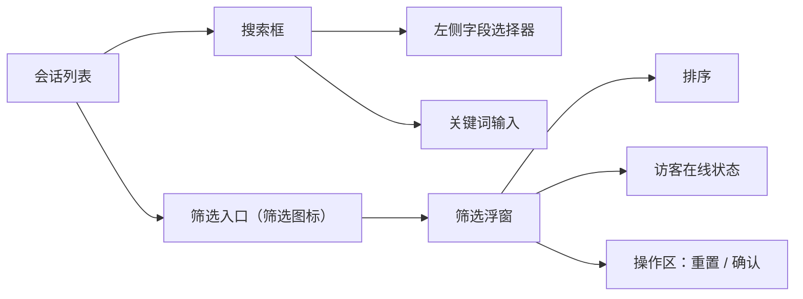
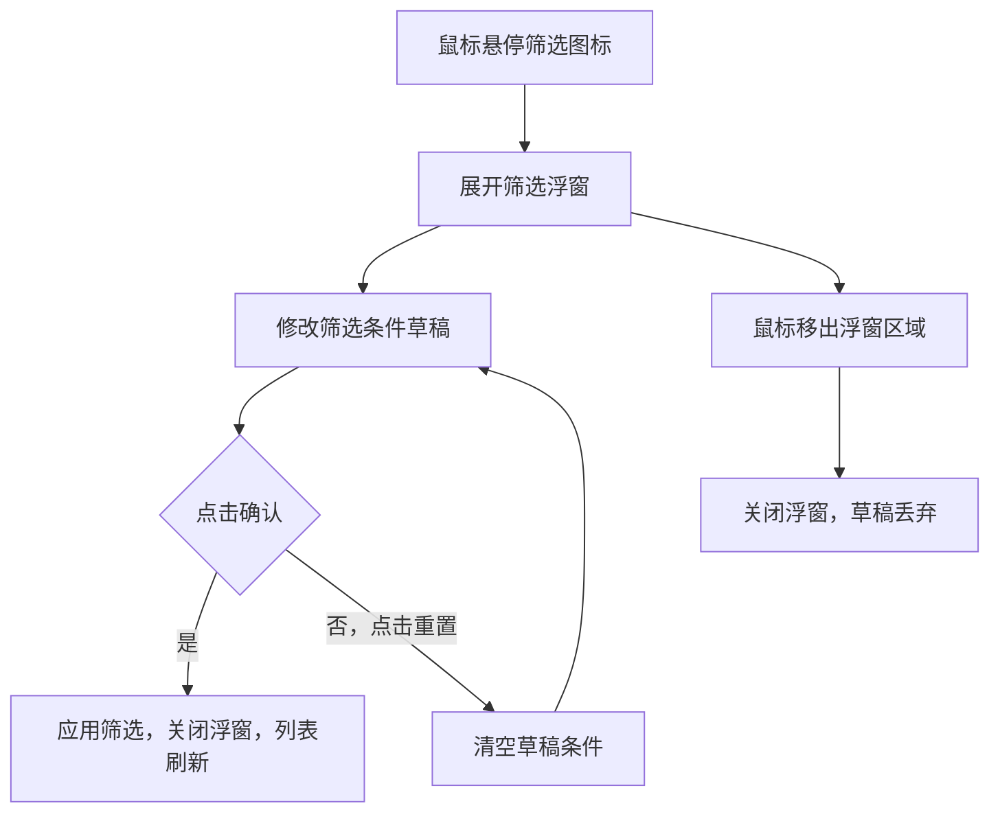

# PRD：在线会话筛选

> **版本**：v1.2 · 2026-04-07
> **状态**：草稿

---

## 1. 概述

### 1.1 背景与动机

| 痛点 | 影响 |
|------|------|
| 访客在线状态无法筛选 | 无法优先处理在线访客 |

客服工作台的在线会话列表支持多维度筛选，帮助客服快速缩小目标会话范围，提升处理效率。

### 1.2 目标

| Key Result | 量化标准 |
|-----------|---------|
| KR1：减少客服查找目标会话的操作步骤 | 通过筛选条件直接定位，无需手动翻阅 |

---

## 2. 用户故事

| ID | 角色 | 用户故事 | 验收标准 | 优先级 |
|----|------|---------|----------|--------|
| US-01 | 客服 | 我希望只查看当前在线的访客会话，以便优先响应 | 选择「在线」后，列表只显示访客在线的会话 | P0 |
| US-02 | 客服 | 我希望调整会话列表的排序方式 | 可在筛选面板中切换倒序/正序 | P0 |
| US-03 | 客服 | 我希望按特定字段搜索会话，以便快速定位 | 可在搜索框左侧选择搜索字段，默认为全部 | P0 |

---

## 3. 功能设计

### 3.1 信息架构

### 3.2 核心流程

### 3.3 子功能详述

#### 3.3.1 筛选入口

**功能描述**：会话列表头部的筛选图标，鼠标悬停时展开筛选浮窗。

**前置条件**：
1. 当前队列属于在线会话分组（全部、待回复、排队中、待处理、已回复）、在线聊天分组（聊天）或 Autopilot 分组

**交互流程**：
1. 鼠标悬停筛选图标，浮窗展开，草稿条件初始化为当前已应用的筛选条件
2. 鼠标移出筛选图标及浮窗区域，关闭浮窗，草稿丢弃

**需求描述（功能规则）**：
1. 筛选图标在在线会话、在线聊天、Autopilot 所有队列中均显示
2. 当前存在已应用的筛选条件时，筛选图标呈激活状态，显示红点 badge
3. 切换队列时，已应用的筛选条件自动重置为默认值，筛选图标激活状态同步取消

#### 3.3.2 排序

**功能描述**：筛选面板顶部的排序选项，控制会话列表的排列顺序。

**需求描述（功能规则）**：
1. 选项：倒序（默认）、正序，单选
2. 会话消息列表排序功能和筛选功能合并

#### 3.3.3 访客在线状态筛选

**功能描述**：按访客当前是否在线筛选会话列表。

**需求描述（功能规则）**：
1. 选项：全部（默认）、在线、离线，单选
2. 选择「在线」时，只显示访客/客户当前在线的会话
3. 选择「离线」时，只显示访客/客户当前不在线的会话
4. 选择「全部」时，不按此维度过滤
5. 在线会话、在线聊天、Autopilot 所有队列均显示此筛选项
6. 在线聊天中群聊在「在线」筛选下不显示，「离线」和「全部」下显示

#### 3.3.4 搜索字段选择

**功能描述**：搜索框左侧的字段选择器，用于指定搜索范围。

**需求描述（功能规则）**：
1. 选择器默认显示「全部」，点击展开下拉菜单
2. 可选字段：全部、访客姓名、访客备注名、客服姓名、会话标题、沟通记录、客户标识
3. 选中字段后，搜索关键词仅在该字段范围内匹配
4. 点击选择器外部区域，关闭下拉菜单
5. 在线会话、在线聊天、Autopilot 所有队列均显示

#### 3.3.5 筛选操作区

**功能描述**：浮窗底部的重置和确认操作。

**需求描述（功能规则）**：
1. **重置**：清空浮窗内所有草稿条件，恢复为默认值（排序为倒序，在线状态选「全部」），不关闭浮窗，重置后将更新当前已应用的筛选条件
2. **确认**：将草稿条件写入已应用条件，关闭浮窗，会话列表立即按新条件刷新；确认按钮始终可点击，无禁用状态

---

## 4. 异常处理

| 异常场景 | 处理方式 | 用户感知 |
|---------|---------|---------|
| 筛选条件组合后无匹配会话 | 列表显示空状态 | 列表区域显示「暂无符合条件的会话」 |

---

## 5. 跨模块联动

| 联动模块 | 联动方式 | 说明 |
|----------|----------|------|
| 在线会话列表 | 实时过滤 | 确认筛选后，列表立即按条件重新过滤展示 |
