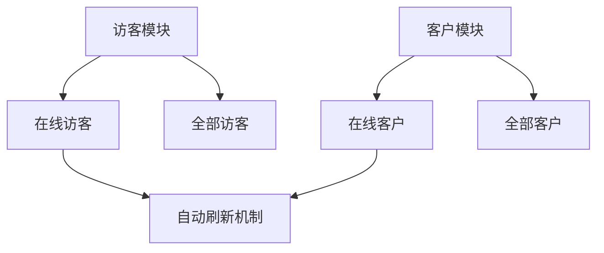
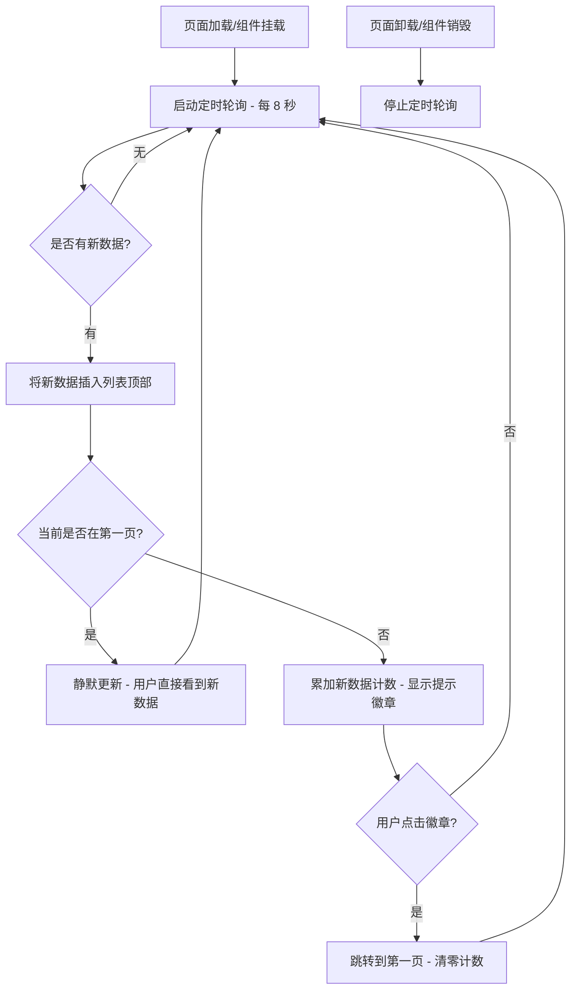

# PRD：在线访客与在线客户自动刷新

> **版本**：v1.0 · 2026-04-22
> **状态**：草稿

---

## 1. 概述

### 1.1 背景与动机

| 痛点 | 影响 |
|------|------|
| 客服人员需要手动刷新页面才能看到新上线的访客/客户 | 错过最佳接待时机，降低响应速度和客户满意度 |
| 非首页浏览时无法感知新数据到达 | 客服可能长时间停留在翻页状态，遗漏新访客/客户 |

在线访客和在线客户列表是客服工作台的核心监控页面。系统需要自动轮询并推送新上线的访客/客户数据，让客服无需手动操作即可实时掌握在线情况，从而提升接待效率。

### 1.2 目标

| Key Result | 量化标准 |
|-----------|---------|
| KR1：实时性 | 新访客/客户上线后 8 秒内自动出现在列表中 |
| KR2：无感刷新 | 第一页用户无需任何操作即可看到新数据 |
| KR3：非首页提醒 | 非第一页用户通过提示徽章感知新数据并一键跳转 |

---

## 2. 用户故事

| ID | 角色 | 用户故事 | 验收标准 | 优先级 |
|----|------|---------|----------|--------|
| US-01 | 客服 | 我希望在线访客列表能自动更新，不用手动刷新页面 | 新访客在 8 秒内自动出现在列表顶部 | P0 |
| US-02 | 客服 | 我在翻页浏览时，希望知道有新访客上线 | 标题旁出现「N 个新访客 · 点击查看」提示 | P0 |
| US-03 | 客服 | 我希望在线客户列表也能自动更新 | 新客户在 8 秒内自动出现在列表顶部 | P0 |
| US-04 | 客服 | 我在翻页浏览客户时，希望知道有新客户上线 | 标题旁出现「N 个新客户 · 点击查看」提示 | P0 |

---

## 3. 功能设计

### 3.1 信息架构

### 3.2 核心流程

### 3.3 子功能详述

#### 3.3.1 定时轮询

**功能描述**：页面加载后自动启动定时器，周期性拉取新上线的访客/客户数据。

**用户场景**：客服打开在线访客或在线客户页面后，系统自动开始轮询，无需任何手动操作。

**前置条件**：
1. 用户已进入在线访客或在线客户页面
2. 页面组件已完成挂载

**交互流程**：
1. 组件挂载时启动定时器
2. 每 8 秒执行一次数据拉取
3. 组件卸载时清除定时器，释放资源

**需求描述（功能规则）**：
1. **轮询间隔**：8 秒
2. **生命周期管理**：组件挂载时启动，组件卸载时停止，避免内存泄漏
3. **数据插入位置**：新数据插入列表顶部（最新的排在最前）

**后置条件**：
1. 列表数据实时更新
2. 总条数同步更新
3. 分页总页数随数据量变化自动调整

#### 3.3.2 第一页静默更新

**功能描述**：当用户停留在第一页时，新数据直接出现在列表顶部，无需额外提示。

**用户场景**：客服正在查看在线访客/客户列表的第一页，新数据自动出现在表格最上方。

**前置条件**：
1. 当前页码为第 1 页
2. 有新数据到达

**交互流程**：
1. 新数据插入列表顶部
2. 分页组件中的总条数自动更新
3. 表格展示当前页的前 N 条数据（N 为每页条数）

**需求描述（功能规则）**：
1. 新数据插入后，第一页展示的数据自动更新，原有数据向下顺移
2. 不显示任何提示徽章
3. 分页器中的总条数实时反映最新数量

#### 3.3.3 非首页新数据提示

**功能描述**：当用户不在第一页时，通过标题旁的提示徽章告知有新数据到达。

**用户场景**：客服正在翻页浏览历史数据，此时有新访客/客户上线，系统在页面标题旁显示提示。

**前置条件**：
1. 当前页码大于 1
2. 有新数据到达

**交互流程**：
1. 新数据到达，累加新数据计数
2. 页面标题旁显示提示徽章，格式为「N 个新访客 · 点击查看」或「N 个新客户 · 点击查看」
3. 用户点击徽章后，页码跳转到第 1 页，计数清零

**需求描述（功能规则）**：
1. **提示文案**：
   - 访客页：「{数量} 个新访客 · 点击查看」
   - 客户页：「{数量} 个新客户 · 点击查看」
2. **显示条件**：当前页码 > 1 且新数据计数 > 0
3. **点击行为**：跳转到第 1 页，同时将新数据计数清零
4. **计数规则**：每次轮询到新数据时累加，点击徽章后归零
5. **徽章位置**：紧跟在页面标题文字之后

#### 3.3.4 在线访客列表

**功能描述**：展示当前在线的所有访客，支持筛选、搜索、分页和操作。

**用户场景**：客服需要查看当前在线的访客信息，并对特定访客发起会话或发送邮件。

**前置条件**：
1. 用户具有「在线访客」查看权限

**需求描述（功能规则）**：

1. **表格字段**：姓名、备注名、邮箱、电话、标签、来源渠道、首次访问、最后访问页面、IP 地址、操作
2. **筛选条件**：
   - 搜索字段下拉：姓名、备注名、邮箱、电话
   - 标签筛选：VIP、普通
   - 来源渠道筛选：Web、网页插件、Email
   - 首次访问日期
3. **排序**：首次访问列支持升序/降序排序
4. **分页**：默认每页 10 条，显示总条数
5. **操作菜单**（通过三点按钮触发下拉菜单）：
   - 非 Email 渠道访客：创建会话、发起聊天、发送邮件
   - Email 渠道访客：发送邮件
6. **姓名点击**：打开访客详情侧边抽屉
7. **发送邮件前置校验**：
   - 未配置 Email 渠道 → 弹出引导弹窗，提示前往配置
   - 访客邮箱为空 → 提示「访客邮箱为空，无法发送」

#### 3.3.5 在线客户列表

**功能描述**：展示当前在线的所有已识别客户，支持筛选、搜索、分页和操作。

**用户场景**：客服需要查看当前在线的已识别客户信息，并对特定客户发起会话或发送邮件。

**前置条件**：
1. 用户具有「在线客户」查看权限
2. 系统已接入客户标识

**需求描述（功能规则）**：

1. **表格字段**：客户标识、备注名、姓名、邮箱、电话、标签、来源渠道、首次访问、最后访问页面、IP 地址、操作
2. **与访客列表的差异**：
   - 多一个「客户标识」字段（唯一标识已识别客户）
   - 搜索字段下拉增加「客户标识」选项
   - 默认搜索字段为「客户标识」（访客默认为「姓名」）
3. **筛选条件**：
   - 搜索字段下拉：客户标识、备注名、姓名、邮箱、电话
   - 标签筛选：VIP、普通
   - 来源渠道筛选：Web、网页插件、Email
   - 首次访问日期
4. **排序**：首次访问列支持升序/降序排序（带排序方向高亮指示）
5. **分页**：默认每页 10 条，显示总条数
6. **操作菜单**：创建会话、发起聊天、发送邮件
7. **姓名点击**：打开访客详情侧边抽屉（含客户信息区块，显示关联客户标识）
8. **发送邮件前置校验**：
   - 未配置 Email 渠道 → 弹出引导弹窗
   - 客户邮箱为空 → 提示「客户邮箱为空，无法发送」

#### 3.3.6 发送邮件弹窗

**功能描述**：从访客/客户列表发起邮件发送。

**前置条件**：
1. 已配置至少一个 Email 渠道
2. 目标访客/客户邮箱不为空

**交互流程**：
1. 点击操作菜单中的「发送邮件」
2. 系统校验 Email 渠道配置和邮箱有效性
3. 打开发送邮件弹窗
4. 填写邮件内容后点击「确认发送」
5. 发送成功后提示「发送成功」

**需求描述（功能规则）**：
1. **收件人（To）**：自动填充目标访客/客户的邮箱，不可编辑
2. **发件人（From）**：下拉选择已配置的 Email 渠道邮箱，默认选中第一个
3. **主题（Subject）**：必填，最大长度 200 字符
4. **正文编辑器**：
   - 支持富文本格式：加粗、斜体、下划线、有序列表、无序列表
   - 支持插入链接：需输入合法 URL（自动补全 https:// 前缀），无效 URL 提示「无效URL」
   - 支持上传附件：接受 pdf/doc/docx/xls/xlsx/csv/zip/rar/7z/txt 格式
   - 支持插入图片：接受所有图片格式
   - 附件/图片大小限制：访客页 20MB，客户页 10MB，超出提示
   - 正文字符上限：2000 字符，超出部分静默截断
5. **发送按钮启用条件**：主题不为空，且正文有文字/图片或有附件
6. **发送成功后**：
   - 关闭弹窗
   - 提示「发送成功」
   - 访客页跳转到已解决队列，客户页跳转到已回复队列

#### 3.3.7 访客/客户详情侧边抽屉

**功能描述**：点击列表中的姓名，打开右侧抽屉展示详细信息。

**需求描述（功能规则）**：
1. **信息区块**（均可折叠/展开）：
   - 基础信息：备注名、姓名、电话、邮箱
   - 访客标签：已有标签列表 + 添加标签按钮
   - 客户信息（仅客户来源时显示）：关联客户标识
   - 附加信息：起始页面、来源渠道、会话总数（可点击进入历史会话列表）
   - 访问轨迹：时间线展示（Email 渠道显示「暂无访问轨迹」）
   - 设备信息：IP 地址、操作系统、浏览器
2. **更多操作菜单**：发起聊天、创建会话
3. **历史会话列表**：点击会话总数进入，支持查看会话详情
4. **会话详情**：展示消息记录，支持上下切换会话、编辑会话标题，底部操作按钮根据会话状态变化

---

## 4. 数据模型

| 实体名 | 字段 | 类型 | 说明 |
|--------|------|------|------|
| 在线访客 | 编号 | 数字 | 唯一标识 |
| | 姓名 | 文本 | 访客姓名 |
| | 备注名 | 文本 | 客服备注，可为空（显示「–」） |
| | 邮箱 | 文本 | 可为空 |
| | 电话 | 文本 | 可为空 |
| | 标签 | 文本 | VIP / 普通 / 无 |
| | 来源渠道 | 枚举 | Web / 网页插件 / Email |
| | 首次访问 | 日期时间 | 格式：YYYY-MM-DD HH:mm |
| | 最后访问页面 | 文本 | URL 路径 |
| | IP 地址 | 文本 | 访客 IP |
| 在线客户 | 编号 | 数字 | 唯一标识 |
| | 客户标识 | 文本 | 格式：CU-{编号}，唯一 |
| | 备注名 | 文本 | 可为空 |
| | 姓名 | 文本 | 客户姓名 |
| | 邮箱 | 文本 | 可为空 |
| | 电话 | 文本 | 可为空 |
| | 标签 | 文本 | VIP / 普通 / 无 |
| | 来源渠道 | 枚举 | Web / 网页插件 / Email |
| | 首次访问 | 日期时间 | 格式：YYYY-MM-DD HH:mm |
| | 最后访问页面 | 文本 | URL 路径 |
| | IP 地址 | 文本 | 客户 IP |

---

## 5. 权限与角色

| 功能 | 具有权限 | 无权限时的表现 |
|------|---------|--------------|
| 在线访客（visitor-online） | 可查看在线访客列表，执行管理操作 | 导航菜单中「访客」入口不可见，路由守卫拦截并跳转至首页 |
| 全部访客（visitor-all） | 可查看全部访客列表 | 子导航中「全部访客」不可见 |
| 在线客户（customer-online） | 可查看在线客户列表，执行管理操作 | 导航菜单中「客户」入口不可见，路由守卫拦截并跳转至首页 |
| 全部客户（customer-all） | 可查看全部客户列表 | 子导航中「全部客户」不可见 |

客户模块整体依赖「接入客户标识」，未接入时模块不可用。

---

## 6. 约束与依赖

| 约束/依赖 | 说明 | 影响范围 |
|----------|------|---------|
| Email 渠道配置 | 发送邮件功能依赖已配置的 Email 渠道 | 访客/客户列表的发送邮件操作 |
| 客户标识接入 | 客户模块需要业务系统接入客户标识后才启用 | 整个客户模块 |

---

## 7. 异常处理

| 异常场景 | 处理方式 | 用户感知 |
|---------|---------|---------|
| 未配置 Email 渠道时点击发送邮件 | 弹出引导弹窗 | 提示「未配置 Email 渠道」，提供「去配置」按钮跳转至设置页 |
| 目标邮箱为空时点击发送邮件 | 阻止打开弹窗 | 访客页提示「访客邮箱为空，无法发送」，客户页提示「客户邮箱为空，无法发送」 |
| 附件超出大小限制 | 跳过该文件 | 提示「附件大小不能超过 20MB/10MB」 |
| 正文超出 2000 字符 | 静默截断 | 无明确提示，超出部分被自动移除 |
| 插入链接 URL 无效 | 阻止插入 | 提示「无效URL」 |
| 组件卸载时定时器未清理 | 组件卸载钩子中清除定时器 | 无感知，防止内存泄漏 |

---

## 8. 跨模块联动

| 联动模块 | 联动方式 | 说明 |
|----------|----------|------|
| 首页（成员概览） | 数据引用 | 首页展示在线访客数和在线客户数统计 |
| 会话模块 | 操作跳转 | 从访客/客户列表发起「创建会话」「发起聊天」后跳转至会话模块 |
| 设置 - Email 渠道 | 配置依赖 | 发送邮件功能依赖 Email 渠道配置，未配置时引导跳转 |
| 访客详情抽屉 | 共享组件 | 访客和客户列表共用同一个详情抽屉组件 |
| 档案模块 | 导航跳转 | 详情抽屉中的「进入档案」链接跳转至档案页 |

---

## 9. 开放问题

| # | 问题 | 备选方案 | 当前倾向 | 状态 |
|---|------|---------|---------|------|
| 1 | 轮询间隔 8 秒是否需要可配置 | A. 固定 8 秒 B. 后台可配置 | A. 固定 8 秒 | 待确认 |
| 2 | 全部访客/全部客户页面是否也需要自动刷新 | A. 不需要 B. 需要但间隔更长 | A. 不需要（当前仅在线列表有此机制） | 待确认 |
| 3 | 正文超出 2000 字符时是否需要给用户明确提示 | A. 静默截断 B. 显示字符计数和提示 | A. 静默截断（当前实现） | 待确认 |
