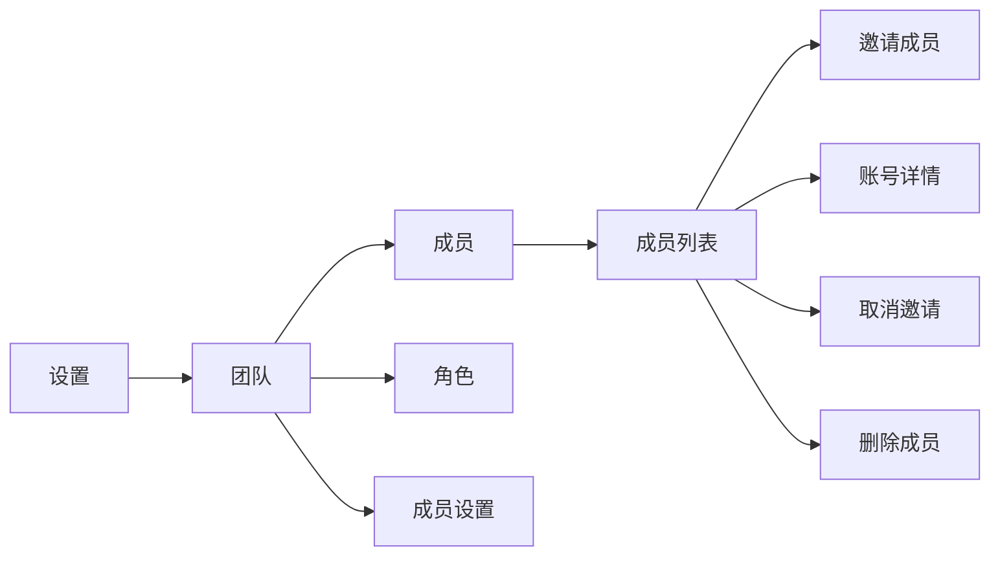
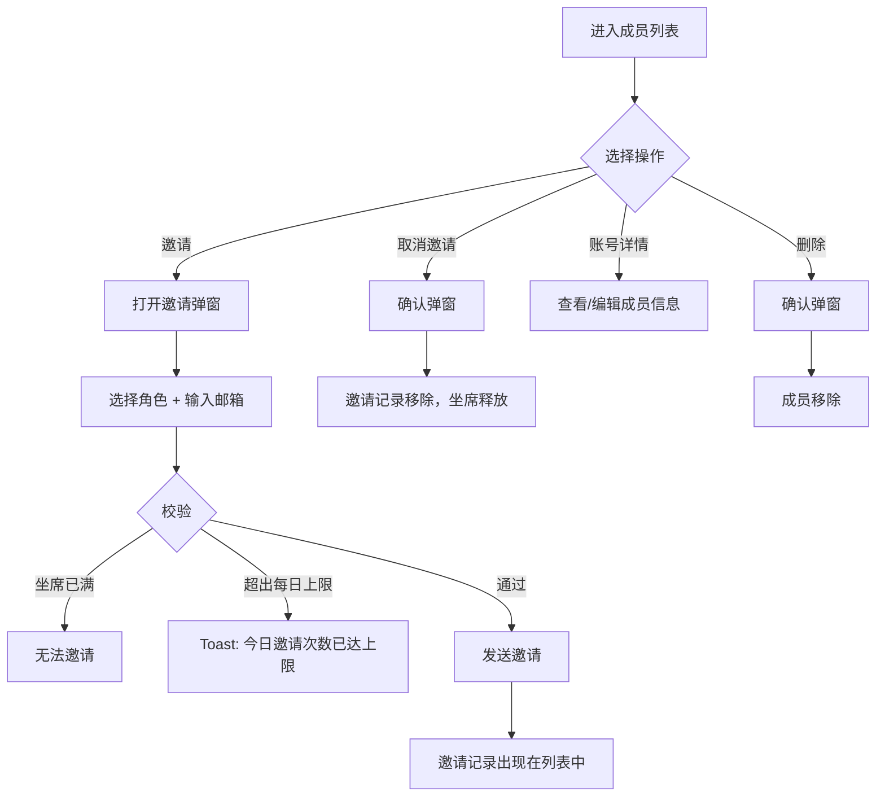

# PRD：成员管理

> **版本**：v2.0 · 2026-03-18
> **状态**：草稿
> **模块编号**：Module 02

---

## 1. 概述

### 1.1 背景与动机

| 痛点 | 影响 |
|------|------|
| 团队需要灵活管理客服人员的加入、离开和岗位变更 | 缺乏系统化管理工具导致运营效率低、坐席资源浪费 |
| 原系统中使用「客服」称呼，但实际团队成员不局限于客服岗位 | 称呼不统一造成用户认知混乱 |

成员管理模块提供团队成员的完整生命周期管理能力，包括邀请加入、坐席名额管理、账号详情编辑等功能。本次迭代同步完成全局更名：将系统中部分「客服」相关称呼统一为「成员」。

### 1.2 目标

| Key Result | 量化标准 |
|-----------|---------|
| KR1：支持邮件邀请新成员加入团队 | 单次最多发送 10 个邀请，每日频率上限为坐席总数 × 2 |
| KR2：坐席名额精确管理 | 邀请中成员占用坐席，取消邀请释放坐席，统计准确 |
| KR3：完成「客服」→「成员」全局更名 | 所有页面中「客服」相关称呼统一替换为「成员」 |

---

## 2. 用户故事

| ID | 角色 | 用户故事 | 验收标准 | 优先级 |
|----|------|---------|----------|--------|
| US-01 | 管理员 | 我希望邀请新成员加入团队并分配角色，以便快速扩充客服团队 | 通过邮箱邀请，可选角色，邀请成功后占用坐席名额 | P0 |
| US-02 | 管理员 | 我希望取消尚未激活的邀请，以便释放坐席名额 | 取消后邀请链接立即失效，坐席释放 | P0 |
| US-03 | 管理员 | 我希望编辑成员的角色和基本信息，以便灵活调整团队分工 | 角色选择后立即保存生效，其他字段失焦保存 | P1 |
| US-04 | 成员 | 我希望查看自己的账号详情，但不能修改自己的角色 | 角色字段为只读状态 | P1 |

---

## 3. 功能设计

### 3.1 信息架构



**功能入口**：系统导航路径 **设置 → 团队 → 成员**（独立子菜单）。

### 3.2 核心流程



### 3.3 子功能详述

#### 3.3.1 成员列表

**功能描述**：以表格形式展示所有已激活成员和邀请记录。

**用户场景**：管理员查看团队成员状况和邀请状态。

**前置条件**：
1. 用户拥有管理成员权限

**需求描述（功能规则）**：
1. **表格列定义**：

| 列名 | 已激活成员 | 邀请记录（邀请中） |
| --- | --- | --- |
| ID | 成员编号（如 10001） | 显示 `-` |
| 姓名 | 头像 + 姓名 | 显示 `-` |
| 昵称 | 成员昵称 | 显示 `-` |
| 加入时间（原创建时间） | 成员加入项目时间 | 显示 `-` |
| 角色 | 角色名称 | 邀请时分配的角色 |
| 邮箱 | 成员邮箱 | 邀请邮箱 |
| 会话限制 | 最大并发会话数 | 显示 `-` |
| 在线状态 | 在线/离开/离线（带颜色圆点） | 显示 `-` |
| 状态 | 启用/停用开关 | 状态文字「邀请中」 |
| 操作 | 更多操作按钮 | 更多操作按钮 |

2. **排序规则**：已激活成员在前（按加入时间倒序），邀请记录在后（按邀请时间倒序）

3. **邀请记录操作菜单**：仅「取消邀请」一项

#### 3.3.2 坐席名额管理

**功能描述**：成员列表头部展示坐席统计信息。

**需求描述（功能规则）**：

| 指标 | 计算规则 |
| --- | --- |
| 坐席总数 | 当前服务包购买的坐席数量 |
| 使用中 | 已激活成员数 + 邀请中记录数 |
| 剩余 | 坐席总数 − 使用中 |

**核心规则**：
- 邀请中记录**占用**坐席名额

#### 3.3.3 邀请成员

**功能描述**：通过邮箱邀请新成员加入团队。

**用户场景**：管理员需要招募新成员加入客服团队。

**前置条件**：
1. 剩余坐席 > 0
2. 用户拥有管理成员权限

**交互流程**：
1. 点击成员列表右上角「+ 邀请成员」按钮
2. 弹出邀请弹窗

**需求描述（功能规则）**：

1. **弹窗内容**：
   - 标题：邀请成员加入团队
   - 描述：`团队成员将通过电子邮件被邀请，最多一次可以发送10张邀请。`
   - 角色选择：下拉选择器，可选项为系统中所有非管理员角色，默认选中「客服」。
   - 邮箱输入：多行文本框
   - 邀请按钮：邮箱为空时按钮不可点击

2. **邀请限制**：

| 校验层级 | 限制规则 | 错误提示 |
| --- | --- | --- |
| 每日频率 | 每日邀请总次数不超过坐席总数 × 2（点击邀请客服按钮） | `今日邀请次数已达 {上限} 上限` |
| 单次邀请 | 单次邀请数超出每日剩余次数（弹窗中邀请） | `今天可邀请 {上限} 次，还剩 {剩余} 次` |

3. **每日频率说明**：按自然天计算（UTC+8 0:00 重置）

**后置条件**：
1. 邀请记录出现在成员列表中，状态「邀请中」
2. 坐席名额使用中 +N，剩余 -N
3. Toast 提示邀请发送成功
4. 关闭邀请弹窗

#### 3.3.4 邀请记录状态与生命周期

**功能描述**：管理邀请的状态流转。

**需求描述（功能规则）**：

```
邀请发送 → 邀请中（链接永久有效）
              ├── 被邀请人点击链接激活 → 已激活（转为正式成员）
              └── 管理员取消邀请 → 已取消（链接立即失效）
```

| 状态 | 说明 | 占用坐席 | 可执行操作 |
| --- | --- | --- | --- |
| 邀请中 | 邀请已发送，等待被邀请人激活 | 是 | 取消邀请 |

**核心规则**：
- 邀请链接**无有效期限制**，不会自动过期
- 取消邀请后，对应邀请链接**立即失效**
- 如需重新邀请同一人，需先取消旧邀请记录，再重新发送

#### 3.3.5 取消邀请

**功能描述**：取消尚未激活的邀请记录。

**用户场景**：管理员需要释放被未激活邀请占用的坐席。

**交互流程**：
1. 从邀请记录操作菜单点击「取消邀请」
2. 弹出确认弹窗

**需求描述（功能规则）**：

1. **确认弹窗**：
   - 标题：取消邀请
   - 描述：`取消后本次邀请将失效，是否取消？`
   - 按钮：「取消」「确定」

**后置条件**：
1. 邀请记录从列表移除
2. 对应邀请链接立即失效
3. 释放坐席名额（使用中 -1，剩余 +1）
4. 对应角色关联成员数 -1
5. Toast 提示「邀请已取消」

#### 3.3.7 账号详情

**功能描述**：查看和编辑成员的账号信息。

**用户场景**：管理员修改成员角色或查看成员信息；成员查看自己的账号详情。

**前置条件**：
1. 从成员列表操作菜单点击「账号详情」

**需求描述（功能规则）**：

1. **角色字段**：
   - 管理员查看他人：角色下拉框可编辑，选择后立即触发保存
   - 成员查看自己：角色字段为只读
2. **保存方式**：所有可编辑字段采用**失焦自动保存**机制（焦点离开字段时自动保存），无底部保存按钮
3. **保存成功**：Toast 提示「保存成功」

---

## 4. 全局更名清单

本次迭代将系统中部分「客服」相关称呼统一替换为「成员」。以下按模块列出所有变更点：

### 4.1 导航与菜单

| 位置 | 原文案 | 新文案 |
| --- | --- | --- |
| 设置子导航菜单项 | 客服 | 成员 |
| 设置子导航菜单项 | 客服设置 | 成员设置 |

### 4.2 首页

| 位置 | 原文案 | 新文案 |
| --- | --- | --- |
| 首页概览标题 | 客服概览 | 成员概览 |
| 首页概览操作按钮 | 邀请客服 | 邀请成员 |
| 首页快捷入口 | 客服 | 成员 |

### 4.3 成员列表页

| 位置 | 原文案 | 新文案 |
| --- | --- | --- |
| 页面标题 | 客服 | 成员 |
| 邀请按钮 | 邀请客服 | 邀请成员 |

### 4.4 邀请弹窗

| 位置 | 原文案 | 新文案 |
| --- | --- | --- |
| 弹窗标题 | 邀请客服加入团队 | 邀请成员加入团队 |
| 弹窗描述 | 团队客服将通过… | 团队成员将通过电子邮件被邀请，最多一次可以发送10个邀请 |

### 4.5 成员设置页

| 位置 | 原文案 | 新文案 |
| --- | --- | --- |
| 不活跃设置标题 | 客服不活跃 | 成员不活跃 |
| 页面标题 | 客服设置 | 成员设置 |

### 4.6 角色列表页

| 位置 | 原文案 | 新文案 |
| --- | --- | --- |
| 表格列名 | 关联客服数 | 关联成员数 |

### 4.7 删除成员弹窗

| 位置 | 原文案 | 新文案 |
| --- | --- | --- |
| 弹窗标题 | 删除客服 | 删除成员 |

### 4.8 成员已达上限弹窗

| 位置 | 原文案 | 新文案 |
| --- | --- | --- |
| 弹窗标题 | 客服已达上限 | 成员已达上限 |
| 弹窗描述 | 已达到当前订购版本的客服添加上限，如需新增客服，请升级服务 | 已达到当前订购版本的成员添加上限，如需新增成员，请升级服务 |

### 4.9 禁用成员

| 位置 | 原文案 | 新文案 |
| --- | --- | --- |
| 禁用成员 | 确认禁用该客服吗？ | 确认禁用该成员吗？ |

### 4.10 服务过期邀请客服弹窗

| 位置 | 原文案 | 新文案 |
| --- | --- | --- |
| 试用版服务过期弹窗描述 | 服务已过期，如需新增客服，请购买服务 | 服务已过期，如需新增成员，请购买服务 |
| 付费后服务过期弹窗描述 | 服务已过期，如需新增客服，请续订服务 | 服务已过期，如需新增成员，请续订服务 |

---

## 5. 业务规则汇总表

| # | 规则 | 触发条件 | 预期行为 |
| --- | --- | --- | --- |
| 1 | 邀请中记录占用坐席 | 邀请发送后 | 使用中名额包含邀请中记录 |
| 2 | 邀请链接无有效期 | 邀请发送后 | 链接在被激活或被取消前始终有效 |
| 3 | 取消邀请链接立即失效 | 取消邀请后 | 邀请链接立即失效，坐席释放 |
| 4 | 每日邀请频率上限 | 邀请发送时 | 每日邀请总次数 ≤ 坐席总数 × 2 |
| 5 | 成员不可修改自身角色 | 成员查看个人资料 | 角色字段只读 |
| 6 | 账号详情失焦保存 | 编辑账号详情字段 | 字段失焦后自动保存，Toast「保存成功」 |
| 7 | 角色选择即时保存 | 管理员修改他人角色 | 选择后立即触发保存，权限即时生效 |
| 8 | 停用成员不释放坐席 | 停用成员账号 | 使用中名额不变 |
| 9 | 不可删除自身 | 当前用户操作菜单 | 发起聊天、修改密码、删除按钮置灰不可点击 |
| 10 | 角色关联成员数实时统计 | 角色列表展示 | 含邀请中记录在内的使用该角色的成员数 |

---

## 6. 名词解释

| 名词 | 说明 |
| --- | --- |
| 成员 | 系统中的团队用户，原称「客服」，本次统一更名 |
| 坐席 | 服务包中包含的成员名额，邀请中和已激活成员均占用坐席 |
| 邀请中 | 成员已被邀请但尚未完成激活，占用坐席名额但不可登录系统 |
| 失焦保存 | 编辑字段后焦点离开时自动触发保存，替代传统的保存按钮 |
| 每日邀请上限 | 每日可发送邀请的最大次数，为坐席总数 × 2，按自然天（UTC+8）重置 |
