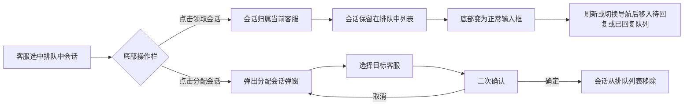

# PRD：排队中会话领取与分配

> **版本**：v1.1 · 2026-03-22
> **状态**：已交付
> **模块**：会话模块 - 在线会话 - 排队中

---

## 1. 概述

### 1.1 目标

| Key Result | 量化标准 |
|-----------|---------|
| KR1：排队会话处理效率 | 客服可在会话详情页一键领取或分配，无需跳转其他页面 |

---

## 2. 用户故事

| ID | 角色 | 用户故事 | 验收标准 | 优先级 |
|----|------|---------|----------|--------|
| US-01 | 客服 | 我希望在排队中会话详情页直接领取会话，以便快速开始服务 | 点击「领取会话」后，底部变为正常输入框，客服可立即回复 | P0 |
| US-02 | 客服 | 我希望将排队中的会话分配给指定客服，以便合理分流 | 点击「分配会话」后弹出客服选择弹窗，确认分配后会话从排队列表移除 | P0 |

---

## 3. 功能设计

### 3.1 功能入口

| 入口 | 位置 | 触发条件 |
|-----|------|---------|
| 排队会话操作栏 | 会话详情页底部 | 当前选中的会话属于"排队中"队列 |

### 3.2 核心流程

### 3.3 子功能详述

#### 3.3.1 排队会话操作栏

**功能描述**：排队中的会话底部增加「分配会话」按钮，原「分配给我」改名为「领取会话」。

**用户场景**：客服在会话列表中点击某个排队中的会话，查看访客消息后决定自己处理或分配给他人。

**前置条件**：
1. 当前选中的会话属于"排队中"队列

**交互流程**：
1. 客服进入排队中队列，点击某个会话
2. 会话详情页底部显示操作栏，包含两个按钮

**需求描述（功能规则）**：

1. **按钮布局**：左侧为「分配会话」（边框样式按钮），右侧为「领取会话」（主色填充按钮），两按钮居中排列
2. **显示条件**：仅当会话的队列状态为"排队中"时显示

#### 3.3.2 分配会话

**功能描述**：客服点击「分配会话」按钮，弹出分配弹窗，将会话分配给指定客服。

**用户场景**：客服查看排队会话内容后，判断应由其他客服处理，选择目标客服进行分配。

**前置条件**：
1. 当前会话处于排队中状态

**交互流程**：
1. 客服点击「分配会话」按钮
2. 弹出"分配会话"弹窗，列出所有可分配的客服
3. 客服列表按在线状态排序（在线优先），支持搜索
4. 客服点击目标客服行的「分配」按钮
5. 弹出二次确认气泡："确定分配给该客服吗？"
6. 点击「确定」完成分配，弹窗关闭
7. 会话从排队列表中移除
8. 若排队列表中还有其他会话，自动选中第一个
9. 显示提示"会话分配成功"

**需求描述（功能规则）**：

1. **弹窗内容**：复用通用分配会话弹窗，标题为"分配会话"
2. **客服列表**：展示所有客服（含当前客服），按在线/离线排序，在线客服排在前面
3. **搜索功能**：支持按客服名称模糊搜索
4. **二次确认**：点击「分配」后，在按钮下方显示确认气泡弹窗，需点击「确定」才会执行分配

**后置条件**：
1. 会话从排队中列表移除
2. 排队中队列的会话计数减 1