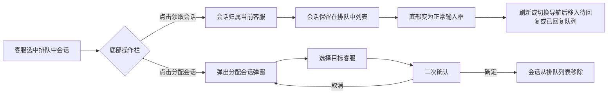

# PRD：排队中会话领取与分配

> **版本**：v1.2 · 2026-03-31
> **状态**：已交付
> **模块**：会话模块 - 在线会话 - 排队中 / 档案模块 - 会话记录

---

## 1. 概述

### 1.1 目标

| Key Result | 量化标准 |
| --- | --- |
| KR1：排队会话处理效率 | 客服可在会话详情页和档案页一键领取或分配，无需跳转其他页面 |

---

## 2. 用户故事

| ID | 角色 | 用户故事 | 验收标准 | 优先级 |
| --- | --- | --- | --- | --- |
| US-01 | 客服 | 我希望在排队中会话详情页直接领取会话，以便快速开始服务 | 点击「领取会话」后弹出确认弹窗，确认后底部变为正常输入框，客服可立即回复 | P0 |
| US-02 | 客服 | 我希望将排队中的会话分配给指定客服，以便合理分流 | 点击「分配会话」后弹出客服选择弹窗，确认分配后会话从排队列表移除 | P0 |
| US-03 | 客服 | 我希望在档案页查看排队中会话并快速领取或分配 | 档案页排队中会话支持领取/分配操作，领取后自动跳转到消息页对应会话 | P0 |

---

## 3. 功能设计

### 3.1 功能入口

| 入口 | 位置 | 触发条件 |
| --- | --- | --- |
| 排队会话操作栏 | 消息模块 - 会话详情页底部 | 当前选中的会话属于"排队中"队列 |
| 档案操作菜单 | 档案模块 - 会话记录列表 | 排队中会话的操作菜单 |
| 档案会话抽屉 | 档案模块 - 会话详情抽屉底部 | 查看排队中会话详情时 |

### 3.2 核心流程

### 3.3 子功能详述

#### 3.3.1 排队会话操作栏

**功能描述**：排队中的会话底部增加「分配会话」按钮，原「分配给我」改名为「领取会话」。

**用户场景**：客服在会话列表中点击某个排队中的会话，查看访客消息后决定自己处理或分配给他人。

**前置条件**：

1.  当前选中的会话属于"排队中"队列
    

**交互流程**：

1.  客服进入排队中队列，点击某个会话
    
2.  会话详情页底部显示操作栏，包含两个按钮
    

**需求描述（功能规则）**：

1.  **按钮布局**：左侧为「分配会话」，右侧为「领取会话」
    
2.  **显示条件**：仅当会话的队列状态为"排队中"时显示
    

#### 3.3.2 分配会话

**功能描述**：客服点击「分配会话」按钮，弹出分配弹窗，将会话分配给指定客服。

**用户场景**：客服查看排队会话内容后，判断应由其他客服处理，选择目标客服进行分配。

**前置条件**：

1.  当前会话处于排队中状态
    

**交互流程**：

1.  客服点击「分配会话」按钮
    
2.  弹出"分配会话"弹窗，列出所有可分配的客服
    
3.  客服列表按在线状态排序（在线优先），支持搜索
    
4.  客服点击目标客服行的「分配」按钮
    
5.  弹出二次确认气泡："确定分配给该客服吗？"
    
6.  点击「确定」完成分配，弹窗关闭
    
7.  会话从排队列表中移除
    
8.  若排队列表中还有其他会话，自动选中第一个
    
9.  显示提示"会话分配成功"
    

**需求描述（功能规则）**：

1.  **弹窗内容**：复用通用分配会话弹窗，标题为"分配会话"
    
2.  **客服列表**：展示所有客服（含当前客服），按在线/离线排序，在线客服排在前面
    
3.  **搜索功能**：支持按客服名称模糊搜索
    
4.  **二次确认**：点击「分配」后，在按钮下方显示确认气泡弹窗，需点击「确定」才会执行分配
    

**后置条件**：

1.  会话从排队中列表移除
    
2.  排队中队列的会话计数减 1

#### 3.3.3 领取会话确认弹窗

**功能描述**：客服点击「领取会话」按钮时，弹出确认弹窗，确认后完成领取操作。

**用户场景**：客服在消息模块或档案模块查看排队会话后，决定自己处理该会话。

**前置条件**：

1.  当前会话处于排队中状态

**交互流程**：

1.  客服点击「领取会话」按钮
2.  弹出确认弹窗，标题为"确认领取"
3.  弹窗描述："确认领取该会话吗？"
4.  底部显示「取消」和「确认」按钮
5.  点击「确认」完成领取操作
6.  消息模块：会话保留在排队中列表，底部变为正常输入框
7.  档案模块：自动跳转到消息页对应会话分类

**需求描述（功能规则）**：

1.  **弹窗样式**：标题"确认领取"，描述"确认领取该会话吗？"
2.  **按钮布局**：左侧「取消」，右侧「确认」
3.  **跳转逻辑**：档案模块领取后跳转到消息-在线会话中相应的会话分类

#### 3.3.4 档案模块 - 排队中会话操作

**功能描述**：档案-会话记录页面，排队中会话支持领取和分配操作。

**用户场景**：客服在档案页面查看历史会话记录，发现排队中的会话需要处理。

**前置条件**：

1.  会话记录中存在状态为"排队中"的会话

**交互流程**：

1.  客服在档案-会话记录页面，点击排队中会话的操作按钮
2.  操作菜单显示：领取会话、分配会话、查看会话
3.  点击「查看会话」打开会话详情抽屉
4.  抽屉底部显示两个按钮：左侧「分配会话」（线框），右侧「领取会话」（主按钮）
5.  点击「领取会话」显示确认弹窗
6.  确认后自动跳转到消息-在线会话页面对应会话

**需求描述（功能规则）**：

1.  **操作菜单**：排队中会话显示"领取会话"、"分配会话"、"查看会话"三个选项
2.  **抽屉按钮**：左侧「分配会话」（线框按钮），右侧「领取会话」（蓝色主按钮）
3.  **领取操作**：点击领取会话显示确认弹窗，确认后跳转到消息页对应会话
4.  **分配操作**：点击分配会话打开分配弹窗，选择目标客服完成分配

**后置条件**：

1.  领取会话后自动跳转到消息-在线会话页面
2.  分配会话后会话从当前列表移除
