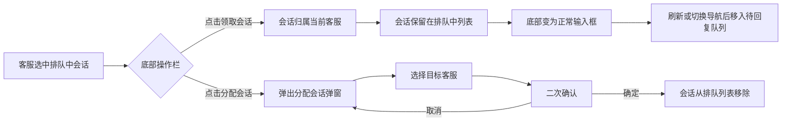
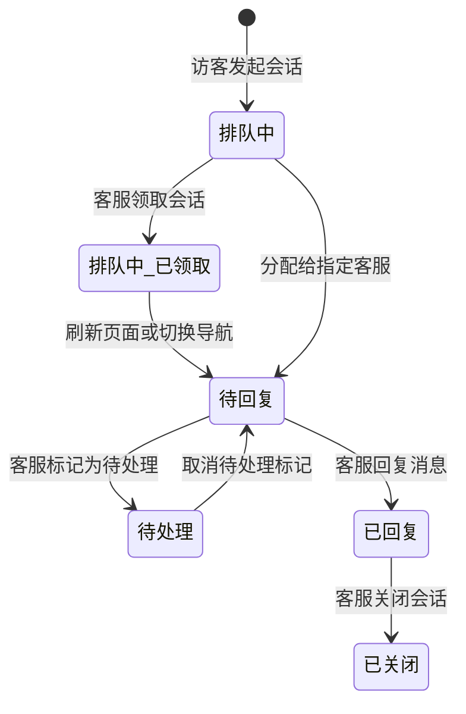

# PRD：排队中会话领取与分配

> **版本**：v1.1 · 2026-03-22
> **状态**：已交付
> **模块**：会话模块 - 在线会话 - 排队中

---

## 1. 概述

### 1.1 背景与动机

| 痛点 | 影响 |
|------|------|
| 排队中的会话仍显示消息输入框，客服可能误以为可以直接回复 | 访客实际处于等待状态，客服发送消息不符合业务流程 |
| 排队中的会话缺少主动领取和分配的快捷入口 | 客服需要通过归档等其他路径才能处理排队会话，操作效率低 |

排队中的会话是指访客已发起咨询但尚未被分配给任何客服的会话。本次调整将排队会话的底部输入区域替换为「领取会话」和「分配会话」两个操作按钮，使客服能够快速认领或分配排队中的会话。

### 1.2 目标

| Key Result | 量化标准 |
|-----------|---------|
| KR1：排队会话处理效率 | 客服可在会话详情页一键领取或分配，无需跳转其他页面 |
| KR2：操作准确性 | 排队中的会话无法输入消息，避免误操作 |

---

## 2. 用户故事

| ID | 角色 | 用户故事 | 验收标准 | 优先级 |
|----|------|---------|----------|--------|
| US-01 | 客服 | 我希望在排队中会话详情页直接领取会话，以便快速开始服务 | 点击「领取会话」后，会话保留在排队中列表，底部变为正常输入框，客服可立即回复；刷新页面或切换导航后会话才移入待回复队列 | P0 |
| US-02 | 客服 | 我希望将排队中的会话分配给指定客服，以便合理分流 | 点击「分配会话」后弹出客服选择弹窗，确认分配后会话从排队列表移除 | P0 |
| US-03 | 客服 | 我不希望在排队中的会话里误发消息 | 排队中会话底部不显示消息输入框，仅显示操作按钮 | P0 |

---

## 3. 功能设计

### 3.1 功能入口

| 入口 | 位置 | 触发条件 |
|-----|------|---------|
| 排队会话操作栏 | 会话详情页底部（替代消息输入框） | 当前选中的会话属于"排队中"队列 |

### 3.2 核心流程

### 3.3 子功能详述

#### 3.3.1 排队会话操作栏

**功能描述**：排队中的会话底部不显示消息输入框，改为显示「分配会话」和「领取会话」两个操作按钮。

**用户场景**：客服在会话列表中点击某个排队中的会话，查看访客消息后决定自己处理或分配给他人。

**前置条件**：
1. 当前选中的会话属于"排队中"队列

**交互流程**：
1. 客服进入排队中队列，点击某个会话
2. 会话详情页底部显示操作栏，包含两个按钮
3. 会话消息区域可正常浏览，但无法输入和发送消息

**需求描述（功能规则）**：

1. **按钮布局**：左侧为「分配会话」（边框样式按钮），右侧为「领取会话」（主色填充按钮），两按钮居中排列
2. **显示条件**：仅当会话的队列状态为"排队中"时显示，其他队列状态显示对应的输入框或状态标签
3. **互斥逻辑**：操作栏与消息输入框、邮件输入框、"会话已结束"标签互斥，按以下优先级判断：AI Agent 会话 > 排队中会话 > 已关闭会话 > 邮件输入框 > 消息输入框

#### 3.3.2 领取会话

**功能描述**：客服点击「领取会话」按钮，将排队中的会话分配给自己并开始处理。

**用户场景**：客服查看排队会话内容后，决定由自己来处理该会话。

**前置条件**：
1. 当前会话处于排队中状态

**交互流程**：
1. 客服点击「领取会话」按钮
2. 系统将会话分配给当前客服
3. 会话保留在排队中列表，底部操作栏替换为正常的消息输入框，客服可立即回复
4. 显示提示"领取会话成功"
5. 刷新页面或客服手动切换到其他导航后，会话才从排队中列表移入待回复队列

**需求描述（功能规则）**：

1. **状态变更**：会话归属更新为当前客服，但暂不离开排队中队列；刷新页面或切换导航后才正式转入待回复队列
2. **归属变更**：会话的负责客服更新为当前操作的客服

**后置条件**：
1. 会话仍在排队中列表，排队中队列计数不变
2. 底部变为正常消息输入框，客服可回复消息
3. 头部「转移会话」「添加客服」按钮恢复可用
4. 刷新页面或切换导航后，会话从排队中列表移入待回复队列

#### 3.3.3 分配会话

**功能描述**：客服点击「分配会话」按钮，弹出分配弹窗，将会话分配给指定客服。

**用户场景**：客服查看排队会话内容后，判断应由其他客服处理，选择目标客服进行分配。

**前置条件**：
1. 当前会话处于排队中状态

**交互流程**：
1. 客服点击「分配会话」按钮
2. 弹出"分配会话"弹窗，列出所有可分配的客服
3. 客服列表按在线状态排序（在线优先），支持搜索
4. 客服点击目标客服行的「分配」按钮
5. 弹出二次确认气泡："确定分配给该客服吗？"
6. 点击「确定」完成分配，弹窗关闭
7. 会话从排队列表中移除
8. 若排队列表中还有其他会话，自动选中第一个；否则自动切换到待回复队列
9. 显示提示"会话分配成功"

**需求描述（功能规则）**：

1. **弹窗内容**：复用通用分配会话弹窗，标题为"分配会话"
2. **客服列表**：展示所有客服（含当前客服），按在线/离线排序，在线客服排在前面
3. **搜索功能**：支持按客服名称模糊搜索
4. **二次确认**：点击「分配」后，在按钮下方显示确认气泡弹窗，需点击「确定」才会执行分配
5. **关闭方式**：点击关闭按钮、点击遮罩层均可关闭弹窗

**后置条件**：
1. 会话从排队中列表移除
2. 排队中队列的会话计数减 1

---

## 4. 会话头部栏行为

排队中会话的头部操作区与正常会话有区别：

| 操作 | 排队中会话（未领取） | 排队中会话（已领取） | 正常会话 |
|------|----------|----------|---------|
| 转移会话 | 按钮置灰不可点击 | 可用 | 可用 |
| 添加客服 | 按钮置灰不可点击 | 可用 | 可用 |
| 标记为待处理 | 显示 | 显示 | 显示 |
| 结束会话 | 显示 | 显示 | 显示 |
| 编辑会话标题 | 可用 | 可用 | 可用 |

---

## 5. 状态机

| 状态 | 含义 | 底部区域显示 |
|------|------|------------|
| 排队中 | 会话等待被领取或分配 | 「分配会话」+「领取会话」按钮 |
| 排队中（已领取） | 已被客服领取，暂未离开队列 | 消息输入框 |
| 待回复 | 已分配客服，等待回复 | 消息输入框 |
| 待处理 | 已标记为待处理 | 消息输入框 |
| 已回复 | 客服已回复 | 消息输入框 |
| 已关闭 | 会话已结束 | "会话已结束"标签 |

---

## 6. 跨模块联动

| 联动模块 | 联动方式 | 说明 |
|----------|----------|------|
| 会话归档 | 归档列表中排队状态的会话同样支持分配操作 | 归档页面已有独立的分配入口，逻辑一致 |
| 会话队列导航 | 队列计数实时更新 | 分配后排队中队列计数减 1；领取后计数不变（会话仍在排队中列表），刷新或切换导航后才更新 |
| 在线会话分类筛选 | 筛选标签在排队中队列可用 | 支持按访客/客户类型筛选排队中的会话 |
