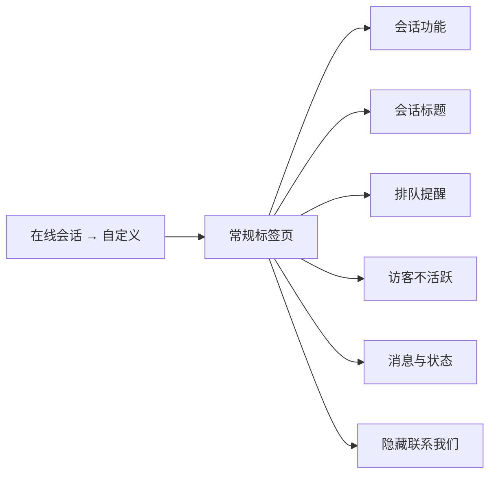
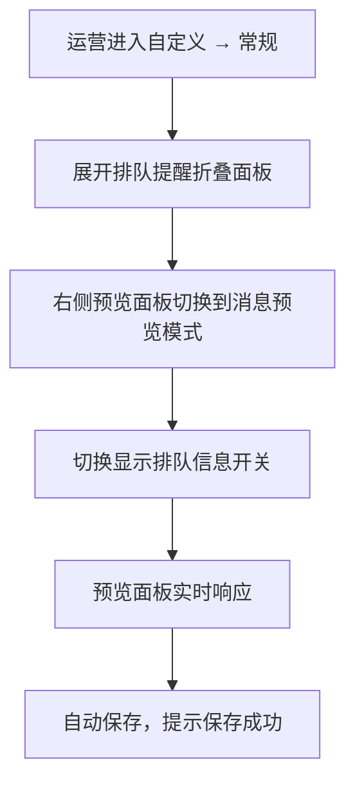

# PRD：排队提醒

> **版本**：v1.0 · 2026-03-25
> **状态**：待开发
> **模块编号**：Module 15-B

---

## 1. 概述

### 1.1 背景与动机

| 痛点 | 影响 |
| --- | --- |
| 访客发起会话进入排队后，无法得知自己前面还有多少人 | 访客等待焦虑增大，缺乏预期管理，可能导致访客流失 |

在线会话自定义模块已支持外观、内容、会话表单和常规设置。本次在常规标签页中新增**排队提醒**配置能力，让运营团队可以灵活控制访客端的排队信息展示策略。

### 1.2 目标

| Key Result | 量化标准 |
| --- | --- |
| KR1：排队透明化 | 排队中访客可在会话详情顶部看到排队位置信息，减少等待焦虑 |

### 1.3 非目标

*   AI Agent 接待的会话不显示排队提醒

---

## 2. 用户故事

| ID | 角色 | 用户故事 | 验收标准 | 优先级 |
| --- | --- | --- | --- | --- |
| US-01 | 运营管理员 | 我希望配置是否向访客展示排队信息，以便管理访客等待体验 | 在自定义 → 常规 → 排队提醒中可开关，预览面板实时响应 | P0 |
| US-02 | 访客 | 当排队提醒开启时，我希望在会话详情消息区域内看到排队位置 | 排队状态下显示胶囊形状提醒「排队中，前面还有 N 人」，数字高亮显示，被接待后提醒消失 | P0 |

---

## 3. 功能设计

### 3.1 信息架构

排队提醒位于「会话标题」下方、「访客不活跃」上方。

### 3.2 核心流程

### 3.3 功能详述

**功能描述**：控制访客进入排队时，是否在会话详情消息区域内展示排队位置信息。

**用户场景**：运营团队希望向排队中的访客透明化等待信息，让访客了解前方排队人数，减少等待焦虑。

**前置条件**：

1.  用户具有自定义管理权限

**交互流程**：

1.  运营展开「排队提醒」折叠面板

2.  右侧预览面板自动切换到消息预览模式

3.  运营切换「显示排队信息」开关

4.  预览面板实时响应：开启时显示排队胶囊提醒，关闭时隐藏

5.  系统立即保存，提示「保存成功」

**需求描述（功能规则）**：

1.  **开关说明**：默认关闭。开启后，访客端在排队状态下的会话详情页面消息区域内显示排队提醒

2.  **排队提醒样式**：

    *   位置：消息区域内顶部居中显示

    *   文案根据语言显示：

        *   英文：「In queue, **N** visitors ahead」

        *   简体中文：「排队中，前面还有**N**人」

        *   繁体中文：「排隊中，前面還有**N**人」

    *   数字 N 高亮显示

3.  **显示条件**：

    *   访客发起会话后无客服接待，进入排队状态时显示

    *   仅在开关开启时生效

4.  **状态更新规则**：

    *   被客服接待后，排队提醒立即消失

    *   从被接待状态重新变为排队状态时，排队提醒重新出现并显示最新排队人数

    *   排队人数发生变化时，提醒中的数字实时更新

5.  **不生效场景**：AI Agent 接待的会话不显示排队提醒

6.  **保存方式**：切换即保存

**后置条件**：

1.  配置项持久化存储

2.  所有当前排队中的访客会话立即按新设置展示或隐藏通知条

---

## 4. 数据模型

| 实体名 | 字段 | 类型 | 说明 |
| --- | --- | --- | --- |
| 自定义配置 | 显示排队信息 | 布尔 | 默认：关闭 |

---

## 5. 异常处理

| 异常场景 | 处理方式 | 用户感知 |
| --- | --- | --- |
| 排队提醒开启后排队人数为 0 | 显示排队提醒，告知前面还有 0 人 | \- |
| 排队提醒开关切换时网络异常 | 保存失败，配置不生效 | 不弹出保存成功提示 |

---

## 6. 跨模块联动

| 联动模块 | 联动方式 | 说明 |
| --- | --- | --- |
| AI Agent | 条件判断 | AI Agent 接待的会话不受排队提醒影响 |
