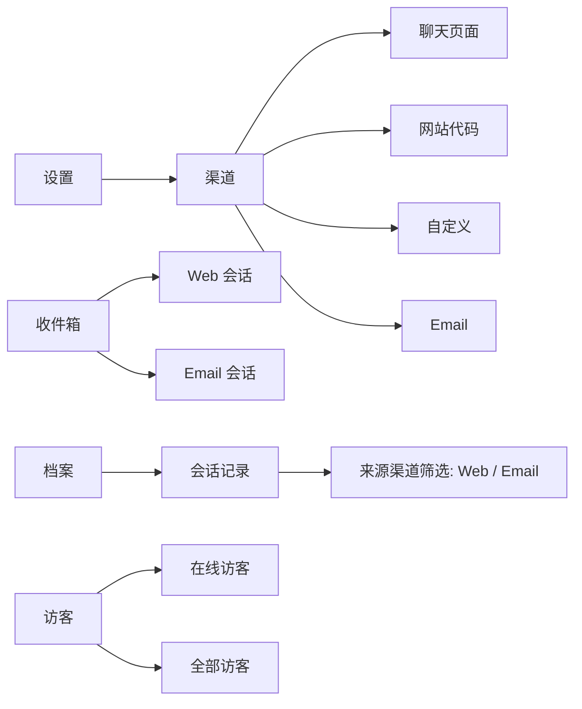
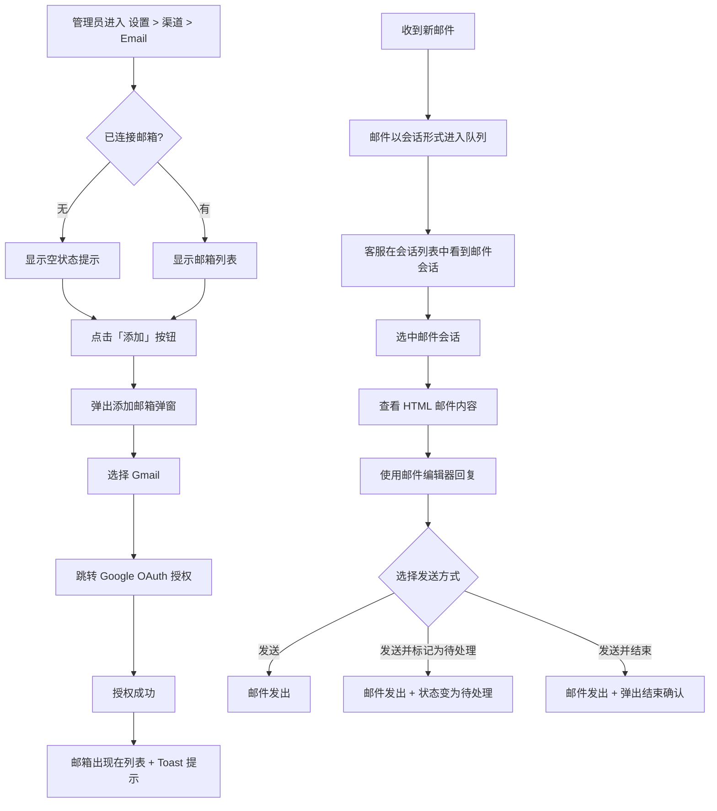

# PRD：接入邮箱渠道

> **版本**：v1.1 · 2026-03-22
> **状态**：草稿
> **模块编号**：Module 08

---

## 1. 概述

### 1.1 背景与动机

| 痛点 | 影响 |
|------|------|
| 客户通过邮件发起的咨询散落在不同邮箱客户端，客服需频繁切换工具 | 降低响应速度，容易遗漏邮件，无法统一管理 |
| 邮件会话与在线聊天会话分属两套系统，管理层无法统一查看和分析 | 服务质量数据割裂，报表和归档不完整 |
| 多人协作处理同一封邮件缺乏机制，容易重复回复或无人跟进 | 客户体验差，内部协作效率低 |

TWT Chat 新增邮箱渠道接入能力，允许团队在同一个客服工作台中收发邮件，所有邮件以会话形式呈现并纳入统一的会话管理流程（分配、协作、标记、归档）。

### 1.2 目标

| Key Result | 量化标准 |
|-----------|---------|
| KR1：渠道覆盖 | 支持通过 Gmail OAuth 接入邮箱，后续扩展其他邮箱服务商 |
| KR2：统一管理 | 邮件会话与 Web 会话共享同一套会话队列、分配、归档、筛选流程 |
| KR3：协作效率 | 客服可在同一界面中完成邮件查看、富文本回复、附件发送、会话流转 |

### 1.3 非目标（本期不做）

- 不支持 Gmail 以外的邮箱服务商（界面已预留"其他邮箱"入口，标记为"敬请期待"）
- 不支持邮件自动分配规则（需手动分配或自行认领）
- 不支持邮件模板/预设回复
- 不支持在邮件会话中使用 AI Agent 自动接待
- 邮件会话不计入客服并发会话上限

---

## 2. 用户故事

| ID | 角色 | 用户故事 | 验收标准 | 优先级 |
|----|------|---------|----------|--------|
| US-01 | 管理员 | 我希望在设置中添加公司 Gmail 邮箱，以便团队能统一收发邮件 | 通过 Gmail OAuth 授权后，邮箱出现在已连接列表中，Toast 提示"邮箱连接成功" | P0 |
| US-02 | 管理员 | 我希望能删除已连接的邮箱 | 删除确认后邮箱从列表移除，Toast 提示"删除成功" | P0 |
| US-03 | 客服 | 我希望在会话列表中区分 Web 和邮件会话 | 邮件会话显示邮件图标（黄色底色），Web 会话显示 Web 图标（蓝色底色） | P0 |
| US-04 | 客服 | 我希望用富文本编辑器回复邮件 | 支持加粗、斜体、下划线、有序/无序列表、超链接、图片内嵌、文件附件 | P0 |
| US-05 | 客服 | 我希望发送邮件时可以选择不同发件人 | 发件人下拉框列出所有已连接邮箱，默认选中该会话最初接收邮件的邮箱 | P0 |
| US-06 | 客服 | 我希望在发送邮件的同时完成状态变更 | 发送菜单提供三种操作：发送 / 发送并标记为待处理 / 发送并结束 | P0 |
| US-07 | 管理员 | 我希望在档案中按来源渠道筛选邮件会话 | 会话记录列表增加"来源渠道"筛选项和列，支持 Web / Email 筛选 | P1 |
| US-08 | 客服 | 我希望邮件未连接时能看到明确引导 | 编辑器区域显示"暂无可用的发件邮箱"提示，引导前往渠道 > Email 添加 | P0 |
| US-09 | 客服 | 我希望 hover 邮件消息时能快速翻译 | hover 消息显示翻译按钮，再 hover 翻译按钮弹出语言面板，选择语言后显示翻译内容 | P1 |
| US-10 | 客服 | 我希望在访客列表中直接向 email 来源的访客发送邮件 | email 来源访客的操作菜单显示"发送邮件"，点击打开邮件编辑弹窗，发送后跳转到收件箱 | P1 |
| US-11 | 客服 | 我希望在档案中快速进入或加入已结束的 email 会话 | 若当前客服是服务客服显示"进入会话"，否则显示"加入会话"，点击后跳转到收件箱对应会话 | P1 |

---

## 3. 功能设计

### 3.1 信息架构

### 3.2 核心流程

### 3.3 子功能详述

#### 3.3.1 邮箱管理（设置页面）

**功能描述**：在设置 > 渠道 > Email 页面中管理已连接的邮箱账户。

**用户场景**：管理员需要为团队接入公司邮箱，使客服能处理邮件咨询。

**前置条件**：
1. 用户具有 Email 渠道的"管理"权限

**交互流程**：
1. 进入 Email 页面，页面标题为"Email"，下方描述文案为"统一收发其他邮箱服务商的邮件，所有邮件都会以会话形式呈现，便于统一管理"
2. 若无已连接邮箱，显示空状态："暂未连接任何邮箱，点击上方按钮添加"
3. 若已有邮箱，以表格形式展示，列为：邮箱地址、创建时间、创建人、操作

**需求描述（功能规则）**：

1. **添加邮箱**：
   - 点击右上角「添加」按钮打开弹窗，弹窗标题"添加邮箱"
   - 弹窗内展示两张服务商卡片：Gmail（可用）、其他邮箱（置灰，显示"敬请期待"）
   - 点击 Gmail 卡片后跳转新窗口进行 Google OAuth 授权
   - 授权成功后邮箱自动加入列表，Toast 提示"邮箱连接成功"
   - 邮箱数量上限 99 个，达到上限时「添加」按钮置灰，hover 提示"最多支持 99 个邮箱"

2. **删除邮箱**：
   - 操作列显示红色"删除"文字按钮
   - 点击后弹出确认弹窗，标题"删除邮箱"，描述"删除后将无法接收该邮箱的邮件"
   - 按钮：「取消」(ghost) + 「删除」(红色)
   - 确认后从列表移除，Toast 提示"删除成功"

3. **表格字段**：
   - 邮箱地址：显示完整邮箱地址
   - 创建时间：格式 YYYY-MM-DD HH:mm
   - 创建人：头像圆形（首字 + 渐变色背景）+ 姓名

**后置条件**：
1. 添加邮箱后，系统可通过该邮箱收发邮件，相关会话将进入会话队列
2. 删除邮箱后，该邮箱不再接收新邮件

---

#### 3.3.2 邮件会话列表

**功能描述**：邮件会话与 Web 会话在同一会话列表中展示，通过渠道图标进行区分。

**用户场景**：客服打开工作台后，需要快速识别哪些是邮件会话、哪些是在线聊天。

**前置条件**：
1. 系统已连接至少一个邮箱

**需求描述（功能规则）**：

1. **渠道图标**：
   - 每个会话项的客户名称前显示渠道图标
   - Web 会话：蓝色底色（#e8f0ff）+ 蓝色图标（#2f6bff）
   - Email 会话：黄色底色（#fef3cd）+ 棕色图标（#b45309）

2. **在线状态**：
   - Web 会话显示在线/离线状态圆点（绿色/灰色）
   - Email 会话不显示在线状态圆点

3. **会话标题**：
   - Email 会话标题取自最后一条含主题的消息的 subject 字段
   - 若无 subject 则显示客户名称
   - 回复时自动在 subject 前加 "Re: " 前缀

4. **会话预览**：
   - 显示最后一条消息的纯文本摘要

---

#### 3.3.3 邮件查看与消息展示

**功能描述**：在会话详情区域展示邮件的 HTML 内容，支持富文本渲染和附件显示。

**用户场景**：客服选中一个邮件会话后查看来往邮件内容。

**需求描述（功能规则）**：

1. **HTML 邮件渲染**：
   - 邮件消息以 HTML 格式渲染，支持段落、加粗、斜体、有序/无序列表、超链接、引用块、表格、图片等标签
   - 对 HTML 内容进行安全过滤（白名单机制），移除不安全标签和属性
   - 链接强制在新窗口打开（target="_blank"）

2. **附件显示**：
   - 邮件中的附件信息从 HTML 内容中提取，以独立的附件区域展示
   - 附件区域位于邮件正文下方，以分割线分隔

3. **消息操作**：
   - Email 会话中的消息仅显示翻译操作（不显示回复、复制、撤回）
   - hover 消息时，在消息气泡上方出现翻译按钮
   - hover 翻译按钮时弹出语言选择面板
   - 访客消息的语言面板在翻译按钮的右侧展开，客服消息在左侧展开
   - 鼠标可从翻译按钮直接滑入语言面板（无断层区域），移出面板后自动关闭
   - 支持 14 种语言：英语、西班牙语、法语、德语、葡萄牙语、俄语、简体中文、繁体中文、日语、韩语、越南语、泰语、印度尼西亚语、马来语
   - 选择语言后在面板内显示翻译内容预览

4. **非邮件会话消息操作**：
   - Web 会话中的消息显示完整工具栏：回复、复制、翻译、更多（撤回）
   - 翻译按钮点击后弹出语言面板，面板定位在消息气泡侧方（访客消息右侧，客服消息左侧）

4. **消息气泡样式**：
   - 客户消息：白色背景，靠左对齐
   - 客服消息：浅蓝色背景（#eef4ff），靠右对齐

---

#### 3.3.4 邮件编辑器

**功能描述**：提供富文本邮件编辑器，支持格式化、附件上传和多种发送方式。

**用户场景**：客服需要回复邮件，要求支持 HTML 格式和文件附件。

**前置条件**：
1. 当前会话为 Email 类型
2. 系统已连接至少一个邮箱（否则显示禁用提示）

**交互流程**：
1. 会话详情底部展示邮件编辑器
2. 客服在 To 字段看到收件人（只读），在 From 下拉框选择发件人
3. 使用工具栏进行格式化编辑，或添加附件/图片
4. 点击发送按钮或使用快捷键发送

**需求描述（功能规则）**：

1. **禁用状态**：
   - 当无可用发件邮箱时，编辑器区域显示禁用提示
   - 提示标题："暂无可用的发件邮箱"
   - 提示描述："请先在 渠道 > Email 中添加邮箱后再回复"

2. **收发件人**：
   - To 字段：只读，显示客户邮箱地址
   - From 字段：下拉选择框，列出所有已连接邮箱
   - 默认选中该会话最初接收邮件的那个邮箱

3. **工具栏**：
   - 格式化按钮：加粗、斜体、下划线
   - 列表按钮：有序列表、无序列表
   - 插入按钮：超链接（弹出输入框输入 URL）
   - 附件按钮：触发文件选择，仅限非图片文件（PDF、DOC、XLS、CSV、ZIP 等）
   - 图片按钮：独立于附件按钮，仅限图片文件，选择后内嵌到编辑器正文中
   - 表情按钮
   - 翻译按钮（受专业版门控）
   - 分割线
   - 快捷回复按钮：触发快捷回复面板
   - Copilot 推荐按钮：触发 AI 推荐回复

4. **附件规则**：
   - 单个文件大小上限 20MB，超出提示"附件和图片大小不能超过20MB"
   - 附件数量上限 10 个，超出提示"最多添加10个附件"
   - 图片文件：通过图片按钮选择后内嵌到编辑器正文中，支持拖拽 resize（鼠标拖拽图片四角可调整尺寸）
   - 非图片文件：通过附件按钮选择后以附件卡片形式显示在编辑器下方，展示文件图标、文件名、大小和移除按钮

5. **文本限制**：
   - 正文最多 2000 字符，超出时自动截断并提示"文本最多支持2000字符"

6. **发送按钮**：
   - 采用分裂按钮设计：左侧为主按钮"发送"，右侧为下拉箭头
   - 下拉菜单三个选项：
     - 「发送」：仅发送邮件
     - 「发送并标记为待处理」：发送后将会话状态变为待处理
     - 「发送并结束」：发送后弹出结束会话确认弹窗
   - 当编辑器无内容时，发送按钮置灰不可用
   - 快捷键：Cmd/Ctrl + Enter 等同于点击「发送」

**后置条件**：
1. 发送成功后，邮件以客服消息的形式追加到消息列表
2. 编辑器内容和附件清空

---

#### 3.3.5 邮件会话头部操作

**功能描述**：邮件会话头部提供与 Web 会话不同的操作按钮集合。

**用户场景**：客服在处理邮件会话时需要协作或关闭会话。

**需求描述（功能规则）**：

1. **会话标题**：
   - 邮件会话标题不支持编辑（Web 会话支持）

2. **操作按钮**：
   - 「添加客服」：邮件会话中按钮 tooltip 为"添加客服"（Web 会话为"添加成员"）
   - 「转移会话」：与 Web 会话一致
   - 「标记为待处理/取消待处理」：与 Web 会话一致
   - 「结束会话」：点击后弹出确认弹窗

3. **结束会话弹窗**：
   - 标题："结束会话"
   - 描述："确认结束该会话吗？"
   - 按钮：「取消」(ghost) + 「确认结束」(红色)
   - 确认后会话从列表中移除，Toast 提示"会话已结束"

4. **按钮禁用**：
   - 会话已关闭时，所有操作按钮置灰不可用（降低透明度）

---

#### 3.3.6 邮件会话的访客信息面板

**功能描述**：邮件会话的右侧访客信息面板与 Web 会话有差异化展示。

**用户场景**：客服查看邮件发送者的信息。

**需求描述（功能规则）**：

1. **基础信息**：与 Web 会话一致，包含备注名、姓名、电话、邮箱

2. **附加信息**：
   - 邮件会话不显示"起点页面"字段（Web 会话有此字段）
   - 保留"会话总数"字段

3. **访问轨迹**：
   - 邮件会话显示该区块但内容为空（Web 访客有完整轨迹数据）

4. **设备信息**：
   - 邮件会话显示该区块但字段值为空

---

#### 3.3.7 档案中的邮件会话筛选

**功能描述**：会话记录档案中增加"来源渠道"维度，支持按 Web/Email 筛选和展示，并提供不同身份下的差异化操作。

**用户场景**：管理员在归档列表中查看和筛选邮件会话的历史记录，需要根据自身身份快速进入或加入会话。

**需求描述（功能规则）**：

1. **筛选项**：
   - 新增"来源渠道"下拉筛选，选项：全部 / Web / Email

2. **列表展示**：
   - 新增"来源渠道"列，展示 Web 或 Email 文本

3. **排队中的邮件会话操作**：
   - 管理员可"分配会话"，普通客服可"分配给我"，均可"查看会话"
   - 分配成功后，被分配客服收到 Push 通知 Toast："新会话请求 - {分配人}将此会话分配给你"

4. **非排队状态的邮件会话操作**：
   - 当前客服是该会话的服务客服：操作按钮显示"进入会话"，点击后直接跳转到收件箱对应会话
   - 当前客服不是该会话的服务客服：操作按钮显示"加入会话"，点击后将当前客服加入会话的服务团队，然后跳转到收件箱对应会话
   - 均可"查看会话"

---

#### 3.3.8 导航与权限标签调整

**功能描述**：接入 Email 渠道后，对左侧导航和权限树中的文案进行统一调整，区分在线会话和邮件会话。

**用户场景**：管理员和客服在日常工作中需要清晰区分在线聊天和邮件两种渠道的入口。

**需求描述（功能规则）**：

1. **导航重命名**：
   - 左侧主导航中原"会话"入口重命名为"收件箱"
   - 会话队列面板的标题同步改为"收件箱"

2. **权限标签重命名**：
   - 权限树中"会话"权限组重命名为"收件箱"
   - 权限树中"安装"权限组重命名为"在线会话"

---

#### 3.3.9 访客发送邮件

**功能描述**：对于通过 Email 渠道来源的访客，客服可在访客列表中直接发送邮件，替代"创建会话"操作。

**用户场景**：客服在访客列表中发现一个 email 来源的访客，希望主动发送邮件联系。

**前置条件**：
1. 该访客的来源渠道为 Email

**交互流程**：
1. 客服在访客列表中操作菜单中点击"发送邮件"（email 来源访客不显示"创建会话"）
2. 弹出发送邮件弹窗，标题"发送邮件"，下方显示"发送给: {访客名称}"
3. 在富文本编辑区域编写邮件内容，最多 2000 字符，右下角显示字符计数
4. 点击"确认发送"发送邮件
5. 发送成功后弹窗关闭，Toast 提示"发送成功"，自动跳转到收件箱已回复分类

**需求描述（功能规则）**：

1. **操作菜单条件**：
   - Email 来源访客：操作菜单显示"发送邮件"，隐藏"创建会话"
   - 非 Email 来源访客：操作菜单显示"创建会话"，不显示"发送邮件"

2. **弹窗规则**：
   - 编辑区域为富文本输入（contenteditable），最多 2000 字符
   - 超出字符上限时自动截断
   - 编辑区域为空时"确认发送"按钮置灰

---

#### 3.3.10 邮件会话生命周期规则

**功能描述**：Email 会话与 Web 会话在生命周期管理上存在差异化规则。

**用户场景**：客服在处理 email 会话时，结束会话和并发管理的行为与在线聊天不同。

**需求描述（功能规则）**：

1. **结束 email 会话**：
   - 结束 email 会话时保留原服务客服（不清除分配关系），后续邮件回复仍可重新激活会话
   - 已结束的 email 会话进入档案

2. **并发上限豁免**：
   - Email 会话不计入客服的并发会话上限
   - 仅 Web 在线会话计入并发数统计

---

#### 3.3.11 设置页渠道适用范围说明

**功能描述**：在相关设置页面中明确标注配置项的渠道适用范围，防止用户混淆。

**用户场景**：管理员在配置安装自定义或团队设置时，需要知道这些配置是否会影响 email 渠道。

**需求描述（功能规则）**：

2. **团队 > 客服设置页面**：

| 实体名 | 字段 | 类型 | 说明 |
|--------|------|------|------|
| ConnectedEmail | id | string | 唯一标识 |
| | email | string | 邮箱地址 |
| | createdAt | string | 连接时间 |
| | createdBy | string | 创建人姓名 |
| SessionItem | channelType | 'web' \| 'email' | 会话渠道类型 |
| | fromEmail | string | 接收该邮件的己方邮箱地址 |
| MessageItem | contentType | 'text' \| 'html' | 消息内容类型 |
| | subject | string | 邮件主题 |
| | fromEmail | string | 发件人邮箱 |
| | toEmail | string | 收件人邮箱 |

---

## 5. 权限与角色

| 功能 | 超级管理员 | 客服 | 无权限时的表现 |
|------|-----------|------|--------------|
| 查看 Email 设置页面 | 有 | 有（需授权） | 设置导航中不显示 Email 入口 |
| 管理邮箱（添加/删除） | 有 | 需"Email 渠道 - 管理"权限 | 无法操作 |
| 收发邮件会话 | 有 | 有（会话权限为锁定权限，所有角色均有） | 无 |

权限在权限树中的位置：
- 权限组：Email 渠道
- 权限项：Email — 管理

---

## 6. 约束与依赖

| 约束/依赖 | 说明 | 影响范围 |
|----------|------|---------|
| Gmail OAuth | 当前仅支持 Gmail，依赖 Google OAuth 2.0 授权流程 | 邮箱连接功能 |
| 已连接邮箱 | 编辑器需要至少一个已连接邮箱才能启用发送功能 | 邮件回复功能 |

---

## 7. 异常处理

| 异常场景 | 处理方式 | 用户感知 |
|---------|---------|---------|
| 无已连接邮箱时尝试回复 | 编辑器显示禁用提示 | 看到"暂无可用的发件邮箱"引导文案 |
| 上传附件超过 20MB | 跳过该文件 | Toast "附件和图片大小不能超过20MB" |
| 附件数量超过 10 个 | 跳过超出的文件 | Toast "最多添加10个附件" |
| 正文超过 2000 字符 | 自动截断 | Toast "文本最多支持2000字符" |
| 邮箱数量达到上限 99 个 | 添加按钮置灰 | hover 提示"最多支持 99 个邮箱" |

---

## 8. 跨模块联动

| 联动模块 | 联动方式 | 说明 |
|----------|----------|------|
| 导航模块 | 文案重命名 | "会话"导航重命名为"收件箱"，以包含 Web 和 Email 两种渠道 |
| 会话列表 | 渠道类型标识 | 邮件会话在会话列表中以不同图标和样式区分 |
| 会话头部 | 操作按钮差异 | 邮件会话的操作按钮文案和行为与 Web 会话不同 |
| 消息展示 | 翻译操作 | 邮件消息 hover 显示翻译按钮和语言面板；Web 消息显示完整工具栏（回复、复制、翻译、撤回） |
| 访客信息面板 | 字段差异 | 邮件会话隐藏起点页面，访问轨迹和设备信息为空 |
| 访客列表 | 操作菜单差异 | Email 来源访客显示"发送邮件"替代"创建会话" |
| 档案模块 | 筛选和操作差异 | 新增来源渠道筛选列，邮件会话有差异化的操作菜单和导航行为 |
| 权限模块 | 权限标签调整 | "会话"权限组改为"收件箱"，"安装"改为"在线会话"；Email 渠道设置页受独立权限项控制 |
| 并发管理 | 计数豁免 | Email 会话不计入客服并发会话上限 |
| 设置模块 | 渠道适用说明 | 安装自定义页标注"仅适用于在线会话"，团队设置页标注"同时适用于在线会话和 Email" |
| 专业版门控 | 翻译功能 | 邮件编辑器中的翻译按钮受专业版功能门控 |
