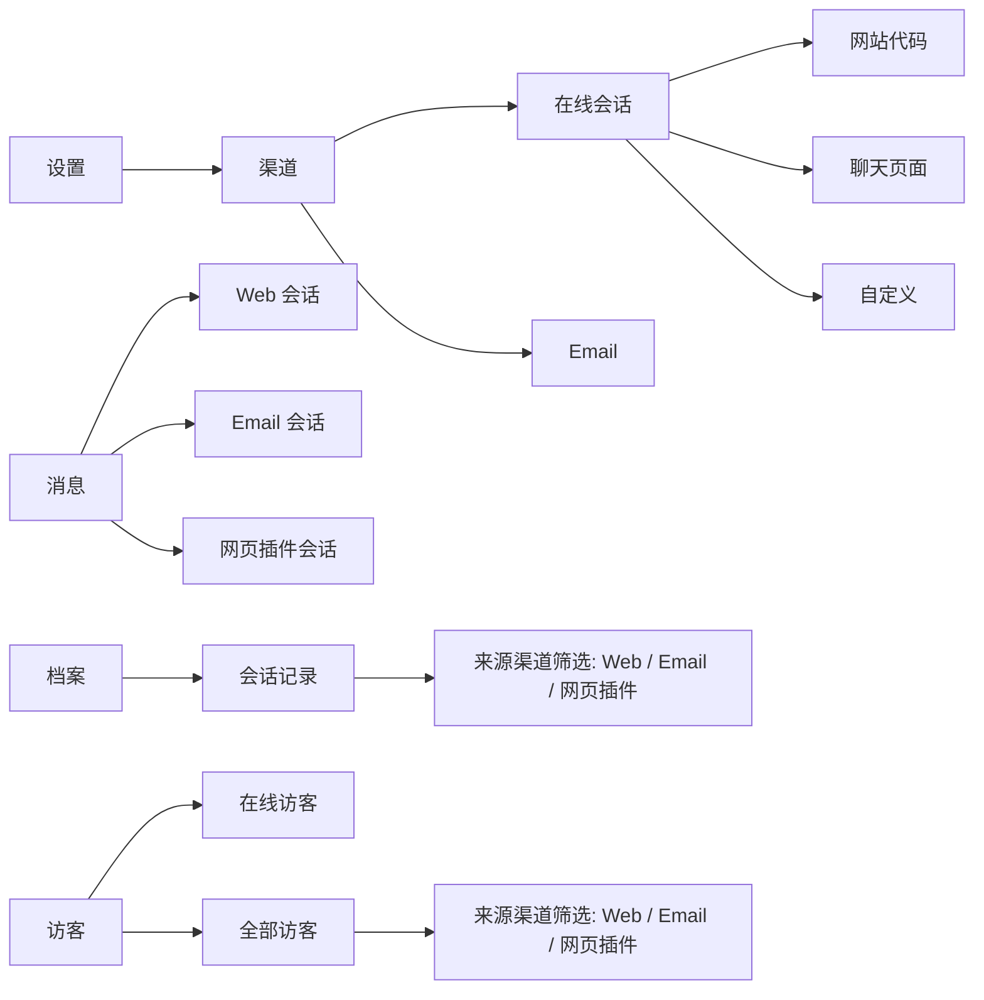
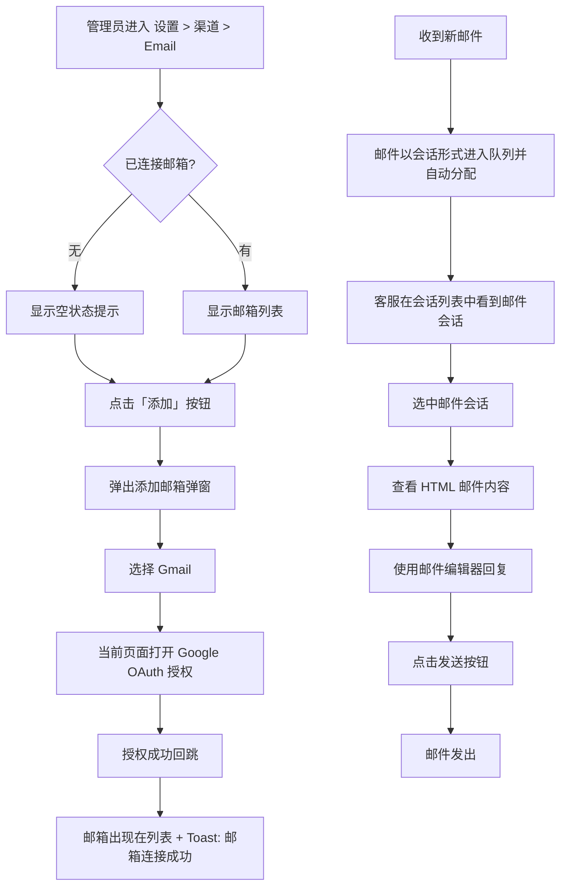

# PRD：接入邮箱渠道

> **版本**：v1.3 · 2026-03-28
> **状态**：草稿
> **模块编号**：Module 08

---

## 1. 概述

### 1.1 背景与动机

| 痛点 | 影响 |
| --- | --- |
| 客户通过邮件发起的咨询散落在不同邮箱客户端，客服需频繁切换工具 | 降低响应速度，容易遗漏邮件，无法统一管理 |

TWT Chat 新增邮箱渠道接入能力，允许团队在同一个客服工作台中收发邮件，所有邮件以会话形式呈现并纳入统一的会话管理流程（分配、协作、标记、归档）。

### 1.2 目标

| Key Result | 量化标准 |
| --- | --- |
| KR1：渠道覆盖 | 支持通过 Gmail OAuth 接入邮箱，后续扩展其他邮箱服务商 |
| KR2：统一管理 | 邮件会话与 Web 会话共享同一套会话队列、分配、归档、筛选流程 |
| KR3：协作效率 | 客服可在同一界面中完成邮件查看、邮件回复、附件发送、会话流转 |

### 1.3 Email 渠道特殊说明

*   不支持 Gmail 以外的邮箱服务商（界面预留"其他邮箱"入口，标记为"敬请期待"）
    
*   不支持邮件模板/邮件签名
    
*   不支持在邮件会话中使用 Autopilot 自动接待
    
*   邮件会话不计入客服并发会话上限
    
*   系统自动过滤 no-reply 类邮件地址（noreply@、no-reply@、no\_reply@、donotreply@、do-not-reply@、do\_not\_reply@、mailer-daemon@，不区分大小写），此类邮件不进入消息队列
    
*   不支持表单、欢迎语、离线回复等专属于网页渠道的会话功能
    
*   不支持边写边译、聊天翻译、文本润色和远程协助功能
    

---

## 2. 用户故事

| ID | 角色 | 用户故事 | 验收标准 | 优先级 |
| --- | --- | --- | --- | --- |
| US-01 | 管理员 | 我希望在设置中添加公司 Gmail 邮箱，以便团队能统一收发邮件 | 通过 Gmail OAuth 授权后，邮箱出现在已连接列表中，Toast 提示"邮箱连接成功" | P0 |
| US-02 | 管理员 | 我希望能删除已连接的邮箱 | 删除确认后邮箱从列表移除，Toast 提示"删除成功" | P0 |
| US-03 | 客服 | 我希望用富文本编辑器回复邮件 | 支持加粗、斜体、下划线、有序/无序列表、超链接、图片内嵌、文件附件 | P0 |
| US-04 | 客服 | 我希望发送邮件时可以选择不同发件人 | 发件人下拉框列出所有已连接邮箱，默认选中该会话最初接收邮件的邮箱 | P0 |
| US-05 | 管理员 | 我希望在档案中按来源渠道筛选邮件会话 | 会话记录列表增加"来源渠道"筛选项和列，支持 Web / Email 筛选 | P1 |
| US-06 | 客服 | 我希望邮件未连接时能看到明确引导 | 编辑器区域显示"暂无可用的发件邮箱"提示，引导前往渠道 > Email 添加 | P0 |
| US-07 | 客服 | 我希望 hover 邮件消息时能快速翻译 | hover 消息显示翻译按钮，再 hover 翻译按钮弹出语言面板，选择语言后显示翻译内容 | P1 |
| US-08 | 客服 | 我希望在访客列表中直接向 email 来源的访客发送邮件 | email 来源访客的操作菜单显示"发送邮件"，点击打开邮件编辑弹窗，发送后跳转到消息 | P1 |
| US-09 | 客服 | 我希望在档案中快速进入或加入已结束的 email 会话 | 若当前客服是服务客服显示"进入会话"，否则显示"加入会话"，点击后跳转到消息对应会话 | P1 |

---

## 3. 功能设计

### 3.1 信息架构

### 3.2 核心流程

### 3.3 子功能详述

#### 3.3.1 邮箱管理（设置页面）

**功能描述**：在设置 > 渠道 > Email 页面中管理已连接的邮箱账户。

**用户场景**：管理员需要为团队接入公司邮箱，使客服能处理邮件咨询。

**前置条件**：

1.  用户具有 Email 渠道的"管理"权限
    

**交互流程**：

1.  进入 Email 页面，若无已连接邮箱，显示空状态：标题"还未添加任何邮箱"，描述"添加邮箱统一收发邮件"
    
2.  若已有邮箱，以表格形式展示，列为：邮箱、创建时间、创建人、操作
    

**需求描述（功能规则）**：

1.  **添加邮箱**：
    
    *   点击右上角「添加」按钮打开弹窗，弹窗标题"添加邮箱"
        
    *   弹窗内展示两张服务商卡片：Gmail（可用）、其他邮箱（置灰，显示"敬请期待"）
        
    *   点击 Gmail 卡片后在当前页面打开 Google OAuth 授权页面
        
    *   授权成功后回跳到邮件页面，邮箱自动加入列表，Toast 提示"邮箱连接成功"
        
    *   邮箱数量上限 99 个，达到上限时「添加」按钮置灰
        
2.  **删除邮箱**：
    
    *   操作列显示"删除"文字按钮
        
    *   点击后弹出确认弹窗，标题"删除邮箱"，描述"删除后将无法接收该邮箱的邮件"
        
    *   按钮：「取消」 + 「删除」
        
    *   确认后从列表移除，Toast 提示"删除成功"
        
3.  **表格字段**：
    
    *   邮箱：显示完整邮箱，超出显示区域用「...」截断
        
    *   创建时间：格式 YYYY-MM-DD HH:mm
        
    *   创建人：头像 + 昵称
        

**后置条件**：

1.  添加邮箱后，系统可通过该邮箱收发邮件，相关会话将进入会话队列
    
2.  删除邮箱后，该邮箱不再接收新邮件
    

---

#### 3.3.2 邮件会话列表

**功能描述**：邮件会话与 Web 会话在同一会话列表中展示，通过渠道图标进行区分。

**用户场景**：客服打开工作台后，需要快速识别哪些是邮件会话、哪些是 Web 会话，哪些是网页插件会话。

**前置条件**：

1.  系统已连接至少一个邮箱
    

**需求描述（功能规则）**：

1.  **渠道图标**：
    
    *   每个会话列表的会话标题前显示渠道图标
        
    *   Autopilot 会话标题前同样显示来源渠道图标
        
2.  **在线状态**：
    
    *   Web / 网页插件会话显示在线/离线状态圆点
        
    *   Email 会话不显示在线状态圆点
        
3.  **会话标题**：
    
    *   Email 会话标题取 subject 字段
        
    *   若无 subject 则显示访客姓名，若访客有备注名显示访客备注名称
        
    *   邮件会话标题无法修改
        
4.  **会话预览**：
    
    *   显示最后一条消息的格式化摘要
        
    *   Email 富文本消息展示规则：
        
        *   纯文本：显示文字，超出显示区域显示"..."
            
        *   包含图片、附件等文件，图片/附件转化为\[图片\]\[附件\]然后显示。例如：我想咨询\[图片\]这个订单状态\[附件\]
            

---

#### 3.3.3 邮件查看与消息展示

**功能描述**：在会话详情区域展示邮件的 HTML 内容，支持富文本渲染和附件显示。

**用户场景**：客服选中一个邮件会话后查看来往邮件内容。

**需求描述（功能规则）**：

1.  **HTML 邮件渲染**：
    
    *   邮件消息以 HTML 格式渲染，支持段落、加粗、斜体、有序/无序列表、超链接、引用块、表格、图片、css样式等标签
        
    *   对 HTML 内容进行安全过滤（白名单机制），移除不安全标签和属性
        
    *   链接强制在新窗口打开（`target="_blank"` + `rel="noopener noreferrer"`）
        
    *   白名单允许的标签：`p, br, strong, em, b, i, u, ol, ul, li, a, blockquote, h1, h2, h3, h4, table, tr, td, th, thead, tbody, span, div, hr, img`
        
    *   白名单允许的属性：`href, src, alt, target, width, height, style`

        
2.  **附件显示**：
    
    *   邮件中的附件信息从 HTML 内容中自动提取，以独立的附件区域展示
        
        
    *   附件提取规则：解析 HTML 结构，识别包含文件名和文件大小的 div 标记，提取后从正文中移除

    *   附件区域位于邮件正文下方
        
    *   附件展示格式：附件格式缩略图 + 附件名称 + 附件大小。缩略图沿用网页会话文件缩略图
        
    *   点击附件在新窗口打开预览，显示文件图标、文件名和文件大小
        
3.  **消息操作**：
    
    *   Email 会话中的消息仅显示翻译操作（不显示回复、复制、撤回等）
        
    *   仅翻译文本内容，图片、附件不翻译
        
        
4.  **引用内容处理**：
    
    *   邮件回复中通常包含历史引用内容（由发件人邮箱客户端自动附加），系统对引用内容进行剥离和独立展示
        
    *   默认仅展示邮件的新增内容，引用内容折叠隐藏
        
    *   当消息包含引用内容时，新增内容下方显示「...」展开按钮
        
    *   点击「...」按钮展开全部引用内容，引用内容以左侧竖线边框 + 次要文字颜色区分
        
    *   展开状态下底部显示「收起」按钮，点击后重新折叠
        
    *   引用内容识别规则：
        *   HTML `<blockquote>` 标签（主要方式）
        *   归因行匹配：`On ... wrote:`、`在 ... 写道：`、`-----Original Message-----`
        
    *   首封邮件（非回复）无引用内容，不显示展开按钮

---

#### 3.3.4 邮件编辑器

**功能描述**：提供富文本邮件编辑器，支持格式化、附件上传。

**用户场景**：客服需要回复邮件，要求支持 HTML 格式和文件附件。

**前置条件**：

1.  当前会话为 Email 类型
    
2.  系统已连接至少一个邮箱（否则显示禁用提示）
    

**交互流程**：

1.  会话详情底部展示邮件编辑器
    
2.  客服在 To 字段看到收件人（只读），在 From 下拉框选择发件人
    
3.  使用工具栏进行格式化编辑，或添加附件/图片
    
4.  点击发送按钮发送
    

**需求描述（功能规则）**：

1.  **禁用状态**：
    
    *   当无可用发件邮箱时，编辑器区域显示禁用提示
        
    *   提示标题："暂无可用的发件邮箱"
        
    *   提示描述："请先在 渠道 > Email 中添加邮箱后再回复"
        
2.  **收发件人**：
    
    *   To 字段：只读，显示访客邮箱
        
    *   From 字段：下拉选择框，列出所有已连接邮箱。下拉选择邮件后不记录，下次进入还是默认选中该会话最初接收邮件的那个邮箱
        
    *   默认选中该会话最初接收邮件的那个邮箱
        
3.  **工具栏**：
    
    *   格式化按钮：加粗、斜体、下划线
        
    *   列表按钮：有序列表、无序列表
        
    *   插入按钮：超链接（弹出输入框输入 URL）
        
    *   附件按钮：触发文件选择，支持多选，单个文件大小上限 10MB。上传的内容都被当作附件处理
        
    *   图片按钮：独立于附件按钮，支持多选，单个文件大小上限 10MB，选择后内嵌到编辑器正文中
        
    *   表情按钮
        
    *   分割线
        
    *   快捷回复按钮：触发快捷回复面板
        
    *   Copilot 推荐回复按钮：触发 AI 推荐回复
        
4.  **图片规则**：
    
    *   点击图片按钮打开本地资源文件夹，系统自动过滤不支持的图片格式文件。
        
    *   支持图片格式：JPG、JPEG、PNG、GIF、WebP、AVIF（忽略大小写）；可多选上传，图片将内嵌至编辑器正文，上传图片后自动在图片上方和下方插入换行符；上传后支持拖动图片四角调整展示尺寸。同时支持粘贴图片、拖拽图片两种快捷上传方式。
        
    *   大小与数量限制：单张图片上限 10MB，超限 Toast 提示：{{file\_name}} 大小不能超过 10MB；单次最多可上传 10 张图片，超限提示：最多只能上传 10 张图片。系统自动过滤超额文件，未超限文件将自动上传。
        
    *   智能上传规则：拖拽文件时自动识别格式，图片内嵌正文，非图片自动转为附件；多选上传自动过滤不支持格式文件，并 toast 提示：{{file1\_name、file2\_name}} 不支持该格式，发送失败。
        
    *   名额自动补足：若当前已上传部分图片/附件，批量上传时将自动补足剩余可上传名额，超出限额的多余图片/附件将自动舍弃。
        
5.  **附件规则**：
    
    *   点击附件按钮打开本地资源文件夹，系统自动过滤不支持格式的文件。
        
    *   支持文件格式：JPG、JPEG、PNG、GIF、WebP、AVIF、MP4、WebM、MOV、TXT、DOC、DOCX、CSV、XLS、XLSX、PPT、PPTX、PDF、ZIP、RAR、7Z（忽略大小写）；支持快捷拖拽上传附件；单个附件大小上限 10MB，超限 Toast 提示：附件大小不能超过 10MB。
        
    *   数量限制：单次最多可上传 10 个附件，超限 Toast 提示：最多只能上传 10 个附件；系统自动过滤超额文件，未超限文件将自动上传。
        
    *   可通过附件选择按钮多选上传；上传完成后，文件以卡片样式展示在编辑器底部，卡片包含文件图标、文件名、文件大小及移除按钮。
        
    *   智能上传规则：拖拽文件时自动识别格式，图片内嵌至正文，非图片自动转为附件；多选上传自动过滤不支持格式文件，并 Toast 提示：{{file1\_name、file2\_name}} 不支持该格式，发送失败。
        
    *   名额自动补足：若当前已上传部分图片 / 附件，批量上传时将自动补足剩余可上传名额，超出限额的多余图片 / 附件将自动舍弃。
        
6.  **文本限制**：
    
    *   正文最多 2000 字符，超出无法输入，仅统计纯文字，图片 / 附件不占字符数。
        
7.  **发送按钮**：
    
    *   单一发送按钮：「发送」
        
    *   当编辑器无内容时，发送按钮置灰不可用
        
8.  **快捷回复与 Copilot 推荐**：
    
    *   使用快捷回复或 Copilot 推荐回复时，会替换输入框的所有内容
        

**后置条件**：

1.  发送成功后，邮件以客服消息的形式追加到消息列表
    
2.  编辑器内容和附件清空
    

---

#### 3.3.5 邮件会话头部操作

**功能描述**：邮件会话头部提供与 Web 会话相同操作按钮集合。

**用户场景**：客服在处理邮件会话时需要协作或关闭会话。

**需求描述（功能规则）**：

1.  **会话标题**：
    
    *   邮件会话标题不支持编辑（Web 会话支持）
        
2.  **操作按钮**：
    
    *   「添加客服」：与 Web 会话一致
        
    *   「转移会话」：与 Web 会话一致
        
    *   「标记为待处理/取消待处理」：与 Web 会话一致
        
    *   「结束会话」：点击后弹出确认弹窗
        
3.  **结束会话弹窗**：
    
    *   标题："结束会话"
        
    *   描述："确认结束该会话吗？"
        
    *   按钮：「取消」 + 「确认结束」
        
    *   确认后会话从列表中移除，Toast 提示"会话已结束"
        
4.  **按钮禁用**：
    
    *   会话已关闭时，所有操作按钮置灰不可用
        
    
    ---
    
    #### 3.3.6 访客信息面板
    
    **功能描述**：访客信息面板增加来源渠道
    
    **用户场景**：客服查看访客来源。
    
    **需求描述（功能规则）**：
    
5.  **附加信息**：
    
    *   来源渠道：在「附加信息 -> 起点页面」下增加「来源渠道」，显示访客的来源渠道。
        
    *   来源渠道确定后不再更新
        
    *   来源渠道无数据显示「-」
        
    *   上线后历史数据统一归纳为 「Web」渠道
        

---

#### 3.3.7 档案中的邮件会话筛选

**功能描述**：会话记录档案中增加"来源渠道"维度，支持按 Web/Email/网页插件 筛选和展示，并提供不同身份下的差异化操作。

**用户场景**：管理员在归档列表中查看和筛选不同渠道会话的历史记录

**需求描述（功能规则）**：

1.  **筛选项**：
    
    *   新增"来源渠道"下拉筛选，选项：全部 / Web / 网页插件 / Email
        
    *   位置在「访客评价」右侧增加
        
2.  **列表展示**：
    
    *   新增"来源渠道"列，展示 Web / 网页插件 / Email 文本
        
    *   位置在「标签」右侧增加
        
    *   上线后历史数据统一归纳为 「Web」渠道
        
3.  **排队中的邮件会话操作**：
    
    *   操作："分配会话"、"查看会话"
        
    *   分配成功后，被分配客服收到浏览器 Push 通知："新会话请求 - {分配人}将此会话分配给你"
        
4.  **非排队状态的邮件会话操作**：
    
    *   当前客服是该会话的服务客服：操作按钮显示"进入会话"，点击后直接跳转到消息对应会话
        
    *   当前客服不是该会话的服务客服：操作按钮显示"加入会话"，点击后将当前客服加入会话的服务团队，然后跳转到消息对应会话
        
    *   均可"查看会话"
        
5.  **删除限制**：
    
    *   结束的邮件会话不显示「删除会话」按钮，无删除功能
        

---

#### 3.3.8 导航与权限标签调整

**功能描述**：接入 Email 渠道后，对左侧导航和权限树中的文案进行统一调整，区分在线会话和邮件会话。

**用户场景**：管理员和客服在日常工作中需要清晰区分在线会话和邮件两种渠道的入口。

**需求描述（功能规则）**：

1.  **导航重命名**：
    
    *   左侧主导航中原"会话"入口重命名为"消息"
        
    *   会话队列面板的标题同步改为"消息"
        
2.  **权限标签重命名**：
    
    *   权限树中"会话"权限组重命名为"消息"
        
    *   权限树中"安装"权限组重命名为"在线会话"
        

---

#### 3.3.9 访客发送邮件

**功能描述**：对于通过 Email 渠道来源的访客，客服可在访客列表中直接发送邮件

**用户场景**：客服在访客列表中发现一个 email 来源的访客，希望主动发送邮件联系。

**前置条件**：

1.  访客信息中已添加 Email、已配置邮箱渠道
    

**交互流程**：

1.  客服在访客列表中操作菜单中点击"发送邮件"（email 来源访客不显示"创建会话"和"发起聊天"）
    
2.  弹出发送邮件弹窗，标题"发送邮件"，下方显示"发送给: {访客姓名}"
    
3.  在富文本编辑区域编写邮件内容，最多 2000 字符。富文本支持加粗、斜体、下划线、有序/无序列表、超链接、附件、图片
    
4.  点击"确认发送"发送邮件
    
5.  发送成功后弹窗关闭，Toast 提示"发送成功"，自动跳转到消息已回复分类
    

**需求描述（功能规则）**：

1.  **操作菜单条件**：
    
    *   Email 来源访客：操作菜单显示"发送邮件"。若访客邮箱为空，点击"发送邮件"toast提示：访客邮箱为空，无法发送。若未配置任何邮箱渠道，点击"发送邮件"toast提示：未配置邮箱渠道，无法发送。
        
    *   非 Email 来源访客：操作菜单显示"创建会话"、"发起聊天"和"发送邮件"。若访客邮箱为空，点击"发送邮件"toast提示：访客邮箱为空，无法发送。若未配置任何邮箱渠道，点击"发送邮件"toast提示：未配置邮箱渠道，无法发送。
        
2.  **弹窗规则**：
    
    *   编辑区域为富文本输入（contenteditable），最多 2000 字符
        
    *   超出字符上限时自动截断
        
    *   编辑区域为空时"确认发送"按钮置灰
        

---

#### 3.3.10 客户发送邮件

**功能描述**：对于已填写邮箱的客户，客服可在客户列表中直接发送邮件

**用户场景**：客服在客户列表主动发送邮件联系客户。

**前置条件**：

1.  客户信息中已添加 Email、已配置邮箱渠道
    

**交互流程**：

1.  客服在客户列表中操作菜单中点击"发送邮件"
    
2.  弹出发送邮件弹窗，标题"发送邮件"，下方显示"发送给: {访客姓名}"
    
3.  在富文本编辑区域编写邮件内容，最多 2000 字符。富文本支持加粗、斜体、下划线、有序/无序列表、超链接、附件、图片
    
4.  点击"确认发送"发送邮件
    
5.  发送成功后弹窗关闭，Toast 提示"发送成功"，自动跳转到消息已回复分类
    

**需求描述（功能规则）**：

1.  **操作菜单条件**：
    
    *   客户列表：操作菜单显示"创建会话"、"发起聊天"和"发送邮件"。若访客邮箱为空，点击"发送邮件"toast提示：访客邮箱为空，无法发送。若未配置任何邮箱渠道，点击"发送邮件"toast提示：未配置邮箱渠道，无法发送。
        
2.  **弹窗规则**：
    
    *   编辑区域为富文本输入（contenteditable），最多 2000 字符
        
    *   超出字符上限时自动截断
        
    *   编辑区域为空时"确认发送"按钮置灰
        

---

#### 3.3.11 邮件会话生命周期规则

**功能描述**：Email 会话与 Web 会话在生命周期管理上存在差异化规则。

**用户场景**：客服在处理 email 会话时，结束会话和并发管理的行为与在线会话不同。

**需求描述（功能规则）**：

1.  **结束 email 会话**：
    
    *   结束 email 会话时保留原服务客服（不清除分配关系），后续邮件回复仍可重新激活会话
        
    *   已结束的 email 会话进入档案
        
2.  **并发上限豁免**：
    
    *   Email 会话不计入客服的并发会话上限
        
    *   仅 Web / 网页插件在线会话计入并发数统计
        
3.  **访客自动生成**：
    
    *   收到新邮件时系统自动生成一个访客
        
    *   访客昵称取发件人姓名，头像取姓名前 2 个字符
        
4.  **会话重新激活分配**：
    
    *   结束的邮件会话收到新邮件时，会话重新激活并分配给原服务客服，不重新进入排队分配流程
        

---

#### 3.3.12 APP 端 Email 会话处理

**功能描述**：移动端 APP 不支持 Email 会话的查看和处理，仅在 Web 客服端可见。

**用户场景**：客服在移动端 APP 中查看档案或会话列表时，不应看到 Email 会话。

**需求描述（功能规则）**：

1.  **档案列表过滤**：
    
    *   APP 档案中不展示 Email 会话
        
    *   不显示来源渠道筛选项
        
2.  **会话跳转限制**：
    
    *   如果通过其他入口（如分配会话）尝试打开 Email 会话，Toast 提示"暂不支持邮件会话，请前往网页端处理"
        
    *   不跳转到会话详情页
        

---

#### 3.3.13 访客与客户模块增加来源渠道

**功能描述**：在访客列表、客户列表、访客信息面板、客户信息面板中增加来源渠道字段，支持按渠道筛选和展示。

**用户场景**：客服需要了解访客或客户是通过哪个渠道接入的，便于分类管理和统计分析。

**需求描述（功能规则）**：

1.  **访客列表**：
    
    *   新增"来源渠道"表头列，位置在标签右侧
        
    *   显示值：Web / 网页插件 / Email
        
    *   新增"来源渠道"筛选项，下拉选项：全部 / Web / 网页插件 / Email
        
    *   上线后历史数据统一归纳为 「Web」渠道
        
2.  **客户列表**：
    
    *   新增"来源渠道"表头列，位置在标签右侧
        
    *   显示值：Web / 网页插件 / Email
        
    *   新增"来源渠道"筛选项，下拉选项：全部 / Web / 网页插件 / Email
        
    *   上线后历史数据统一归纳为 「Web」渠道
        
3.  **访客信息面板**：
    
    *   在"附加信息"区块中，"起点页面"字段下方增加"来源渠道"字段
        
    *   显示值：Web / 网页插件 / Email
        
    *   上线后历史数据统一归纳为 「Web」渠道
        
4.  **客户信息面板**：
    
    *   在"附加信息"区块中，"起点页面"字段下方增加"来源渠道"字段
        
    *   显示值：Web / 网页插件 / Email
        
    *   上线后历史数据统一归纳为 「Web」渠道
        

---

#### 3.3.14 设置页渠道适用范围说明

**功能描述**：在相关设置页面中明确标注配置项的渠道适用范围，防止用户混淆。

**用户场景**：管理员在配置团队设置时，需要知道这些配置是否会影响 email 渠道。

**需求描述（功能规则）**：

1.  **团队 > 成员设置页面**：
    
    *   在「成员不活跃」和「会话超时」设置项标题后增加问号图标（?）
        
    *   Hover 问号图标时显示 tooltip："此设置对 Email 渠道会话不生效"
        

---

#### 3.3.15 运营后台联动

**功能描述**：运营后台的列表和数据看板需同步支持 Email 渠道的数据展示与筛选。

**用户场景**：运营人员需要在后台查看和筛选不同渠道的会话、访客、客户数据，并在数据看板中查看包含 Email 会话的统计。

**需求描述（功能规则）**：

1.  **会话列表**：
    
    *   新增"来源渠道"表头列和筛选项，下拉选项：全部 / Web / 网页插件 / Email
        
2.  **访客列表**：
    
    *   新增"来源渠道"表头列和筛选项，下拉选项：全部 / Web / 网页插件 / Email
        
3.  **客户列表**：
    
    *   新增"来源渠道"表头列和筛选项，下拉选项：全部 / Web / 网页插件 / Email
        
4.  **数据看板**：
    
    *   会话统计数据需包含 Email 会话
        
5.  需求原型：
    
    *   需求原型：[https://pm.pro.jishu666.com/web-admin/#/project/list](https://pm.pro.jishu666.com/web-admin/#/project/list)
        
    *   需求文档：[《PRD：运营后台来源渠道功能》](https://alidocs.dingtalk.com/i/nodes/EpGBa2Lm8ajPxxe5fDzl5ERvWgN7R35y?utm_scene=team_space)
        

---

## 4. 权限与角色

| 功能 | 超级管理员 | 客服 | 无权限时的表现 |
| --- | --- | --- | --- |
| 管理邮箱（添加/删除） | 有 | 默认无，不给予 | 无法操作 |
| 收发邮件会话 | 有 | 有（会话权限为锁定权限，所有角色均有） | \- |

权限在权限树中的位置：

*   权限组：Email 渠道
    
*   权限项：Email — 管理
    

---

## 5. 约束与依赖

| 约束/依赖 | 说明 | 影响范围 |
| --- | --- | --- |
| Gmail OAuth | 当前仅支持 Gmail，依赖 Google OAuth 2.0 授权流程 | 邮箱连接功能 |
| 已连接邮箱 | 编辑器需要至少一个已连接邮箱才能启用发送功能 | 邮件回复功能 |

---

## 6. 异常处理

| 异常场景 | 处理方式 | 用户感知 |
| --- | --- | --- |
| 无已连接邮箱时尝试回复 | 编辑器显示禁用提示 | 看到"暂无可用的发件邮箱"引导文案 |
| 上传图片超过 10MB | 跳过该文件 | Toast "图片大小不能超过10MB" |
| 上传附件超过 10MB | 跳过该文件 | Toast "附件大小不能超过10MB" |
| 附件数量超过 10 个 | 跳过超出的文件 | Toast "最多只能上传10个附件" |
| 邮箱数量达到上限 99 个 | 添加按钮置灰 | hover 提示"最多支持 99 个邮箱" |

---

## 7. 跨模块联动

| 联动模块 | 联动方式 | 说明 |
| --- | --- | --- |
| 导航模块 | 文案重命名 | "会话"导航重命名为"消息"，以包含 Web、网页插件和 Email 渠道会话 |
| 会话列表 | 渠道类型标识 | 在会话列表中以不同图标和样式区分不同渠道会话 |
| 消息展示 | 翻译操作 | 邮件消息 hover 显示翻译按钮和语言面板；Web 消息显示完整工具栏（回复、复制、翻译、撤回等） |
| 访客信息面板 | 字段差异 | 访客信息面板增加来源渠道 |
| 访客列表 | 操作菜单差异 | Email 来源访客显示"发送邮件"无"创建会话" |
| 访客列表 | 来源渠道筛选 | 新增来源渠道表头列和筛选项，支持 Web / 网页插件 /Email 筛选 |
| 客户列表 | 来源渠道筛选 | 新增来源渠道表头列和筛选项，支持 Web / 网页插件 / Email 筛选 |
| 档案模块 | 筛选和操作差异 | 新增来源渠道筛选列，邮件会话有差异化的操作菜单和导航行为 |
| 移动端 APP | Email 会话过滤 | APP 档案中不展示 Email 会话，点击时 Toast 提示"暂不支持邮件会话，请前往网页端处理" |
| 权限模块 | 权限标签调整 | "会话"权限组改为"消息"，"安装"改为"在线会话"；Email 渠道设置页受独立权限项控制 |
| 并发管理 | 计数豁免 | Email 会话不计入客服并发会话上限 |
| Webhooks | 推送通知 | Webhooks 需要推送 Email 渠道的会话通知 |
| 官网权益 | 权益调整 | 官网增加 Email 权益展示 |
| 风控模块 | 消息检测 | 邮件消息同样需要进行风控检测 |
| 运营后台 | 列表与统计 | 会话列表/访客列表/客户列表增加来源渠道筛选；数据看板会话统计包含 Email 会话 |
