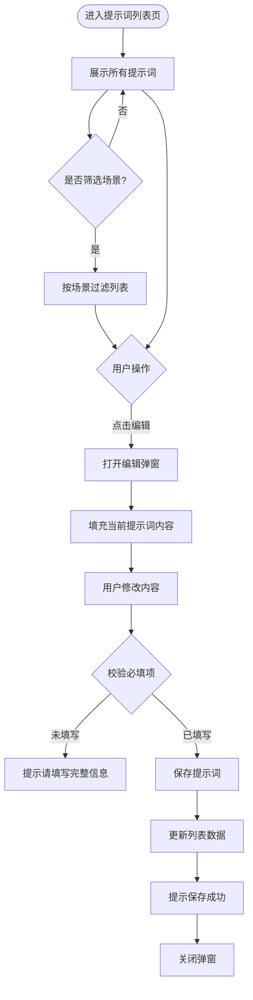

# PRD：提示词管理

> **版本**：v1.0 · 2026-03-26
> **状态**：已确认
> **模块编号**：Module 08

---

## 1. 概述

### 1.1 背景与动机

| 痛点 | 影响 |
|------|------|
| AI Agent 的提示词分散在代码中，运营人员无法直接调整优化 | 每次调整提示词都需要开发介入，迭代周期长，无法快速响应业务需求 |
| 缺乏统一的提示词版本管理和变更记录 | 无法追溯提示词的历史变更，出现问题时难以回溯 |
| 不同场景的提示词缺乏可视化管理界面 | 运营人员无法直观了解当前各场景使用的提示词内容 |

提示词管理功能为运营后台提供统一的提示词配置界面，支持查看、编辑和管理 AI Agent 各场景下的系统提示词和用户提示词，提升提示词迭代效率。

### 1.2 目标

| Key Result | 量化标准 |
|-----------|---------|
| KR1：提示词可视化管理 | 运营人员可在后台查看和编辑所有场景的提示词，无需接触代码 |
| KR2：变更可追溯 | 每次提示词修改记录更新人和更新时间 |

### 1.3 非目标（本期不做）

- 提示词版本历史对比功能
- 提示词 A/B 测试功能
- 提示词效果评估和分析
- 提示词模板库和复用机制

---

## 2. 用户故事

| ID | 角色 | 用户故事 | 验收标准 | 优先级 |
|----|------|---------|----------|--------|
| US-01 | 运营人员 | 我希望查看所有场景的提示词列表，以便了解当前系统配置 | 列表展示场景名称、提示词摘要、更新时间、更新人 | P0 |
| US-02 | 运营人员 | 我希望按场景筛选提示词，以便快速定位特定场景 | 支持场景下拉筛选，选择后列表实时更新 | P0 |
| US-03 | 运营人员 | 我希望编辑提示词内容，以便优化 AI 回复效果 | 点击编辑打开弹窗，修改后保存成功并更新列表 | P0 |
| US-04 | 运营人员 | 我希望看到提示词的完整内容，以便准确修改 | 编辑弹窗中完整展示系统提示词和用户提示词 | P0 |

---

## 3. 功能设计

### 3.1 信息架构

```
运营后台
└── 提示词管理
    └── 提示词列表
        ├── 场景筛选
        ├── 提示词表格
        └── 编辑提示词弹窗
```

### 3.2 核心流程



### 3.3 子功能详述

#### 3.3.1 提示词列表查看

**功能描述**：展示所有场景的提示词配置，支持按场景筛选。

**用户场景**：运营人员需要查看当前系统中各场景使用的提示词内容。

**前置条件**：
1. 用户已登录运营后台
2. 用户有提示词管理权限

**交互流程**：
1. 用户点击侧边栏「提示词管理 > 提示词列表」
2. 系统加载并展示所有提示词记录
3. 用户可选择场景进行筛选
4. 列表实时更新展示筛选结果

**需求描述（功能规则）**：

1. **列表展示规则**：
   - 表格列：场景、系统提示词、用户提示词、更新日期、更新人、操作
   - 系统提示词和用户提示词列最多显示 12 个字符，超出用省略号截断
   - 默认按更新日期倒序排列
   - 支持按更新日期排序

2. **场景筛选规则**：
   - 筛选下拉框默认显示「全部」
   - 下拉选项动态生成，包含所有已有场景
   - 选择场景后立即过滤列表
   - 点击「搜索」按钮执行筛选
   - 点击「重置」按钮清空筛选条件，恢复显示全部

3. **分页规则**：
   - 默认每页显示 10 条
   - 支持切换每页 10/20/50 条
   - 显示总条数「共 N 条」
   - 支持页码跳转

**后置条件**：
1. 列表正确展示提示词数据
2. 筛选和分页功能正常工作

#### 3.3.2 编辑提示词

**功能描述**：修改指定场景的系统提示词和用户提示词内容。

**用户场景**：运营人员需要优化某个场景的提示词以改善 AI 回复效果。

**前置条件**：
1. 用户在提示词列表页
2. 列表中存在可编辑的提示词记录

**交互流程**：
1. 用户点击表格中某条记录的「编辑」链接
2. 系统打开编辑弹窗，填充当前提示词内容
3. 用户修改系统提示词或用户提示词
4. 用户点击「确定」按钮
5. 系统校验必填项
6. 校验通过后保存数据
7. 系统更新列表中的记录
8. 显示「保存成功」提示
9. 关闭弹窗

**需求描述（功能规则）**：

1. **弹窗展示规则**：
   - 弹窗标题：编辑提示词
   - 弹窗宽度：800px
   - 场景名称：只读展示，不可编辑
   - 系统提示词输入框：12 行高度，必填
   - 用户提示词输入框：8 行高度，必填
   - 底部按钮：取消、确定

2. **输入规则**：
   - 系统提示词：必填，多行文本，无长度限制
   - 用户提示词：必填，多行文本，无长度限制
   - 支持输入变量占位符（如 {{visitorMessage}}、{{conversationHistory}}）

3. **校验规则**：
   - 系统提示词为空时，提示「请填写完整信息」
   - 用户提示词为空时，提示「请填写完整信息」
   - 校验不通过时不关闭弹窗

4. **保存规则**：
   - 保存时更新提示词内容
   - 自动更新「更新日期」为当前日期
   - 保存成功后显示「保存成功」提示
   - 关闭弹窗并刷新列表数据

**后置条件**：
1. 提示词内容已更新
2. 列表中对应记录的更新日期已刷新
3. 弹窗已关闭

---

## 4. 数据模型

| 实体名 | 字段 | 类型 | 说明 |
|--------|------|------|------|
| 提示词记录 | id | number | 唯一标识 |
| | scene | string | 场景名称（如：语言检测、意图分类+情绪检测） |
| | systemPrompt | string | 系统提示词内容 |
| | userPrompt | string | 用户提示词内容 |
| | updatedAt | string | 更新日期（YYYY-MM-DD 格式） |
| | updater | string | 更新人姓名 |

---

## 5. 权限与角色

| 功能 | 管理员 | 运营人员 | 无权限时的表现 |
|------|--------|---------|--------------|
| 查看提示词列表 | ✓ | ✓ | 侧边栏菜单隐藏 |
| 编辑提示词 | ✓ | ✓ | 操作列不显示编辑链接 |

---

## 6. 约束与依赖

| 约束/依赖 | 说明 | 影响范围 |
|----------|------|---------|
| 前端数据存储 | 当前版本提示词数据存储在前端 mock 数据中，刷新页面后修改丢失 | 需后续接入后端 API 实现持久化 |
| AI Agent 调用 | 提示词修改后需要 AI Agent 模块重新加载配置才能生效 | 需配合 AI Agent 模块的配置热更新机制 |

---

## 7. 异常处理

| 异常场景 | 处理方式 | 用户感知 |
|---------|---------|---------|
| 必填项未填写 | 前端校验拦截，不提交保存 | 显示「请填写完整信息」提示 |
| 保存失败（网络异常） | 显示错误提示，保持弹窗打开 | 显示「保存失败，请重试」提示 |
| 列表加载失败 | 显示空状态或错误提示 | 页面提示「加载失败」 |

---

## 8. 跨模块联动

| 联动模块 | 联动方式 | 说明 |
|----------|----------|------|
| AI Agent 设置 | 配置读取 | AI Agent 运行时读取提示词配置 |
| 会话管理 | 提示词应用 | 访客会话中使用配置的提示词生成回复 |

---

## 9. 开放问题

| # | 问题 | 备选方案 | 当前倾向 | 状态 |
|---|------|---------|---------|------|
| 1 | 提示词修改后是否需要审核流程？ | A. 直接生效 B. 需审核后生效 | A. 直接生效 | 待确认 |
| 2 | 是否需要提示词版本历史记录？ | A. 本期不做 B. 本期实现 | A. 本期不做 | 已确认 |
| 3 | 是否支持提示词导入导出？ | A. 本期不做 B. 本期实现 | A. 本期不做 | 已确认 |
