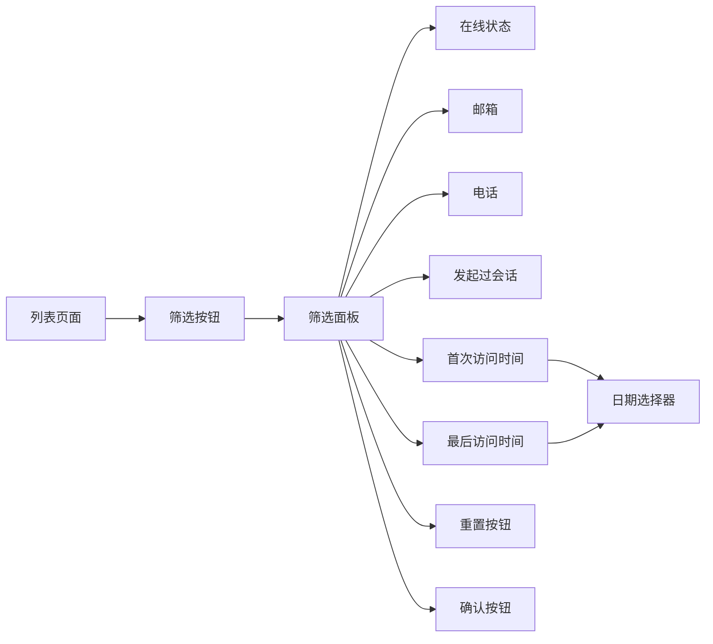
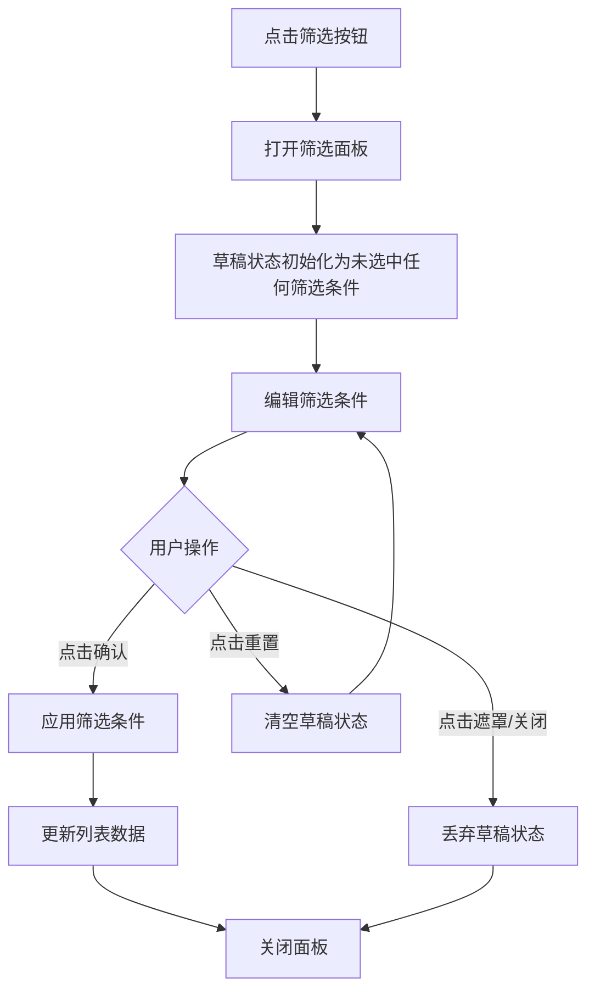

# PRD：筛选面板

> **版本**：v1.0 · 2026-03-31  
> **状态**：草稿

---

## 1. 概述

### 1.1 背景与动机

| 痛点 | 影响 |
|------|------|
| 访客和客户列表数据量大时，难以快速找到目标对象 | 查找效率低，影响客服工作效率 |
| 仅靠搜索姓名无法满足复杂筛选需求 | 无法按在线状态、联系方式、访问时间等维度筛选 |

筛选面板为访客和客户列表提供多维度筛选能力，支持按在线状态、联系方式、会话历史、访问时间等条件快速定位目标对象。

---

## 2. 用户故事

| ID | 角色 | 用户故事 | 验收标准 | 优先级 |
|----|------|---------|----------|--------|
| US-01 | 客服 | 我希望筛选当前在线的访客 | 可通过在线状态筛选条件快速过滤 | P0 |
| US-02 | 客服 | 我希望找到有邮箱的客户 | 可通过联系方式筛选条件过滤 | P0 |
| US-03 | 客服 | 我希望找到最近 7 天访问过的访客 | 可通过日期范围筛选访问时间 | P1 |
| US-04 | 客服 | 我希望组合多个筛选条件 | 可同时应用多个筛选条件（AND 关系） | P1 |

---

## 3. 功能设计

### 3.1 信息架构

### 3.2 核心流程

### 3.3 子功能详述

#### 3.3.1 打开筛选面板

**功能描述**：点击筛选按钮打开筛选面板弹窗。

**用户场景**：需要按特定条件筛选访客或客户列表。

**前置条件**：
1. 当前页面为访客列表或客户列表

**交互流程**：
1. 用户点击筛选按钮
2. 系统打开筛选面板
3. 草稿状态（即筛选面板中用户正在编辑但未点击确认的筛选条件）初始化为空状态

**需求描述（功能规则）**：
1. **触发入口**：列表页面搜索框右侧的筛选按钮
2. **初始状态**：每次打开筛选面板时，草稿状态重置为空，不保留上次的筛选条件

**后置条件**：
1. 筛选面板打开
2. 草稿状态为空（所有筛选条件未选中）

#### 3.3.2 选择筛选条件

**功能描述**：在筛选面板中选择或取消筛选条件。

**用户场景**：设置需要的筛选条件组合。

**交互流程**：
1. 用户点击筛选选项按钮
2. 系统切换该选项的选中状态
3. 草稿状态更新

**需求描述（功能规则）**：
1. **筛选条件列表**：
   - 在线状态：在线 / 不在线（单选，可取消）
   - 邮箱：有邮箱 / 无邮箱（单选，可取消）
   - 电话：有电话 / 无电话（单选，可取消）
   - 发起过会话：是 / 否（单选，可取消）
   - 首次访问时间：日期范围选择
   - 最后访问时间：日期范围选择

2. **单选可取消规则**：
   - 初始状态：未选中任何选项
   - 点击选项：选中该选项
   - 再次点击已选项：取消选中，恢复未选状态
   - 点击另一选项：切换到新选项

3. **日期范围选择**：点击日期触发按钮打开日期选择器（详见 3.3.3）

**后置条件**：
1. 草稿状态更新
2. 选项按钮显示选中或未选状态

#### 3.3.3 日期范围选择

**功能描述**：选择首次访问时间或最后访问时间的日期范围。

**用户场景**：需要筛选特定时间段内访问过的访客或客户。

**前置条件**：
1. 筛选面板已打开

**交互流程**：
1. 用户点击日期触发按钮
2. 系统打开日期选择器弹窗（位于筛选面板上方）
3. 用户点击开始日期，再点击结束日期
4. 系统自动关闭日期选择器，日期范围显示在触发按钮上

**需求描述（功能规则）**：
1. **日历布局**：双月并排显示，左侧为上月，右侧为当月
2. **日期限制**：不可选择未来日期，今天及之前的日期可选
3. **选择流程**：
   - 第一次点击选择开始日期
   - 第二次点击选择结束日期
   - 如果第二次点击的日期早于开始日期，自动交换两者
   - 如果第二次点击的日期等于开始日期（单个日期），丢弃选择，不保存到草稿
   - 选择完结束日期后自动关闭弹窗

4. **悬停预览**：选择开始日期后，鼠标悬停在其他日期上时，显示临时范围高亮
5. **日期状态**：
   - 开始和结束日期：选中状态
   - 范围内日期：范围内状态
   - 今天：今日标识
   - 未来日期：禁用状态，不可点击

6. **月份导航**：
   - 左侧月份：可向前翻页（年/月）
   - 右侧月份：不可超过当前月份
   - 导航按钮：« 上一年、‹ 上一月、› 下一月、» 下一年

7. **触发按钮显示**：
   - 未选择时：显示「请选择」
   - 已选择时：显示「YYYY/MM/DD - YYYY/MM/DD」

8. **清除功能**：
   - 鼠标悬停在已选择日期的触发按钮上时，显示清除按钮
   - 点击清除按钮，清空该日期范围选择

9. **关闭方式**：
   - 选择完结束日期后自动关闭
   - 点击遮罩层关闭，丢弃已选的开始日期，不保存到草稿

9. **边界值**：
   - 允许开始日期 = 结束日期（表示筛选当天）
   - 无最大跨度限制

**后置条件**：
1. 日期范围保存到草稿筛选条件
2. 触发按钮显示选中的日期范围

#### 3.3.4 重置筛选条件

**功能描述**：清空草稿状态中的所有筛选条件。

**用户场景**：需要清空当前编辑的筛选条件，重新选择。

**交互流程**：
1. 用户点击「重置」按钮
2. 系统清空草稿状态
3. 所有筛选选项恢复未选状态

**需求描述（功能规则）**：
1. **重置范围**：仅清空草稿状态，不影响已应用的筛选条件
2. **重置内容**：
   - 所有单选条件恢复为 null（未选状态）
   - 所有日期范围清空
3. **面板状态**：重置后面板保持打开，允许用户重新选择
4. **按钮状态**：重置按钮始终可用

**后置条件**：
1. 草稿状态所有字段清空
2. 所有选项按钮恢复未选状态
3. 日期触发按钮显示默认文案「请选择」

#### 3.3.5 确认应用筛选

**功能描述**：将草稿状态应用为正式筛选条件，更新列表数据。

**用户场景**：完成筛选条件设置，应用到列表。

**交互流程**：
1. 用户点击「确认」按钮
2. 系统将草稿状态应用为正式筛选条件
3. 系统根据筛选条件更新列表数据
4. 系统关闭筛选面板

**需求描述（功能规则）**：
1. **应用逻辑**：将草稿状态复制到正式筛选条件
2. **筛选规则**：所有条件之间为 AND 关系（同时满足）
3. **按钮状态**：确认按钮始终可用
4. **筛选按钮状态更新**：
   - 无筛选条件时：默认状态
   - 有筛选条件时：激活状态

**后置条件**：
1. 正式筛选条件更新
2. 列表数据根据筛选条件过滤
3. 筛选面板关闭
4. 筛选按钮显示激活状态（如有筛选条件）

#### 3.3.6 关闭筛选面板

**功能描述**：关闭筛选面板并丢弃未确认的草稿状态。

**用户场景**：用户不想应用当前编辑的筛选条件。

**交互流程**：
1. 用户点击关闭按钮或遮罩层
2. 系统丢弃草稿状态
3. 系统关闭筛选面板

**需求描述（功能规则）**：
1. **触发方式**：
   - 点击面板外的遮罩层

2. **草稿处理**：丢弃草稿状态，不影响已应用的筛选条件

**后置条件**：
1. 筛选面板关闭
2. 草稿状态丢弃
3. 已应用的筛选条件保持不变

---

## 4. 跨模块联动

| 联动模块 | 联动方式 | 说明 |
|----------|----------|------|
| 列表数据 | 筛选条件变化时更新 | 根据筛选条件过滤列表 |
| 搜索功能 | 与搜索条件叠加 | 搜索和筛选同时生效（AND 关系） |

---

## 5. 开放问题

| # | 问题 | 备选方案 | 当前倾向 | 状态 |
|---|------|---------|---------|------|
| 1 | 筛选条件是否需要持久化？ | A. 每次打开重置 B. 记住上次条件 | A | 已确认 |
| 2 | 「发起过会话」和「首次/最后访问时间」是否需要后端数据支持？ | A. 当前为前端 mock B. 对接后端 API | A | 待实现 |

