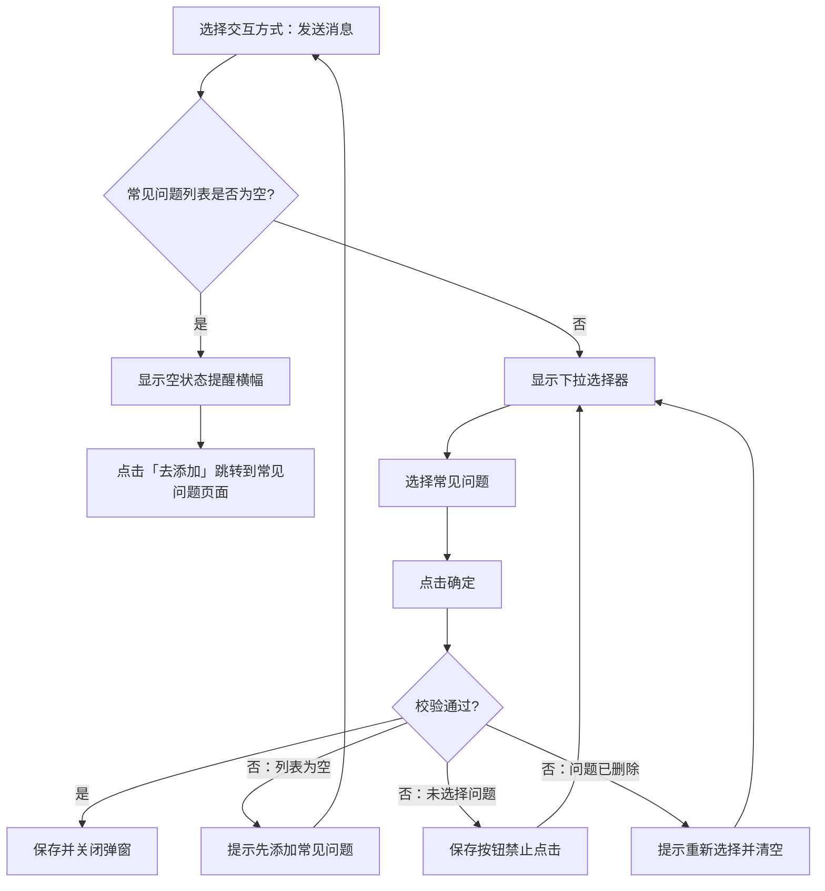

# PRD：网页渠道快捷入口优化

> **版本**：v1.0 · 2026-04-01
> **状态**：已交付

---

## 1. 概述

### 1.1 背景与动机

| 痛点 | 影响 |
|------|------|
| 快捷入口仅支持跳转链接和复制文本，功能单一 | 无法满足自动发送常见问题等场景，访客仍需手动输入 |
| 图标一旦设置无法清除，且为必填项 | 管理员配置灵活度不足 |
| 交互方式字段名称和提示文案不够直观 | 管理员理解成本高 |

本次优化在已有快捷入口功能基础上，新增「发送消息」交互方式（关联知识库常见问题），优化图标字段为非必填并支持删除，同时调整字段名称和提示文案使其更加清晰。

### 1.2 目标

| Key Result | 量化标准 |
|-----------|---------|
| KR1：新增发送消息交互方式 | 支持关联知识库常见问题 |
| KR2：关联知识库 | 发送消息支持选择知识库常见问题页面中的问题 |
| KR3：优化配置体验 | 图标改为非必填并支持删除，字段文案更直观 |

---

## 2. 用户故事

| ID | 角色 | 用户故事 | 验收标准 | 优先级 |
|----|------|---------|----------|--------|
| US-01 | 客服管理员 | 我希望访客能通过快捷入口自动发送预设消息 | 能创建「发送消息」类型的快捷入口，关联知识库常见问题 | P0 |
| US-02 | 客服管理员 | 我希望删除不需要的图标 | 已设置的图标显示删除按钮，可清除图标 | P1 |

---

## 3. 功能设计

### 3.1 核心流程

### 3.2 子功能详述

#### 3.2.1 图标字段优化

**功能描述**：图标改为非必填，已有图标支持删除。

**需求描述**：
1. 图标字段改为非必填
2. 已有图标时（无论自动填充还是手动上传），显示删除按钮
3. 点击删除按钮清除图标，恢复为空状态，可重新上传

---

#### 3.2.2 字段名称和文案调整

**功能描述**：优化弹窗中的字段名称和提示文案，使其更清晰易懂。

**需求描述**：

| 调整项 | 调整前 | 调整后 |
|--------|--------|--------|
| 字段名称 | 访问内容 | 交互方式 |
| 选项名称 | URL | 打开链接 |
| 选项名称 | 文本内容 | 复制文本 |
| 打开链接输入框提示 | 请输入URL | 请输入链接地址 |
| 复制文本输入框提示 | 请输入文本内容 | 请输入需要复制的文本 |
| 说明提示（tooltip） | 选择 URL 时，请填写完整网页地址，访客点击后会直接跳转；选择文本内容时，访客点击后会直接复制该内容。 | 打开链接：访客点击后跳转到指定网页；复制文本：访客点击后复制指定内容；发送消息：访客点击后自动发送预设消息 |

---

#### 3.2.3 发送消息交互方式

**功能描述**：新增「发送消息」交互方式，访客点击快捷入口后自动发送预设消息。

**用户场景**：管理员希望访客点击快捷入口后自动发送问题，由系统或客服给出回答，减少访客手动输入。

**交互流程**：
1. 在交互方式中选择「发送消息」
2. 系统判断常见问题列表是否为空
   - 若为空：显示空状态提醒横幅
   - 若不为空：显示常见问题下拉选择器
3. 从知识库常见问题列表中选择问题
4. 提交时系统校验内容有效性

**需求描述**：
1. **空状态提醒横幅**（当常见问题列表为空时显示）：
   - 提示文案：「当前未添加常见问题」
   - 「去添加」链接：点击跳转到知识库常见问题页面
2. **常见问题下拉选择器**（当常见问题列表不为空时显示）：
   - 提示文案「请选择常见问题」
   - 选项来源为知识库常见问题页面中的问题列表
3. 校验规则：
   - 所选常见问题已被删除时提交：toast提示「所选常见问题已被删除，请重新选择」并清空选择
4. 访客端显示规则：
   - 会话结束后快捷入口隐藏

---

#### 3.2.4 常见问题关联与异常处理

**功能描述**：处理已关联的常见问题被删除的异常场景。

**需求描述**：

1. **管理端编辑时**：当已关联的常见问题被删除后，下次打开编辑弹窗时，系统检测到所选问题已不存在，在下拉选择器下方显示行内警告「所选常见问题已被删除，请重新选择」。点击确定时阻止提交，toast 提示「所选常见问题已被删除，请重新选择」，同时清空选择。

2. **访客端点击时**：当访客点击关联了已删除常见问题的快捷入口时，该快捷入口不执行任何操作（不发送消息），静默失效。