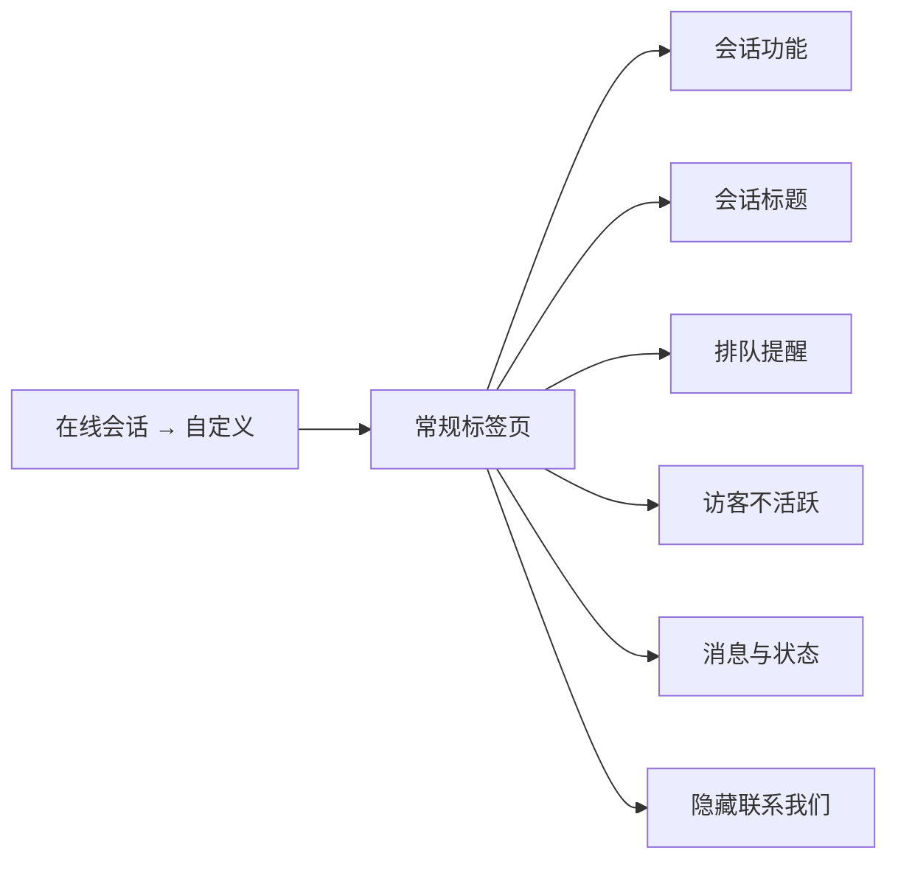
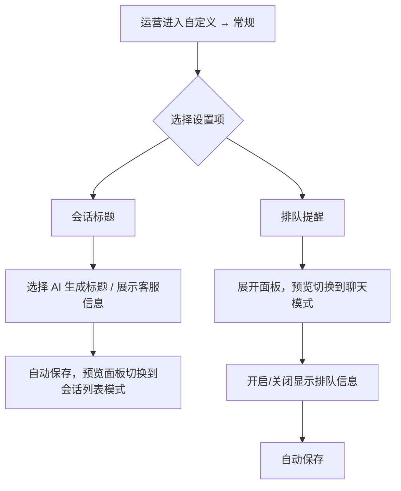

# PRD：自定义会话标题与排队提醒

> **版本**：v1.0 · 2026-03-22
> **状态**：已交付
> **模块编号**：Module 15

---

## 1. 概述

### 1.1 背景与动机

| 痛点 | 影响 |
|------|------|
| 访客端会话列表和会话详情中无法展示负责客服的信息 | 访客无法直观识别正在服务的客服是谁，降低了服务的个性化感知和信任感 |
| 访客发起会话进入排队后，无法得知自己前面还有多少人 | 访客等待焦虑增大，缺乏预期管理，可能导致访客流失 |

在线会话自定义模块已支持外观、内容、会话表单和常规设置。本次在常规标签页中新增两项配置能力：**会话标题展示方式**和**排队提醒**，让运营团队可以灵活控制访客端的信息展示策略。

### 1.2 目标

| Key Result | 量化标准 |
|-----------|---------|
| KR1：会话标题可配置 | 运营可在「AI 生成标题」和「展示客服信息」之间自由切换，切换后访客端实时生效 |
| KR2：排队透明化 | 排队中访客可在聊天顶部看到排队位置信息，减少等待焦虑 |

### 1.3 非目标（本期不做）

- 不支持自定义排队提醒的文案模板
- 不支持排队预估等待时长
- 客服端不受会话标题设置的影响，保持现有展示逻辑

---

## 2. 用户故事

| ID | 角色 | 用户故事 | 验收标准 | 优先级 |
|----|------|---------|----------|--------|
| US-01 | 运营管理员 | 我希望配置访客端会话标题的展示方式，以便选择展示 AI 生成的标题或客服信息 | 在自定义 → 常规 → 会话标题中可切换两种模式，切换即保存，预览面板实时响应 | P0 |
| US-02 | 访客 | 当选择「展示客服信息」时，我希望在会话列表和聊天详情中看到负责客服的头像和昵称 | 会话列表头像显示为客服头像，标题显示为「与{昵称}的会话」；无负责人时显示项目头像和名称 | P0 |
| US-03 | 运营管理员 | 我希望配置是否向访客展示排队信息，以便管理访客等待体验 | 在自定义 → 常规 → 排队提醒中可开关，预览面板实时响应 | P0 |
| US-04 | 访客 | 当排队提醒开启时，我希望在聊天顶部看到排队位置 | 排队状态下显示通知条「正在排队中，前面还有 N 位访客」，被接待后通知条消失 | P0 |

---

## 3. 功能设计

### 3.1 信息架构

会话标题和排队提醒位于「会话功能」下方、「访客不活跃」上方。

### 3.2 核心流程

### 3.3 子功能详述

#### 3.3.1 会话标题

**功能描述**：设置访客端会话标题的展示方式，支持「AI 生成会话标题」和「展示客服信息」两种模式。

**用户场景**：运营团队希望根据业务需求选择访客端会话的展示风格——使用 AI 自动生成的语义化标题，或展示负责客服的真实信息以增强信任感。

**前置条件**：
1. 用户具有自定义管理权限

**交互流程**：
1. 运营展开「会话标题」折叠面板
2. 右侧预览面板自动切换到会话列表预览模式
3. 运营在两个选项中点选其一
4. 系统立即保存，提示「保存成功」
5. 预览面板实时更新展示效果

**需求描述（功能规则）**：

1. **选项说明**：
   - **AI 生成会话标题**：由 AI 根据会话内容自动生成标题（默认选中）
   - **展示客服信息**：展示会话负责人信息

2. **「展示客服信息」模式下的访客端行为**：
   - 会话列表：头像替换为负责客服头像，标题显示为「与{负责人昵称}的会话」
   - 会话详情页顶部：头像替换为负责客服头像，标题显示为「与{负责人昵称}的会话」，标题不可修改
   - 无会话负责人时：头像显示项目 Logo，标题显示项目名称（超出部分省略号截断）
   - 客服头像或昵称发生变更时，访客端同步更新
   - 会话负责人变更时，访客端同步更新
   - 会话从无负责人变为有负责人时，访客端同步更新

3. **仅影响访客端**：客服端保持现有展示逻辑不变

4. **保存方式**：选择即保存

**后置条件**：
1. 配置项持久化存储
2. 访客端所有在线会话立即按新模式展示

#### 3.3.2 排队提醒

**功能描述**：控制访客进入排队时，是否在聊天消息顶部展示排队位置信息。

**用户场景**：运营团队希望向排队中的访客透明化等待信息，让访客了解前方排队人数，减少等待焦虑。

**前置条件**：
1. 用户具有自定义管理权限

**交互流程**：
1. 运营展开「排队提醒」折叠面板
2. 右侧预览面板自动切换到聊天预览模式，并展示排队通知条预览效果
3. 运营切换「显示排队信息」开关
4. 系统立即保存，提示「保存成功」

**需求描述（功能规则）**：

1. **开关说明**：默认关闭。开启后，访客端在排队状态下的聊天页面顶部显示通知条

2. **通知条内容**：「正在排队中，前面还有 N 位访客」
   - N 为当前会话前方的排队会话数量

3. **显示条件**：
   - 访客发起会话后无客服接待，进入排队状态时显示
   - 仅在开关开启时生效

4. **状态更新规则**：
   - 被客服接待后，通知条立即消失
   - 从被接待状态重新变为排队状态时，通知条重新出现并显示最新排队人数
   - 排队人数发生变化时，通知条数字实时更新

5. **不生效场景**：AI Agent 接待的会话不显示排队通知条

6. **保存方式**：切换即保存

**后置条件**：
1. 配置项持久化存储
2. 所有当前排队中的访客会话立即按新设置展示或隐藏通知条

---

## 4. 数据模型

| 实体名 | 字段 | 类型 | 说明 |
|--------|------|------|------|
| 自定义配置 | 会话标题模式 | 枚举（AI 生成 / 客服信息） | 默认：AI 生成 |
| 自定义配置 | 显示排队信息 | 布尔 | 默认：关闭 |

---

## 5. 权限与角色

| 功能 | 超级管理员 | 普通客服 | 无权限时的表现 |
|------|-----------|---------|--------------|
| 配置会话标题模式 | 可操作 | 不可操作 | 菜单不显示自定义入口 |
| 配置排队提醒 | 可操作 | 不可操作 | 同上 |

自定义管理权限由权限系统中的「自定义管理」权限项控制。

---

## 7. 异常处理

| 异常场景 | 处理方式 | 用户感知 |
|---------|---------|---------|
| 「展示客服信息」模式下客服被移出项目 | 该会话回退到项目头像和项目名称 | 访客看到的头像和标题自动切换 |
| 排队提醒开启后排队人数为 0 | 不显示通知条（直接进入接待状态） | 无感知 |
| 会话标题模式切换时网络异常 | 保存失败，配置不生效 | 不弹出保存成功提示 |

---

## 8. 跨模块联动

| 联动模块 | 联动方式 | 说明 |
|----------|----------|------|
| 会话分配/转移 | 数据联动 | 会话负责人变更后，若处于「展示客服信息」模式，访客端需同步更新头像和标题 |
| AI Agent | 条件判断 | AI Agent 接待的会话不受排队提醒影响 |
| 客服个人设置 | 数据联动 | 客服修改头像或昵称后，若处于「展示客服信息」模式，访客端需同步��新 |
