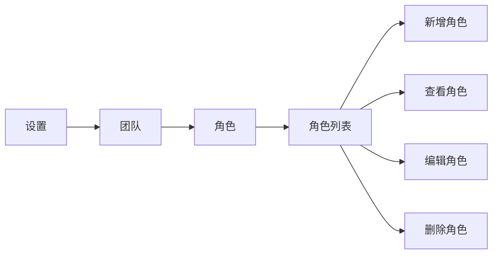
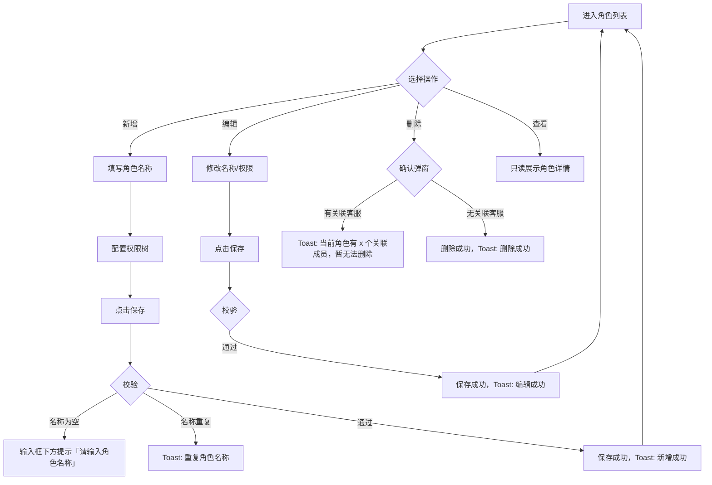

# PRD：角色管理

> **版本**：v2.0 · 2026-03-18
> **状态**：草稿
> **模块编号**：Module 01

---

## 1. 概述

### 1.1 背景与动机

| 痛点 | 影响 |
|------|------|
| 客服团队成员职能不同，但所有人拥有相同的系统操作权限 | 低权限客服可能误操作敏感配置（如删除会话、修改安全设置），带来运营风险 |
| 缺乏细粒度权限控制，管理员无法按岗位灵活分配功能范围 | 团队协作效率低，管理员需要频繁人工监督 |

角色管理模块为客服系统提供基于角色的权限控制能力（RBAC），支持系统预设角色与自定义角色并存，通过三级权限树（一级菜单 → 二级菜单 → 功能权限）实现精细化的权限配置。

### 1.2 目标

| Key Result | 量化标准 |
|-----------|---------|
| KR1：支持灵活的角色配置 | 最多可创建 99 个自定义角色，每个角色可从 14 个一级菜单中自由组合权限 |
| KR2：角色完整生命周期管理 | 支持角色的新增、查看、编辑、删除全流程 |
| KR3：权限变更实时生效 | 角色权限修改后，关联客服的权限即时更新，无权限页面自动拦截 |

---

## 2. 用户故事

| ID | 角色 | 用户故事 | 验收标准 | 优先级 |
|----|------|---------|----------|--------|
| US-01 | 管理员 | 我希望创建自定义角色并配置权限，以便为不同职能的客服分配差异化的操作范围 | 可在权限树中自由勾选权限组合，保存后角色立即可用 | P0 |
| US-02 | 管理员 | 我希望编辑已有角色的权限配置，以便随业务调整权限范围 | 编辑保存后关联客服的权限即时生效 | P0 |
| US-03 | 管理员 | 我希望删除不再使用的自定义角色，以便保持角色列表整洁 | 有关联客服的角色无法删除，无关联客服的角色可直接删除 | P0 |
| US-04 | 管理员 | 我希望查看角色的权限配置详情，以便了解各角色的权限范围 | 查看模式下所有勾选框为只读状态 | P1 |
| US-05 | 客服 | 当我的权限被管理员修改后，我希望系统自动通知并引导我到首页 | 权限被撤销时弹出提示弹窗，确认后跳转首页 | P0 |

---

## 3. 功能设计

### 3.1 信息架构



**功能入口**：系统导航路径 **设置 → 团队 → 角色**

### 3.2 核心流程



### 3.3 子功能详述

#### 3.3.1 角色列表

**用户场景**：管理员进入「设置 → 团队 → 角色」查看和管理所有角色。

**前置条件**：
1. 用户拥有团队相关权限

**需求描述（功能规则）**：

1. **表格列定义**：

| 列名 | 说明 |
| --- | --- |
| 角色名称 | 超出显示区域用「...」截断 |
| 关联客服数 | 使用该角色的客服人数（含邀请中），无数据显示 0 |
| 创建人 | 头像（圆形色块 + 首字母）+ 昵称；系统角色显示「系统」 |
| 创建时间 | 格式：YYYY-MM-DD HH:mm；系统角色为项目创建时间 |
| 操作 | 更多操作按钮（···），点击展开下拉菜单 |

2. **排序规则**：系统角色排在前面（超级管理员、客服），自定义角色按创建时间倒序排列
3. **操作菜单**：

| 角色类型 | 可见操作 |
| --- | --- |
| 超级管理员 | 查看 |
| 客服（系统角色） | 查看、编辑 |
| 自定义角色 | 查看、编辑、删除 |

#### 3.3.2 新增角色

**功能描述**：创建自定义角色并配置权限。

**用户场景**：管理员需要为新岗位创建专属角色。

**前置条件**：
1. 用户拥有管理客服权限
2. 当前自定义角色数量未达 99 个上限

**交互流程**：
1. 点击角色列表右上角「+ 新增角色」按钮
2. 进入新增角色页面，页面标题「新增角色」
3. 填写角色名称，配置权限树
4. 点击「保存」提交

**需求描述（功能规则）**：

1. **输入规则**：
   - 角色名称：必填，最大 50 字符
   - 权限配置：可为空（允许创建无权限的角色）
2. **默认状态**：角色名称为空，所有可配置权限均未勾选（零权限起始）
3. **校验规则**：
   - 角色名称为空时，保存按钮不可点击
   - 点击保存后若名称仍为空，输入框下方显示提示「请输入角色名称」，输入框边框变红
   - 角色名称重复检测仅在点击保存时执行，重复时 Toast 提示「重复角色名称」
   - 编辑场景下，若名称未修改不做重复检测
4. **数量限制**：最多可添加 99 个自定义角色

**后置条件**：
1. 角色出现在角色列表中
2. Toast 提示「新增成功」
3. 返回角色列表页

#### 3.3.3 查看角色

**功能描述**：只读展示角色名称和权限配置。

**用户场景**：管理员查看某个角色的权限范围。

**前置条件**：
1. 从角色列表操作菜单点击「查看」

**交互流程**：
1. 进入角色详情页，页面标题「角色详情」
2. 角色名称以文本形式展示（非输入框）
3. 权限树所有勾选框为只读状态
4. 超级管理员角色查看时，所有权限自动显示为全选状态

**需求描述（功能规则）**：
1. 页面底部不显示任何操作按钮
2. 左上角「‹」返回按钮可直接返回列表，无需确认

#### 3.3.4 编辑角色

**功能描述**：修改已有角色的名称和权限配置。

**用户场景**：管理员需要调整某个角色的权限范围。

**前置条件**：
1. 角色为可编辑状态（客服系统角色或自定义角色）
2. 用户拥有管理客服权限

**交互流程**：
1. 从角色列表操作菜单点击「编辑」
2. 进入编辑页面，页面标题「编辑角色」
3. 角色名称可修改（系统角色的名称不可修改）
4. 权限树可勾选/取消
5. 点击「保存」提交

**需求描述（功能规则）**：
1. 校验规则与新增角色一致
2. 页面底部显示「取消」和「保存」按钮，左对齐

**后置条件**：
1. Toast 提示「编辑成功」
2. 返回角色列表
3. 已关联客服的权限立即生效

#### 3.3.5 删除角色

**功能描述**：删除不再使用的自定义角色。

**用户场景**：管理员清理不再需要的角色。

**前置条件**：
1. 角色为自定义角色（系统角色不可删除）

**交互流程**：
1. 从角色列表操作菜单点击「删除」
2. 弹出确认弹窗

**需求描述（功能规则）**：

1. **确认弹窗**：
   - 标题：删除角色
   - 描述：`删除后不可恢复、确认删除？`
   - 按钮：「取消」「删除」
2. **场景一：角色有关联客服** — 点击「删除」后 Toast 提示 `当前角色有 x 个关联成员，暂无法删除`
3. **场景二：角色无关联客服** — 点击「删除」执行删除，Toast 提示「删除成功」

#### 3.3.6 未保存修改离开确认

**功能描述**：在新增/编辑页面有未保存修改时，阻止用户直接离开。

**用户场景**：管理员在编辑权限过程中误触返回按钮。

**需求描述（功能规则）**：

1. **触发条件**：角色名称或权限配置与初始状态不同时，点击「取消」或返回按钮
2. **确认弹窗**：
   - 标题：未保存的更改
   - 描述：`当前页面有未保存的修改，确定要离开吗？`
   - 按钮：「放弃」（幽灵样式）+ 「继续编辑」（红色背景）
3. **操作**：
   - 点击「放弃」：丢弃修改，返回角色列表
   - 点击「继续编辑」：关闭弹窗，留在当前页面
4. **无修改时**：直接返回列表，不弹窗

---

## 4. 权限体系

### 4.1 权限层级结构

权限采用三级树形结构：

```
一级菜单（权限组标题，不可勾选）
  └── 二级菜单（可勾选）
        └── 功能权限（可勾选）
```

- **一级菜单**：对应系统主导航的功能模块，仅作为分组标题展示，不可直接勾选
- **二级菜单**：对应一级菜单下的子功能页面
- **功能权限**：对应二级菜单内的具体操作能力（管理/查看）

每个非锁定一级菜单下统一为「二级菜单 → 功能权限」结构。

#### 锁定权限

**首页**和**会话**为锁定一级菜单，所有角色默认包含，在权限配置树中以勾选 + 置灰状态展示，无法取消。

### 4.2 完整权限清单

#### 一级菜单：首页

锁定，默认勾选（查看），无法取消。所有角色默认包含此权限。

#### 一级菜单：会话

锁定，默认勾选（管理），无法取消。所有角色默认包含此权限。

#### 一级菜单：档案

| 二级菜单 | 功能权限 |
| --- | --- |
| 会话记录 | 管理 |
| 聊天记录 | 管理 |

#### 一级菜单：访客

| 二级菜单 | 功能权限 |
| --- | --- |
| 在线访客 | 管理 |
| 全部访客 | 管理 |

#### 一级菜单：客户

> 提示：仅在接入客户标识后启用客户模块（权限组标题旁显示 tooltip）

| 二级菜单 | 功能权限 |
| --- | --- |
| 在线客户 | 管理 |
| 全部客户 | 管理 |

#### 一级菜单：营销

| 二级菜单 | 功能权限 |
| --- | --- |
| 群发消息 | 管理 |
| 主动营销 | 管理 |

#### 一级菜单：报表

| 二级菜单 | 功能权限 |
| --- | --- |
| 会话概览 | 查看 |
| 会话评价分析 | 查看 |

#### 一级菜单：AI Agent

| 二级菜单 | 功能权限 |
| --- | --- |
| 文档知识 | 管理 |
| 常见问题 | 管理 |
| Copilot设置 | 管理 |

#### 一级菜单：团队

| 二级菜单 | 功能权限 |
| --- | --- |
| 客服 | 管理 |
| 角色 | 管理 |
| 客服设置 | 管理 |

#### 一级菜单：快捷回复

| 二级菜单 | 功能权限 |
| --- | --- |
| 公共回复 | 管理 |
| 个人回复 | 管理 |

#### 一级菜单：标签

| 二级菜单 | 功能权限 |
| --- | --- |
| 访客标签 | 管理 |
| 会话标签 | 管理 |

#### 一级菜单：安装

| 二级菜单 | 功能权限 |
| --- | --- |
| 网站代码 | 查看 |
| 聊天页面 | 查看 |
| 自定义 | 管理 |

#### 一级菜单：安全

| 二级菜单 | 功能权限 |
| --- | --- |
| 黑名单 | 管理 |
| 信任域名 | 管理 |

#### 一级菜单：开发设置

| 二级菜单 | 功能权限 |
| --- | --- |
| 开发设置 | 管理 |
| Webhooks | 管理 |

**汇总**：14 个一级菜单（含 2 个锁定），12 个非锁定一级菜单共 29 个二级菜单，每个二级菜单含 1 个功能权限。

### 4.3 系统角色

系统预设两个内置角色，均**不可删除**：

| 角色名称 | 权限范围 | 名称可编辑 | 权限可编辑 | 创建人 |
| --- | --- | --- | --- | --- |
| 超级管理员 | 全部权限 | 否 | 否 | 系统 |
| 客服 | 部分权限（详见 4.4） | 否 | 是 | 系统 |

### 4.4 系统默认客服角色的权限

客服角色的默认权限集包含：首页（锁定）、会话（锁定）、档案（会话记录、聊天记录）、访客（在线访客、全部访客）、客户（在线客户、全部客户）、营销（群发消息、主动营销）、标签（访客标签、会话标签）、快捷回复（个人回复 → 管理）。

管理员可修改客服角色的权限配置，但角色名称不可修改。

### 4.5 功能权限明细表

以下表格详细说明每个一级菜单下各权限对应的具体操作能力：
当某个一级功能没有任何二级菜单权限时，对应一级功能菜单隐藏

#### 档案

| 二级菜单 | 功能权限 | 具备该权限可执行的操作 | 不具备该权限的表现 |
| --- | --- | --- | --- |
| 会话记录 | 管理 | - | 导航菜单中不显示会话记录入口；访问会话记录路径显示403 |
| 聊天记录 | 管理 | - | 导航菜单中不显示聊天记录入口；访问聊天记录路径显示403 |

#### 访客

| 二级菜单 | 功能权限 | 具备该权限可执行的操作 | 不具备该权限的表现 |
| --- | --- | --- | --- |
| 在线访客 | 管理 | - | 导航菜单中不显示在线访客入口；访问在线访客路径显示403 |
| 全部访客 | 管理 | - | 导航菜单中不显示全部访客入口；访问全部访客路径显示403 |

#### 客户

| 二级菜单 | 功能权限 | 具备该权限可执行的操作 | 不具备该权限的表现 |
| --- | --- | --- | --- |
| 在线客户 | 管理 | - | 导航菜单中不显示在线客户入口；访问在线客户路径显示403 |
| 全部客户 | 管理 | - | 导航菜单中不显示全部客户入口；访问全部客户路径显示403 |

#### 营销

| 二级菜单 | 功能权限 | 具备该权限可执行的操作 | 不具备该权限的表现 |
| --- | --- | --- | --- |
| 群发消息 | 管理 | - | 导航菜单中不显示群发消息入口；访问群发消息路径显示403 |
| 主动营销 | 管理 | - | 导航菜单中不显示主动营销入口；访问主动营销路径显示403 |

#### 报表

| 二级菜单 | 功能权限 | 具备该权限可执行的操作 | 不具备该权限的表现 |
| --- | --- | --- | --- |
| 会话概览 | 查看 | 访问会话概览报表页面 | 导航菜单中不显示报表入口；访问报表路径显示403 |
| 会话评价分析 | 查看 | 访问会话评价分析报表页面 | 同上 |

#### AI Agent

| 二级菜单 | 功能权限 | 具备该权限可执行的操作 | 不具备该权限的表现 |
| --- | --- | --- | --- |
| 文档知识 | 管理 | 管理 AI 文档知识库 | 导航菜单中不显示 AI Agent 入口；访问 AI Agent 路径显示403 |
| 常见问题 | 管理 | 管理常见问题列表 | 同上 |
| Copilot设置 | 管理 | 配置 Copilot 参数 | 同上 |

#### 团队

| 二级菜单 | 功能权限 | 具备该权限可执行的操作 | 不具备该权限的表现 |
| --- | --- | --- | --- |
| 客服 | 管理 | 邀请客服、编辑客服（昵称/角色等）、删除客服、禁用/启用客服、取消邀请、修改密码、发起聊天等 | 团队菜单下不显示客服入口；访问客服路径显示403 |
| 角色 | 管理 | 新增/编辑/删除角色、管理角色权限配置 | 团队菜单下不显示角色入口，访问角色路径显示403 |
| 客服设置 | 管理 | 访问客服设置页面、修改客服相关的系统配置项 | 团队菜单下不显示客服设置入口，访问客服设置路径显示403 |

#### 快捷回复

| 二级菜单 | 功能权限 | 具备该权限可执行的操作 | 不具备该权限的表现 |
| --- | --- | --- | --- |
| 公共回复 | 管理 | 查看/新增/编辑/删除公共快捷回复 | 快捷回复菜单下不显示公共回复入口，访问公共回复路径显示403 |
| 个人回复 | 管理 | 查看/新增/编辑/删除个人快捷回复 | 快捷回复菜单下不显示个人回复入口，访问个人回复路径显示403 |

#### 标签

| 二级菜单 | 功能权限 | 具备该权限可执行的操作 | 不具备该权限的表现 |
| --- | --- | --- | --- |
| 访客标签 | 管理 | 新增/编辑/删除访客标签 | 导航菜单中不显示标签入口，访问访客标签路径显示403；无管理标签权限时，访客、客户、档案、会话/聊天中访客信息中无法创建标签，只能搜索添加已有标签 |
| 会话标签 | 管理 | 新增/编辑/删除会话标签 | 导航菜单中不显示标签入口，访问会话标签路径显示403；无管理标签权限时，会话中无法创建标签，只能搜索添加已有标签 |

#### 安装

| 二级菜单 | 功能权限 | 具备该权限可执行的操作 | 不具备该权限的表现 |
| --- | --- | --- | --- |
| 网站代码 | 查看 | 访问安装设置页面、查看网站嵌入代码 | 安装菜单下不显示网站代码入口，访问网站代码路径显示403 |
| 聊天页面 | 查看 | 查看聊天窗口页面配置和预览 | 安装菜单下不显示聊天页面入口，访问聊天页面路径显示403 |
| 自定义 | 管理 | 管理安装相关的自定义配置项 | 安装菜单下不显示自定义入口，访问自定义路径显示403 |

#### 安全

| 二级菜单 | 功能权限 | 具备该权限可执行的操作 | 不具备该权限的表现 |
| --- | --- | --- | --- |
| 黑名单 | 管理 | 配置 IP 黑名单 | 设置菜单下不显示黑名单，访问黑名单路径显示403
| 信任域名 | 管理 | 配置信任域名 | 设置菜单下不显示信任域名，访问黑名单路径显示403 |

#### 开发设置

| 二级菜单 | 功能权限 | 具备该权限可执行的操作 | 不具备该权限的表现 |
| --- | --- | --- | --- |
| 开发设置 | 管理 | 管理 API 密钥等开发者配置 | 设置菜单下不显示开发设置入口，访问开发设置路径显示403 |
| Webhooks | 管理 | 管理 Webhook 配置 | 设置菜单下不显示Webhooks入口，访问Webhooks路径显示403 |

---

## 5. 权限选择交互规则

### 5.1 两级联动选择

权限树中一级菜单仅作为分组标题，不可勾选。联动规则在二级菜单和功能权限两个层级之间：

| 操作 | 联动行为 |
| --- | --- |
| 勾选二级菜单 | 自动勾选该二级菜单下所有功能权限 |
| 取消勾选二级菜单 | 自动取消该二级菜单下所有功能权限 |
| 勾选功能权限 | 自动勾选所属二级菜单（若尚未勾选） |
| 取消最后一个功能权限 | 自动取消所属二级菜单 |

### 5.2 规则说明

- 一级菜单不参与勾选联动，仅作为视觉分组
- 锁定一级菜单（首页、会话）始终为勾选 + 置灰状态

---

## 6. 权限变更处理方案

### 6.1 权限收回场景

当管理员修改某角色权限后，使用该角色的客服若正停留在被撤销权限的页面：

1. 客服点击其他导航菜单或进行当前页面的操作时（新增、编辑、删除、搜索、查看等操作）
2. 弹出权限变更弹窗：
   - 标题：权限变更
   - 描述：`你的权限已变更，即将进入首页`
   - 按钮：仅一个「确认」按钮
3. 用户点击「确认」后，关闭弹窗并重定向至首页
4. 导航菜单自动隐藏无权限的菜单项（响应式计算）

### 6.2 权限授予场景

当客服被授予新权限后：
1. 客服点击其他导航菜单或进行当前页面的操作时（新增、编辑、删除、搜索、查看等操作）
2. 弹出权限变更弹窗：
   - 标题：权限变更
   - 描述：`你的权限已变更，即将进入首页`
   - 按钮：仅一个「确认」按钮
3. 用户点击「确认」后，关闭弹窗并重定向至首页
4. 导航菜单自动显示新增的菜单项（无需刷新页面）
5. 客服可直接点击新菜单访问对应功能

### 6.3 路由守卫

当客服切换页面时，系统在路由跳转前检查目标页面的权限：
- 有权限：正常跳转
- 无权限：弹出权限变更弹窗，重定向至首页

### 6.4 锁定权限保护

首页和会话权限为所有角色始终拥有的锁定权限，不可撤销，确保客服始终可以访问首页和会话功能。

---

## 7. 数据模型

| 实体名 | 字段 | 类型 | 说明 |
|--------|------|------|------|
| 角色 | 角色名称 | 字符串 | 必填，最大 50 字符，不可重复 |
| | 权限集 | 字符串数组 | 该角色拥有的权限项 key 集合，可为空 |
| | 关联客服数 | 整数 | 系统自动统计，含邀请中客服 |
| | 创建人 | 字符串 | 系统角色为「系统」，自定义角色为创建者昵称 |
| | 创建时间 | 日期时间 | 格式 YYYY-MM-DD HH:mm |
| | 是否系统角色 | 布尔 | 系统角色不可删除 |

---

## 8. 业务规则汇总表

| # | 规则 | 触发条件 | 预期行为 |
| --- | --- | --- | --- |
| 1 | 超级管理员角色不可编辑 | 操作菜单展示时 | 仅显示「查看」，不显示「编辑」和「删除」 |
| 2 | 系统角色不可删除 | 操作菜单展示时 | 不显示「删除」选项 |
| 3 | 角色名称必填 | 新增/编辑角色页面 | 名称为空时保存按钮不可点击 |
| 4 | 角色名称空提交提示 | 点击保存时名称为空 | 输入框下方显示「请输入角色名称」，输入框边框变红 |
| 5 | 角色名称长度限制 | 输入角色名称时 | 最大 50 字符 |
| 6 | 角色名称重复检测 | 点击保存时 | Toast 提示「重复角色名称」 |
| 7 | 新角色零权限起始 | 进入新增角色页面 | 所有可配置权限默认未选中 |
| 8 | 角色数量上限 | 新增角色时 | 最多 99 个自定义角色 |
| 9 | 有关联客服不可删除角色 | 点击删除确认时 | Toast 提示 `当前角色有 x 个关联成员，暂无法删除` |
| 10 | 勾选二级菜单自动勾选所有子权限 | 勾选二级菜单 | 该二级菜单下所有功能权限全部选中 |
| 11 | 取消最后子权限自动取消父级 | 取消最后一个功能权限 | 所属二级菜单自动取消勾选 |
| 12 | 勾选功能权限自动勾选父级 | 勾选功能权限 | 若所属二级菜单未选中则自动选中 |
| 13 | 查看页面无操作按钮 | 查看角色详情底部 | 不显示任何操作按钮 |
| 14 | 未保存修改离开确认 | 有修改时点击返回/取消 | 弹出确认弹窗 |

---

## 9. 名词解释

| 名词 | 说明 |
| --- | --- |
| 系统角色 | 系统预设的内置角色（超级管理员、客服），不可删除 |
| 自定义角色 | 管理员手动创建的角色，支持完整的增删改查操作 |
| 权限树 | 以树形结构组织的权限配置界面，包含一级菜单、二级菜单、功能权限三个层级 |
| 锁定权限 | 所有角色始终拥有的权限（首页、会话），不可取消 |
| 关联客服数 | 当前使用该角色的客服人数（含邀请中） |
