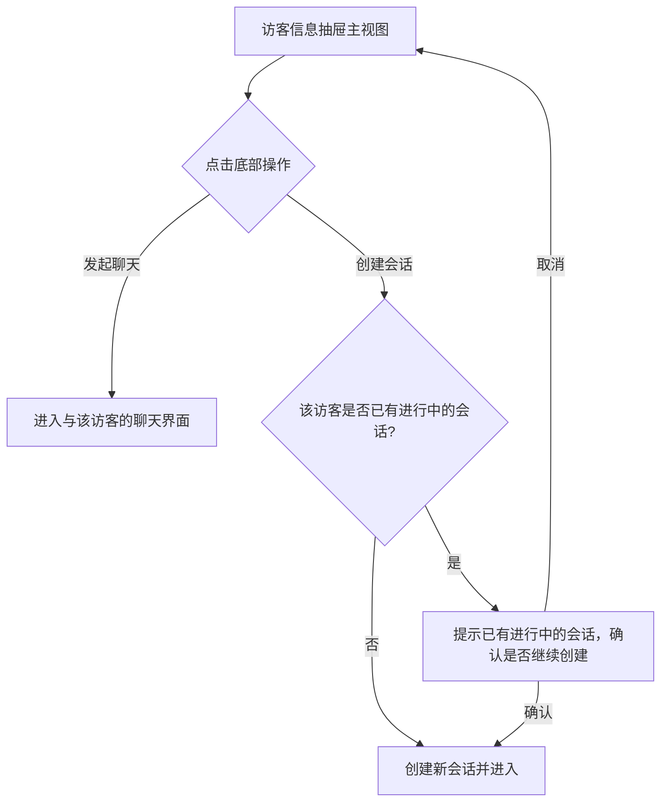

# PRD：访客信息底部操作入口

> **版本**：v1.0 · 2026-04-14
> **状态**：部分实现（按钮已存在，尚未接入真实逻辑）

---

## 1. 概述

### 1.1 背景与动机

| 痛点 | 影响 |
|------|------|
| 客服在查看访客信息时，无法直接发起沟通或创建会话 | 需要退出访客信息面板再手动操作，流程割裂 |

访客信息抽屉底部提供「发起聊天」和「创建会话」两个操作入口，让客服在查看访客信息的同时可直接发起沟通，减少操作路径。

### 1.2 目标

| Key Result | 量化标准 |
|-----------|---------|
| KR1：发起聊天可用 | 客服可从访客信息面板直接向该访客发起聊天 |
| KR2：创建会话可用 | 客服可从访客信息面板直接为该访客创建新会话 |

---

## 2. 用户故事

| ID | 角色 | 用户故事 | 验收标准 | 优先级 |
|----|------|---------|----------|--------|
| US-01 | 客服 | 我希望在查看访客信息时直接向该访客发起聊天 | 点击「发起聊天」后进入与该访客的聊天界面 | P0 |
| US-02 | 客服 | 我希望在查看访客信息时直接为该访客创建新会话 | 点击「创建会话」后创建一条新会话并进入 | P0 |

---

## 3. 功能设计

### 3.1 核心流程

### 3.2 子功能详述

#### 3.2.1 发起聊天

**功能描述**：从访客信息面板直接向该访客发起聊天。

**需求描述**：
1. 入口位于访客信息抽屉主视图底部
2. 点击后关闭抽屉，进入与该访客的聊天界面
3. 若该访客当前无可用的聊天渠道，按钮置灰并展示提示「该访客暂无可用聊天渠道」

---

#### 3.2.2 创建会话

**功能描述**：从访客信息面板直接为该访客创建一条新会话。

**需求描述**：
1. 入口位于访客信息抽屉主视图底部
2. 点击后系统为该访客创建新会话
3. 创建成功后关闭抽屉，进入新会话
4. 创建成功 toast 提示「创建成功」
5. 若该访客已有进行中的会话（状态为排队中或待处理），弹出确认弹窗：
   - 标题：「该访客已有进行中的会话」
   - 描述：「确认是否继续创建新会话？」
   - 操作：「取消」+ 「继续创建」
6. 创建失败时 toast 提示「创建失败，请重试」

---

## 4. 权限与角色

| 功能 | 客服 | 无权限时的表现 |
|------|------|--------------|
| 发起聊天 | 可操作 | 按钮置灰，hover 提示无权限 |
| 创建会话 | 可操作 | 按钮置灰，hover 提示无权限 |

---

## 5. 开放问题

| # | 问题 | 备选方案 | 当前倾向 | 状态 |
|---|------|---------|---------|------|
| 1 | 「发起聊天」与「创建会话」的业务区别是什么 | 聊天=即时消息，会话=工单式流程 | 待产品确认 | 待确认 |
| 2 | 创建会话是否需要填写表单（主题、分类等） | 直接创建 / 弹窗填写 | 待确认 | 待确认 |
| 3 | 两个按钮在访客信息抽屉的所有视图（列表、详情）中是否都显示 | 仅主视图显示 | 仅主视图 | 待确认 |
