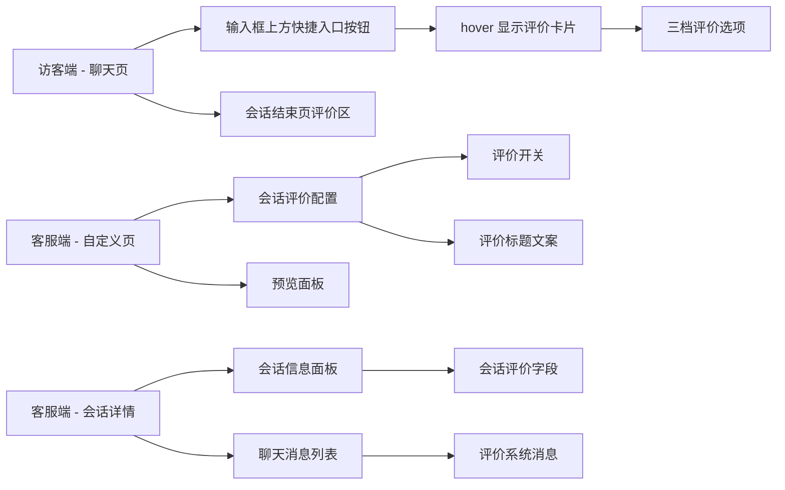
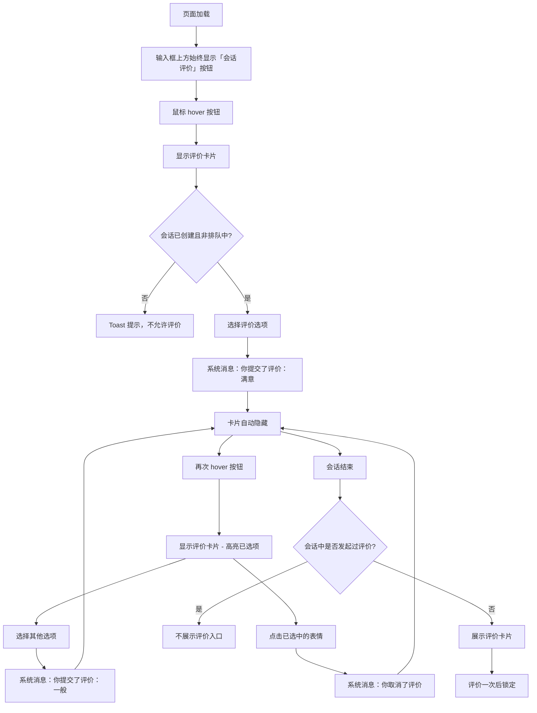

# PRD：会话评价调整

> **版本**：v1.4 · 2026-04-07
> **状态**：已交付

---

## 1. 概述

### 1.1 背景与动机

| 痛点 | 影响 |
|------|------|
| 评价入口仅在会话结束后出现，访客需要等到会话关闭才能评价 | 大量访客在会话结束前已离开，评价收集率低 |
| 评价一旦提交不可修改 | 访客误操作后无法纠正，评价数据不够准确 |

本次调整将会话评价从「会话结束后出现」改为「输入框上方快捷入口按钮」，hover 后显示评价卡片，支持会话活跃期间随时评价、修改和取消。

### 1.2 目标

| Key Result | 量化标准 |
|-----------|---------|
| KR1：提升评价可达性 | 评价入口显示在输入框上方 |
| KR2：提升评价准确性 | 活跃会话中支持修改和取消，最终值以最后一次操作为准 |

---

## 2. 用户故事

| ID | 角色 | 用户故事 | 验收标准 | 优先级 |
|----|------|---------|----------|--------|
| US-01 | 访客 | 我希望在会话过程中就能对客服服务进行评价 | 输入框上方始终显示「会话评价」快捷入口按钮 | P0 |
| US-02 | 访客 | 我希望可以修改已提交的评价 | hover 评价按钮后选择其他选项即可覆盖 | P0 |
| US-03 | 访客 | 我希望可以取消已提交的评价 | hover 评价按钮后点击已选中的表情即可取消 | P0 |
| US-04 | 访客 | 我希望会话结束后如果还没评价，仍有机会评价一次 | 未评价时结束页展示评价卡片，可评价一次 | P0 |
| US-05 | 客服管理员 | 我希望在小部件配置中预览评价入口的真实效果 | 预览面板展示输入框上方的快捷按钮样式 | P1 |
| US-06 | 客服 | 我希望在会话信息面板中查看访客的评价结果 | 会话信息面板基础信息区显示会话评价字段 | P0 |
| US-07 | 客服 | 我希望在会话聊天记录中看到会话评价的系统消息 | 会话消息列表中显示评价相关的系统消息 | P0 |
| US-08 | 客服 | 我希望在会话记录档案的聊天抽屉中看到评价系统消息 | 抽屉消息列表中显示评价相关的系统消息 | P0 |

---

## 3. 功能设计

### 3.1 信息架构

### 3.2 核心流程

### 3.3 子功能详述

#### 3.3.1 评价入口

**功能描述**：在输入框上方始终显示「会话评价」快捷入口按钮，hover 后弹出评价卡片。

**用户场景**：访客在会话过程中希望随时对客服服务进行评价。

**前置条件**：客服开启会话评价功能

**交互流程**：
1. 输入框上方始终显示「会话评价」快捷按钮
2. 鼠标 hover 按钮，弹出评价卡片
3. 评价卡片显示标题和三个评价选项
4. 鼠标移出按钮区域，评价卡片自动隐藏

**需求描述（功能规则）**：
1. **显示条件**：按钮始终显示，会话结束后快捷入口隐藏
2. **位置**：输入框卡片外部上方，作为第一个快捷入口
3. **评价校验**：点击评价选项时校验状态：
   - 会话未创建 → Toast 提示「请先发送消息创建会话」
   - 当前排队中 → Toast 提示「排队中无法评价」
4. **按钮文案**：始终显示「会话评价」
5. **评价不影响消息发送**：评价操作期间，底部输入框和发送按钮功能不受影响

#### 3.3.2 评价选择与反馈

**功能描述**：访客在评价卡片中选择满意度，每次操作均产生系统消息。

**用户场景**：访客对服务体验做出评价、修改评价或取消评价。

**交互流程**：
1. hover 评价按钮后，访客点击某个评价选项
2. 系统记录评价结果，卡片自动隐藏
3. 消息列表中追加一条系统消息

**需求描述（功能规则）**：
1. **评价选项**：三档，分别为满意、一般、不满意
2. **提交评价**：选择任一选项后立即生效，卡片自动隐藏，发送系统消息「你提交了评价：{选项名}」
3. **修改评价**：再次 hover 后选择其他选项，覆盖旧值，发送系统消息「你提交了评价：{新选项名}」（不区分首次和修改，统一使用「你提交了评价」）
4. **取消评价**：hover 后点击当前已选中的表情，清空评价值，发送系统消息「你取消了评价」
5. **选中状态高亮**：已选中的选项在卡片中高亮展示（表情恢复彩色），未选中的选项保持灰度
6. **评价值语义**：系统始终只保留一个当前评价值（单值枚举），最新操作覆盖旧值

#### 3.3.3 会话结束后评价

**功能描述**：会话结束后，根据访客是否在会话中发起过评价，决定评价区域的展示方式。

**用户场景**：访客在会话结束补充评价。

**前置条件**：
1. 会话已结束（客服主动关闭、访客主动关闭、不活跃自动关闭）

**交互流程**：

**场景一：会话中已发起过评价**
1. 消息列表不展示评价卡片

**场景二：会话中未发起过评价**
1. 结束后展示评价卡片
2. 访客可选择一个评价选项，选择后立即生效
3. 评价后选项锁定，不可修改或取消
4. 评价后消息列表中追加系统消息「你提交了评价：{选项名}」

**需求描述（功能规则）**：
1. **判断依据**：是否在会话中发起过评价
2. **已评价场景**：不展示评价入口，不可再操作
3. **未评价场景**：展示评价卡片，仅允许评价一次，评价后锁定不可修改/取消（提交后取消评价算未评价）
4. **结束后评价产生系统消息**：评价后在结束页消息列表中追加系统消息「你提交了评价：{选项名}」，与活跃态一致

#### 3.3.4 客服端评价配置

**功能描述**：客服管理员在小部件自定义页面管理评价功能的开关和标题文案。

**用户场景**：客服管理员需要开启/关闭评价功能并自定义评价标题。

**交互流程**：
1. 进入自定义页面 → 内容 Tab → 会话评价区域
2. 通过开关控制评价功能的启用/禁用，切换时自动保存
3. 开启后展开配置区域，可编辑评价标题文案

**需求描述（功能规则）**：
1. **评价开关**：默认开启
2. **配置描述文案**：「会话评价作为快捷入口始终可见，评价需会话已创建且非排队中」
3. **配置生效范围**：评价开关变更对当前活跃会话不生效（前端已加载的配置不会实时刷新），仅影响新加载的会话

#### 3.3.5 客服端预览面板

**功能描述**：在自定义页面右侧预览会话评价入口的样式效果。

**交互流程**：
1. 点击「会话评价」配置区域，右侧预览切换到聊天模式
2. 评价功能开启时，预览面板显示：
   - 输入框上方的「会话评价」快捷按钮
   - 会话结束按钮改为输入框

**需求描述（功能规则）**：
1. 「访客评价」文案改为「会话评价」
2. 评价功能关闭时，预览面板不显示评价快捷按钮
3. 评价功能开启时，显示输入框上方的快捷按钮样式
4. 预览为动态展示，支持 hover 后显示评价卡片

#### 3.3.6 客服端会话信息面板展示

**功能描述**：客服在会话详情右侧的会话信息面板中查看访客的评价结果。

**用户场景**：客服需要了解访客对本次服务的满意度评价。

**前置条件**：
1. 客服已打开某个会话的详情页
2. 右侧会话信息面板处于展开状态

**交互流程**：
1. 客服点击右侧「会话信息」Tab
2. 在基础信息区域，接待时间字段下方常驻显示「会话评价」字段
3. 字段值实时显示访客的当前评价结果

**需求描述（功能规则）**：
1. **显示位置**：会话信息面板 → 基础信息区域 → 接待时间字段下方
2. **字段标签**：「会话评价」
3. **字段值映射**：
   - 访客已评价满意 → 显示「满意」
   - 访客已评价一般 → 显示「一般」
   - 访客已评价不满意 → 显示「不满意」
   - 访客未评价或已取消评价 → 显示「-」
4. **同步更新**：访客在会话中修改或取消评价后，客服端会话信息面板中的会话评价字段同步更新
5. **文案修改**：「服务评价」改为「会话评价」

#### 3.3.7 客服端聊天消息列表展示

**功能描述**：客服在聊天消息列表中查看会话评价相关的系统消息。

**用户场景**：客服需要了解访客何时提交、修改或取消了评价。

**前置条件**：
1. 访客在会话中进行了评价操作（提交/修改/取消）

**交互流程**：
1. 访客提交评价后，消息列表中追加一条系统消息
2. 消息内容为「访客提交了评价：{选项名}」或「访客取消了评价」

**需求描述（功能规则）**：
1. **消息类型**：系统消息
2. **消息内容**：
   - 提交评价：「访客提交了评价：满意」「访客提交了评价：一般」「访客提交了评价：不满意」
   - 取消评价：「访客取消了评价」

#### 3.3.8 客服端会话记录档案展示

**功能描述**：客服在会话记录档案页面中查看和筛选会话评价。

**用户场景**：客服需要查看历史会话的评价情况，或按评价结果筛选会话。

**交互流程**：
1. 客服进入「档案 → 会话记录」页面
2. 点击会话行的「查看会话」按钮，打开聊天抽屉
3. 抽屉中的消息列表显示评价相关的系统消息

**需求描述（功能规则）**：
1. **筛选器标签**：「会话评价」（替换原「访客评价」）
2. **聊天抽屉消息**：显示评价相关的系统消息，样式与活跃会话一致

---

## 4. 异常处理

| 异常场景 | 处理方式 | 用户感知 |
|---------|---------|---------|
| 访客未发送过消息（会话未创建） | 点击评价选项时 Toast 提示 | 「请先发送消息创建会话」 |
| 访客处于排队中 | 点击评价选项时 Toast 提示 | 「排队中无法评价，请等待客服接待」 |
| 会话中已评价后结束 | 结束页不展示评价入口 | 仅显示「会话已结束」提示 |
| 会话中未评价后结束 | 结束页展示评价卡片 | 可评价一次，评价后锁定 |
