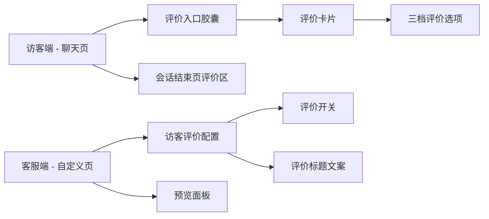
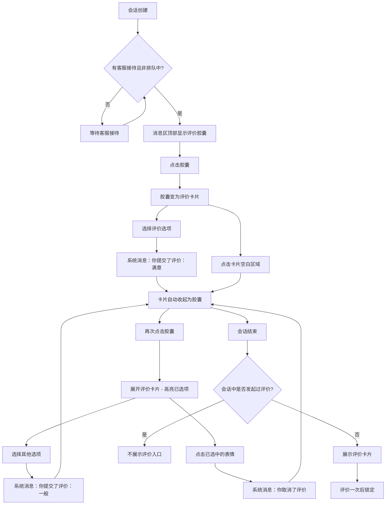

# PRD：访客评价调整

> **版本**：v1.1 · 2026-04-02
> **状态**：已交付

---

## 1. 概述

### 1.1 背景与动机

| 痛点 | 影响 |
|------|------|
| 评价入口仅在会话结束后出现，访客需要等到会话关闭才能评价 | 大量访客在会话结束前已离开，评价收集率低 |
| 评价一旦提交不可修改 | 访客误操作后无法纠正，评价数据不够准确 |
| 新建会话需要先填写表单 | 增加访客操作成本，降低发起会话的意愿 |

本次调整将访客评价从「会话结束后一次性弹出」改为「消息区顶部常驻入口」，支持会话活跃期间随时评价、反复修改和取消。同时简化新会话创建流程，跳过表单直接进入聊天。

### 1.2 目标

| Key Result | 量化标准 |
|-----------|---------|
| KR1：提升评价可达性 | 会话创建且有客服接待后，评价入口始终可见，不依赖会话结束状态 |
| KR2：提升评价准确性 | 活跃会话中支持反复修改和取消，最终值以最后一次操作为准 |
| KR3：降低会话创建门槛 | 新会话默认无需填写表单，直接进入聊天 |

### 1.3 非目标（本期不做）

- 后端评价数据持久化和报表口径调整
- 评价历史审计（多次修改的记录追溯）
- 新增可配置字段（本期仅保留现有评价标题配置）

---

## 2. 用户故事

| ID | 角色 | 用户故事 | 验收标准 | 优先级 |
|----|------|---------|----------|--------|
| US-01 | 访客 | 我希望在会话过程中就能对客服服务进行评价 | 会话创建且有客服接待后，消息区顶部出现评价入口 | P0 |
| US-02 | 访客 | 我希望可以修改已提交的评价 | 再次展开评价卡片后选择其他选项即可覆盖 | P0 |
| US-03 | 访客 | 我希望可以取消已提交的评价 | 展开评价卡片后点击已选中的表情即可取消 | P0 |
| US-04 | 访客 | 我希望会话结束后如果还没评价，仍有机会评价一次 | 未评价时结束页展示评价卡片，可评价一次 | P0 |
| US-05 | 访客 | 我希望创建新会话不用填写表单 | 点击「新的会话」直接进入聊天页 | P1 |
| US-06 | 客服管理员 | 我希望在小部件配置中预览评价入口的真实交互效果 | 预览面板展示胶囊入口，可点击展开/收起评价卡片 | P1 |

---

## 3. 功能设计

### 3.1 信息架构

### 3.2 核心流程

### 3.3 子功能详述

#### 3.3.1 评价入口（活跃会话）

**功能描述**：在消息列表顶部展示常驻评价入口，默认为收起的胶囊形态。

**用户场景**：访客在会话过程中希望随时对客服服务进行评价。

**前置条件**：
1. 会话已创建（发送了至少一条消息，不论访客还是客服发送）
2. 有客服接待，非排队中状态

**交互流程**：
1. 满足前置条件后，消息区顶部出现评价胶囊，显示文案「服务评价」
2. 点击胶囊，胶囊原地变为评价卡片（非新增元素，是同一位置的形态切换）
3. 评价卡片显示标题「请对我们的服务进行评价」和三个评价选项
4. 点击卡片空白区域可将卡片收起为胶囊

**需求描述（功能规则）**：
1. **显示条件**：会话已创建且有客服接待（非排队中）时显示入口
2. **位置**：消息列表最顶部，位于排队提示和所有消息之上
3. **形态切换**：胶囊和卡片互斥显示，共用同一位置
4. **胶囊文案**：始终显示「服务评价」，不随评价状态变化
5. **评价不影响消息发送**：评价操作期间，底部输入框和发送按钮功能不受影响

#### 3.3.2 评价选择与反馈

**功能描述**：访客在评价卡片中选择满意度，每次操作均产生系统消息。

**用户场景**：访客对服务体验做出评价、修改评价或取消评价。

**交互流程**：
1. 展开评价卡片后，访客点击某个评价选项
2. 系统记录评价结果，卡片自动收起为胶囊
3. 消息列表中追加一条系统消息

**需求描述（功能规则）**：
1. **评价选项**：三档，分别为满意、一般、不满意
2. **提交评价**：选择任一选项后立即生效，卡片自动收起，发送系统消息「你提交了评价：{选项名}」
3. **修改评价**：再次展开卡片后选择其他选项，覆盖旧值，发送系统消息「你提交了评价：{新选项名}」（不区分首次和修改，统一使用「你提交了评价」）
4. **取消评价**：展开卡片后点击当前已选中的表情，清空评价值，发送系统消息「你取消了评价」
5. **选中状态高亮**：已选中的选项在卡片中高亮展示（表情恢复彩色），未选中的选项保持灰度
6. **评价值语义**：系统始终只保留一个当前评价值（单值枚举），最新操作覆盖旧值
7. **防抖**：选择评价后卡片收起，无需额外防抖处理；再次点击胶囊仅展开卡片，不会重复提交

#### 3.3.3 会话结束后评价

**功能描述**：会话结束后，根据访客是否在会话中发起过评价，决定评价区域的展示方式。

**用户场景**：访客在会话结束页查看或补充评价。

**前置条件**：
1. 会话已结束（客服主动关闭或不活跃自动关闭）

**交互流程**：

**场景一：会话中已发起过评价**
1. 结束页不展示任何评价入口
2. 仅显示「会话已结束，请重新咨询」提示

**场景二：会话中未发起过评价**
1. 结束页展示评价卡片（标题 + 三档选项）
2. 访客可选择一个评价选项，选择后立即生效
3. 评价后选项锁定，不可修改或取消
4. 下方显示「已评价：{选项名}」

**需求描述（功能规则）**：
1. **判断依据**：是否在会话中发起过评价（提交或取消均算发起过）
2. **已评价场景**：不展示评价入口，不可再操作
3. **未评价场景**：展示评价卡片，仅允许评价一次，评价后锁定不可修改/取消
4. **结束后评价产生系统消息**：评价后发送系统消息「你提交了评价：{选项名}」，与活跃态一致

#### 3.3.4 会话重置

**功能描述**：重新创建会话时，所有评价状态清空。

**需求描述（功能规则）**：
1. 评价值清空
2. 评价卡片展开状态重置为收起
3. 消息列表清空（含评价系统消息）
4. 评价入口隐藏（直到满足显示条件）
5. 「是否发起过评价」标记重置

#### 3.3.5 新会话创建简化

**功能描述**：默认跳过表单直接创建会话。

**用户场景**：访客从会话列表点击「新的会话」快速开始聊天。

**交互流程**：
1. 访客在会话列表页点击「新的会话」
2. 直接跳转到聊天页，无需填写姓名、邮箱等表单

**需求描述（功能规则）**：
1. 表单页面保留，不作为默认入口
2. 是否启用会前表单由客服端配置决定

#### 3.3.6 客服端评价配置

**功能描述**：客服管理员在小部件自定义页面管理评价功能的开关和标题文案。

**用户场景**：客服管理员需要开启/关闭评价功能并自定义评价标题。

**交互流程**：
1. 进入自定义页面 → 内容 Tab → 访客评价区域
2. 通过开关控制评价功能的启用/禁用，切换时自动保存
3. 开启后展开配置区域，可编辑评价标题文案
4. 评价标题支持多语言（英文、简体中文、繁体中文），失焦时自动保存

**需求描述（功能规则）**：
1. **评价开关**：默认开启
2. **评价标题**：支持三种语言独立配置，必填，最大长度 100 字符，清空后失焦恢复默认值
3. **默认标题**：
   - 英文：「Please evaluate our service」
   - 简体中文：「请对我们的服务进行评价」
   - 繁体中文：「請對我們的服務進行評價」
4. **配置描述文案**：「会话创建后常驻显示评价入口，会话中和结束后都可评价」
5. **配置生效范围**：评价开关变更对当前活跃会话不生效（前端已加载的配置不会实时刷新），仅影响新加载的会话

#### 3.3.7 客服端预览面板

**功能描述**：在自定义页面右侧预览访客评价入口的真实交互效果。

**交互流程**：
1. 点击「访客评价」配置区域，右侧预览切换到聊天模式
2. 评价功能开启时，预览面板显示：
   - 评价胶囊入口（默认收起状态）
   - 一条访客消息气泡（模拟已发送状态）
3. 点击预览中的胶囊可展开评价卡片，再次点击卡片可收起

**需求描述（功能规则）**：
1. 评价功能关闭时，预览面板不显示评价入口和访客消息
2. 评价功能开启时，隐藏其他配置项的预览消息（欢迎语等），仅显示评价入口和访客消息
3. 评价卡片标题跟随当前语言切换实时更新
4. 预览中的胶囊/卡片可交互切换，与访客端行为一致

---

## 4. 数据模型

| 实体名 | 字段 | 类型 | 说明 |
|--------|------|------|------|
| 评价配置 | 评价开关 | 布尔值 | 是否启用访客评价功能，默认开启 |
| 评价配置 | 评价标题 | 多语言文本 | 评价卡片标题，支持英文/简中/繁中，必填，最大 100 字符 |
| 评价结果 | 评价值 | 枚举（满意/一般/不满意/空） | 当前评价值，活跃态最新操作覆盖旧值 |
| 评价结果 | 是否发起过评价 | 布尔值 | 会话中是否触发过评价操作（提交或取消均算），用于结束页判断 |
| 系统消息 | 消息类型 | 枚举 | 评价相关的系统消息类型 |
| 系统消息 | 消息内容 | 文本 | 如「你提交了评价：满意」「你取消了评价」 |

---

## 5. 权限与角色

| 功能 | 访客 | 客服管理员 |
|------|------|-----------|
| 查看评价入口 | 可见（会话创建且有客服接待后） | 仅预览面板可见 |
| 提交/修改/取消评价 | 活跃会话中可操作 | 仅预览面板可交互 |
| 结束后评价 | 仅未评价时可操作一次 | 不可操作 |
| 配置评价开关和标题 | 不可见 | 可操作 |

---

## 6. 异常处理

| 异常场景 | 处理方式 | 用户感知 |
|---------|---------|---------|
| 访客处于排队中，无客服接待 | 不显示评价入口 | 消息区顶部无评价胶囊 |
| 会话中已评价后结束 | 结束页不展示评价入口 | 仅显示「会话已结束」提示 |
| 会话中未评价后结束 | 结束页展示评价卡片 | 可评价一次，评价后锁定 |
| 评价开关被关闭 | 当前活跃会话不受影响 | 新会话不显示评价入口 |
| 重置会话 | 清空所有评价状态和消息 | 评价入口隐藏，页面恢复初始状态 |

---

## 7. 跨模块联动

| 联动模块 | 联动方式 | 说明 |
|----------|----------|------|
| 会话列表页 | 路由跳转 | 「新的会话」按钮默认直接跳转到聊天页，是否经过表单由客服端配置决定 |
| 小部件自定义页 | 配置同步 | 评价开关和标题配置影响访客端的评价入口展示（新会话生效） |
| 小部件自定义页 | 预览联动 | 访客评价配置区域展开时，预览面板切换到聊天模式并显示评价入口 |
