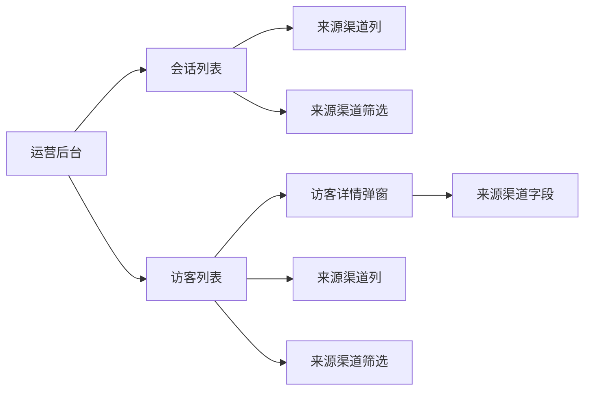
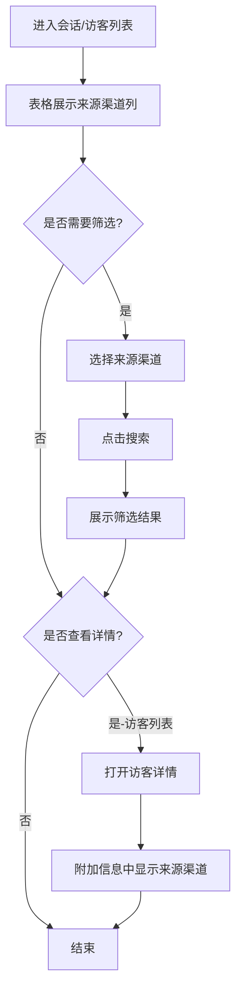

# PRD：运营后台来源渠道功能

> **版本**：v1.0 · 2026-03-27
> **状态**：已交付
> **模块编号**：Module 08

---

## 1. 概述

### 1.1 背景与动机

| 痛点 | 影响 |
|------|------|
| 运营人员无法区分会话和访客来自哪个接入渠道（web、网页插件、Email） | 无法按渠道分析转化率、响应效率等关键指标，影响运营决策 |
| 筛选和导出数据时无法按渠道维度过滤 | 数据分析效率低，无法针对性优化各渠道的服务质量 |

本功能为运营后台的会话列表、访客列表增加「来源渠道」字段展示和筛选能力，帮助运营团队按渠道维度分析和管理客户服务数据。

### 1.2 目标

| Key Result | 量化标准 |
|-----------|---------|
| KR1：渠道数据可见性 | 会话列表、访客列表、访客详情 100% 展示来源渠道信息 |
| KR2：渠道筛选能力 | 支持按 web、网页插件、Email 三种渠道独立筛选 |

---

## 2. 用户故事

| ID | 角色 | 用户故事 | 验收标准 | 优先级 |
|----|------|---------|----------|--------|
| US-01 | 运营人员 | 我希望在会话列表中看到每条会话的来源渠道 | 表格「标签」列后显示「来源渠道」列，值为 web/网页插件/Email | P0 |
| US-02 | 运营人员 | 我希望按来源渠道筛选会话 | 筛选栏「项目ID」后有「来源渠道」下拉框，可选全部/web/网页插件/Email | P0 |
| US-03 | 运营人员 | 我希望在访客列表中看到每个访客的来源渠道 | 表格「电话」列后显示「来源渠道」列，值为 web/网页插件/Email | P0 |
| US-04 | 运营人员 | 我希望按来源渠道筛选访客 | 筛选栏「电话」后有「来源渠道」下拉框，可选全部/web/网页插件/Email | P0 |
| US-05 | 运营人员 | 我希望在访客详情中看到来源渠道 | 访客详情弹窗「附加信息」中「起始页面」下方显示「来源渠道」 | P0 |

---

## 3. 功能设计

### 3.1 信息架构

### 3.2 核心流程

### 3.3 子功能详述

#### 3.3.1 会话列表来源渠道展示

**功能描述**：在会话列表表格中展示每条会话的来源渠道。

**用户场景**：运营人员查看会话列表时，需要快速识别会话来自哪个接入渠道。

**前置条件**：
1. 用户已登录运营后台
2. 进入会话列表页面

**交互流程**：
1. 用户进入会话列表页面
2. 系统在表格中展示「来源渠道」列（位于「标签」列之后）
3. 每条会话记录显示对应的渠道值

**需求描述（功能规则）**：

1. **展示规则**：
   - 列标题：「来源渠道」
   - 列宽：100px
   - 列位置：「标签」列之后、「发起时间」列之前
   - 可选值：web、网页插件、Email
   - 空值显示：不允许为空，所有会话必须有来源渠道

2. **数据来源**：
   - 字段名：sourceChannel
   - 数据类型：字符串枚举

#### 3.3.2 会话列表来源渠道筛选

**功能描述**：支持按来源渠道筛选会话列表。

**用户场景**：运营人员需要查看特定渠道的会话数据，或对比不同渠道的服务质量。

**前置条件**：
1. 用户已进入会话列表页面

**交互流程**：
1. 用户在筛选栏找到「来源渠道」下拉框（位于「项目ID」之后）
2. 用户选择目标渠道或保持「全部」
3. 用户点击「搜索」按钮
4. 系统展示符合条件的会话记录

**需求描述（功能规则）**：

1. **筛选控件规则**：
   - 控件类型：下拉选择框
   - 控件位置：第二行筛选栏，「项目ID」输入框之后、「状态」下拉框之前
   - 标签文字：「来源渠道：」
   - 控件宽度：120px
   - 默认值：空字符串（表示全部）

2. **可选值**：
   - 全部（值为空字符串）
   - web
   - 网页插件
   - Email

3. **筛选逻辑**：
   - 选择「全部」时不过滤，展示所有会话
   - 选择具体渠道时，仅展示该渠道的会话
   - 与其他筛选条件（会话标题、访客、项目ID 等）组合使用时为 AND 关系

4. **重置行为**：
   - 点击「重置」按钮时，来源渠道恢复为「全部」

#### 3.3.3 访客列表来源渠道展示

**功能描述**：在访客列表表格中展示每个访客的来源渠道。

**用户场景**：运营人员查看访客列表时，需要了解访客首次接入的渠道。

**前置条件**：
1. 用户已登录运营后台
2. 进入访客列表页面

**交互流程**：
1. 用户进入访客列表页面
2. 系统在表格中展示「来源渠道」列（位于「电话」列之后）
3. 每条访客记录显示对应的渠道值

**需求描述（功能规则）**：

1. **展示规则**：
   - 列标题：「来源渠道」
   - 列宽：100px
   - 列位置：「电话」列之后、「首次访问」列之前
   - 可选值：web、网页插件、Email
   - 空值显示：不允许为空，所有访客必须有来源渠道

2. **数据来源**：
   - 字段名：sourceChannel
   - 数据类型：字符串枚举
   - 业务含义：访客首次接入时使用的渠道

#### 3.3.4 访客列表来源渠道筛选

**功能描述**：支持按来源渠道筛选访客列表。

**用户场景**：运营人员需要查看特定渠道获取的访客，分析各渠道的获客效果。

**前置条件**：
1. 用户已进入访客列表页面

**交互流程**：
1. 用户在筛选栏找到「来源渠道」下拉框（位于「电话」之后）
2. 用户选择目标渠道或保持「全部」
3. 用户点击「搜索」按钮
4. 系统展示符合条件的访客记录

**需求描述（功能规则）**：

1. **筛选控件规则**：
   - 控件类型：下拉选择框
   - 控件位置：第一行筛选栏，「电话」输入框之后，第二行筛选栏之前
   - 标签文字：「来源渠道：」
   - 控件宽度：120px
   - 默认值：空字符串（表示全部）

2. **可选值**：
   - 全部（值为空字符串）
   - web
   - 网页插件
   - Email

3. **筛选逻辑**：
   - 选择「全部」时不过滤，展示所有访客
   - 选择具体渠道时，仅展示该渠道的访客
   - 与其他筛选条件（姓名、邮箱、电话等）组合使用时为 AND 关系

4. **重置行为**：
   - 点击「重置」按钮时，来源渠道恢复为「全部」

#### 3.3.5 访客详情来源渠道展示

**功能描述**：在访客详情弹窗的「附加信息」中展示来源渠道。

**用户场景**：运营人员查看访客详细信息时，需要了解该访客的接入渠道。

**前置条件**：
1. 用户已在访客列表中点击「详情」链接

**交互流程**：
1. 用户点击访客列表中的「详情」链接
2. 系统打开访客详情弹窗
3. 用户展开「附加信息」折叠面板（默认展开）
4. 系统在「起始页面」下方显示「来源渠道」字段

**需求描述（功能规则）**：

1. **展示规则**：
   - 字段标签：「来源渠道」
   - 字段位置：「附加信息」折叠面板中，「起始页面」下方、「会话总数」上方
   - 标签样式：灰色 #75869c，14px
   - 值样式：黑色 #222，14px
   - 可选值：web、网页插件、Email
   - 空值显示：不允许为空

2. **布局规则**：
   - 使用 detail-row 样式类
   - 标签宽度：100px
   - 值区域：flex: 1

---

## 4. 数据模型

| 实体名 | 字段 | 类型 | 说明 |
|--------|------|------|------|
| Session（会话） | sourceChannel | string | 来源渠道，枚举值：web、网页插件、Email |
| Visitor（访客） | sourceChannel | string | 来源渠道，枚举值：web、网页插件、Email |

---

## 5. 权限与角色

本功能无特殊权限限制，所有能访问运营后台的用户均可查看和筛选来源渠道信息。

---

## 6. 约束与依赖

| 约束/依赖 | 说明 | 影响范围 |
|----------|------|---------|
| 渠道枚举值固定 | 当前仅支持 web、网页插件、Email 三种渠道 | 新增渠道类型需同步更新筛选项和数据模型 |
| 历史数据兼容 | 本次上线前的历史会话和访客数据需补充 sourceChannel 字段 | 需数据迁移脚本或默认值策略 |

---

## 7. 异常处理

| 异常场景 | 处理方式 | 用户感知 |
|---------|---------|---------|
| sourceChannel 字段为空 | 不应出现，数据层保证必填 | 若出现则显示「--」 |
| 筛选无结果 | 展示空表格，显示「暂无数据」 | 正常提示 |

---

## 8. 跨模块联动

无。本功能为独立的数据展示和筛选能力，不涉及其他模块联动。

---

## 9. 开放问题

无。
