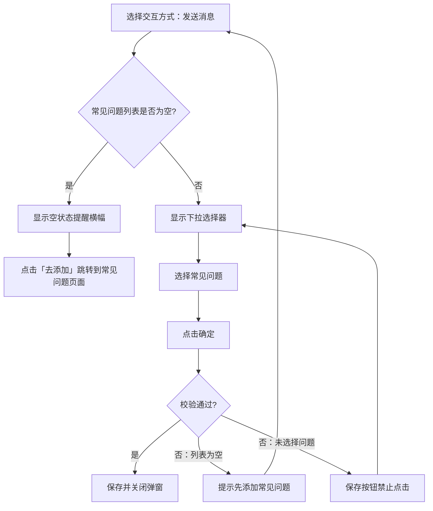

# PRD：自定义快捷入口优化

## 1. 概述

### 1.1 背景与动机

| 痛点 | 影响 |
| --- | --- |
| 快捷入口仅支持跳转链接和复制文本，功能单一 | 无法满足自动发送常见问题等场景，访客仍需手动输入 |
| 图标一旦设置无法清除，且为必填项 | 管理员配置灵活度不足 |
| 交互方式字段名称和提示文案不够直观 | 管理员理解成本高 |

本次优化在已有快捷入口功能基础上，新增「发送消息」交互方式（关联知识库常见问题），优化图标字段为非必填并支持删除，同时调整字段名称和提示文案使其更加清晰。

### 1.2 目标

| Key Result | 量化标准 |
| --- | --- |
| KR1：新增发送消息交互方式 | 支持关联知识库常见问题 |
| KR2：关联知识库 | 发送消息支持选择知识库常见问题页面中的问题 |
| KR3：优化配置体验 | 图标改为非必填并支持删除，字段文案更直观 |

---

## 2. 用户故事

| ID | 角色 | 用户故事 | 验收标准 | 优先级 |
| --- | --- | --- | --- | --- |
| US-01 | 客服管理员 | 我希望访客能通过快捷入口自动发送预设消息 | 能创建「发送消息」类型的快捷入口，关联知识库常见问题 | P0 |
| US-02 | 客服管理员 | 我希望删除不需要的图标 | 已设置的图标显示删除按钮，可清除图标 | P1 |
| US-03 | 客服管理员 | 我希望删除常见问题时能感知关联的快捷入口 | 删除已关联快捷入口的常见问题时，弹窗提示并同步删除关联快捷入口 | P0 |

---

## 3. 功能设计

### 3.1 核心流程

### 3.2 子功能详述

#### 3.2.1 图标字段优化

**功能描述**：图标改为非必填，已有图标支持删除。

**需求描述**：

1.  图标字段改为非必填
    
2.  已有图标时（无论自动填充还是手动上传），显示删除按钮
    
3.  点击删除按钮清除图标，恢复为空状态，可重新上传
    

---

#### 3.2.2 字段名称和文案调整

**功能描述**：优化弹窗中的字段名称和提示文案，使其更清晰易懂。

**需求描述**：

| 调整项 | 调整前 | 调整后 |
| --- | --- | --- |
| 字段名称 | 访问内容 | 交互方式 |
| 选项名称 | URL | 打开链接 |
| 选项名称 | 文本内容 | 复制文本 |
| 打开链接输入框提示 | 请输入URL | 请输入链接地址 |
| 复制文本输入框提示 | 请输入文本内容 | 请输入需要复制的文本 |
| 说明提示（tooltip） | 选择 URL 时，请填写完整网页地址，访客点击后会直接跳转；选择文本内容时，访客点击后会直接复制该内容。 | 打开链接：访客点击后跳转到指定网页；复制文本：访客点击后复制指定内容；发送消息：访客点击后自动发送预设消息 |

---

#### 3.2.3 发送消息交互方式

**功能描述**：新增「发送消息」交互方式，访客点击快捷入口后自动发送预设消息。

**用户场景**：管理员希望访客点击快捷入口后自动发送问题，由客服给出回答，减少访客手动输入。

**交互流程**：

1.  在交互方式中选择「发送消息」
    
2.  系统判断常见问题列表是否为空
    
    *   若为空：显示空状态提醒横幅
        
    *   若不为空：显示常见问题下拉选择器
        
3.  从知识库常见问题列表中选择问题
    
4.  提交时系统校验内容有效性
    

**需求描述**：

1.  **空状态提醒横幅**（当常见问题列表为空时显示）：
    
    *   提示文案：「当前未添加常见问题」
        
    *   「去添加」链接：点击跳转到知识库常见问题页面
        
2.  **常见问题下拉选择器**（当常见问题列表不为空时显示）：
    
    *   提示文案「请选择常见问题」
        
    *   选项来源为知识库常见问题页面中的问题列表
        
3.  访客端显示规则：
    
    *   会话结束后快捷入口隐藏
        

#### 3.2.4 访客端交互方式

**功能描述**：访客点击「发送消息」类型的快捷入口后，系统自动完成消息发送与回复。

**需求描述**：

1. **访客发送消息**：访客点击快捷入口后，以访客身份自动发送该常见问题的问题文本。

2. **系统自动回复**：系统以系统消息身份自动发送该常见问题的答案内容，无论当前会话是人工客服会话还是 AI 机器人会话，均直接发出预设答案，不经过 AI 推理。

   - 使用系统消息身份而非客服头像，避免误导访客认为客服在实时回复，同时避免在多客服场景下身份混乱。

3. **系统消息操作支持**：该系统消息与普通消息一致，支持以下操作：
   - 撤回
   - 回复
   - 复制
   - 翻译

---

#### 3.2.5 常见问题关联与异常处理

**功能描述**：删除常见问题时，若已有快捷入口关联该问题，系统提示并同步删除关联快捷入口，确保不存在失效的快捷入口。

**需求描述**：

1.  **删除常见问题时的联动处理**：在知识库常见问题页面删除某条常见问题时：
    - 系统检测该常见问题是否已被快捷入口关联
    - 若未关联：直接删除，toast 提示「删除成功」
    - 若已关联：弹出确认弹窗，列出所有关联的快捷入口名称，提示「删除后这些快捷入口也将同步删除」
    - 管理员点击「确认删除」后：同步删除该常见问题及所有关联的快捷入口，toast 提示「删除成功」
    - 管理员点击「取消」：关闭弹窗，不执行任何删除操作