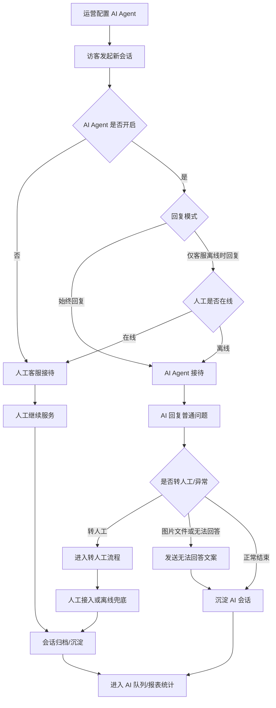
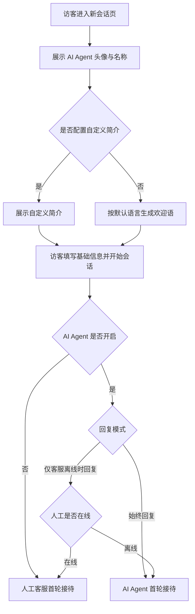
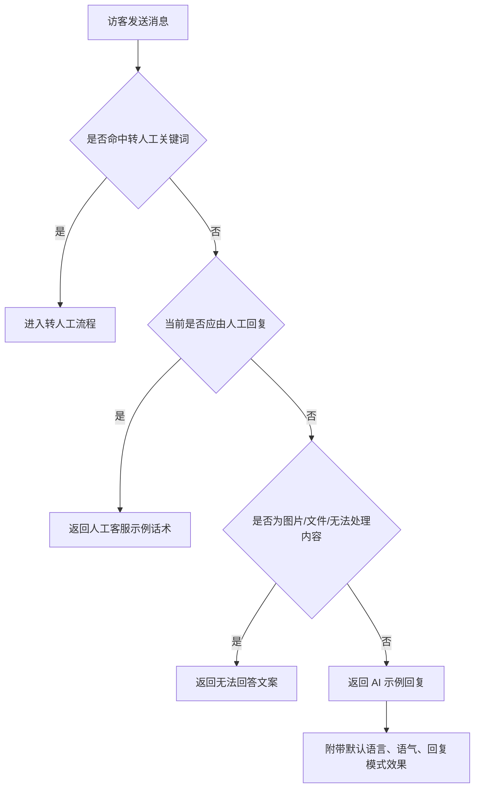
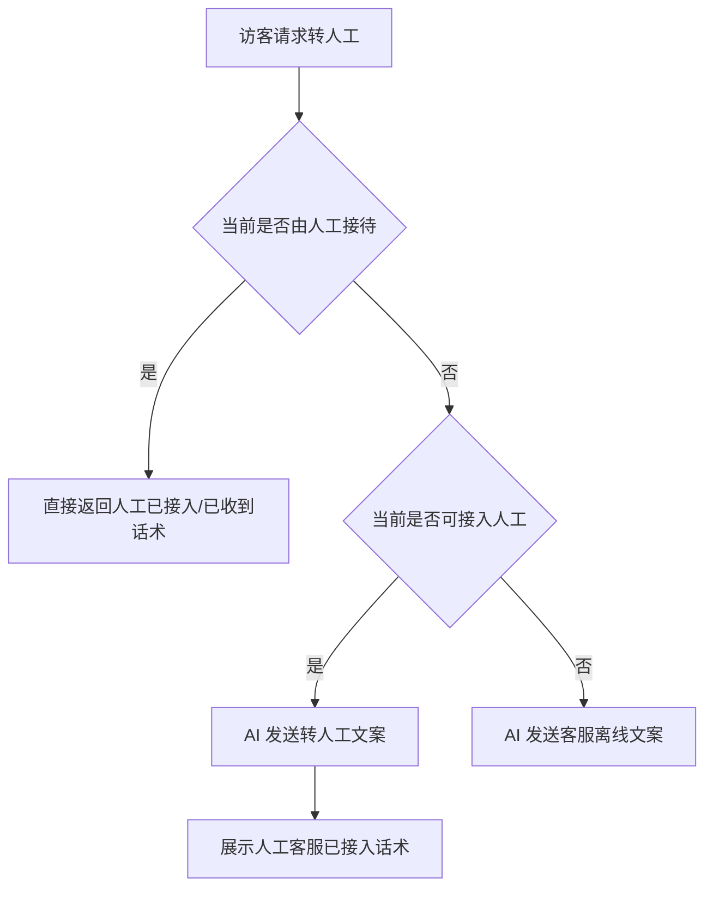
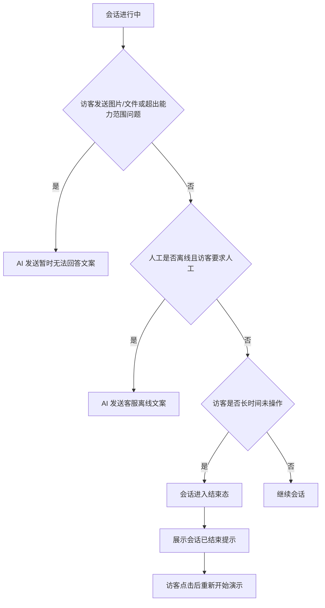

# 客服端 AI Agent 现状版 PRD

## 1. 文档概述

### 1.1 文档定位

本文档用于梳理当前仓库内已实现的客服端 AI Agent 原型能力，覆盖客服工作台配置页、访客端接待 Demo、AI 会话队列与 AI Agent 报表等内容。

本文档是**现状梳理版 PRD**，目标是让产品、设计、研发、测试对当前版本的能力边界、关键流程、配置项和逻辑规则形成统一认知。

### 1.2 文档目标

- 明确 AI Agent 在当前版本中的定位与业务价值。
- 说明 AI Agent 如何接待访客、何时回复、如何回复、何时转人工。
- 沉淀客服端配置项、访客端接待逻辑、AI 队列运营逻辑和报表口径。
- 标记当前原型的能力边界，避免被误认为已具备正式生产系统能力。

### 1.3 版本属性

- 文档类型：现状版 PRD
- 覆盖范围：当前前端原型已实现/已演示的能力
- 输出语言：中文
- 目标读者：产品经理、交互设计师、前端/后端研发、测试、业务评审方

### 1.4 范围说明

#### 本文档覆盖

- 客服端 AI Agent 基础配置与会话配置
- 访客端新会话接待与消息回复逻辑
- AI 会话队列与转人工运营流程
- AI Agent 报表展示口径
- 当前版本限制、风险与建议

#### 本文档不展开

- Copilot 辅助能力的详细产品设计
- 知识库、FAQ 的后台运营设计
- 真正的知识检索、LLM 编排、模型路由、权限体系
- 真正的人工在线状态接入、真实坐席分配、工单系统联动

### 1.5 相关模块边界

- `Copilot设置`：当前为平行 AI 模块，用于客服辅助，不属于本 PRD 主体。
- `文档知识 / 常见问题`：当前为导航占位入口，页面未形成完整产品能力，本 PRD 仅作为 AI Agent 上下游依赖提及。

## 2. 产品概述

### 2.1 产品定位

AI Agent 是客服工作台中的一个智能接待原型模块，用于在访客咨询场景中承担首轮接待、标准问题回复、转人工衔接和 AI 会话数据沉淀。

### 2.2 当前版本目标

- 提升首响效率：让访客在进入会话后立即获得 AI 或人工的首轮响应。
- 提供自动接待能力：支持 AI 始终接待，或仅在人工离线时接待。
- 统一对外形象：支持配置 AI Agent 的名称、头像、简介、语气和语言。
- 支持基础分流：对普通问答、转人工、无法处理内容做不同分支处理。
- 建立运营闭环：将 AI 会话沉淀到 AI 队列和报表模块中进行查看。

### 2.3 当前版本价值

- 对访客：缩短等待时间，提升对话连续性。
- 对客服团队：降低重复问题接待成本，保留人工介入入口。
- 对运营人员：可配置 AI 对外形象和核心回复策略，并查看基础结果数据。

## 3. 角色与核心场景

### 3.1 角色定义

| 角色 | 定义 | 当前版本主要动作 |
| --- | --- | --- |
| 访客 | 进入聊天窗口发起咨询的用户 | 发起会话、发送文本、请求转人工、发送图片/文件、结束后重新开始 |
| AI Agent | 访客侧展示的智能客服身份 | 首轮接待、普通回复、转人工提示、离线提示、无法回答提示 |
| 人工客服/客服团队 | 客服工作台坐席 | 在人工接待场景回复访客、接收转移会话、查看 AI 队列 |
| 运营/配置人员 | 负责配置 AI 能力的内部人员 | 配置启用状态、回复模式、语言、语气、文案、不活跃时长 |

### 3.2 核心业务场景

1. 访客发起新会话后，由 AI 或人工完成首轮接待。
2. 访客发送普通文本消息，系统按当前接待主体生成回复。
3. 访客明确要求人工客服时，系统走转人工分支。
4. 人工不可接入时，系统向访客展示离线兜底文案。
5. 访客发送图片、文件或超出能力范围的问题时，系统返回无法回答文案。
6. 访客长时间未操作时，会话进入结束态，并支持重新开始演示。
7. 客服团队在工作台查看 AI 会话队列、查看 AI 身份消息、把会话转移给人工客服。
8. 运营人员在报表中查看 AI Agent 的基础表现数据。

## 4. 产品结构与页面映射

### 4.1 模块结构

- 客服端 AI Agent 配置
- 访客端 AI 接待与回复
- 客服端 AI 会话运营
- AI Agent 报表

### 4.2 页面映射

| 模块 | 页面/入口 | 当前职责 |
| --- | --- | --- |
| 客服端配置 | AI Agent 配置页 | 配置 AI Agent 的启用状态、展示信息、回复策略和个性化文案 |
| 访客端接待 | 新会话表单页 | 展示 AI Agent 形象与欢迎信息，填写基础资料后进入聊天 |
| 访客端接待 | 聊天页 | 展示 AI/人工接待状态，执行消息回复、转人工、无法回答、不活跃关闭等演示逻辑 |
| 客服端运营 | 会话工作台 AI Agent 队列 | 展示 AI 会话，支持查看详情和转移给人工客服 |
| 客服端报表 | AI Agent 报表页 | 展示总会话数、已解决会话、解决率、转人工、趋势和满意度 |

## 5. 功能范围

### 5.1 客服端配置

#### 5.1.1 基本设置

客服端支持配置以下内容：

| 配置项 | 类型 | 当前选项/规则 | 说明 |
| --- | --- | --- | --- |
| 启用 AI Agent | 开关 | 开/关 | 开启后，AI Agent 参与访客会话接待 |
| AI Agent 回复 | 单选 | `always` / `offline-only` | 决定 AI 始终参与，还是仅在人工离线时参与 |
| 显示 AI Agent 标签 | 开关 | 开/关 | 访客端 AI 回复消息可展示 `AI Agent` 标识 |
| 头像 | 图片上传 | png/jpg/jpeg | 用于访客端和客服端 AI 身份展示 |
| 昵称 | 文本输入 | 必填，最长 64 | 访客询问身份、会话头部、AI 消息显示名称 |
| 简介 | 多行文本 | 最长 200 | 有值时优先作为欢迎文案 |
| 回复语气 | 单选 | 友好亲切 / 专业严谨 / 幽默活泼 / 简洁高效 | 当前用于影响 AI 示例回复中的风格描述 |
| 默认语言 | 单选 | 英语、西班牙语、法语、德语、葡萄牙语、俄语、简中、繁中、日语、韩语、越南语、泰语、印尼语、马来语 | 无法识别访客语言时，按该语言生成欢迎语与示例回复 |

#### 5.1.2 会话设置

| 配置项 | 类型 | 当前选项/规则 | 说明 |
| --- | --- | --- | --- |
| 访客不活跃关闭时长 | 数值输入 | 1~1440 分钟 | 作为会话关闭阈值配置；当前访客端以演示方式体现 |
| 回复模式 | 单选 | `strict` / `creative` | 当前用于标识回复策略类型；在 Demo 中体现为回复文本附加说明 |
| 转人工文案 | 多行文本 | 必填 | AI 准备转接人工客服时发给访客 |
| 客服离线文案 | 多行文本 | 必填 | 人工不可接入时发给访客 |
| 暂时无法回答文案 | 多行文本 | 必填 | 访客发送图片/文件或问题超出范围时发给访客 |

#### 5.1.3 配置保存规则

- 当前版本支持点击“保存”分别保存基本设置与会话设置。
- 当前版本的配置持久化方式为**浏览器本地存储（localStorage）**。
- 同一浏览器环境下，客服端配置可被访客端 Demo 读取，用于展示配置生效后的接待效果。
- 该保存方式仅用于原型联调与演示，不代表正式后端存储方案。

### 5.2 访客端接待与回复

#### 5.2.1 新会话接待

访客进入新会话后，先看到 AI Agent 头像、名称和欢迎信息，再填写基础信息进入聊天。

欢迎信息生成规则如下：

| 条件 | 当前行为 |
| --- | --- |
| 已配置自定义简介 | 直接展示自定义简介 |
| 未配置自定义简介 | 按默认语言模板生成欢迎语 |

#### 5.2.2 首轮接待规则

| AI 开关 | 回复模式 | 人工在线状态 | 首轮接待主体 | 当前展示结果 |
| --- | --- | --- | --- | --- |
| 关闭 | 任意 | 任意 | 人工客服 | 直接展示人工客服回复话术 |
| 开启 | `always` | 任意 | AI Agent | 直接展示 AI 欢迎语/简介 |
| 开启 | `offline-only` | 在线 | 人工客服 | 展示人工客服接待效果 |
| 开启 | `offline-only` | 离线 | AI Agent | 展示 AI 欢迎语/简介 |

说明：

- 当前访客端提供“客服在线/离线”的演示切换按钮，用于验证不同分支。
- 当前版本的“在线状态”是 Demo 状态，不代表已接入真实坐席状态系统。

#### 5.2.3 普通文本回复规则

访客发送普通文本后，系统根据接待主体生成不同回复：

| 条件 | 当前回复主体 | 当前回复内容 |
| --- | --- | --- |
| AI 关闭 | 人工客服 | 使用人工客服示例话术 |
| `offline-only` 且人工在线 | 人工客服 | 使用人工客服示例话术 |
| `always` | AI Agent | 使用默认语言示例回复，并附带语气/回复模式说明 |
| `offline-only` 且人工离线 | AI Agent | 使用默认语言示例回复，并附带语气/回复模式说明 |

补充说明：

- 当前 AI 普通回复为模板化示例回复，不是基于真实知识库/模型推理产生。
- 当前“回复语气”和“回复模式”主要体现在示例回复中附加的说明文案，不代表已完成真实模型参数切换。

#### 5.2.4 转人工规则

当访客消息命中“转人工”意图时，进入转人工分支。

当前识别示例关键词包括：

- 中文：`人工`、`转人工`、`人工客服`
- 英文：`human`、`agent`、`person`

当前转人工规则如下：

| 当前接待场景 | 是否可接入人工 | 系统行为 |
| --- | --- | --- |
| 当前由人工接待 | 是 | 直接返回“人工客服已收到/已接入”类话术 |
| 当前由 AI 接待，且人工可接入 | 是 | AI 先发送转人工文案，再展示人工客服已接入话术 |
| 当前由 AI 接待，且人工不可接入 | 否 | AI 发送客服离线文案 |

说明：

- 在 `always` 模式下，当前 Demo 视为人工可被接入。
- 在 `offline-only` 且人工离线场景下，转人工结果为离线兜底。

#### 5.2.5 无法回答/不支持内容规则

当访客发送图片、文件、附件，或问题被视为超出当前能力范围时，进入无法回答分支。

当前识别示例关键词包括：

- 中文：`图片`、`文件`、`附件`
- 英文：`image`、`photo`、`picture`、`file`、`attachment`、`pdf`、`doc`

当前行为：

- 若当前由人工接待，则仍返回人工客服回复话术。
- 若当前由 AI 接待，则返回“暂时无法回答”个性化文案。

#### 5.2.6 不活跃关闭规则

- 客服端可配置访客不活跃分钟数。
- 当前访客端支持通过演示入口触发“不活跃关闭”效果。
- 进入结束态后，页面展示“会话已结束”提示，并支持点击后重新开始演示。
- 当前版本尚未实现真实的前台计时器和自动倒计时关闭，而是通过 Demo 方式演示该产品行为。

#### 5.2.7 访客端消息展示规则

| 项 | 当前规则 |
| --- | --- |
| 消息角色 | `visitor` / `ai` / `human` |
| AI 标签展示 | 仅当 `agentEnabled = true` 且 `showMessageAgentLabel = true` 时展示 |
| 人工标签展示 | 人工消息显示人工客服标识 |
| 头部状态文案 | 根据 AI 开关、回复模式、人工在线状态实时变化 |

### 5.3 客服端 AI 会话运营

#### 5.3.1 AI 会话队列

- 客服工作台中存在独立的 `AI Agent` 队列。
- AI 处理中的会话进入该队列展示。
- 队列中的示例会话带有 `AI` 标记。

#### 5.3.2 会话详情中的 AI 身份展示

- 当会话属于 AI 队列时，消息中的机器人角色以 AI Agent 配置的昵称、头像和头像配色展示。
- 会话详情中的“服务客服”区域，可显示 AI Agent 作为当前接待主体。
- AI 消息数量通过机器人消息条数统计。

#### 5.3.3 转移给人工客服

客服端支持将当前 AI 会话转移给人工客服：

| 步骤 | 当前行为 |
| --- | --- |
| 选择转移 | 从可转移客服列表中选择目标人工客服 |
| 二次确认 | 弹出确认转移弹窗 |
| 转移成功 | 在会话中生成系统消息，如“当前客服已将会话转移给某客服” |
| 队列变化 | 当前会话从本地 AI 队列中移除 |
| 通知 | 向接收方发送浏览器通知（受浏览器权限限制） |

说明：

- 当前转移行为基于前端本地状态更新，未接入真实服务端分配系统。
- 当前“客服在线”排序、可转移坐席列表均为原型数据。

### 5.4 AI Agent 数据报表

当前 AI Agent 报表模块展示以下维度：

| 维度 | 当前说明 |
| --- | --- |
| 总会话数 | AI Agent 处理的会话总数 |
| 已解决会话 | 无需人工协助，由 AI Agent 独立解决的会话量 |
| 解决率 | 已关闭会话中，AI Agent 独立解决且无需人工介入的会话占比 |
| 转人工 | AI Agent 转接至人工客服的会话量 |
| 会话趋势 | 各时间段 AI Agent 处理会话数量走势 |
| 会话解决占比 | AI 已解决会话与未解决会话的对比 |
| 转人工趋势 | 各时间段 AI 转人工会话分布 |
| 满意度趋势 | 各时间段访客对 AI Agent 的满意度评价分布 |

说明：

- 当前页面使用 Demo 数据进行展示。
- 报表口径以页面 tooltip/文案定义为准，当前未体现真实数据回传或统计任务。

## 6. 关键流程

### 6.1 AI Agent 整体业务闭环



**产品解释**

- AI Agent 的业务链路始于客服端配置，终于会话数据沉淀与报表查看。
- 首轮由谁接待，取决于 AI 开关、回复模式和人工在线状态。
- AI 接待后，会继续分流到普通回复、转人工、无法回答三类路径。
- 无论最终由 AI 解决还是人工接管，结果都会回流到运营视角中的队列和报表模块。

### 6.2 新会话接待决策流程



**产品解释**

- 新会话页先承担“品牌化展示 + 预期管理”作用，再进入实际聊天。
- 当前欢迎信息来源只有两种：自定义简介，或默认语言模板。
- 聊天开始后，系统依据 AI 开关和回复模式判断首轮接待主体。
- `offline-only` 模式的关键作用是让人工在线时保留人工首接待，离线时再由 AI 兜底。

### 6.3 单条消息回复决策流程



**产品解释**

- 当前消息分流优先级为：转人工 > 人工接待判断 > 无法回答判断 > 普通 AI 回复。
- 若当前会话已由人工接待，则图片/文件等内容不会触发 AI 兜底，而是继续按人工回复展示。
- AI 的普通回复并非真实知识推理，而是模板化文本 + 配置效果展示。

### 6.4 转人工流程



**产品解释**

- 当前版本不会直接静默切换接待主体，而是先向访客说明“正在转接”。
- AI 接待场景下，如果人工可接入，访客会看到“转人工提示 + 人工接入提示”的连续反馈。
- 如果人工不可接入，则不再继续转接，而是统一返回客服离线文案。

### 6.5 异常与结束流程



**产品解释**

- 当前异常处理主要覆盖两类：AI 无法回答、人工无法接入。
- 当前结束流程覆盖“不活跃关闭”场景，并允许访客快速重置对话，重新验证接待逻辑。
- 当前关闭与重开均是前端 Demo 状态切换，不涉及真实会话生命周期管理。

## 7. 详细规则与决策表

### 7.1 接待主体决策表

| 规则编号 | `agentEnabled` | `agentResponseMode` | 人工在线 | 接待主体 |
| --- | --- | --- | --- | --- |
| R1 | false | 任意 | 任意 | 人工 |
| R2 | true | `always` | 在线/离线 | AI |
| R3 | true | `offline-only` | true | 人工 |
| R4 | true | `offline-only` | false | AI |

### 7.2 AI 普通回复效果规则

| 维度 | 当前作用 |
| --- | --- |
| `defaultLanguage` | 决定欢迎语模板和普通回复模板的语言 |
| `selectedTone` | 作为 AI 示例回复中的风格描述 |
| `replyMode` | 作为 AI 示例回复中的策略描述 |
| `botIntro` | 有值时覆盖默认欢迎语 |
| `botName` | 用于头部、欢迎语、身份展示 |

### 7.3 消息触发规则

| 触发类型 | 当前触发方式 | 分支结果 |
| --- | --- | --- |
| 转人工 | 命中关键词 | 进入转人工流程 |
| 图片/文件 | 命中关键词或模拟发送图片文件 | 进入无法回答流程 |
| 普通文本 | 其他文本 | 进入人工或 AI 普通回复分支 |

### 7.4 客服端转移规则

| 步骤 | 当前规则 |
| --- | --- |
| 选择目标客服 | 从坐席列表中选择目标客服 |
| 在线优先 | 当前列表按在线状态优先排序 |
| 二次确认 | 转移前必须确认 |
| 成功后系统消息 | 生成“已将会话转移给某客服”的系统消息 |
| 当前列表变更 | 从当前本地会话列表中移除 |

## 8. 关键状态/接口模型

### 8.1 AI Agent 配置模型

```ts
type AgentResponseMode = "always" | "offline-only";
type AgentTone = "friendly" | "professional" | "humorous" | "concise";
type AgentReplyMode = "strict" | "creative";

interface AiAgentSettings {
  agentEnabled: boolean;
  agentResponseMode: AgentResponseMode;
  showMessageAgentLabel: boolean;
  botAvatarUrl: string;
  botName: string;
  botIntro: string;
  selectedTone: AgentTone;
  defaultLanguage: string;
  visitorInactiveMinutes: number;
  replyMode: AgentReplyMode;
  offlineMessage: string;
  transferMessage: string;
  unsupportedQuestionMessage: string;
}
```

### 8.2 访客端消息模型

```ts
type MessageRole = "visitor" | "ai" | "human";

interface MessageItem {
  role: MessageRole;
  text: string;
  time: string;
}
```

### 8.3 当前关键状态说明

| 状态/字段 | 含义 | 当前版本说明 |
| --- | --- | --- |
| `agentEnabled` | AI 是否启用 | 关闭后访客端直接走人工接待演示 |
| `agentResponseMode` | AI 参与规则 | `always` 或 `offline-only` |
| `showMessageAgentLabel` | 是否展示 AI 标识 | 仅对 AI 消息生效 |
| `selectedTone` | 回复风格 | 当前用于回复文案样式说明 |
| `defaultLanguage` | 默认语言 | 当前影响欢迎语与模板回复语言 |
| `replyMode` | 回复模式 | 当前为 `strict` / `creative` 两档 |
| `visitorInactiveMinutes` | 不活跃阈值 | 当前通过模拟关闭演示生效 |
| `offlineMessage` | 离线文案 | 无人工可接入时发送 |
| `transferMessage` | 转人工文案 | AI 接待且人工可接入时先发送 |
| `unsupportedQuestionMessage` | 无法回答文案 | 图片/文件/超出能力范围时发送 |

### 8.4 特殊触发条件

| 类型 | 当前定义 |
| --- | --- |
| 转人工关键词 | `人工`、`转人工`、`人工客服`、`human`、`agent`、`person` |
| 图片/文件类内容 | `图片`、`文件`、`附件`、`image`、`photo`、`picture`、`file`、`attachment`、`pdf`、`doc` |

## 9. 验收与测试清单

### 9.1 业务场景覆盖

- AI 关闭时，访客进入会话后应展示人工接待效果。
- `always` 模式下，访客进入会话后应由 AI 首轮接待。
- `offline-only` 模式下，人工在线时应由人工接待，离线时应由 AI 接待。
- 访客发送普通文本时，应按当前接待主体返回对应示例回复。
- 访客发送转人工请求时，应进入转人工流程。
- 访客发送图片/文件时，应进入无法回答流程。
- 人工可接入与不可接入场景，应分别展示转接成功与离线兜底结果。
- 不活跃关闭后，应能重新开始演示。
- AI 标签开关、昵称、头像、语气、语言、回复模式应能影响访客侧展示效果。
- AI 会话应进入 AI 队列，并支持转移给人工客服。
- 报表应覆盖总会话数、已解决会话、解决率、转人工、会话趋势、解决占比、转人工趋势、满意度趋势。

### 9.2 文档边界校验

- 不将 `知识库`、`FAQ` 占位页面写成已上线能力。
- 不将 `Copilot` 写入本 PRD 主体功能。
- 不将本地存储误写为正式服务端存储方案。
- 不将关键词匹配、在线状态切换、模拟不活跃关闭误写为真实线上自动化能力。
- 不补写仓库中尚未实现的真实知识检索、模型推理、坐席路由能力。

### 9.3 Mermaid 校验

- 五张流程图均使用 `flowchart` 语法。
- 图中节点命名使用产品语言，和文档规则保持一致。
- 每张图后均附“产品解释”，便于评审理解。

## 10. 当前版本限制、风险与建议

### 10.1 当前版本限制

1. **当前为前端原型，不是正式生产系统。**
   - 配置保存在浏览器本地存储中。
   - 会话、转移、报表等数据均为前端 Demo 数据。

2. **AI 回复不是基于真实知识库与大模型编排。**
   - 当前普通回复主要是模板化文本。
   - `strict` / `creative` 仅体现为文案标签效果，不代表真实生成策略切换。

3. **知识库与 FAQ 尚未接入真实问答链路。**
   - 虽然导航中存在入口，但当前仍为占位状态。
   - 因此无法定义真实的“知识命中”“召回失败”“答案置信度”等能力。

4. **人工在线状态与转人工能力均为演示态。**
   - 访客端在线/离线通过按钮切换。
   - 客服端转移基于前端本地状态更新，不涉及真实坐席调度。

5. **不活跃关闭为模拟能力。**
   - 当前支持配置阈值和演示结束态。
   - 尚未形成真实的自动计时、断线恢复、服务端超时关闭机制。

### 10.2 现阶段风险

- 若未明确“原型能力”边界，评审方可能误认为 AI 已完成正式接待链路。
- 若后续接入真实知识库/模型，现有“模板回复”与真实能力之间存在预期落差。
- 若转人工后续改为真实分配，当前规则、状态字段和报表口径需要重新梳理。
- 若访客端与客服端不在同一浏览器环境，当前 localStorage 联动无法成立。

### 10.3 建议

- 短期建议将“原型态能力”在评审材料中显式标注，避免误解。
- 下一阶段建议优先补齐知识库/FAQ 到 AI 回复链路的真实接入。
- 下一阶段建议补齐真实在线状态、人工接入结果、会话生命周期管理。
- 若要进入开发评审，建议将“模板回复演示逻辑”与“正式 AI 策略”拆分为两个阶段 PRD。

## 11. 结论

当前版本的 AI Agent 已形成一个可演示的基础闭环：

- 客服端可配置 AI Agent 的启用状态、展示信息和回复策略。
- 访客端可体验 AI 首接待、普通回复、转人工、离线兜底、无法回答和不活跃关闭。
- 客服工作台可查看 AI 会话队列并执行转移操作。
- 运营视角可通过 AI Agent 报表查看基础结果指标。

该版本适合用于产品评审、交互评审和原型验证；不应被视为正式生产能力定义。
