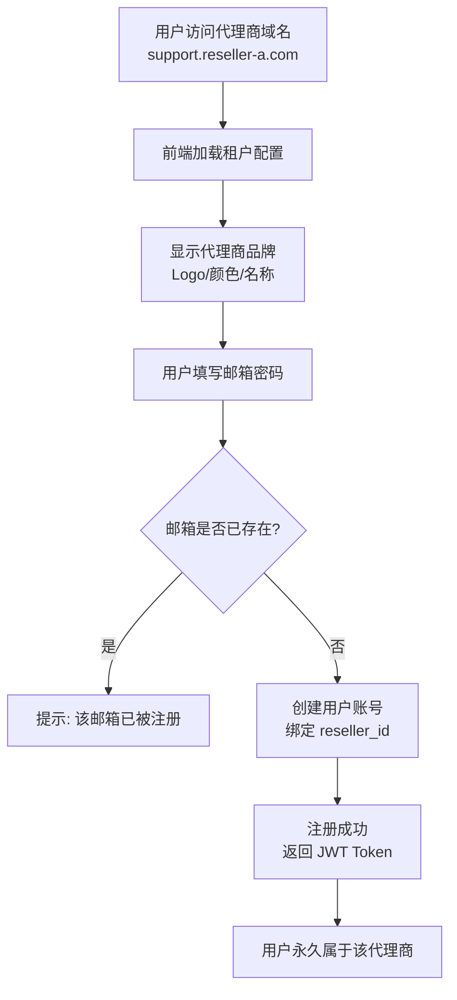
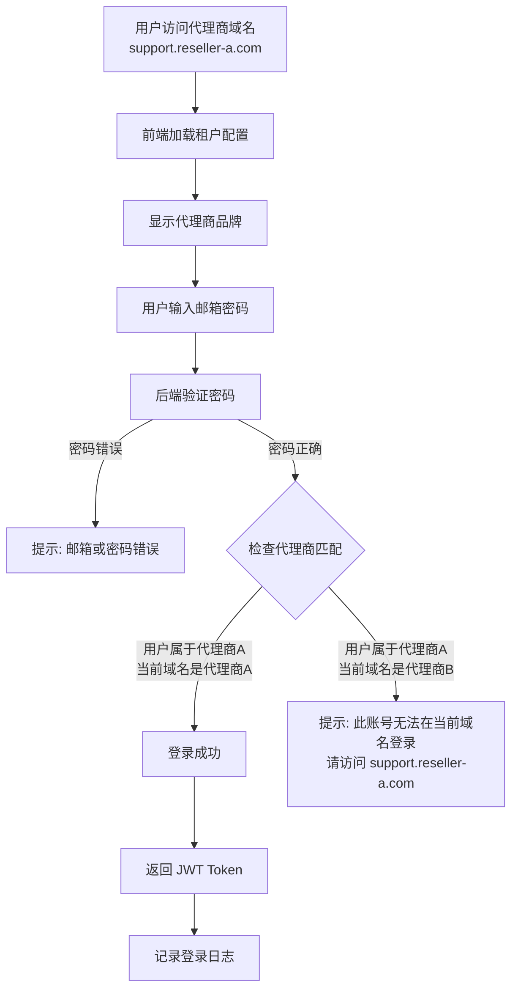
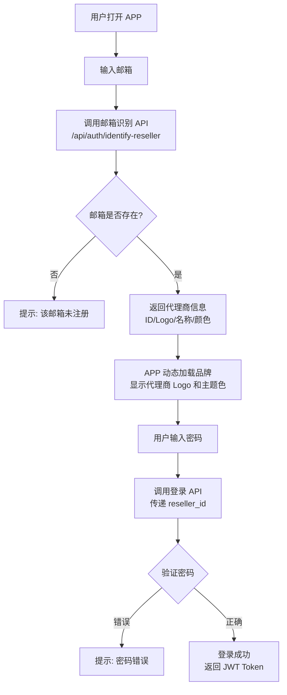
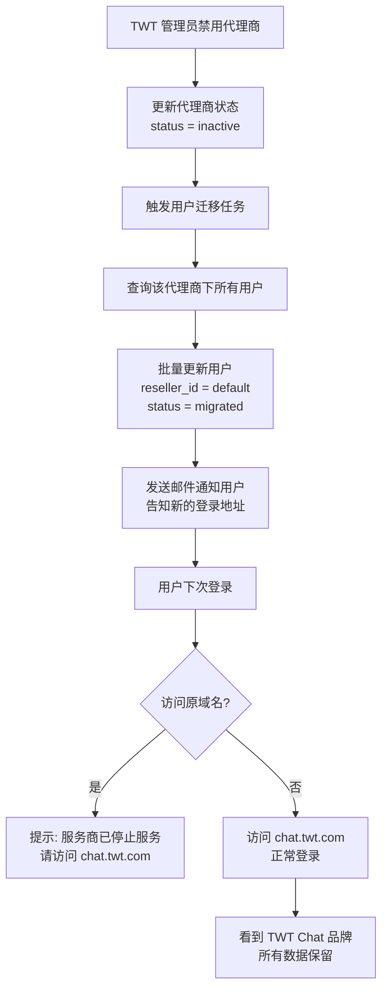
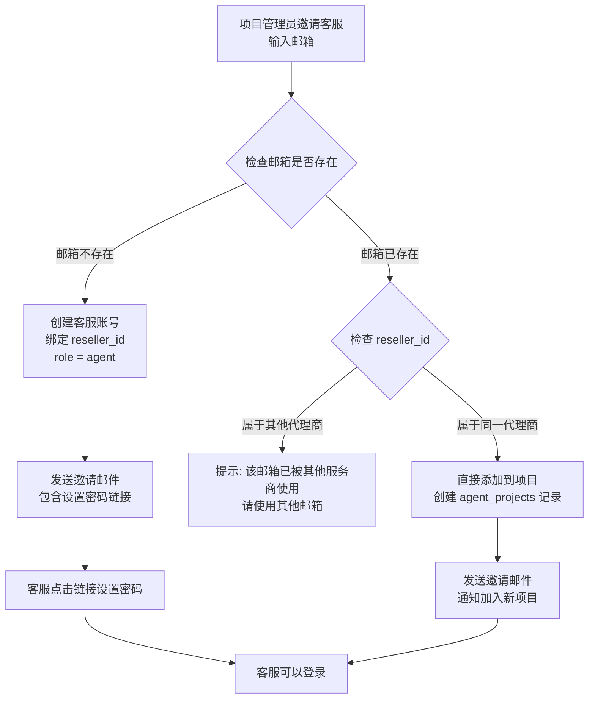
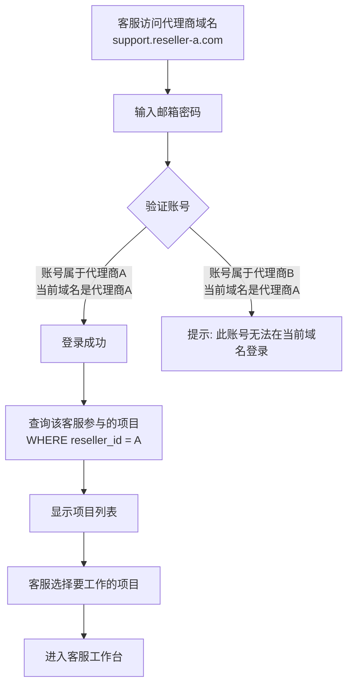
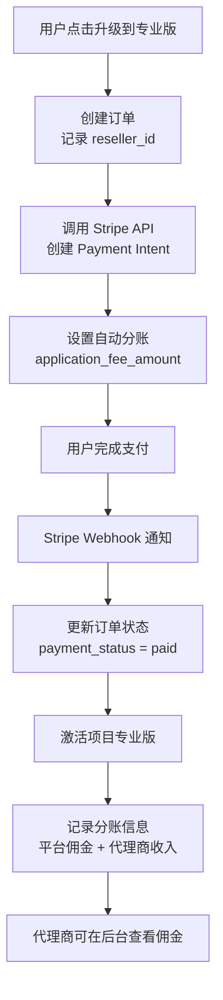

# TWT 客服系统白标功能实现方案

## 一、方案概述

### 1.1 业务背景

TWT 是一个客服 SaaS 系统，包含官网、客服端、访客端、控制台、APP 五个应用。为了拓展销售渠道，需要支持代理商白标功能，让代理商用自己的品牌销售 TWT 的产品。

### 1.2 核心原则

1. **账号归属平台**：所有用户都是 TWT 平台的用户，代理商只是销售渠道
2. **邮箱全局唯一**：一个邮箱只能注册一次，无论在哪个代理商
3. **账号绑定代理商**：用户注册时永久绑定代理商，不允许跨代理商登录
4. **数据严格隔离**：代理商之间数据完全隔离，互不可见
5. **不支持账号迁移**：除非代理商被禁用，用户自动迁移到 TWT Chat

### 1.3 技术架构

- **多租户模式**：运行时根据域名动态加载租户配置
- **单一代码库**：所有代理商共享同一套代码
- **数据隔离**：通过 `reseller_id` 字段实现数据隔离
- **支付分账**：使用 Stripe Connect 自动分账

---

## 二、产品方案

### 2.1 用户注册流程



**关键点：**
- 用户在哪个代理商域名注册，就永久属于哪个代理商
- 邮箱全局唯一，不能在多个代理商重复注册
- 注册时自动记录 `reseller_id` 和 `registered_domain`

### 2.2 用户登录流程



**关键点：**
- 用户只能在注册时的代理商域名登录
- 跨代理商登录会被拒绝，并提示正确的登录域名
- 所有登录尝试都会记录日志（包括失败的）

### 2.3 APP 登录流程



**关键点：**
- APP 通过邮箱自动识别代理商，无需用户输入域名
- 动态加载代理商品牌，提供一致的体验
- 一个 APP 支持所有代理商

### 2.4 代理商禁用流程



**关键点：**
- 代理商禁用后，用户自动迁移到 TWT Chat
- 用户数据完整保留，不受影响
- 通过邮件通知用户域名变更

### 2.5 客服邀请流程



**关键点：**
- 客服账号绑定代理商，和终端用户一样
- 邮箱全局唯一，不能跨代理商
- 邀请时自动创建账号（如果不存在）
- 客服只能为本代理商的项目工作

### 2.6 客服登录流程



**关键点：**
- 客服登录逻辑和终端用户一样，需要检查代理商匹配
- 登录后显示该客服参与的所有项目（都是同一代理商的）
- 客服选择项目后进入工作台

### 2.7 支付和分账流程



**关键点：**
- 使用 Stripe Connect 自动分账
- 平台收取佣金（如 30%），剩余给代理商
- 代理商可以实时查看佣金明细

---

## 三、数据库设计

### 3.1 核心表结构

#### resellers（代理商表）

| 字段 | 类型 | 说明 |
|------|------|------|
| id | VARCHAR(50) | 主键 |
| name | VARCHAR(100) | 品牌名称 |
| display_name | VARCHAR(100) | 显示名称 |
| logo_url | TEXT | Logo URL |
| primary_color | VARCHAR(20) | 主题色 |
| domains | JSON | 绑定的域名列表 |
| stripe_account_id | VARCHAR(100) | Stripe Connect 账号 |
| commission_rate | DECIMAL(5,2) | 佣金比例（%） |
| status | ENUM | pending/active/inactive/rejected |
| created_at | TIMESTAMP | 创建时间 |

#### users（用户表）

| 字段 | 类型 | 说明 |
|------|------|------|
| id | VARCHAR(50) | 主键 |
| email | VARCHAR(255) | 邮箱（全局唯一） |
| password_hash | VARCHAR(255) | 密码哈希 |
| name | VARCHAR(100) | 用户名称 |
| **reseller_id** | VARCHAR(50) | **所属代理商（核心字段）** |
| **role** | ENUM | **customer/agent/admin（用户角色）** |
| registered_domain | VARCHAR(255) | 注册时的域名 |
| status | ENUM | active/inactive/migrated/pending |
| migrated_from_reseller_id | VARCHAR(50) | 迁移前的代理商 |
| created_at | TIMESTAMP | 创建时间 |

**说明：**
- `role` 字段区分用户类型：
  - `customer`：终端用户（项目所有者）
  - `agent`：客服
  - `admin`：管理员
- 客服和终端用户共用同一张表，都绑定 `reseller_id`

**索引：**
- UNIQUE KEY (email)
- INDEX (reseller_id)
- INDEX (role)

#### projects（项目表）

| 字段 | 类型 | 说明 |
|------|------|------|
| id | VARCHAR(50) | 主键 |
| name | VARCHAR(200) | 项目名称 |
| owner_id | VARCHAR(50) | 所有者 ID |
| **reseller_id** | VARCHAR(50) | **所属代理商** |
| plan_type | ENUM | free/pro |
| status | ENUM | active/inactive |
| created_at | TIMESTAMP | 创建时间 |

#### orders（订单表）

| 字段 | 类型 | 说明 |
|------|------|------|
| id | VARCHAR(50) | 主键 |
| order_no | VARCHAR(100) | 订单号 |
| project_id | VARCHAR(50) | 项目 ID |
| user_id | VARCHAR(50) | 用户 ID |
| **reseller_id** | VARCHAR(50) | **所属代理商** |
| amount | DECIMAL(10,2) | 订单金额 |
| platform_commission | DECIMAL(10,2) | 平台佣金 |
| reseller_revenue | DECIMAL(10,2) | 代理商收入 |
| payment_status | ENUM | pending/paid/failed/refunded |
| created_at | TIMESTAMP | 创建时间 |

#### agent_projects（客服-项目关联表）

| 字段 | 类型 | 说明 |
|------|------|------|
| id | VARCHAR(50) | 主键 |
| agent_id | VARCHAR(50) | 客服 ID（users.id） |
| project_id | VARCHAR(50) | 项目 ID |
| **reseller_id** | VARCHAR(50) | **所属代理商（冗余字段）** |
| role | ENUM | agent/admin（项目内角色） |
| invited_by | VARCHAR(50) | 邀请人 ID |
| invited_at | TIMESTAMP | 邀请时间 |
| status | ENUM | pending/active/inactive |
| created_at | TIMESTAMP | 创建时间 |

**说明：**
- 一个客服可以参与多个项目（同一代理商内）
- `reseller_id` 冗余字段用于快速过滤和数据隔离检查
- `status = pending` 表示客服还未设置密码

**索引：**
- INDEX (agent_id)
- INDEX (project_id)
- INDEX (reseller_id)
- UNIQUE KEY (agent_id, project_id)

### 3.2 数据隔离策略

**原则：所有查询必须带 `reseller_id` 过滤**

```sql
-- 正确：查询代理商 A 的项目
SELECT * FROM projects 
WHERE reseller_id = 'reseller-a' 
AND owner_id = 'user_123';

-- 错误：缺少 reseller_id 过滤（可能泄露其他代理商数据）
SELECT * FROM projects 
WHERE owner_id = 'user_123';
```

---

## 四、API 接口设计

### 4.1 认证相关

#### POST /api/auth/register
注册新用户

**请求：**
```json
{
  "email": "user@example.com",
  "password": "******",
  "name": "张三",
  "domain": "support.reseller-a.com"
}
```

**响应：**
```json
{
  "success": true,
  "user": {
    "id": "user_123",
    "email": "user@example.com",
    "name": "张三",
    "reseller_id": "reseller-a"
  },
  "token": "eyJhbGciOiJIUzI1NiIsInR5cCI6IkpXVCJ9..."
}
```

**错误：**
```json
{
  "success": false,
  "error": {
    "code": "EMAIL_EXISTS",
    "message": "该邮箱已被注册"
  }
}
```

#### POST /api/auth/login
用户登录

**请求：**
```json
{
  "email": "user@example.com",
  "password": "******",
  "domain": "support.reseller-a.com"
}
```

**响应（成功）：**
```json
{
  "success": true,
  "user": {
    "id": "user_123",
    "email": "user@example.com",
    "reseller_id": "reseller-a"
  },
  "token": "eyJhbGciOiJIUzI1NiIsInR5cCI6IkpXVCJ9..."
}
```

**响应（跨代理商登录）：**
```json
{
  "success": false,
  "error": {
    "code": "WRONG_DOMAIN",
    "message": "此账号无法在当前域名登录，请访问 support.reseller-a.com",
    "correct_domain": "support.reseller-a.com"
  }
}
```

#### POST /api/auth/identify-reseller
根据邮箱识别代理商（APP 使用）

**请求：**
```json
{
  "email": "user@example.com"
}
```

**响应：**
```json
{
  "success": true,
  "reseller": {
    "id": "reseller-a",
    "name": "Reseller A",
    "displayName": "Reseller A Support",
    "logo": "https://cdn.reseller-a.com/logo.png",
    "primaryColor": "#FF6B00"
  }
}
```

### 4.2 租户相关

#### GET /api/tenants/by-domain?domain=xxx
根据域名获取租户配置（公开接口）

**响应：**
```json
{
  "success": true,
  "tenant": {
    "tenantId": "reseller-a",
    "name": "Reseller A",
    "displayName": "Reseller A Support",
    "logo": "/tenants/reseller-a/logo.svg",
    "primaryColor": "#FF6B00",
    "domains": ["support.reseller-a.com"]
  }
}
```

### 4.3 客服邀请相关

#### POST /api/projects/{projectId}/invite-agent
邀请客服加入项目

**请求：**
```json
{
  "email": "agent@example.com",
  "role": "agent"
}
```

**响应（邮箱不存在，创建新账号）：**
```json
{
  "success": true,
  "agent": {
    "id": "user_456",
    "email": "agent@example.com",
    "isNewUser": true
  },
  "message": "邀请邮件已发送"
}
```

**响应（邮箱存在，同一代理商）：**
```json
{
  "success": true,
  "agent": {
    "id": "user_456",
    "email": "agent@example.com",
    "isNewUser": false
  },
  "message": "客服已添加到项目"
}
```

**响应（邮箱被其他代理商使用）：**
```json
{
  "success": false,
  "error": {
    "code": "EMAIL_USED_BY_OTHER_RESELLER",
    "message": "该邮箱已被其他服务商使用，请使用其他邮箱"
  }
}
```

#### POST /api/auth/setup-password
客服首次设置密码

**请求：**
```json
{
  "token": "eyJhbGciOiJIUzI1NiIsInR5cCI6IkpXVCJ9...",
  "password": "******"
}
```

**响应：**
```json
{
  "success": true,
  "message": "密码设置成功，请登录"
}
```

#### GET /api/agent/projects
获取客服参与的项目列表

**响应：**
```json
{
  "success": true,
  "projects": [
    {
      "id": "proj_123",
      "name": "项目 A",
      "role": "agent",
      "status": "active"
    },
    {
      "id": "proj_456",
      "name": "项目 B",
      "role": "admin",
      "status": "active"
    }
  ]
}
```

---

## 五、测试用例

### 5.1 用户注册测试

| 用例 ID | 测试场景 | 前置条件 | 操作步骤 | 预期结果 |
|---------|---------|---------|---------|---------|
| REG-001 | 正常注册 | 邮箱未被使用 | 1. 访问 support.reseller-a.com<br/>2. 填写邮箱密码<br/>3. 点击注册 | 注册成功，用户绑定 reseller-a |
| REG-002 | 邮箱已存在 | 邮箱已在代理商 A 注册 | 1. 访问 support.reseller-b.com<br/>2. 使用相同邮箱注册 | 提示"该邮箱已被注册" |
| REG-003 | 品牌显示 | 无 | 1. 访问 support.reseller-a.com | 显示代理商 A 的 Logo 和品牌 |

### 5.2 用户登录测试

| 用例 ID | 测试场景 | 前置条件 | 操作步骤 | 预期结果 |
|---------|---------|---------|---------|---------|
| LOGIN-001 | 正常登录 | 用户在代理商 A 注册 | 1. 访问 support.reseller-a.com<br/>2. 输入邮箱密码<br/>3. 点击登录 | 登录成功 |
| LOGIN-002 | 跨代理商登录 | 用户在代理商 A 注册 | 1. 访问 support.reseller-b.com<br/>2. 输入邮箱密码<br/>3. 点击登录 | 提示"此账号无法在当前域名登录，请访问 support.reseller-a.com" |
| LOGIN-003 | 密码错误 | 用户在代理商 A 注册 | 1. 访问 support.reseller-a.com<br/>2. 输入错误密码<br/>3. 点击登录 | 提示"邮箱或密码错误" |
| LOGIN-004 | 邮箱不存在 | 邮箱未注册 | 1. 访问任意域名<br/>2. 输入未注册邮箱<br/>3. 点击登录 | 提示"邮箱或密码错误" |

### 5.3 APP 登录测试

| 用例 ID | 测试场景 | 前置条件 | 操作步骤 | 预期结果 |
|---------|---------|---------|---------|---------|
| APP-001 | 邮箱识别 | 用户在代理商 A 注册 | 1. 打开 APP<br/>2. 输入邮箱 | APP 显示代理商 A 的 Logo 和品牌 |
| APP-002 | 正常登录 | 用户在代理商 A 注册 | 1. 输入邮箱<br/>2. 输入密码<br/>3. 点击登录 | 登录成功，显示代理商 A 品牌 |
| APP-003 | 邮箱不存在 | 邮箱未注册 | 1. 输入未注册邮箱 | 提示"该邮箱未注册" |

### 5.4 数据隔离测试

| 用例 ID | 测试场景 | 前置条件 | 操作步骤 | 预期结果 |
|---------|---------|---------|---------|---------|
| ISO-001 | 项目隔离 | 代理商 A 和 B 各有项目 | 1. 代理商 A 登录后台<br/>2. 查看项目列表 | 只能看到代理商 A 的项目 |
| ISO-002 | 订单隔离 | 代理商 A 和 B 各有订单 | 1. 代理商 A 登录后台<br/>2. 查看订单列表 | 只能看到代理商 A 的订单 |
| ISO-003 | 用户隔离 | 代理商 A 和 B 各有用户 | 1. 代理商 A 登录后台<br/>2. 查看用户列表 | 只能看到代理商 A 的用户 |

### 5.5 代理商禁用测试

| 用例 ID | 测试场景 | 前置条件 | 操作步骤 | 预期结果 |
|---------|---------|---------|---------|---------|
| DIS-001 | 禁用代理商 | 代理商 A 有 10 个用户 | 1. TWT 管理员禁用代理商 A | 10 个用户自动迁移到 TWT Chat |
| DIS-002 | 用户登录 | 代理商 A 已被禁用 | 1. 用户访问 support.reseller-a.com<br/>2. 尝试登录 | 提示"服务商已停止服务，请访问 chat.twt.com" |
| DIS-003 | 迁移后登录 | 用户已迁移到 TWT Chat | 1. 用户访问 chat.twt.com<br/>2. 登录 | 登录成功，看到 TWT Chat 品牌，数据完整 |

### 5.6 客服邀请测试

| 用例 ID | 测试场景 | 前置条件 | 操作步骤 | 预期结果 |
|---------|---------|---------|---------|---------|
| AGENT-001 | 邀请新客服 | 邮箱未被使用 | 1. 项目管理员邀请 agent@example.com<br/>2. 客服收到邮件<br/>3. 点击链接设置密码 | 客服账号创建成功，绑定代理商 A |
| AGENT-002 | 邀请已有客服（同代理商） | 客服已在代理商 A 的项目 1 | 1. 项目 2 管理员邀请同一邮箱 | 客服直接添加到项目 2 |
| AGENT-003 | 邀请其他代理商的客服 | 客服属于代理商 B | 1. 代理商 A 的项目邀请该邮箱 | 提示"该邮箱已被其他服务商使用" |
| AGENT-004 | 客服登录 | 客服属于代理商 A | 1. 访问 support.reseller-a.com<br/>2. 登录 | 登录成功，显示参与的项目列表 |
| AGENT-005 | 客服跨代理商登录 | 客服属于代理商 A | 1. 访问 support.reseller-b.com<br/>2. 尝试登录 | 提示"此账号无法在当前域名登录" |
| AGENT-006 | 客服选择项目 | 客服参与 2 个项目 | 1. 登录后查看项目列表<br/>2. 选择项目 1 | 进入项目 1 的客服工作台 |

---

## 六、实施计划

### 阶段 1：核心白标功能（2 周）

**目标：** 实现基本的多租户和数据隔离

**任务：**
1. 创建数据库表（resellers, users, projects, orders）
2. 实现租户配置 API（/api/tenants/by-domain）
3. 实现用户注册/登录（绑定代理商 + 跨代理商检查）
4. 实现数据隔离中间件
5. Web 应用集成测试

**验收标准：**
- 用户可以在不同代理商域名注册
- 用户只能在注册域名登录
- 数据完全隔离

### 阶段 2：代理商管理（1 周）

**目标：** TWT 管理后台可以管理代理商

**任务：**
1. 代理商 CRUD API
2. TWT 管理后台对接
3. 代理商禁用和用户迁移
4. 邮件通知

**验收标准：**
- 可以创建/编辑/禁用代理商
- 禁用后用户自动迁移
- 用户收到通知邮件

### 阶段 3：支付和分账（1.5 周）

**目标：** 实现 Stripe Connect 自动分账

**任务：**
1. Stripe Connect 集成
2. 订单和支付流程
3. Webhook 处理
4. 分账计算
5. 代理商佣金管理

**验收标准：**
- 用户可以购买专业版
- 支付自动分账
- 代理商可查看佣金

### 阶段 4：APP 邮箱识别（1 周）

**目标：** APP 通过邮箱自动识别代理商

**任务：**
1. 邮箱识别 API
2. APP 登录流程改造
3. 动态品牌加载
4. 多代理商测试

**验收标准：**
- 输入邮箱后自动显示代理商品牌
- 可以正常登录

### 阶段 5：客服邀请功能（1 周）

**目标：** 实现客服邀请和管理

**任务：**
1. 客服邀请 API（/api/projects/{id}/invite-agent）
2. 客服设置密码 API（/api/auth/setup-password）
3. 客服项目列表 API（/api/agent/projects）
4. agent_projects 表创建
5. 邮件模板（邀请邮件、设置密码邮件）
6. 前端集成（项目设置页面、客服登录流程）

**验收标准：**
- 可以邀请新客服（自动创建账号）
- 可以邀请已有客服（同代理商）
- 跨代理商邀请被拒绝
- 客服可以设置密码并登录
- 客服登录后可以选择项目

---

## 七、关键文件清单

### 需要修改的文件

| 文件路径 | 修改内容 |
|---------|---------|
| `packages/branding/src/loader.ts` | 增强租户配置加载，调用后端 API |
| `packages/branding/src/types.ts` | 完善 TenantConfig 类型定义 |
| `apps/web-agent/src/main.ts` | 集成租户配置加载 |
| `apps/web-customer/src/main.ts` | 集成租户配置加载 |
| `apps/web-website/src/main.ts` | 集成租户配置加载 |
| `apps/mobile-app/src/main.ts` | 实现邮箱识别和动态品牌加载 |

### 需要创建的文件

| 文件路径 | 说明 |
|---------|------|
| `backend/migrations/001_create_resellers.sql` | 创建代理商表 |
| `backend/migrations/002_alter_users.sql` | 用户表增加 reseller_id |
| `backend/api/auth/register.ts` | 注册 API |
| `backend/api/auth/login.ts` | 登录 API |
| `backend/api/auth/identify-reseller.ts` | 邮箱识别 API |
| `backend/api/auth/setup-password.ts` | 客服设置密码 API |
| `backend/api/projects/invite-agent.ts` | 客服邀请 API |
| `backend/api/agent/projects.ts` | 客服项目列表 API |
| `backend/api/tenants/by-domain.ts` | 租户配置 API |
| `backend/middleware/reseller-isolation.ts` | 数据隔离中间件 |
| `backend/migrations/003_create_agent_projects.sql` | 创建客服-项目关联表 |

---

## 八、风险和注意事项

### 8.1 技术风险

| 风险 | 影响 | 缓解措施 |
|------|------|---------|
| 数据隔离不完整 | 高 | 代码审查 + 自动化测试 + 中间件强制过滤 |
| 跨代理商数据泄露 | 高 | 所有 API 必须检查 reseller_id |
| 性能问题 | 中 | 添加索引 + 查询优化 + 缓存 |
| Stripe 分账失败 | 中 | 异常处理 + 重试机制 + 人工介入 |

### 8.2 业务风险

| 风险 | 影响 | 缓解措施 |
|------|------|---------|
| 代理商禁用导致用户流失 | 高 | 提前通知 + 自动迁移 + 数据保留 |
| 用户忘记注册域名 | 中 | 登录错误时提示正确域名 |
| 邮箱全局唯一限制用户 | 低 | 文档说明 + 支持 Gmail + 号 |

---

## 九、总结

本方案采用**运行时多租户架构**，通过 `reseller_id` 实现数据隔离，支持代理商白标功能。核心特点：

1. **邮箱全局唯一**：避免账号混乱
2. **账号绑定代理商**：保护代理商客户关系
3. **严格数据隔离**：代理商之间互不可见
4. **客服账号统一管理**：客服和终端用户共用账号体系，都绑定代理商
5. **自动分账**：Stripe Connect 实现
6. **APP 邮箱识别**：一个 APP 支持所有代理商

**关键设计决策：**
- ✅ 终端用户和客服都绑定代理商，不允许跨代理商
- ✅ 客服邀请时自动创建账号（如果不存在）
- ✅ 客服只能为本代理商的项目工作
- ✅ 客服登录后选择要工作的项目

预计开发周期：**7.5 周**，2-3 名开发人员。
