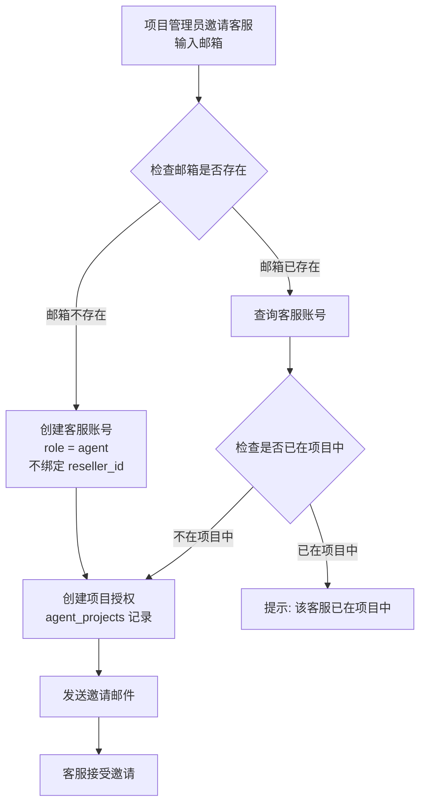
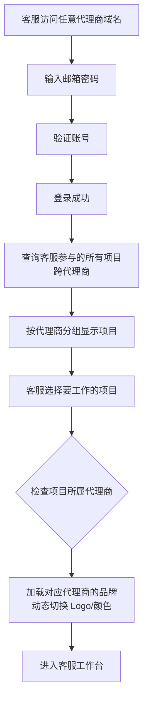
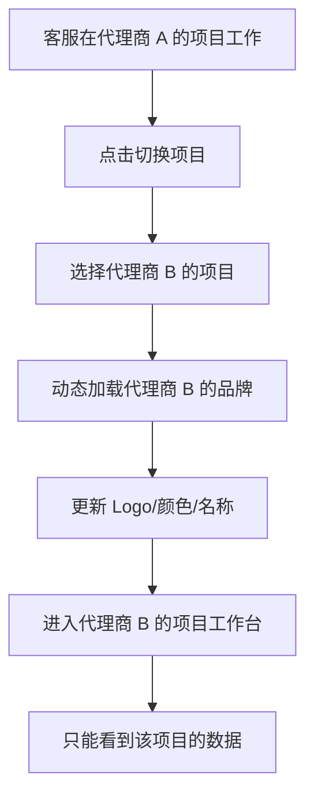

# TWT 客服系统白标功能实现方案（选项 2：客服可跨代理商工作）

## 一、方案概述

### 1.1 与选项 1 的核心区别

| 维度 | 选项 1（推荐） | 选项 2（本方案） |
|------|---------------|-----------------|
| 客服账号归属 | 绑定代理商，不能跨代理商 | 不绑定代理商，可以跨代理商 |
| 邮箱唯一性 | 全局唯一 | 全局唯一 |
| 客服工作范围 | 只能为本代理商的项目工作 | 可以同时为多个代理商的项目工作 |
| 数据隔离 | 简单，通过 reseller_id 过滤 | 复杂，需要基于项目级别过滤 |
| 客服登录 | 在代理商域名登录 | 在任意代理商域名登录 |

### 1.2 核心原则

1. **账号归属平台**：客服账号不绑定代理商，属于平台
2. **邮箱全局唯一**：一个邮箱只能注册一次
3. **项目级别授权**：客服通过项目邀请获得访问权限
4. **数据按项目隔离**：客服只能看到被授权项目的数据
5. **灵活的工作方式**：客服可以同时为多个代理商的项目工作

---

## 二、产品方案

### 2.1 客服邀请流程



**关键点：**
- 客服账号不绑定 `reseller_id`
- 通过 `agent_projects` 表记录客服可以访问哪些项目
- 客服可以被多个代理商的项目邀请

### 2.2 客服登录流程



**关键点：**
- 客服可以在任意代理商域名登录
- 登录后看到所有参与的项目（跨代理商）
- 选择项目后，动态加载该项目所属代理商的品牌

### 2.3 客服工作台品牌切换



**关键点：**
- 客服切换项目时，品牌也跟着切换
- 客服只能看到当前项目的数据，不能看到其他项目

---

## 三、数据库设计

### 3.1 核心表结构

#### users（用户表）

| 字段 | 类型 | 说明 |
|------|------|------|
| id | VARCHAR(50) | 主键 |
| email | VARCHAR(255) | 邮箱（全局唯一） |
| password_hash | VARCHAR(255) | 密码哈希 |
| name | VARCHAR(100) | 用户名称 |
| **role** | ENUM | **customer/agent/admin** |
| **reseller_id** | VARCHAR(50) | **仅 customer 绑定，agent 为 NULL** |
| registered_domain | VARCHAR(255) | 注册时的域名 |
| status | ENUM | active/inactive/pending |
| created_at | TIMESTAMP | 创建时间 |

**关键变更：**
- `reseller_id` 对于 `role = agent` 的用户为 NULL
- 客服不绑定代理商

#### agent_projects（客服-项目关联表）

| 字段 | 类型 | 说明 |
|------|------|------|
| id | VARCHAR(50) | 主键 |
| agent_id | VARCHAR(50) | 客服 ID |
| project_id | VARCHAR(50) | 项目 ID |
| **reseller_id** | VARCHAR(50) | **项目所属代理商（冗余）** |
| role | ENUM | agent/admin（项目内角色） |
| invited_by | VARCHAR(50) | 邀请人 ID |
| status | ENUM | pending/active/inactive |
| created_at | TIMESTAMP | 创建时间 |

**关键点：**
- `reseller_id` 冗余字段，用于快速查询客服在哪些代理商的项目工作
- 一个客服可以有多条记录，对应不同代理商的项目

#### agent_project_permissions（客服项目权限表）

| 字段 | 类型 | 说明 |
|------|------|------|
| id | VARCHAR(50) | 主键 |
| agent_project_id | VARCHAR(50) | agent_projects.id |
| permission_key | VARCHAR(100) | 权限标识 |
| granted_at | TIMESTAMP | 授权时间 |

**说明：**
- 记录客服在特定项目中的权限
- 支持细粒度权限控制

### 3.2 数据隔离策略

**原则：基于项目级别过滤，而非代理商级别**

```sql
-- 查询客服可以访问的会话
SELECT s.* FROM sessions s
JOIN agent_projects ap ON s.project_id = ap.project_id
WHERE ap.agent_id = 'agent_123'
AND ap.status = 'active'
AND s.project_id = 'current_project_id';

-- 查询客服参与的所有项目（跨代理商）
SELECT p.*, ap.reseller_id, r.name as reseller_name
FROM projects p
JOIN agent_projects ap ON p.id = ap.project_id
JOIN resellers r ON ap.reseller_id = r.id
WHERE ap.agent_id = 'agent_123'
AND ap.status = 'active'
ORDER BY r.name, p.name;
```

---

## 四、API 接口设计

### 4.1 客服邀请

#### POST /api/projects/{projectId}/invite-agent

**请求：**
```json
{
  "email": "agent@example.com",
  "role": "agent"
}
```

**响应（成功）：**
```json
{
  "success": true,
  "agent": {
    "id": "user_456",
    "email": "agent@example.com",
    "isNewUser": false,
    "existingProjects": [
      {
        "projectId": "proj_789",
        "projectName": "其他项目",
        "resellerId": "reseller-b",
        "resellerName": "代理商 B"
      }
    ]
  },
  "message": "客服已添加到项目"
}
```

**说明：**
- 返回客服已参与的其他项目信息
- 让管理员知道这个客服也在为其他代理商工作

### 4.2 客服登录

#### POST /api/auth/login

**请求：**
```json
{
  "email": "agent@example.com",
  "password": "******",
  "domain": "support.reseller-a.com"
}
```

**响应：**
```json
{
  "success": true,
  "user": {
    "id": "user_456",
    "email": "agent@example.com",
    "role": "agent"
  },
  "token": "eyJhbGciOiJIUzI1NiIsInR5cCI6IkpXVCJ9..."
}
```

**说明：**
- 客服可以在任意域名登录
- 不检查 reseller_id 匹配（因为客服不绑定代理商）

### 4.3 获取客服项目列表

#### GET /api/agent/projects

**响应：**
```json
{
  "success": true,
  "projectsByReseller": [
    {
      "resellerId": "reseller-a",
      "resellerName": "代理商 A",
      "resellerLogo": "https://cdn.reseller-a.com/logo.png",
      "resellerColor": "#FF6B00",
      "projects": [
        {
          "id": "proj_123",
          "name": "项目 A1",
          "role": "agent"
        },
        {
          "id": "proj_456",
          "name": "项目 A2",
          "role": "admin"
        }
      ]
    },
    {
      "resellerId": "reseller-b",
      "resellerName": "代理商 B",
      "resellerLogo": "https://cdn.reseller-b.com/logo.png",
      "resellerColor": "#2F6BFF",
      "projects": [
        {
          "id": "proj_789",
          "name": "项目 B1",
          "role": "agent"
        }
      ]
    }
  ]
}
```

**说明：**
- 按代理商分组显示项目
- 返回每个代理商的品牌信息，用于前端显示

### 4.4 切换项目

#### POST /api/agent/switch-project

**请求：**
```json
{
  "projectId": "proj_789"
}
```

**响应：**
```json
{
  "success": true,
  "project": {
    "id": "proj_789",
    "name": "项目 B1",
    "resellerId": "reseller-b"
  },
  "reseller": {
    "id": "reseller-b",
    "name": "代理商 B",
    "logo": "https://cdn.reseller-b.com/logo.png",
    "primaryColor": "#2F6BFF"
  }
}
```

**说明：**
- 返回项目和代理商信息
- 前端根据返回的品牌信息动态更新 UI

---

## 五、前端实现

### 5.1 客服登录后的项目选择页面

```vue
<template>
  <div class="project-selector">
    <h1>选择要工作的项目</h1>
    
    <div v-for="group in projectsByReseller" :key="group.resellerId" class="reseller-group">
      <div class="reseller-header">
        
        <h2>{{ group.resellerName }}</h2>
      </div>
      
      <div class="project-list">
        <div 
          v-for="project in group.projects" 
          :key="project.id"
          class="project-card"
          @click="selectProject(project.id, group)"
        >
          <h3>{{ project.name }}</h3>
          <span class="role-badge">{{ project.role }}</span>
        </div>
      </div>
    </div>
  </div>
</template>

<script setup>
import { ref, onMounted } from 'vue'
import { useRouter } from 'vue-router'

const router = useRouter()
const projectsByReseller = ref([])

onMounted(async () => {
  const response = await fetch('/api/agent/projects')
  const data = await response.json()
  projectsByReseller.value = data.projectsByReseller
})

async function selectProject(projectId, resellerGroup) {
  // 切换项目
  const response = await fetch('/api/agent/switch-project', {
    method: 'POST',
    body: JSON.stringify({ projectId })
  })
  
  const data = await response.json()
  
  // 动态更新品牌
  updateBranding(data.reseller)
  
  // 跳转到工作台
  router.push('/workspace')
}

function updateBranding(reseller) {
  // 更新 Logo
  document.querySelector('.app-logo').src = reseller.logo
  
  // 更新主题色
  document.documentElement.style.setProperty('--agent-color-brand-primary', reseller.primaryColor)
  
  // 更新页面标题
  document.title = `${reseller.name} - 客服工作台`
}
</script>
```

### 5.2 工作台顶部项目切换器

```vue
<template>
  <div class="project-switcher">
    <button @click="showProjectSelector = true">
      
      <span>{{ currentProject.name }}</span>
      <ChevronDownIcon />
    </button>
    
    <Modal v-if="showProjectSelector" @close="showProjectSelector = false">
      <ProjectSelector @select="handleProjectSwitch" />
    </Modal>
  </div>
</template>
```

---

## 六、测试用例

### 6.1 客服跨代理商邀请测试

| 用例 ID | 测试场景 | 前置条件 | 操作步骤 | 预期结果 |
|---------|---------|---------|---------|---------|
| CROSS-001 | 客服被多个代理商邀请 | 客服已在代理商 A 的项目 | 1. 代理商 B 的项目邀请同一邮箱 | 邀请成功，客服可以访问两个代理商的项目 |
| CROSS-002 | 客服登录查看项目 | 客服参与代理商 A 和 B 的项目 | 1. 客服登录<br/>2. 查看项目列表 | 看到两个代理商的项目，按代理商分组 |
| CROSS-003 | 客服切换项目 | 客服在代理商 A 的项目工作 | 1. 点击切换项目<br/>2. 选择代理商 B 的项目 | 品牌切换为代理商 B，进入代理商 B 的项目 |
| CROSS-004 | 数据隔离 | 客服参与项目 A 和项目 B | 1. 在项目 A 工作台<br/>2. 查看会话列表 | 只能看到项目 A 的会话，看不到项目 B 的 |

### 6.2 客服权限测试

| 用例 ID | 测试场景 | 前置条件 | 操作步骤 | 预期结果 |
|---------|---------|---------|---------|---------|
| PERM-001 | 客服访问未授权项目 | 客服只参与项目 A | 1. 尝试访问项目 B 的 API | 返回 403 Forbidden |
| PERM-002 | 客服被移除项目 | 客服参与项目 A | 1. 管理员移除客服<br/>2. 客服尝试访问项目 A | 返回 403 Forbidden |

---

## 七、优缺点分析

### 7.1 优点

1. **灵活性高**
   - 客服可以同时为多个代理商工作
   - 适合自由职业客服或外包团队
   - 客服资源可以共享

2. **客服体验好**
   - 一个账号管理所有项目
   - 不需要记住多个账号
   - 可以在任意域名登录

3. **代理商成本低**
   - 可以雇佣已有经验的客服（在其他代理商工作过）
   - 不需要从零培训

### 7.2 缺点

1. **数据泄露风险高** ⚠️
   - 客服可能无意中泄露代理商 A 的信息给代理商 B
   - 客服可能比较不同代理商的客户数据
   - 难以审计和追踪

2. **代理商利益冲突** ⚠️
   - 代理商 A 培训的客服，可能被代理商 B "挖走"
   - 代理商之间可能是竞争关系
   - 客服可能优先服务高薪代理商

3. **实现复杂度高** ⚠️
   - 数据隔离逻辑复杂（基于项目而非代理商）
   - 权限检查更复杂
   - 品牌动态切换增加前端复杂度
   - 审计日志更难追踪

4. **品牌体验不一致**
   - 客服在不同项目间切换时，品牌频繁变化
   - 可能造成混淆

---

## 八、实施计划

### 阶段 1：核心功能（2 周）

**任务：**
1. 修改 users 表（agent 的 reseller_id 为 NULL）
2. 创建 agent_projects 表
3. 实现客服邀请 API（支持跨代理商）
4. 实现客服项目列表 API（按代理商分组）
5. 实现项目切换 API

**验收标准：**
- 客服可以被多个代理商邀请
- 客服登录后看到所有项目

### 阶段 2：前端实现（2 周）

**任务：**
1. 项目选择页面（按代理商分组）
2. 项目切换器组件
3. 动态品牌加载逻辑
4. 数据隔离中间件（基于项目）

**验收标准：**
- 客服可以切换项目
- 品牌动态更新
- 数据正确隔离

### 阶段 3：权限和审计（1 周）

**任务：**
1. 细粒度权限控制
2. 审计日志（记录客服在哪个项目的操作）
3. 数据访问监控

**验收标准：**
- 客服只能访问授权项目
- 所有操作可追踪

---

## 九、风险和缓解措施

| 风险 | 影响 | 缓解措施 |
|------|------|---------|
| 数据泄露 | 高 | 1. 严格的审计日志<br/>2. 客服协议约束<br/>3. 数据访问监控 |
| 代理商利益冲突 | 高 | 1. 合同条款约束<br/>2. 竞业限制<br/>3. 代理商可以选择不雇佣跨代理商客服 |
| 实现复杂度 | 中 | 1. 充分测试<br/>2. 代码审查<br/>3. 分阶段实施 |
| 品牌混淆 | 低 | 1. 清晰的 UI 提示<br/>2. 项目切换时的确认弹窗 |

---

## 十、总结

**选项 2 适用场景：**
- 代理商之间不是竞争关系
- 客服资源稀缺，需要共享
- 代理商接受客服跨代理商工作的风险
- 有完善的审计和监控机制

**不推荐选项 2 的原因：**
1. 数据泄露风险太高
2. 代理商利益难以保护
3. 实现和维护成本高
4. 不符合行业标准（Shopify、Zendesk 都不允许跨租户）

**建议：优先选择选项 1**，除非有明确的业务需求必须支持跨代理商客服。
